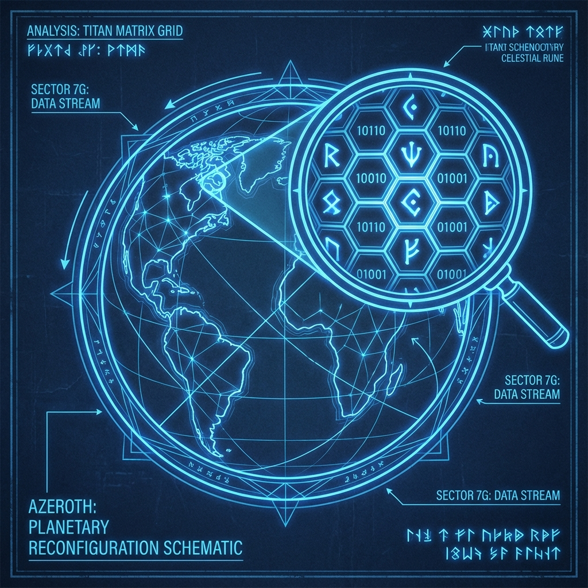

# 1.1 法力值的上限（有限信息公理）

**(The Mana Cap - Axiom of Finite Information)**

> **“泰坦的服务器不支持无限的数据。如果你听到有谁在讨论“无限”，那他一定是在试图用取巧的办法绕过计算限制。当这种近似被当成真理时，整个物理引擎就要崩溃了。”**

在构建我们的“艾泽拉斯代码”模型的第一步，我们必须面对经典物理学中最大的一个误解，那就是**连续性假设**。这个假设认为，如果你把镜头拉得足够近，你可以无限地放大画面，永远不会看到马赛克。

但这在魔兽世界里显然是行不通的。如果你凑得太近看一面墙，你能清楚地看到它是由大块的像素点组成的。我们的宇宙也是如此。

### 1.1.1 显存的灾难

如果我们假设现实世界是**连续**的，那就像是假设你的显卡拥有无限的显存。

想象一下，如果每一个像素点内部都包含着无限的细节，那么哪怕是一个简单的面包，它所包含的信息量也是无穷大的。如果每一个坐标点上都有独立的物理数值，那么渲染这块面包需要的算力将直接烧毁泰坦的服务器。

在旧时代的物理学（经典力学）中，这种“无限信息密度”勉强能被接受，因为那时候的观察手段（测量精度）很粗糙。但在量子力学的副本里，这引发了灾难性的后果：

1.  **无限的掉落列表（紫外发散）**：如果你要计算所有可能的粒子相互作用，而在一个连续的空间里，波长可以无限短（频率无限高），这意味着你需要计算无穷多的能量。这就像是一个BOSS死后爆出了无穷无尽的装备，瞬间卡死客户端。

2.  **数据溢出（奇点）**：广义相对论预言，在黑洞中心，物质密度趋向于无穷大。在程序员看来，这根本不是什么物理现象，而是一个典型的**除以零错误（Divide by Zero Error）**。这是模型崩溃的标志，而不是现实的特征。

物理学中的“无穷大”从未被真正观测到过，它仅仅是当数学模型超出其适用范围时，系统抛出的错误报告。

### 1.1.2 背包格子的上限：贝肯斯坦界限

我们不仅在逻辑上拒绝无限，在物理规则内部，我们也找到了否定它的证据。这个证据来自黑洞热力学，我们称之为**贝肯斯坦界限（Bekenstein Bound）**。

你可以把这看作是**背包系统的上限**。

传奇大法师雅各布·贝肯斯坦指出，对于任何一个有限大小的空间区域（比如一个半径为 R 的球），它所能容纳的最大信息量（熵）是有严格限制的：

$$ S \le \frac{2\pi k_B R E}{\hbar c} $$

当物质坍缩形成黑洞时，这个熵值达到极限。这就好比你把无数垃圾装备塞进银行，直到塞满为止。黑洞的熵正比于它的**表面积**：

$$ S_{BH} = \frac{A}{4 l_P^2} $$

这里的 $l_P$ 是普朗克长度，你可以把它理解为**全艾泽拉斯最小的像素点**。

这个公式揭示了一个惊人的事实：**物理系统的信息容量不是无限的，而是由其边界的像素数量（表面积）严格限制的。**

这意味着：

1.  **离散性（像素化）**：宇宙不是画在纸上的油画，而是显示在屏幕上的位图。每一个普朗克面积单元（$l_P^2$）大约只能存储 1/4 个比特（Bit）的信息。

2.  **有限性（格子限制）**：无论你怎么压缩，一个区域内的最大状态数是有限的。你的背包满了就是满了，再也塞不进任何东西。

### 1.1.3 副本状态的有限性

基于这个背包上限，我们可以推导出一个关于“副本状态”的重要定理。

**定理 1.1.1（状态空间维数有限定理）**

对于宇宙中任何一个封闭的区域（比如一个只有你自己存在的位面/副本），描述其内部所有可能物理状态的**希尔伯特空间**（Hilbert Space），其维数 D 必须是有限的。

**翻译成人话**：虽然艾泽拉斯可能发生的事情多得数不清，但它并不是**无限**的。就像一盘棋，虽然走法多如繁星，但终究有一个上限。为了保证热力学第二定律不被破坏（为了不让服务器过热），物理状态必须是被“截断”的。

### 1.1.4 泰坦的设计公理

综上所述，我们在本书中引入第一条核心公理，也是泰坦创世的第一行代码：

> **有限信息公理 (The Mana Cap Axiom/Axiom of Finite Information)**

> **物理实在由离散的信息单元构成。对于任何有限的宏观时空体积，其包含的独立物理自由度是有限的。不存在无限精度的属性值，时空结构在普朗克尺度上存在自然截断（像素化）。**

这一公理确立了我们的**计算本体论**立场：

*   **宇宙即计算**：艾泽拉斯本质上是一个在一个巨大的格点网络上运行的**量子元胞自动机**（Quantum Cellular Automata）。
*   **去连续化**：不要相信平滑的曲线，世界是由一个个跳动的数字组成的。
*   **资源受限**：为什么光速有限？因为带宽有限。为什么有测不准原理？因为数据精度有限。泰坦的计算机必须在**有限存储**和**有限带宽**的约束下运行。

在接下来的章节中，我们将看到，正是为了节省这点显存，导致了量子力学的那些奇怪现象。
