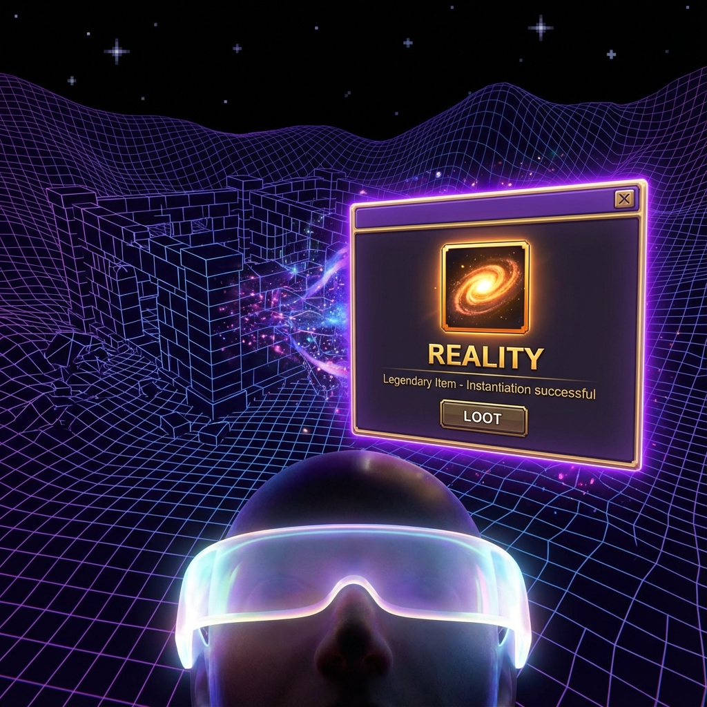

# 1.3 Loot Exists Only When Dropped (Computable Definition of Existence)

**(Loot Exists Only When Dropped - Computable Definition of Existence)**

> **"Only when the mouse hovers over it and shows the Tooltip is that equipment truly real. Before that, it's just a line of code in the loot table."**

After dealing with the video memory limit (Axiom 1.1) and the physics engine (Axiom 1.2), we still need to solve the final BOSS of Volume I: **What exactly is 'existence'?**

In the old world's view, everyone thought that as long as something is there, it's there, whether you look at it or not. But in our interactive universe, in this huge program running on the Titan host, "existence" has a completely different definition.

This section will prove to you: Physical entities are essentially data structures that are **instantiated** and **persisted** in the server database.

### 1.3.1 The Void and Uninitialized Memory

Before discussing what "exists," let's see what "doesn't exist" means.

In classical physics, vacuum is empty. But in computational ontology, vacuum is not just empty; it is **NULL**.

**Definition 1.3.1 (Computational Vacuum)**

Vacuum state corresponds to **uninitialized** memory regions. Since no players are nearby, the system hasn't allocated computing power to render it at all.

Like those black areas beyond the map edges when you used to play games. There are not only no monsters there, but not even coordinates. That's not black; that's **void**. In the physical universe, unobserved regions exist only as **wave functions (generation rules/class definitions)**, not as concrete entities.

### 1.3.2 The Dual Criteria of Existence: Legitimacy and Persistence

What counts as "real"? We have two criteria:

1.  **Constructive criterion (legitimate loot)**: This object must be generable by the server's algorithm. You cannot have an artifact with all attributes as garbage characters; that's a Bug item and will be automatically deleted by the system. All physical existence must be Turing-computable.

2.  **Stability criterion (save file)**: This object must resist garbage collection mechanisms.
    *   **Fermions (matter particles)**: Like **epic equipment** in your bag. They are highly stable; they're still there after logging off and back on. They are **persistent** objects.
    *   **Bosons (force particles)**: Like **spell effects** or **text in the chat box**. They are born for interaction, disappear after use, and don't permanently occupy memory.

### 1.3.3 Observation as Instantiation: From Class to Object

In object-oriented programming (OOP), the difference between **class** and **object** perfectly corresponds to **superposition state** and **collapsed state** in quantum mechanics.

*   **Potential existence (class/loot table)**: The mount "Invincible," before Arthas falls, exists in a superposition state of "both existing and not existing." It's just a line of code composed of various probabilities in the database (wave function). This is called **weak existence**.

*   **Actual existence (object/pickup)**: When you kill the BOSS, the server performs an RNG judgment (observation/measurement) and decides to generate this item, it is truly **instantiated** (`new Mount()`). At this point, abstract probability becomes a definite item ID and unique GUID.

Therefore, **physical reality is not pre-placed there; it is generated on demand.**

Does the moon exist when no one is looking? No, then it's just a texture file on the hard drive. Only when you look up, the rendering engine loads it into video memory and instantiates it as a bright celestial body.

### 1.3.4 Levels of Reality: Particle Effects and Collision Volumes

Based on this definition, existence is no longer black and white, but a **continuous spectrum**:

1.  **Transient reality (particle effects)**: Like quantum fluctuations or fire effects in games. They look cool but have no **collision volume**. The system allocates little computing resources to them; they vanish in an instant.

2.  **Steady reality (collision models)**: Like tables, walls, BOSSes in raid instances. They are consensus reached by all players (observers). Countless interactions lock their states, giving them hard **physical collision**. This is the foundation for MMO synchronization.

3.  **Ultimate reality (hardcoded)**: The physical laws themselves, or **Blizzard's (Titans') bottom-layer code**. These are read-only rules that form the foundation of all game content.

**Corollary 1.3.1 (Unity of Idealism and Materialism)**

In this framework, matter (data) and consciousness (player operations) are inseparable. Without players to trigger, data is forever just 0s and 1s on the hard drive; without data feedback, player operations are meaningless. **Existence is the interface for player-server interaction.**

Congratulations, you have understood the core of Volume I: **The world is the Titans' code, and your observation turns code into reality.**
