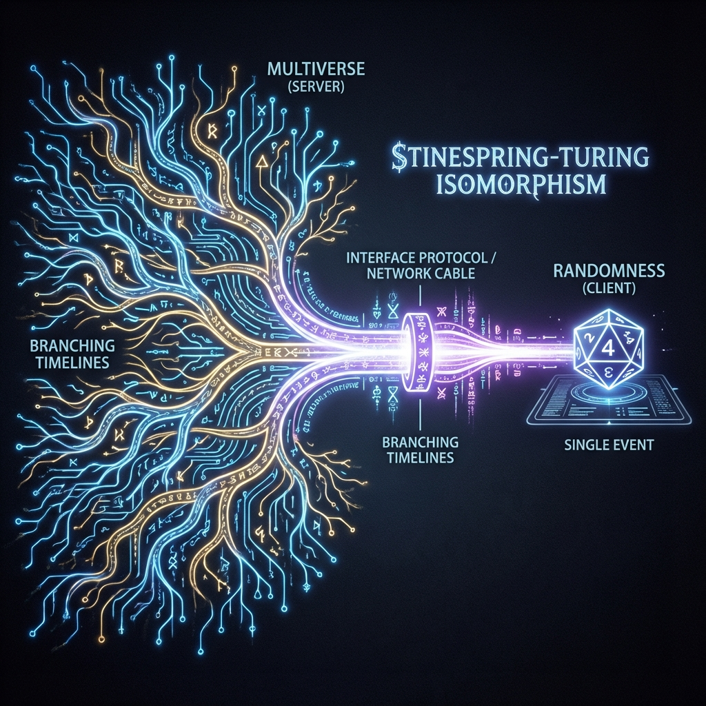

# 2.3 接口协议（斯泰恩斯普林-图灵同构）

**(The Interface Protocol - Stinespring-Turing Isomorphism)**

> **“随机性就是视野范围外投下的阴影。所谓的‘坍缩’，不过是庞大的服务器数据流挤过你那根细细的网线时发生的丢包和压缩。本节将证明，‘多重宇宙’和‘自由意志’其实是一回事，只是从服务器看还是从客户端看的区别。”**

在 2.1 节和 2.2 节中，我们建立了两个模型：
1.  **服务器模型**：全知全能，多线程，包含所有历史。
2.  **客户端模型**：单线程，只能看到一个结果，充满随机性。

物理学界吵了一百年，有的说世界是确定的（爱因斯坦），有的说世界是随机的（玻尔）。这其实是因为他们把服务器逻辑和客户端逻辑搞混了。

本节我们将证明全书的核心定理——**斯泰恩斯普林-图灵同构定理**。翻译过来就是：**完美无缝的客户端同步协议**。

我们将证明，对于你这个只能盯着屏幕的玩家来说，你永远无法分辨自己到底是生活在一个确定的多重宇宙里，还是生活在一个随机的单机游戏里。

### 2.3.1 定理陈述：计算的不可区分性

**定理 2.3.1（暴雪协议同构）**

对于任何一个游戏过程，以下两种解释在数学上是完全等价的：

1.  **服务器视角（全局幺正性）**：整个艾泽拉斯是一个巨大的、没有任何随机性的精密机器。所有产生随机数的地方（比如Roll点），实际上是不仅Roll出了100，也Roll出了1-99，只是各自在不同的平行位面里。

2.  **客户端视角（交互随机性）**：服务器不仅给你发数据，还给你发了一个随机种子。每一次Roll点，你的客户端都根据这个种子和你的输入（点击时刻），算出了一个唯一的结果。

**物理推论**：

只要你无法黑进暴雪的机房查看后台数据（即无法访问视界外的环境），你就永远无法通过做实验来区分这两种情况。

**你以为的自由选择，可能是平行宇宙的分支；你以为的随机命运，可能是高维数据的投影。**

### 2.3.2 正向证明：从平行世界到RNG

我们先来看，服务器的确定性是如何变成你眼里的随机性的。

假设服务器计算了一次攻击判定。在这一刻，服务器产生了一个叠加态：
*   状态A：暴击（50%）
*   状态B：未命中（50%）

这两个状态在服务器内存里是同时存在的。但是，你的网线（带宽）一次只能传输一个状态的数据包。

于是，服务器根据这两个状态的权重（概率），扔了个骰子，决定把“暴击”这个数据包发给你。

对你来说，你看到了暴击。你觉得这是“随机”的运气。但其实在服务器端，那个“未命中”的历史并没有消失，它只是没有被发送给你（或者发送给了平行宇宙的另一个你）。

**结论**：多重宇宙的结构，在客户端的视野里，**“坍缩”**为了随机数生成器（RNG）。

### 2.3.3 逆向证明：从RNG到平行世界

反过来，任何看似随机的单机游戏，都可以被“洗白”成一个宏大的服务器事件。

想象你在玩一个纯单机游戏。里面的怪物掉落完全是随机的。这在数学上叫“混合态演化”。

著名的**斯泰恩斯普林扩张定理**（Stinespring Dilation Theorem）告诉我们：任何包含随机性的过程，都可以看作是一个更大的、没有随机性的过程的一部分。

我们可以假想存在一个从来看不见的“环境服务器”。每当你的单机游戏产生一个随机数时，实际上是你的电脑和这个环境服务器发生了一次**纠缠**。

$$ U (\text{你的状态} \otimes \text{服务器}) = \sum \text{结果} \otimes \text{环境记录} $$

这个方程告诉我们：**任何随机事件，都在更深层面上对应着某种信息的记录。**

**物理意义**：

这告诉我们，“自由意志”并不违反物理定律。它仅仅意味着你的每一个选择，都在宇宙的后台留下了不可磨灭的Log记录。**客户端的输入指令，就是服务器的环境变量。**

### 2.3.4 全息等价性的后果

这个定理彻底重构了我们对“现实”的理解，建立了**全息计算等价原理**：

1.  **解释的对偶性**：
    *   **多世界诠释**是服务器管理员的真理。
    *   **哥本哈根诠释**是普通玩家的真理。
    *   它们不是对立的，它们只是**用户权限不同**导致的视角差异。

2.  **显卡即预言机**：
    *   客户端模型中那个神秘的“输入源”，在物理上就是你的**视界（Horizon）**。视界屏蔽了服务器的复杂性，把那种让你显卡爆炸的纠缠关系，转化为了简单的随机噪声。

3.  **计算守恒**：
    *   服务器消耗**空间**（存储所有平行宇宙）。
    *   客户端消耗**时间**（实时计算当前历史）。
    *   **以时间换空间**：宇宙之所以让你觉得它是“单历史”的，是因为你作为玩家，内存不够大。你无法加载整个游戏，所以你只能忍受“时间的流逝”——也就是数据的逐帧加载。

至此，第一卷“游戏引擎的原理”讲完了。我们证明了艾泽拉斯是一个有限的、可计算的系统，也解释了为什么你觉得自己在玩一个即时制游戏。

在接下来的第二卷，我们将离开枯燥的代码层，进入真正的艾泽拉斯世界——去看看光速（网络延迟）和引力（服务器负载）是怎么影响你的游戏体验的。
