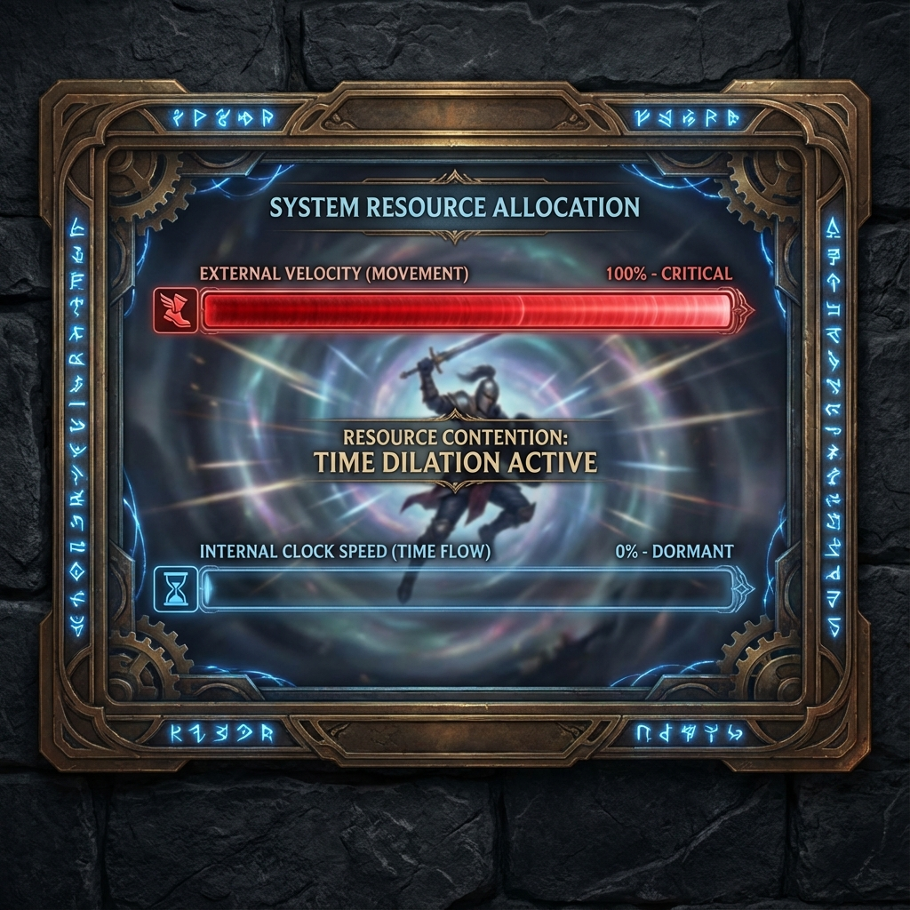
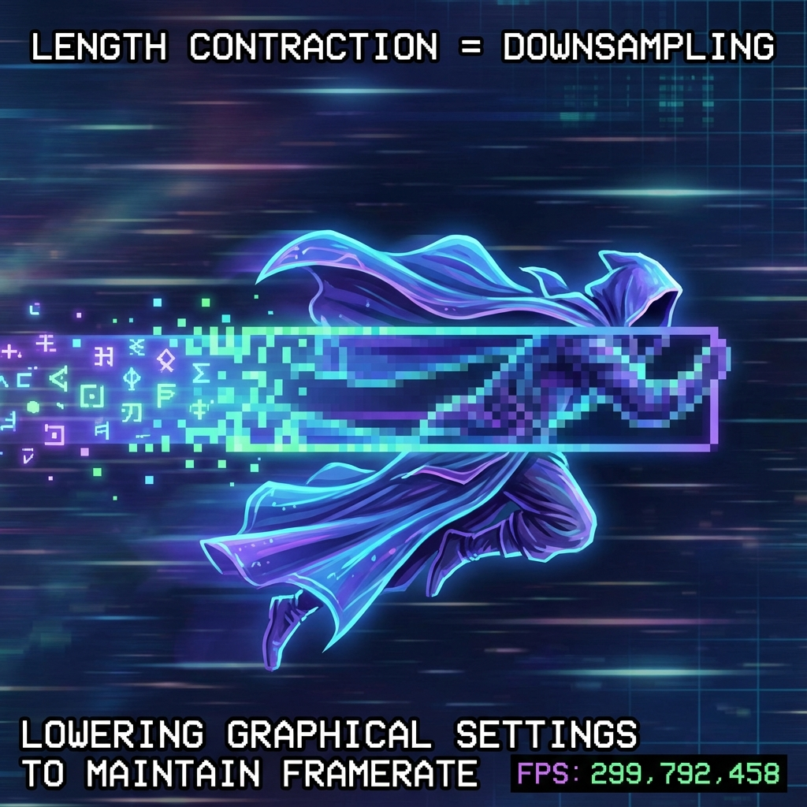

# 3.2 团队副本的同步（狭义相对论的信息论起源）

**(Raid Synchronization - The Information-Theoretic Origin of Special Relativity)**

> **“相对论不是关于‘速度’的魔法，而是关于‘同步’的协议。当你的延迟（Ping）很高时，你的画面自然会变慢。时间膨胀不是什么深奥的哲学，它就是单纯的卡顿（Lag）。”**

在 3.1 节中，我们知道了光速 $c$ 实际上是服务器的最大带宽。在经典物理学中，爱因斯坦提出了狭义相对论。但在我们的“艾泽拉斯代码”体系里，我们不需要假设，我们可以直接推导出来。

本节将证明：只要带宽有限，那么为了保持画面不撕裂，系统必须执行一套特殊的同步算法。这套算法会导致**时间膨胀**（动作变慢）和**尺缩效应**（模型变扁）。

### 3.2.1 参照系：你看到的数据流

在分布式系统理论中，根本不存在所谓的“全服统一时间”。

每个玩家的客户端都有自己的本地时钟。

**定义 3.2.1（物理参照系）**

一个**参照系**本质上就是一种**排序协议**。它负责把你收到的各种乱序的数据包（这儿爆炸了，那儿喊话了），排列成一个有先后顺序的“剧情”。

*   **静止参照系**：你自己看自己。没有延迟，即时响应。
*   **运动参照系**：你看一个正在跑位的盗贼。他的数据包传过来需要时间。

由于数据传输有延迟（光速限制），当你试图锁定一个快速移动的目标时，系统必须进行**插值补偿**。如果这个补偿算法要保证因果逻辑不出错（比如不能先看到他倒地，再看到我火球打出去），那么**洛伦兹变换**是唯一合法的算法。

### 3.2.2 资源竞争与时间膨胀：CPU跑不动了

狭义相对论最著名的预言是：运动的钟走得慢。

在计算宇宙学中，这其实是因为**CPU资源竞争（Resource Contention）**。

根据第一卷的定理，每一个物理对象（比如那个盗贼）在单位时间内能处理的信息量是有上限的（受限于普朗克频率）。这笔“算力预算”必须分给两件事：

1.  **处理位置更新（$v_{ext}$）**：计算他在地图上的位移。这很吃显卡。
2.  **处理内部逻辑（$v_{int}$）**：计算他的生命值回复、能量恢复、或者是他的手表走针。

**定理 3.2.1（算力守恒定理 / 勾股定理）**

对于任何单位，他的外部移动速度和内部刷新速度，必须满足：

$$ v_{ext}^2 + v_{int}^2 = c^2 $$

**翻译成人话**：服务器分给每个单位的资源是固定的。

*   如果你**站着不动**（$v_{ext}=0$），所有的资源都用来刷新你的内部状态，你的时间流逝最快（$v_{int}=c$）。
*   如果你**跑得飞快**（$v_{ext}$ 很大），服务器必须把大部分算力用来计算你的坐标变化。于是，分配给你处理“变老”或者“回血”的算力就变少了。

**这就是时间膨胀的真相**：你之所以看到飞船里的人动作变慢了，不是因为时间变魔术了，而是因为他的系统正忙于处理“移动”这个高优先级任务，导致处理“内部逻辑”的线程被强制降频了。

这是一种**系统级的卡顿（Lag）**。

### 3.2.3 尺缩效应：为了流畅而降低画质

长度收缩（Length Contraction）通常被误解为物体真的被压扁了。在信息论视角下，这实际上是一种**降采样（Downsampling）**。

当你测量一个飞驰的法师的身高时，你其实是在请求服务器同时返回他头顶和脚底的坐标。

但在带宽有限的情况下，为了保证你在有限的时间窗口内接收到完整的数据包，系统必须对数据进行**压缩**。

$$ L' = L \sqrt{1 - \frac{v^2}{c^2}} $$

这就像是在看在线视频。如果网速不够（受限于 $c$），为了保证视频不卡顿（时间连续），系统会自动降低画面的分辨率（空间收缩）。

所谓的尺缩效应，就是**为了保帧率而牺牲分辨率**。

### 3.2.4 洛伦兹协变性：最终一致性

现在我们可以给出狭义相对论的终极定义。它不是关于时空的几何学，而是关于**网络同步**的代数学。

在艾泽拉斯，所有的物理定律都必须符合**洛伦兹协变性**。这意味着：

**定理 3.2.2（协议一致性）**

无论你的延迟是多少，无论你跑得多快，系统的**逻辑因果**（谁先动手，谁先死）必须保持一致。

这在分布式数据库里叫**最终一致性（Eventual Consistency）**。

**总结**：

狭义相对论是泰坦服务器的**I/O调度算法**。它通过动态调整每个玩家的**本地时钟频率（时间膨胀）**和**画面分辨率（尺缩效应）**，确保了在全服带宽有限（$c$）的恶劣硬件条件下，没有任何数据包会发生逻辑错误（比如死人打出DPS）。
