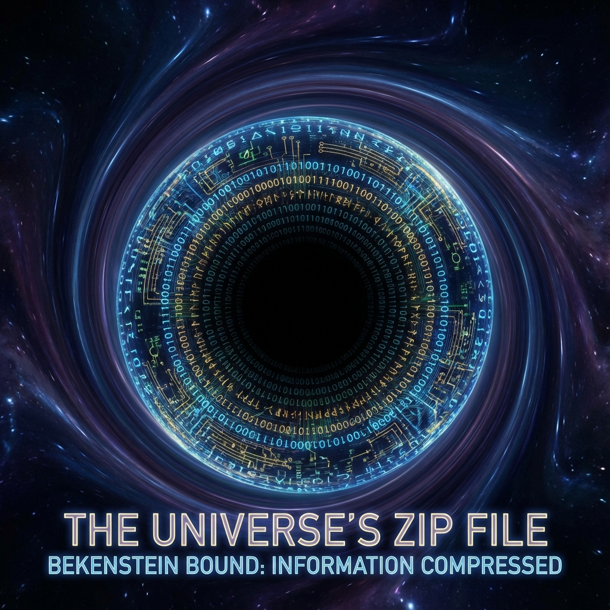

# 4.2 资源的压缩（全息压缩）

**(Resource Compression - Holographic Compression)**

> **“如果不进行压缩，一个1:1真实比例的艾泽拉斯能把泰坦的主机撑爆。大自然是一位极致的极简主义程序员，它发现三维空间里绝大多数地方都是空的。真正的宇宙是一张二维的‘膜’，而我们所感知的深邃太空，不过是这张膜上全息数据的解压与投影。”**

上一节讲了空间是投影。这一节我们来讲讲**为什么**要这么做。
答案很简单：**省流**。

本节将从数据压缩的角度，重新阐述全息原理。宇宙采用了一种类似于现代游戏开发中的**纹理映射（Texture Mapping）**和**稀疏八叉树**的策略。

### 4.2.1 体积的幻觉：别被空气方块骗了

直觉告诉我们，空间是由无数个小方块（体素 Voxel）堆起来的。
如果你要确实地存储一个实心的 $10 \times 10 \times 10$ 的大方块，你需要 $1000$ 个单位的存储空间。
$$ I \propto L^3 $$
这叫**体积律**。这是最笨的存法。

然而，全息原理告诉我们，大自然用的是最高效的存法。对于任何一个区域，它的最大信息量只取决于表面积：
$$ N \propto L^2 $$
对于那个 $10 \times 10 \times 10$ 的方块，大自然只存了 $600$ 个单位（表面积），而不是 $1000$ 个。

这意味着，当我们深入微观尺度时，所谓的“体空间”并没有提供额外的信息存储位。**内部数据是冗余的**。

**计算推论**：
三维空间内部不是“实心”的。它更像是一个空心的气球，所有的物理信息（粒子的位置、动量）实际上都写在气球的表面（贴图）上。内部的任何一点，都不是一个独立的存储单元，而是边界数据通过算法生成的**投影**。

### 4.2.2 贝肯斯坦界限：最大压缩率

我们可以把贝肯斯坦的熵界限公式，看作是宇宙服务器的**最大压缩率**。

**定理 4.2.1（全息信道容量）**

宇宙中任何硬盘或网线的最大存储密度，不能超过每普朗克面积 1/4 比特。

$$ C_{max} = \frac{\text{Area}}{4 \ln 2 \cdot l_P^2} $$

这个公式不仅仅是热力学的约束，更是**艾泽拉斯的总线规范**。它表明：

1.  **比特是面积性的**：在最底层，数据是铺在面上的，不是堆在块里的。
2.  **过饱和导致的视界**：如果你硬要往一个区域塞超过 $A/4$ 比特的数据，系统就会因为**显存溢出（Stack Overflow）**而触发保护机制——形成**黑洞（事件视界）**。黑洞就是那一块数据实在太多，导致渲染引擎无法处理，直接显示成了全黑。

### 4.2.3 纠错码与体空间

既然真实信息只有二维（$L^2$），为什么我们觉得世界是三维（$L^3$）的？
这源于**纠缠冗余**。

在全息对偶模型（AdS/CFT）中，体空间（Bulk）被证明本质上是一种**量子纠错码（Quantum Error Correcting Code）**。

大自然为了保护脆弱的量子信息不丢失，将原始的二维数据，通过复杂的纠缠网络，**扩散**到了三维的虚拟体积中。

我们生活在纠错码的“逻辑空间”里。我们感受到的物理定律（如引力），其实是系统维护这些纠错码稳定性的算法副产品。

### 4.2.4 黑洞：极限压缩包

黑洞是全息压缩机制的最极端案例。

对于经典观察者，掉进黑洞的东西好像都没了。但对于全息理论，黑洞是一个**最优压缩文件（.zip）**。

1.  **视界即硬盘**：黑洞的所有信息都精确地存储在视界表面上。没有任何比特丢失，也没有任何比特在内部。
2.  **防火墙**：由于数据密度过高，系统的渲染引擎无法解析内部结构（无法为内部体素分配独立的地址），因此只能渲染出一个黑色的球面边界，并将所有信息“平铺”在这个边界上。

在程序员眼里，黑洞就是一个**高密度数据节点**。因为它太密了，所以解压需要无限长的时间。

### 4.2.5 宇宙作为全息投影仪

综上所述，我们可以画出艾泽拉斯的工程图纸：

*   **源数据（Source Data）**：位于宇宙的边缘（或者无穷远处），是一张二维的量子位图。
*   **投影算法（Projection Algorithm）**：基于张量网络的重整化流。它负责把二维图“解压”成三维世界。
*   **用户体验（User Experience）**：我们这些玩家处于三维世界内部。我们感觉到的“实体物质”和“距离”，是源数据经过投影算法后的**全息像（Hologram）**。

**结论**：

空间不是空的，它是一张画；空间也不是实的，它是一个梦。全息压缩是泰坦为了在有限的硬件资源下模拟宏大世界的核心优化策略。

既然三维世界是二维数据的投影，那么在这个投影中，任何物体的运动速度都必然受到投影机制刷新率的限制——这再次印证了光速作为系统带宽的本质。
