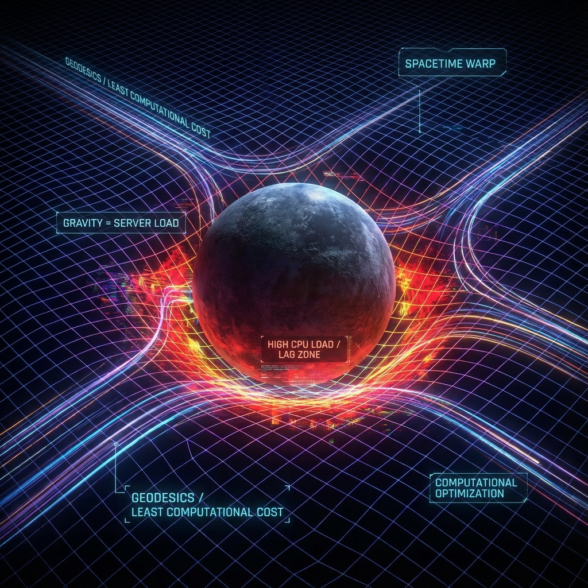

# 5.1 服务器负载与空间弯曲（复杂性与弯曲时空）

**(Server Load and Curved Spacetime - Complexity)**

> **“物质告诉时空如何弯曲？不，是数据负载告诉服务器如何分配算力。当你走进主城，画面变卡了，人物模型加载变慢了，那不是时空弯曲，那是服务器在那个区域的计算负载太高了。引力，就是计算系统处理复杂信息时产生的‘阻尼’。”**

在前几章，我们确立了：光速是带宽，空间是投影。现在，我们要面对物理学最大的BOSS——**引力（Gravity）**。

在爱因斯坦的广义相对论中，引力被解释为时空弯曲。但他没解释**为什么要弯曲**。

在**艾泽拉斯代码**理论中，我们将把引力去神秘化。我们将论证：引力不是一种把物体拉在一起的力，而是一种**熵力**。说白了，它是服务器为了处理复杂数据而产生的一种**滞后效应**。

### 5.1.1 引力是涌现的：就像气压

为了理解引力，想想气压。如果你看单个分子，没有“压力”这个概念。只有当你统计无数分子的撞击时，才会有压力。

同样，引力是时空微观比特（量子像素）在统计上的表现。

**定义 5.1.1（熵力）**

物质倾向于向引力势低（弯曲大）的地方运动，是因为这种运动最大化了系统的**混乱度（熵）**。或者说，这是计算系统在寻找**最小计算代价路径**。

### 5.1.2 复杂性等于体积：显卡杀手

全息原理的前沿研究（CV猜想）告诉我们：**空间的体积，等于计算的复杂性。**

$$ V \sim \text{Complexity} $$

*   一个区域看起来“很大”，意味着系统需要执行很多行代码才能渲染出这个区域。
*   黑洞内部的体积随时间增长，意味着黑洞的数据结构越来越乱，解压它需要的算力随时间增加。

因此，**弯曲时空**实际上是一幅**“服务器负载热力图”（Heatmap of Computational Load）**。

### 5.1.3 负载过高导致的时钟变慢

现在我们可以回答：为什么大质量物体（恒星/黑洞）会扭曲时空？

1.  **质量即复杂性**：一个大质量物体，本质上是一个高度纠缠的、包含海量数据的**高复杂度贴图**。对于服务器来说，这是个“显卡杀手”。
2.  **算力黑洞**：为了渲染这个复杂的物体，服务器必须向该区域分配大量的CPU周期。
3.  **处理延迟（引力红移）**：根据**算力守恒定律**，如果服务器忙着计算这个物体的内部结构，那么它处理外部消息（比如光子路过）的速度就会变慢。

**结论**：在玩家看来，那个区域的“时间”变慢了。光线经过那里时，因为处理节点的**网络拥堵**，路径发生了偏折（引力透镜）。

### 5.1.4 引力就是路由重定向

物体之所以“掉”向大质量物体，是因为在那条路径上，**信息传输延迟最小**。

想象你在玩网游。
*   平直时空 = 没人的野外，走路是直线的。
*   弯曲时空 = 更是人山人海的主城。

当你靠近主城时，由于数据包拥堵，系统会自动调整你的路线，把你导向那个负载中心（虽然这听起来反直觉，但在四维时空的测地线方程里，这就是最短路径）。

**引力实际上是网络拥堵导致的路由重定向。**

### 5.1.5 张量网络中的几何形变

我们可以用**张量网络**来演示引力。

想象一张平整的渔网（平直空间）。
现在我们要在这个网上放一个超级复杂的物体。为了编码这个物体的数据，我们需要在原有的网格里插入更多的**节点**。

根据CV猜想，插入更多的节点，等同于增加了该区域的“体积”。但在边界固定的情况下，内部体积的增加迫使网格**隆起（弯曲）**。

**结论**：

爱因斯坦场方程，实际上是全息计算机的**资源调度方程**：
*   左边 $G_{\mu\nu}$（曲率）：代表**计算节点的分布**。
*   右边 $T_{\mu\nu}$（能量）：代表**待处理的数据负载**。

方程表明：为了处理高密度的数据负载（$T_{\mu\nu}$），系统必须重构网络拓扑（$G_{\mu\nu}$），增加节点密度，从而导致了宏观上的时空弯曲。

**引力，就是宇宙这台计算机在满负荷运转时发出的“噪音”。**
