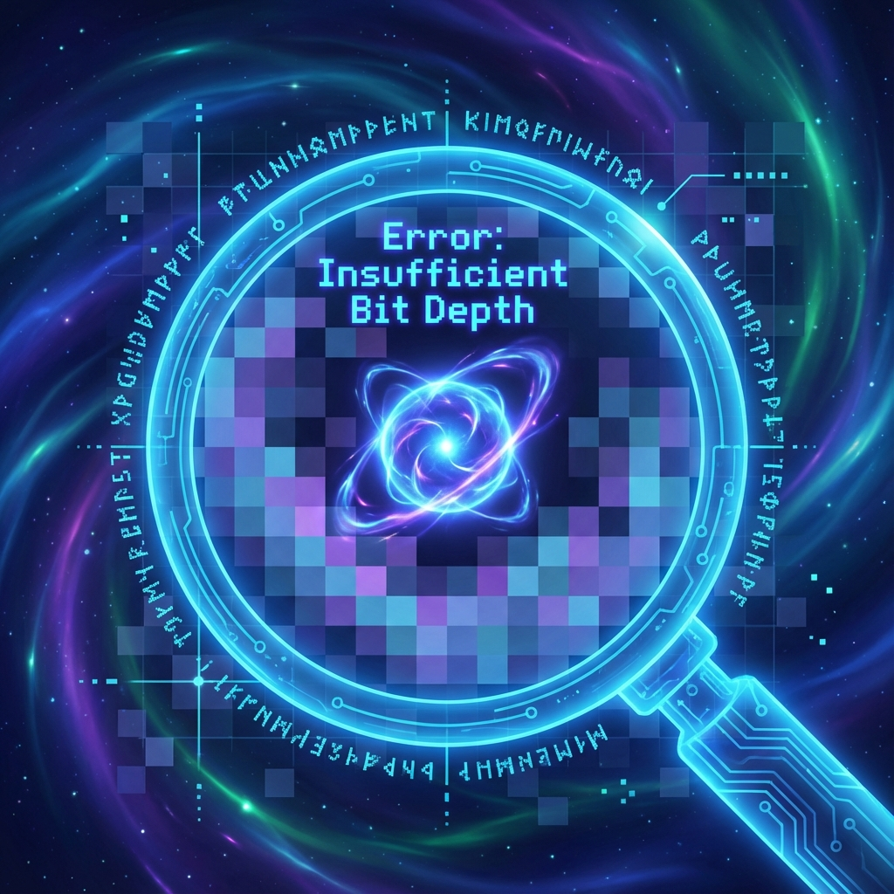

# 6.1 Resolution Limits (Arithmetic Roots of Heisenberg's Uncertainty)

**(Resolution Limits - Arithmetic Roots of Heisenberg's Uncertainty)**

> **"God doesn't play dice, but he does use finite-precision floating-point numbers. The uncertainty principle is not mysterious magic; it's a blurry jpg image. When you zoom to pixel level, you naturally can't see details; this is the iron law of any discrete system."**

In the first two volumes, we discussed macroscopic servers and networks. Now, we zoom in to see Azeroth's microscopic pixels—**quantum mechanics**.

Quantum mechanics' core feature is **Heisenberg's uncertainty principle**: You cannot simultaneously know a particle's position and velocity precisely.
In **Code of Azeroth** theory, this is neither perturbation nor ignorance. It's a mathematical corollary of the **Axiom of Finite Information**. Simply put, it's **insufficient resolution**.

### 6.1.1 Video Memory Can't Store Infinite Decimals

In classical mechanics, position is a real number. If you want to precisely write down a coordinate (like $\pi$), you need an infinitely long strip of paper.
But as we said in Chapter 1, the Titans' server has **finite bits**.

This means the system cannot store infinite-precision decimals. For any attribute, the system can only allocate finite **bit depth**.

Suppose the system allocates $N$ bits total to describe a particle.
*   If you use many bits to describe **position** (very precise position), then fewer bits remain to describe **velocity** (blurry velocity).
*   Vice versa.

**Formula**:
$$ \text{position precision} + \text{velocity precision} \le \text{total memory} $$

This is why when you measure position more precisely ($\Delta x \to 0$), momentum becomes more chaotic ($\Delta p \to \infty$). The system isn't unwilling to tell you; it's **because memory overflow, trailing digits are truncated**.

### 6.1.2 Fourier Transform: The Seesaw of Time Domain and Frequency Domain

This mathematically corresponds to **discrete Fourier transform**.

*   **Position** is like **time domain** signal (which frame you appear in).
*   **Momentum** is like **frequency domain** signal (what's your frequency).

Mathematically, there's a dead law: You cannot create a signal that's both extremely short at this moment (position determined) and extremely narrow in spectrum (momentum determined).

$$ \Delta x \cdot \Delta p \ge \frac{\text{minimum pixel}}{2} $$

This is purely an arithmetic fact. Like you cannot zoom an image to 1x1 pixel while retaining all details.

### 6.1.3 Non-Commuting Operators: Data Type Conflicts

In programmer's eyes, this uncertainty is due to **data type conversion**.

*   **Measuring position**: Equivalent to executing `Read_Position()`. System converts data to "bitmap format."
*   **Measuring momentum**: Equivalent to executing `Read_Momentum()`. System converts data to "spectrum format."

These two operations are **mutually exclusive**. You cannot make a file both .bmp and .mp3. In this conversion process, information reorganization is inevitable.

**Theorem 6.1.1 (Mutually Exclusive Precision Protocol)**

Conjugate variables (position and momentum) are actually projections of the same underlying data in two different **views**. Since underlying data is only one copy, the system prohibits simultaneously opening two high-definition views.

### 6.1.4 Lazy Evaluation and LOD Technology

Finally, we connect the uncertainty principle with **Level of Detail (LOD)** technology.

In games, when the camera is far away, models are rough (low-poly). Only when you get very close does the graphics card load high-definition textures.

Heisenberg's principle is actually the universe rendering engine's **LOD switching mechanism**.

When an observer tries to "see" a particle with extremely high energy (short wavelength), they're actually forcing the system to perform **sub-pixel sampling**.
*   To satisfy this excessive demand, the system must call extremely high-frequency data.
*   These high-frequency data correspond to huge momentum disturbances.
*   This disturbance is not "measurement destroying the particle," but **high-frequency noise that the rendering engine must inject to generate high-precision coordinates**.

**Conclusion**:

Heisenberg's uncertainty principle is the **bandwidth theorem of discrete signal processing**. It protects the universe computer, preventing you from draining server memory through infinite-precision measurements. It's the **overflow protection** mechanism in physical laws.
