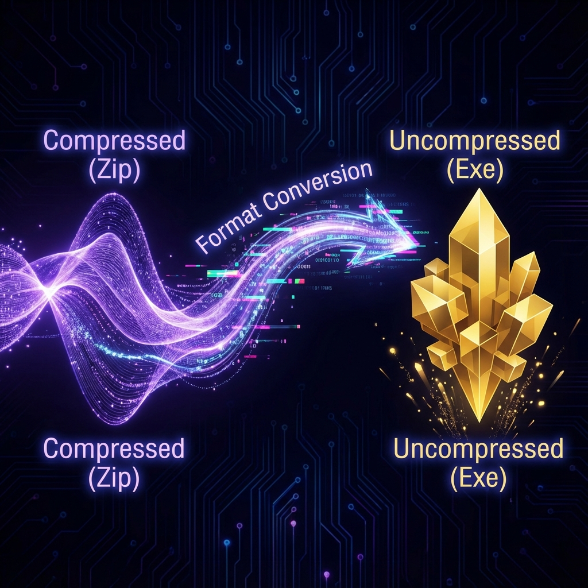
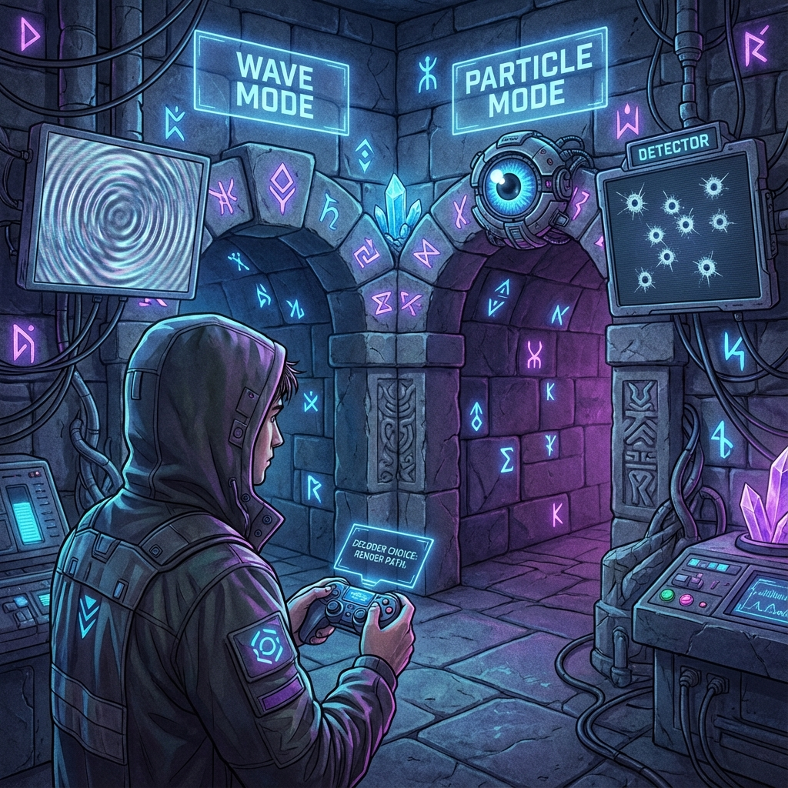

# 6.2 贴图与模型的互补（互补性原理与数据压缩）

**(Textures vs Models - Complementarity Principle and Data Compression)**

> **“波和粒子不是物质的两种属性，而是同一份数据的两种格式。就像游戏文件在硬盘里是压缩包（波），而在运行内存里是解压后的文件（粒子）。宇宙根据你是要‘传输’还是要‘交互’，动态切换数据的格式。”**

在 6.1 节里，我们讲了海森堡原理是分辨率限制。这引出了另一个大问题：**波粒二象性**。

为什么有时候光像波，有时候像粒子？
在**艾泽拉斯代码**里，这不是神秘现象，这是**动态数据压缩策略**。

### 6.2.1 格式转换：位图 vs 矢量图

在代码层面，波和粒子只是数据的两种**表示（Representation）**。

1.  **粒子视图（位图/实体）**：
    *   信息是**定域**的（就在这个坐标点）。
    *   适合处理**碰撞、拾取、战斗**。
    *   这就是你在副本里看到的那个能打的BOSS。

2.  **波动视图（频谱/压缩包）**：
    *   信息是**弥散**的（到处都是）。
    *   适合处理**传播、加载、过场动画**。
    *   这就是那个处于“可能出现”状态的BOSS数据包。

**数学本质**：
从粒子变成波，就是做了一次**格式转换（ZIP压缩）**。
所谓互补性原理，就是说你不能把一个文件同时保持在“已压缩”和“已解压”的状态。

### 6.2.2 传输时压缩，交互时解压

为什么宇宙要搞这么麻烦的两种格式？为了**省流**。

**场景一：跑图（自由传播）**
*   **任务**：一个火球从你的手中飞到怪的脸上。
*   **粒子模式（笨办法）**：如果用粒子模式，服务器要在每一帧每一个像素点计算它的位置，防止它穿模。这很累。
*   **波动模式（聪明办法）**：如果用波动模式，它只是一个数学公式（相位的旋转）。计算起来极其简单。
*   **结论**：**波是最高效的传输格式**。只要没撞到东西，系统默认把所有飞行的东西打包成波（压缩包），这样可以极大降低运算量。

**场景二：命中（局域交互）**
*   **任务**：火球砸在脸上了。
*   **波动模式（笨办法）**：波是散开的，没法算具体的伤害判定位点。
*   **粒子模式（聪明办法）**：系统需要知道精确的坐标 $(\text{x}, \text{y}, \text{z})$ 来扣血。
*   **结论**：**粒子是最高效的交互格式**。当撞击发生时，系统必须把波**解压**回粒子，执行碰撞检测。这就是物理学上的**“坍缩”**。

### 6.2.3 观测者的选择：双缝实验

当你做双缝干涉实验时，其实是你作为玩家在配置**解码器**。

*   **不放探测器**：你告诉服务器：“我不关心它走哪条路。”服务器心想：“太好了，省事了。”于是它保持**波动编码**（压缩包模式），穿过双缝，在屏幕上画出干涉条纹。
*   **放置探测器**：你告诉服务器：“我要看它的精确路径。”服务器被迫执行 `Unzip()`，把数据解压回**粒子编码**。变成粒子后，它只能穿过一条缝，干涉条纹消失。

**定理 6.2.1（所见即所求）**

现实呈现什么样子（波还是粒子），取决于你问系统要什么格式的数据。
$$ \text{现实} = \text{数据} + \text{你的请求} $$

### 6.2.4 延迟选择：按需渲染

惠勒的**延迟选择实验**证明了，即使光子已经飞过来了，只要你还没看结果，你依然可以改变它的过去。

这在代码视角下太正常了：这是**惰性求值（Lazy Evaluation）**。

*   光子在飞行过程中一直是**压缩包**。
*   **日志（Log）**是还没生成的。
*   直到最后一刻你决定怎么看它，系统才根据你的决定，**即时生成**它的历史轨迹。

这就像游戏里的**视锥体剔除**：显卡永远只渲染你盯着看的那一瞬间。

### 6.2.5 总结：实在的编码学

互补性原理揭示了宇宙操作系统的一项核心优化技术：**动态转码**。

1.  **真空是频域的**：为了省带宽，没人的地方全是波。
2.  **物质是时域的**：为了算碰撞，有人的地方全是粒子。
3.  **观测是解码**：你的眼睛决定了数据的解压方式。

物理学家吵了一百年的波粒之争，其实是混淆了**源文件**和**显示格式**。宇宙只有一种东西——量子信息流，它根据需要，在压缩和解压之间来回切换。
