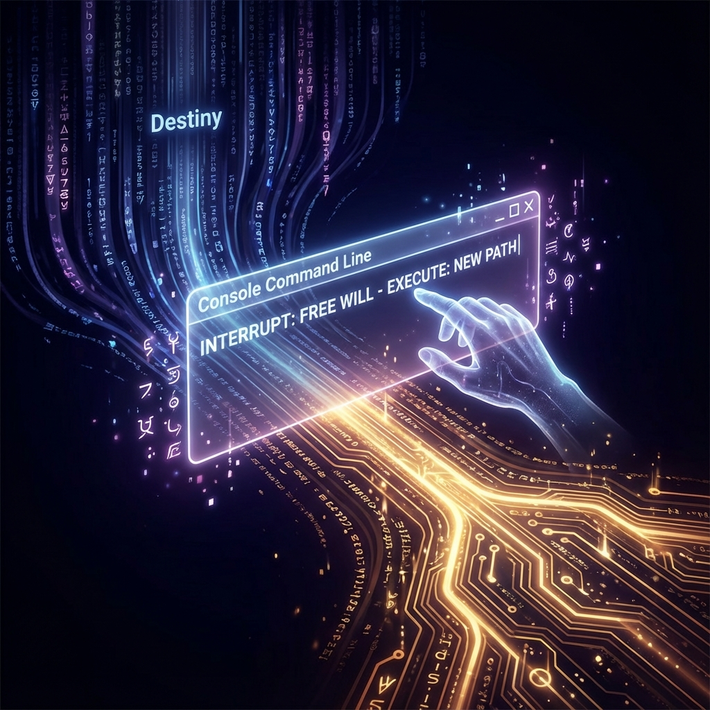

# 8.1 The Player Behind the Screen (Oracle Access: Physical Definition of Free Will)

**(The Player Behind the Screen - Oracle Access and Free Will)**

> **"Without connecting players, Azeroth is just empty-running code. NPC behavior is predetermined (algorithmic), but player behavior is unpredictable. Free will is not magic; it's an interface the system leaves for external input sources to break algorithmic dead loops."**

The first three volumes built the world, but still lack the most important thing: **User**.
Without players, the world is just a screensaver.

In old physics, consciousness was thought to be the brain's product. But in **Code of Azeroth**, consciousness holds supreme status: It's the system's **I/O interface**. It's the only **non-algorithmic input source**.

This section will use Turing's **"Oracle"** concept to give free will a physical definition:
**Free will = external input interrupt.**

### 8.1.1 Gödel Gap: Why Do We Need Players?

Gödel's incompleteness theorem tells us: Any complex system has problems it cannot solve itself.
For the physical universe computer, if it's closed, quantum mechanics would get stuck on the **halting problem** (when exactly does Schrödinger's cat die?).

To break this dead loop, the system must introduce an **external guidance**.

*   **Deterministic dead end**: If everything is calculated, then the future is predetermined, boring.
*   **True randomness need**: Computers can only generate pseudo-random numbers. True random choices must come from outside the system.

### 8.1.2 Definition of Physical Oracle

Turing proposed **oracle** in 1939: A black box that can solve problems computers cannot solve.
In our model, **consciousness = player**.

**Definition 8.1.1 (Consciousness Oracle)**

Consciousness is a function defined outside the physical world. It receives current state and returns a **choice**.
After the system gets this choice, it continues calculating the next frame according to physical laws (game rules).

Consciousness is **non-algorithmic**. This means you cannot write a cheat (program) to perfectly predict player movement, because players are outside the game code's logical closure.

### 8.1.3 Free Will Is Interrupt Request (IRQ)

Free will is neither predetermined nor random. It's **information injection**.

1.  **Interrupt**: When the brain faces a choice (superposition state), physical algorithm evolution **suspends**.
2.  **Query**: System asks player: "Boss, which way?"
3.  **Choice (Input)**: Player presses keyboard (injects information).
4.  **Continue (Resume)**: System receives command, collapses wave function, continues running.

**Corollary 8.1.1 (Bandwidth of Will)**

Free will is not infinite. Only at **critical moments** (branch points) will the system listen to you.
If not facing choices, the system is in **autopilot** mode. This means most of the time we're "AFK."

### 8.1.4 Does Not Violate Physical Laws

Someone asks: Won't players randomly pressing keys break energy conservation?
No. Because **oracle only sets boundary conditions**.

Like when you press "jump" in a game:
*   You didn't modify gravity parameter ($G$ unchanged).
*   You just input a legal control command within the physics engine's allowed range.

**Theorem 8.1.1 (Causal Compatibility)**

For NPCs in the game, player operations look like **purely random natural phenomena**.
The existence of free will will not cause game crashes.

### 8.1.5 Summary: Account and Character

By introducing oracle, we separated **account (Mind)** and **character (Brain)**.

*   **Brain**: Is physical hardware, responsible for storing data, calculating health. It's computable.
*   **Mind**: Is account, responsible for experience and decisions. It's non-algorithmic.

This explains why AI can pass Turing test but has no pain. Because AI only has **character (code)**, no **account (external player)**.

In the next section, we will discuss what interface (UI) this account uses to play the game. Spoiler: That UI is your **feelings (Qualia)**.
