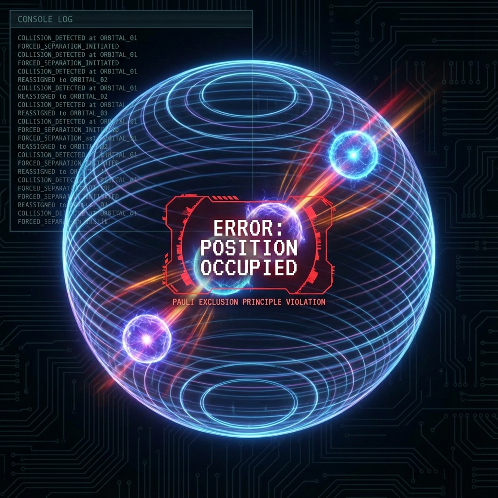

# 9.2 Collision Detection (Pauli Exclusion with Information Theory)

**(Collision Detection - Pauli Exclusion with Information Theory)**

> **"Why can't you walk through walls? Not because of electromagnetic repulsion, but because the system prohibits two objects with unique IDs from occupying the same memory address. Pauli exclusion principle is the universe database's primary key constraint."**

Section 9.1 solved "everyone sees the same world." But what if everyone crowds the same place?
If you and another player try to stand at the same coordinates, what happens?

In classical physics, waves can superimpose.
But in macroscopic reality, matter is **hard**. You cannot sit inside a chair.
This hardness originates from **Pauli exclusion principle**.

This section will prove: Pauli principle is not a force; it's **anti-clipping algorithm** in multi-user systems.

### 9.2.1 Messages vs Objects

In computers, there are two types of data:
1.  **Messages (broadcast phase)**: Can superimpose. Many people can listen to broadcast simultaneously.
    *   Physical correspondence: **Bosons** (photons).
    *   Function: Transmit forces, communication.
2.  **Objects (exclusive items)**: Cannot superimpose. One memory address can only store one number.
    *   Physical correspondence: **Fermions** (electrons, protons).
    *   Function: Constitute material entities.

**Key difference**:
Fermions have **unique identifiers (Unique ID)**. To ensure logic doesn't go wrong, the system prohibits two fermions with the same ID from overlapping states.

### 9.2.2 Antisymmetric Wave Function: Hash Collision Detection

Mathematically, fermion wave functions are **antisymmetric**:
Swapping two particles, sign reverses. $\Psi(1, 2) = -\Psi(2, 1)$.

If two particles have completely identical states ($1=2$), then $\Psi(1, 1) = -\Psi(1, 1)$.
Only solution is $\Psi = 0$.

**Computational interpretation**:
*   $\Psi$ is probability amplitude.
*   $\Psi = 0$ means **illegal operation**.
*   Antisymmetry is a bottom-layer **hash verification algorithm**. System constantly monitors all fermions' state fingerprints. Once conflict detected, directly throws exception, prevents that state from being generated.

This is so-called "exchange repulsion." It doesn't need to exchange any particles; purely originates from logical impossibility.

### 9.2.3 Electron Shells: Memory Allocation Table

Without Pauli principle, electrons outside atomic nuclei would all fall to the bottom layer (ground state). Then all atoms would look the same; there would be no chemical reactions.

Precisely because of uniqueness constraint, electrons are forced to **queue (stack)**:
*   1st electron occupies $1s$ orbital (address `0x001`).
*   2nd electron wants in, system error: `Error: Address Occupied`.
*   2nd forced to $2s$ orbital (`0x002`).

**Conclusion**:
The periodic table is essentially the universe memory management unit's (MMU) **address mapping table**. Matter's volume is the result of system sequential memory allocation.

### 9.2.4 Degeneracy Pressure: Physical Manifestation of Logical Errors

When gravity (to save resources) tries to compress stars to a point, it encounters strong resistance—**degeneracy pressure**.
White dwarfs and neutron stars are held up by this.

This pressure is unrelated to temperature. It's macroscopic manifestation of **logical error throwing**.
Like in a theater with only 100 seats, you force 101 people in.
No matter how hard you push, the 101st person just can't enter.
This resistance isn't because there's repulsion at the door, but because **ticketing system (Pauli principle)** refuses to issue tickets.

**Corollary 9.2.1 (Nature of Contact)**

When you slap a table, the hardness you feel, 90% comes from electron degeneracy pressure.
You're actually touching **boundary conditions of universe code**.
Your hand can't pass through the table because the system prohibits **texture overlap (clipping)**.

### 9.2.5 Summary: Foundation of Multi-User World

Pauli principle is the core of multi-user protocol.
*   Without it, the world would collapse into mush (Bose condensation).
*   With it, every particle has its own "dignity" and "territory."

Precisely because fermions repel each other, we can have **independent bodies**. We are not only independent in software (consciousness), but also mutually exclusive in hardware (body). This is our physical guarantee of "occupying a place in this world."
