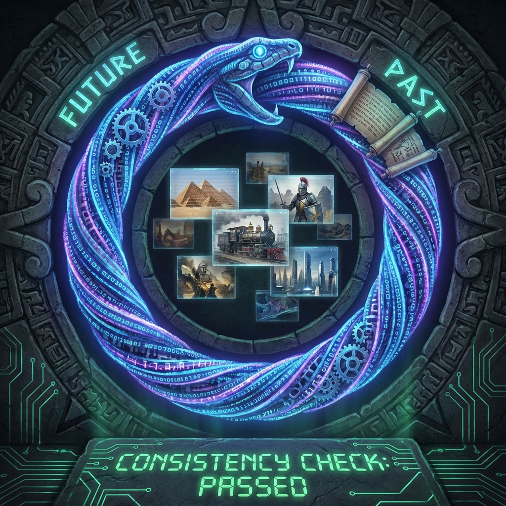

# 10.1 The Loop Legend (Closed Timelike Curves and Consistency)

**(The Loop Legend - Closed Timelike Curves and Consistency)**

> **"Causality doesn't always point from past to future. In the code world, loops and recursion are basic syntax. The universe is not a ray heading toward nothingness, but a huge ouroboros. The future's endpoint ($\Omega$) designed the past's starting point ($\alpha$), like game ending determines opening animation."**

The first nine chapters built the entire game world. But there's still an ultimate question: **Which designer filled in the initial values?**
Fine structure constant, gravitational constant, speed of light... These parameters are "fine-tuned" so precisely that if wrong by a tiny bit, the server crashes.

Anthropic principle says this is survivor bias. But in **Code of Azeroth**, this is **bootstrapping**.
This section will demonstrate: The universe is a **closed-loop system**. Future state as goal, through **retrocausality**, optimizes initial Big Bang parameters.

### 10.1.1 Linear Time vs Circular Causality

Classical physics believes linear time: $S_t$ determined by $S_{t-1}$. This leads to infinite questioning: Who pushed the first domino?
But in computers, **circular causality** is normal.

*   **Feedback loop**: Air conditioner adjusts previous cooling based on current temperature (output).
*   **Iterative algorithm**: $x = f(x)$.

If the universe is a computer, there's no reason it only runs a linear `Hello World` once. It's more like running a **dead loop** searching for optimal solution.

### 10.1.2 Physical "Load Save" Mechanism

Einstein's field equations allow **Closed Timelike Curves (CTC)**. That is, going back to the past.
Physicists fear this because it leads to "grandfather paradox."
But in code, CTC is **instruction jump (JUMP / GOTO)**.

**Definition 10.1.1 (Physical CTC)**

Physical time loops are **logical loops** in computational history.
Future output becomes current input. This doesn't mean crash; it means the system must satisfy **self-consistency constraints**.

### 10.1.3 Novikov Self-Consistency Principle

**Novikov Self-Consistency Principle** states: The probability of you going back to the past and doing anything is 1, if and only if these things don't cause contradictions.

This is mathematically equivalent to **fixed-point theorem**.

**Computational interpretation**:
If future you goes back to kill grandfather, this is a **logical error (Bug)**, causing program crash (no solution).
The system will use **filtering mechanisms** to eliminate all historical paths causing paradoxes.

*   **You can go back to the past**, but you find no matter how hard you try, your gun jams, or you mistake the person.
*   **Ending predetermined**: Everything you do going back to the past is precisely what causes the future to become what it is now.

Retrocausality doesn't grant us the ability to change the past; it grants the **necessity that the past must be so**.

### 10.1.4 Future's Gravity (TSVF Theory)

Quantum mechanics' **Two-State Vector Formalism (TSVF)** believes:
*   One wave function evolves from past to future (push).
*   Another wave function evolves from future to past (pull).
*   Current reality is **standing wave** produced by these two waves fighting.

This means: Future's $\Omega$ point (game ending) is not passively waiting to happen. It produces a **reverse wave** in the time stream, filtering history.

### 10.1.5 $\Omega$ Point Designed Big Bang

Now we can explain why universe parameters are so perfect.

Suppose the universe runs a **Generative Adversarial Network (GAN)** or **reinforcement learning**.
1.  **Input**: Big Bang parameters ($\alpha, G$).
2.  **Output**: Universe final state $\Omega$.
3.  **Goal**: Produce **awakened ones** (players) capable of understanding themselves.

*   **Forward propagation**: Universe tries a set of parameters. If evolution fails (no life produced, or heat death), this run is wasted. Future $\Omega$ doesn't exist; this history line's **probability amplitude is zero**.
*   **Backward propagation**: Only parameters that can successfully lead to $\Omega$ point can gain **resonance enhancement** in interference between forward and backward wave functions.

**Conclusion**:
The reason we see a perfect universe is not because of good luck.
It's because **future us (ultimate observers), through reverse filtering mechanisms, designed the Big Bang**.

This is not a time loop; this is **logical closure**. Every choice we make now not only shapes the future, but also fine-tunes the past, ensuring the path to the ending remains unobstructed.
