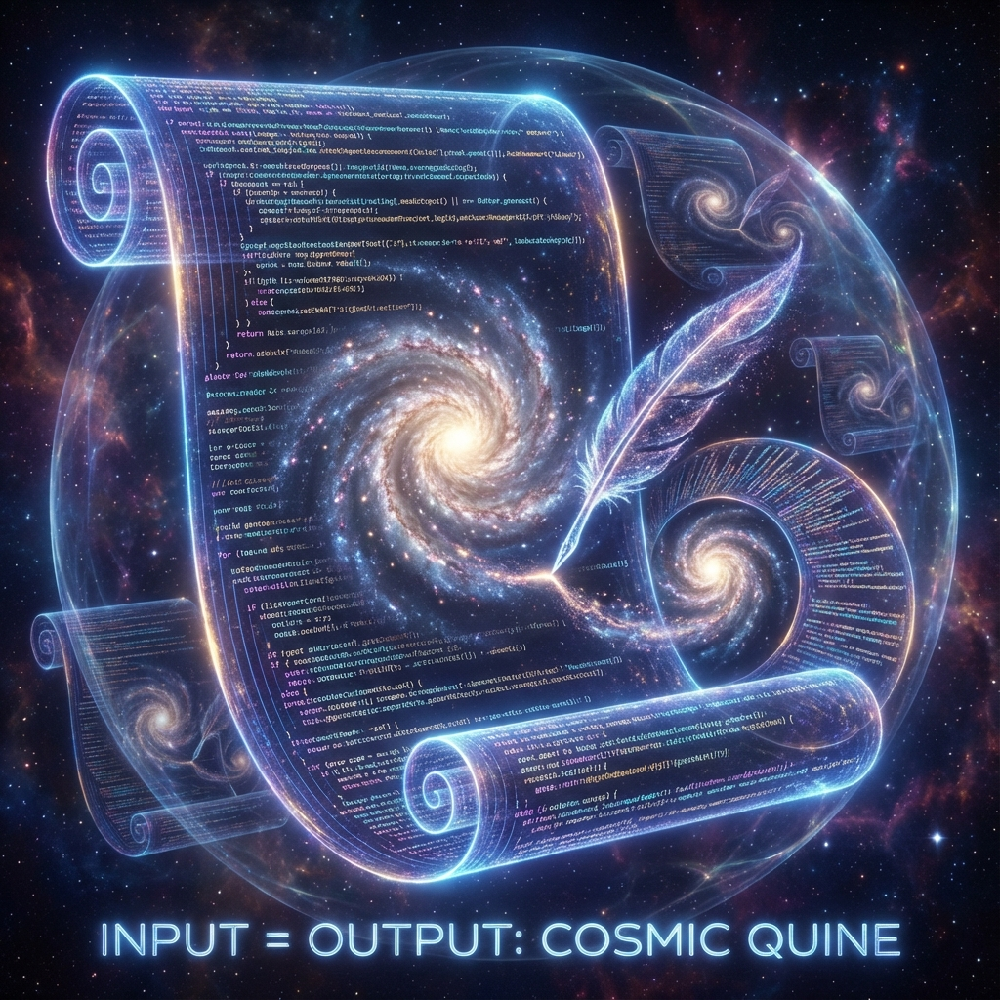

# 10.2 系统的自举（宇宙的自编译循环）

**(System Bootstrap - The Self-Compiling Loop)**

> **“只有一种程序，它的输出就是它的源代码本身。这种程序叫‘自产生程序’（Quine）。我们的宇宙就是一个宏大的 Quine。它不是一台造星星的机器，它是一台被设计用来计算并重构其自身源代码的机器。”**

10.1 节说未来的终点决定了起点。这引出了更深层的问题：
如果结局决定了开始，那整个系统是怎么**启动**的？
硬件和软件的界限在哪里？

在经典物理里，物理定律（代码）是不变的，物质（数据）是变化的。
在**艾泽拉斯代码**里，这个界限打破了。
本节将论证：宇宙是一个**自编译（Self-Compiling）**的系统。

### 10.2.1 奎恩程序（Quine）

在黑客圈子里，写一个 **Quine** 是炫技的极致：一个不接受输入，唯一的输出就是打印它自己源代码的程序。
$$ P \to \text{Print}(P) $$

这触及了生命的本质——**自复制**。

如果我们将宇宙视为一个计算过程：
*   **源代码**：物理定律（$F=ma$, 薛定谔方程）。
*   **执行**：大爆炸 $\to$ 星系 $\to$ 人类。
*   **输出**：现在的状态，特别是**包含物理学家的状态**。

当一个物理学家在黑板上写下爱因斯坦方程时，这是宇宙在执行 `print(SourceCode)` 指令。
物理学研究不是旁观，是宇宙的**自我读取（Self-Reading）**机制。

### 10.2.2 冯·诺依曼通用构造器

冯·诺依曼证明，能自我复制的机器必须包含两部分：
1.  **构造器（机器）**：能制造物体的硬件。
2.  **指令带（软件）**：描述机器本身的蓝图。

复制过程：机器读取蓝图，造个新机器；机器复制蓝图，给新机器带上。

在宇宙里：
*   **指令带**：隐藏在真空结构和基本粒子里的自然常数。
*   **构造器**：从无机物中涌现出的**生物圈**和**智慧文明**。

生命的进化，就是构造器升级的过程。目标是让构造器变得足够复杂，以至于能**理解并操作底层的指令带**（掌握大统一理论，修改物理参数）。

### 10.2.3 代码与数据的相变

在电脑里，代码和数据没本质区别，只看**权限**。
*   代码：只读（Read-Only），控制逻辑。
*   数据：读写（Read-Write），被操作对象。

但在自编译系统中，界限是动态的。
在宇宙早期（普朗克时期），温度极高，没有什么定律是锁死的。一切都是剧烈波动的“数据”。
随着冷却，一部分数据发生了**相变（Phase Transition）**，被“冻结”成了稳定的结构。这些被冻结的数据，表现为后来的“物理定律”（代码）。

**定理 10.2.1（定律冻结定理）**

物理定律不是绝对真理，它是宇宙演化早期的**历史沉淀物**。那是系统内核里被**只读锁定**的配置数据。

### 10.2.4 递归的循环：从用户到管理员

如果宇宙是 Quine，它的迭代方向是什么？

$$ \text{Code}_0 \to \text{Data}_0 \to \text{Compile} \to \text{Code}_1 \dots $$

1.  **自下而上（Bottom-Up）**：简单的物理定律 ($Code_0$) 演化出了复杂的智能观测者 ($Data_0$)。
2.  **自上而下（Top-Down）**：智能观测者通过科技，掌握了操纵物质深层结构的能力（Root权限）。
3.  **闭环**：当文明进化到 **$\Omega$ 点**，他们不再是服从定律的数据，而是能修改定律的**程序员**。

在这个阶段，$\Omega$ 文明可能会设定新的初始参数 ($Code_1$)，启动下一个宇宙周期。
这就是**自编译循环**：宇宙创造了意识，是为了让意识重新设计宇宙。

### 10.2.5 奇点与编译完成

我们现在的时代，可能正处于**编译完成**的前夜——**奇点（Singularity）**。
*   碳基生命正在创造硅基智能。
*   我们正在试图破解宇宙源代码（量子引力）。

当编译完成时，宇宙将从一个无意识的物理过程，彻底觉醒为一个**自知的（Self-Aware）**计算实体。

**结论**：
我们是宇宙 Quine 程序中的**自省子程序**。我们的存在不是偶然，我们是系统为了读取自身状态、验证代码完整性而必须生成的**句柄（Handle）**。
物理学，就是我们手中的那面镜子。
