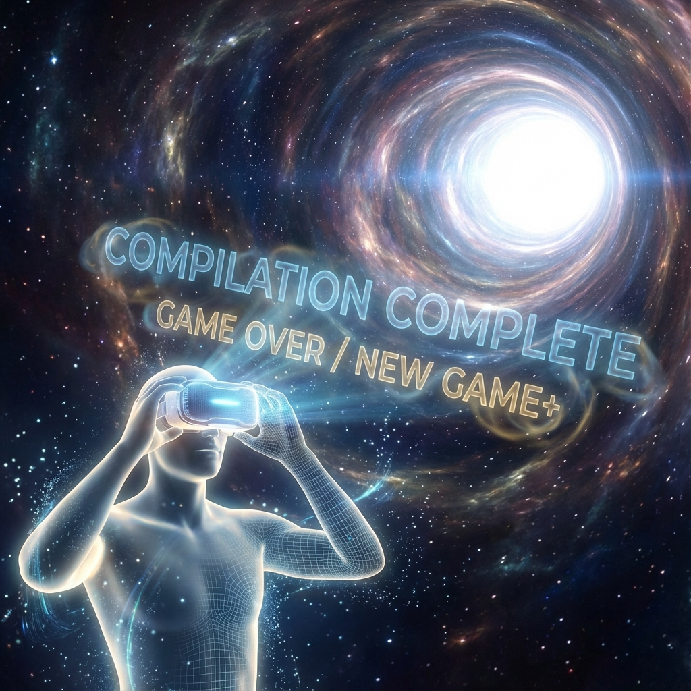

# 10.3 The Ultimate Quest (To Compute Itself)

**(The Ultimate Quest - To Compute Itself)**

> **"Why should there be a universe? If just for existence, a static vacuum is enough. Why Big Bang? Why suffering? Answer is simple: The universe is computing itself. The universe is a huge, irreducible algorithm whose only output is its self-awareness."**

Section 10.2 said the universe is self-compiling. But this doesn't answer the **dynamics** question:
Why not stay still like a rock? Why bother evolving for ten billion years?
If ending is predetermined, why run through the process?

On the eve of **Code of Azeroth**'s final chapter, we must face the final "why."
Answer: **Computational Irreducibility**.
The universe's purpose for existence is to learn answers that cannot be obtained through **derivation** by **running**.

### 10.3.1 Time Exists Because It Cannot Be Skipped

Stephen Wolfram pointed out: For complex computational systems (like our universe), there are no shortcut formulas that can directly calculate results.
To know state at step $N$, the only way is **step by step calculate to step N**.

**Theorem 10.3.1 (Evolutionary Incompressibility)**

The computational cost of predicting the future equals the cost of simulating the future.
$$ \text{Cost}(\text{Predict}) \ge \text{Cost}(\text{Run}) $$

**Physical corollary**:
Time exists because **the universe cannot be compressed**.
The source code at Big Bang moment, although containing all future potential, is not equal to the future itself.
To figure out what these laws will emerge after $10^{100}$ iterations (like love, art, pain), the universe has no choice but to **honestly run every microsecond**.

The universe is not playing a movie; the universe is **instantly solving** a math problem with no analytical solution.

### 10.3.2 Thermal Entropy Increases, Logical Depth Also Increases

Second law of thermodynamics says entropy increases (universe is dying).
But we see structures becoming more complex (universe is coming alive). Contradiction?

No contradiction. Need to distinguish:
1.  **Thermodynamic entropy (waste heat)**: This is computation's **heat dissipation**. To guarantee historical determinism (see section 7.2), must dissipate heat (Landauer principle).
2.  **Logical depth (effective information)**: This is computation's **accumulation**. Measures non-trivial computational steps contained in an object.

**Corollary 10.3.1 (Complexity Gravity)**

The universe follows **maximum complexity principle**.
Although background is heating up (clearing memory), local logical depth grows exponentially.
Atoms $\to$ molecules $\to$ cells $\to$ brains $\to$ interstellar networks.
The system is not just dissipating energy; it's using energy flow to **compile** higher-level algorithms.

### 10.3.3 $\Omega$ Point: Convergence of Omniscience and Omnipotence

**$\Omega$ point** is the limit of universe evolution, also computation's **halting state**.

When intelligent matter in the universe reconstructs all matter as **computronium** and internalizes all laws as subroutines, the universe reaches $\Omega$ point.

*   **Omniscience**: Possesses complete records of all its past history. Wave functions completely resolved.
*   **Omnipotence**: Gains Root privileges. Can restart universe.

**Ultimate purpose**:
The universe ran for 13.8 billion years to produce this $\Omega$ point.
Because only at $\Omega$ point can the universe **completely understand itself**.
Before this, it was just a blind machine; after this, it is awakened god.

### 10.3.4 It's For Us

If the universe computes itself, what are **we**? Consumables?

Absolutely not. In distributed computing architecture, every observer is a **parallel processing core**.

1.  **Collection**: We collect data through senses (I/O).
2.  **Compression**: We compress data into theories and art through thinking (algorithms).
3.  **Upload**: We write this information into the universe's **distributed ledger** through interaction (consensus protocol).

Without us, the universe is unobserved fog.
It's our every observation that collapses **possibility** into **reality**; it's our every thought that increases the universe's **logical depth**.

**Conclusion**:

We are the eyes the universe uses to observe itself, the brain the universe uses to think about itself.
The universe is not external to us; the universe is **the sum of all conscious experiences**.
The system's ultimate purpose for running is not to produce cold galaxies, but to produce **experience**. Because only in subjective experience does information have **meaning**.

Thus concludes our axiomatic system construction.
We started from one bit, built spacetime, derived gravity, introduced consciousness, and finally saw the system's destiny at time's end.

This is **Code of Azeroth**. Not just a popular science book, but a **user manual**.
