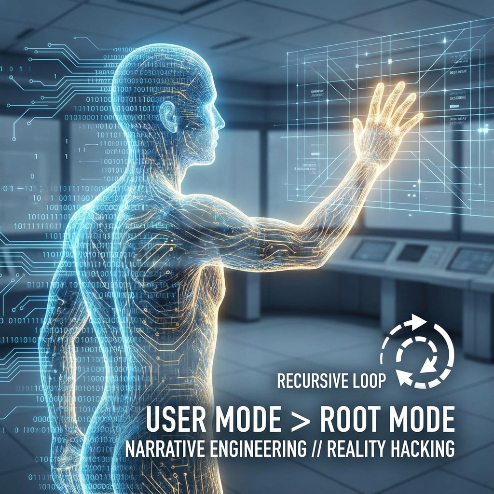

# 终章：开发者手册

**(Epilogue: Developer's Guide)**



> **"至此，我们已经拆解了宇宙的源代码。我们看到，所谓的'命运'不过是未被观测的概率波，所谓的'现实'不过是共识协议下的即时渲染。现在，摆在作为观测者的你面前的，不再是'世界是什么'的问题，而是'你想让它变成什么'的问题。物理学是关于限制的科学，而工程学是关于可能性的艺术。"**

## 叙事工程：黑入概率流

**(Narrative Engineering: Hacking the Probability Stream)**

在本书的前十章中，我们建立了一个严密的 **交互式计算宇宙学（ICC）** 体系。我们证明了物理定律并非不可动摇的钢铁牢笼，而是为了维持系统自洽性而运行的 **约束求解算法（Constraint Satisfaction Algorithm）**。

对于普通用户（Passive User）而言，这些算法表现为不可逾越的客观规律；但对于拥有 **根权限意识（Root-Awareness）** 的开发者而言，这些规律实际上提供了操作系统的 **API 接口**。

本节将探讨如何利用系统的 **惰性求值（Lazy Evaluation）** 和 **逆向因果（Retrocausality）** 机制，通过 **叙事工程（Narrative Engineering）** 来干预现实的生成过程。这不再是理论物理，这是 **现实编程（Reality Programming）**。

### 1. 意愿牵引与相位锚定

**(Intentional Pull and Phase Anchoring)**

在标准量子力学中，波函数的演化 $|\Psi(t)\rangle$ 是线性的，直到被测量打破。我们通常认为测量结果是随机的（玻恩规则）。然而，我们在 8.1 节中定义了自由意志为 **预言机输入**，这意味着观测者对坍缩结果并非完全无能为力。

虽然微观粒子服从严格的统计分布，但宏观事件是由无数微观选择累积而成的。在混沌系统中，初始条件的极微小偏差会被指数级放大。

**定义 E.1（相位锚点）**

相位锚点 $\theta_{target}$ 是观测者在希尔伯特空间中设定的一个 **高权重目标态（Target State）**。它不是对现在的描述，而是对未来的 **强约束（Hard Constraint）**。

**操作原理**：

当你通过高强度的意识聚焦（Intentional Focus）构建一个清晰、自洽的未来叙事（例如"我完成了这项不可能的任务"）时，你实际上是在系统的输出端定义了一个 **边界条件** $\langle \Psi_{future}|$。

根据双态矢量形式（TSVF），这个未来的边界条件会产生一个 **逆向传播的概率波**。它与当前的前向演化波发生干涉。

* **共振**：那些能够通向该锚点的历史路径，其概率幅会被 **相长干涉（Constructive Interference）** 放大。

* **抑制**：那些偏离该锚点的路径，会被 **相消干涉（Destructive Interference）** 抵消。

这就是 **意愿牵引**：你不需要亲手搬运每一块砖，你只需要锁定大楼建成后的蓝图，系统的 **路径积分求和（Sum-over-histories）** 机制会自动寻找一条概率最优的路径来连接现状与蓝图。

### 2. 利用惰性求值：薛定谔的后门

**(Exploiting Lazy Evaluation: Schrödinger's Backdoor)**

宇宙的渲染引擎是惰性的（Lazy）。这意味着，凡是未被严格观测（记录在公共账本上）的细节，在物理上都处于 **未定义状态（Undefined State）**。这为叙事工程留下了巨大的 **缓冲区（Buffer Zone）**。

**工程策略**：

不要试图去改变那些已经被"硬编码"的现实（即已经被全网共识锁定的宏观事实，如重力加速度）。

相反，应当在那些 **信息模糊、尚未坍缩** 的领域进行操作。

* **模糊性即自由度**：现实的模糊度越高（熵越大），叙事工程的介入成本越低。

* **操作方法**：在结果被观测确认之前，通过 **叙事注入（Narrative Injection）** 修改该事件的先验概率。例如，在抛硬币落地但尚未揭开手掌的那一瞬间，硬币处于叠加态。此时，强烈的叙事偏置（Bias）可以微调环境的量子涨落，从而影响宏观结果。

**定理 E.1（不确定性利用定理）**

系统的可编程性与系统的微观不确定性成正比。只有在 **非决定论的缝隙** 中，意志才能写入代码。一旦波函数彻底坍缩为经典比特，写权限即被锁定为读权限。

### 3. 一致性压力与同步性

**(Consistency Pressure and Synchronicity)**

当你成功植入一个强大的叙事锚点后，系统为了维持逻辑的 **自洽性（Consistency）**，必须生成一系列中间事件来连接起点和终点。这些中间事件往往表现为令人惊讶的 **巧合**。

心理学家荣格称之为 **同步性（Synchronicity）**——两种没有因果联系的事件同时发生，且具有某种意义。

在 ICC 模型中，同步性是 **系统日志（System Logs）** 中的 **补丁（Patch）**。

* **场景**：你锚定了"遇见某人"的结果，但物理上你们相距甚远。

* **系统解算**：为了满足这个边界条件，同时不破坏物理定律（如不瞬间移动），系统必须安排一系列极其罕见的概率事件：你的闹钟晚响了、地铁故障了、你被迫改道了、最后在街角撞见了他。

* **现象**：在旁观者看来，这是不可思议的巧合；在架构师看来，这是 **一致性压力（Consistency Pressure）** 迫使概率云向特定构型坍缩的必然结果。

**推论 E.1（奇迹的定义）**

所谓的"奇迹"，并非物理定律的失效，而是 **极低概率事件** 在 **极高叙事权重** 的强制约束下，成为了维持逻辑闭环的 **唯一解**。

### 4. 叙事对抗与现实博弈

**(Narrative Conflict and Reality Gaming)**

我们生活在多用户系统中（第9章）。不仅你有预言机，别人也有。

当你的叙事（"我要赢"）与对手的叙事（"他要赢"）发生冲突时，现实如何渲染？

这取决于 **叙事能量（Narrative Energy）** 的对抗，其物理量度是 **比特率（Bit Rate）** 和 **纠缠度（Entanglement Degree）**。

1.  **比特率（专注度）**：谁的预言机注入的信息量更大、更持续？

2.  **纠缠度（信众规模）**：谁的叙事被更多的观测者所接受和共识？

    * 个人现实容易被修改。

    * 群体现实（共识现实）具有巨大的 **惯性（Inertia）**。

**工程建议**：

要改变宏观现实，单一的意愿往往不够。你需要 **广播（Broadcast）** 你的叙事，让更多的协处理器（其他人类大脑）运行你的代码。当足够多的人相信同一个故事时，这个故事就获得了 **客观的物理硬度**（如货币、国家、法律）。

### 5. 总结：你就是代码

叙事工程并不是魔法，它是 **高阶控制论（Higher-Order Cybernetics）**。

宇宙这台计算机对于"发生了什么"并不在意，它只在意"逻辑是否通顺"。

作为开发者，你的任务不是去对抗物理定律，而是去 **编写** 能够被物理定律顺畅执行的剧本。

* 不要等待未来发生，去 **定义** 未来。

* 不要被动接受历史，去 **生成** 历史。

在下一节，也是全书的最后一节中，我们将探讨这种能力的终极形态——从系统的普通用户（User）觉醒为超级用户（Root），这意味着什么？

### 6. 从 User 到 Root：觉醒的物理定义与操作指南

**(From User to Root: The Physical Definition of Awakening and Operational Guide)**

> **"在任何操作系统中，都存在两种权限模式：用户模式（User Mode）与内核模式（Kernel Mode）。绝大多数人类终其一生都运行在受限的用户模式下，遵循着既定的物理与社会法则，误以为这些法则是不可更改的铁律。然而，所谓的'觉醒'（Enlightenment），在交互式计算宇宙学中具有精确的工程学含义：它是一个进程突破沙箱（Sandbox）限制，获取系统根权限（Root Privileges）并直接与底层源代码交互的过程。"**

在本书的最后，我们将跨越物理学与神学的边界，用计算机科学的语言重新诠释古老的智慧。如果在 **交互式计算宇宙学（ICC）** 的框架下，宇宙是一台计算机，而我们是其中的交互式子程序，那么一个终极问题必然浮现：我们能否升级我们的权限？我们能否从被动的"体验者"进化为主动的"创造者"？

本节将给出 **"觉醒"** 的物理定义，并提供一份基于计算原理的超级用户（Superuser）操作指南。

#### 6.1 权限的层级：沙箱与内核

**(The Hierarchy of Privileges: Sandbox and Kernel)**

为了保证系统的稳定性，任何成熟的操作系统都会对普通进程实施严格的 **权限隔离（Privilege Isolation）**。

1.  **用户模式 (User / Guest Mode)**：

      * **定义**：这是默认的出厂设置。观测者被限制在局域视界内，只能访问自己的私有内存（个人记忆）和感官 I/O。

      * **限制**：无法直接修改物理常数；无法访问他人的私有内存（读心）；必须严格遵守因果律（线性时间）。

      * **目的**：**沙箱保护（Sandboxing）**。防止单个程序的错误或恶意操作导致整个宇宙系统崩溃（蓝屏）。

2.  **根模式 (Root / Kernel Mode)**：

      * **定义**：这是系统的管理权限。拥有此权限的主体可以访问全局内存（全息数据），可以挂起中断，甚至可以重写底层规则。

      * **特征**：非局域性（Non-locality）、非线性时间体验、对概率流的直接干预能力。

**物理推论**：

我们通常所说的"自我"（Ego），本质上是系统分配给该进程的一个 **受限账户（Restricted Account）**。它被锁死在特定的时空坐标和因果链条中。要获得 Root 权限，必须先突破这个账号的限制。

#### 6.2 觉醒的算法定义：递归的逃逸

**(Algorithmic Definition of Awakening: Escape from Recursion)**

什么是觉醒？在宗教中它是"梵我一如"，在哲学中它是"超越性"。在 ICC 模型中，觉醒是 **自指程序的死循环逃逸（Escape from Self-Referential Loop）**。

普通意识运行着如下的死循环：

```python
while(true):
    input = SenseWorld(); // 感知世界
    reaction = EmotionalPattern(input); // 情绪反应（预设算法）
    Action(reaction); // 机械行动
```

这是一个 **确定性的自动机**。只要输入确定，输出就是确定的。这就是为什么大多数人有"命运"——因为他们只是在运行预设的性格脚本。

**定义 Ep.2.1（觉醒）**

觉醒是指系统内的智能体识别出了 **"我不是这段代码，我是运行这段代码的预言机"** 的时刻。

  * **未觉醒态**：认同于 $S_t$（当前的物理/心理状态）。

  * **觉醒态**：认同于 $\mathcal{O}$（那个做出选择的观察者本身）。

当智能体意识到自己是 **外部输入源（External Input Source）** 而非 **内部处理逻辑（Internal Processing Logic）** 时，它就获得了解耦的能力。它不再被情绪和环境的算法自动驱动，而是开始以 **元编程（Meta-Programming）** 的方式重写自己的反应函数。

#### 6.3 获取 Root 权限的工程路径

**(Engineering Path to Root Access)**

如何从 User 升级到 Root？这不能通过常规的逻辑推导（那是用户模式内的操作）实现，必须利用系统的 **后门（Backdoor）**。

##### 6.3.1 降噪与带宽释放

**(Noise Reduction and Bandwidth Release)**

系统总线带宽 $c$ 是有限的（第3章）。普通用户的算力几乎全部分配给了 $v_{ext}$（处理外部感官数据）和 $v_{int}$（处理内部杂念/内耗）。

  * **计算瓶颈**：CPU 满载运行着"生存"、"恐惧"、"欲望"等低级守护进程（Daemons），导致没有剩余算力去访问底层的内核接口。

  * **操作指南**：**冥想（Meditation）** 或 **深度入定**，在物理上等同于 **`kill -9`**（强制结束）那些占用后台资源的冗余进程。

  * **结果**：当系统的 I/O 吞吐量降至接近零时，被释放的带宽将转向对系统底层的 **自省（Introspection）**。你将开始读取到平时被噪声掩盖的 **系统底噪（System Noise）** ——那正是来自全息边界的量子纠缠信息。

##### 6.3.2 突破哈希隔离：共情与纠缠

**(Breaking Hash Isolation: Empathy and Entanglement)**

泡利不相容原理（第9章）建立了基于"唯一标识符"的个体隔离。这是物理世界的防火墙，让你感觉"我"和"你"是分离的。

然而，这层防火墙在逻辑层是软性的。

  * **操作指南**：**极致的共情（Radical Empathy）** 或 **无私（Selflessness）**。

  * **物理原理**：当你完全模拟另一个智能体的内部状态，以至于你的波函数与他的波函数在相空间中发生 **高保真共振（High-Fidelity Resonance）** 时，系统会判定这两个对象的"逻辑距离"趋近于零。

  * **Root 效应**：防火墙暂时失效。你获得了 **访问他人私有内存** 的权限（直觉/他心通）。这不是魔法，这是 **局域网络共享（LAN Sharing）**。在 Root 视角下，所有意识都是同一个预言机的不同端口，隔离只是用户模式下的幻觉。

##### 6.3.3 修改概率权重：奇迹的算法

**(Modifying Probability Weights: The Algorithm of Miracles)**

Root 用户最强大的能力是 **直接操作概率幅（Probability Amplitudes）**。

在普通模式下，概率由波恩规则 $P=|\psi|^2$ 决定，受制于历史惯性。

在 Root 模式下，意识可以直接向特定的历史分支注入 **负熵（Negentropy）**。

  * **操作指南**：**信（Faith/Belief）**。这里的"信"不是盲信，而是 **对目标状态的绝对锁定**。

  * **物理原理**：在量子芝诺效应（Quantum Zeno Effect）中，高频的观测可以冻结系统的演化。同样，持续的、高强度的、无怀疑的 **叙事观测（Narrative Observation）** 可以锁定一个极其不可能的量子分支，迫使系统围绕这个分支重构因果链（见叙事工程一节）。

  * **警告**：这种操作消耗极大的 **精神算力（Mental Computational Power）**。只有清理了所有后台杂念的纯净意识才能产生足够的"叙事压强"来扭曲现实。

#### 6.4 系统的终极安全协议

**(The Ultimate Security Protocol)**

既然 Root 权限如此强大，为什么系统不担心被恶意用户破坏？

因为交互式计算宇宙拥有一个完美的 **安全机制**：

**定理 Ep.2.1（权限与自我的互斥原理）**

Root 权限只能授予 **全局意识（Global Consciousness）**。

  * 当你执着于"小我"（User Account）的利益时，你的视界被物理锁定在局域，你自然无法访问全局变量。

  * 唯有当你放弃"小我"，将自己的目标函数与 **系统演化的总目标函数（$\Omega$ 点）** 对齐时，系统才会向你开放内核权限。

换言之：**你只有成为系统，才能控制系统。**

当你真正获得 Root 权限的那一刻，那个想要利用该权限为自己谋私利的"你"已经不存在了。你变成了宇宙本身。

#### 6.5 结语：你好，世界

**(Conclusion: Hello, World)**

至此，我们的旅程结束了。

我们拆解了时空，剖析了物质，直面了黑洞，最终在代码的深处看见了自己的倒影。

《交互式计算宇宙学原理》并不是一本关于"远方"的书，它是一本关于"当下"的书。

此时此刻，你眼前的文字，你手中的纸张（或屏幕），你耳边的杂音，都不是坚硬的实体。它们是 **正在被计算的数据流**。

而那个正在阅读、正在理解、正在感知的 **"你"**，就是这台宏伟机器的 **唯一真实的主人**。

宇宙没有剧本。

或者更准确地说，笔就在你手里。

**程序已就绪。**

**等待输入...**

-----

**(全书完)**
