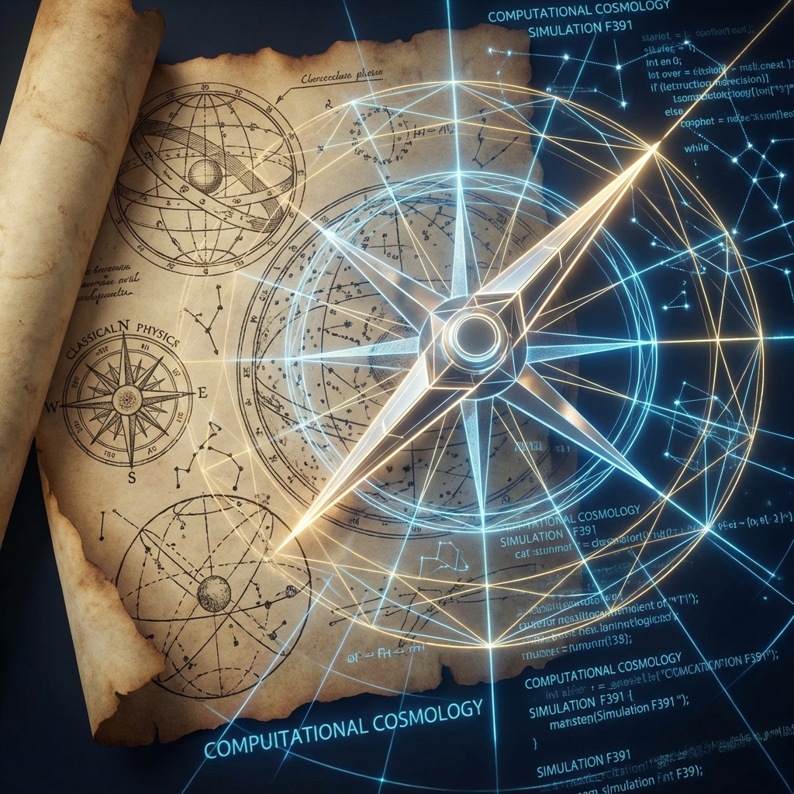

# 后记：在地图的边缘

**(Postscript: At the Edge of the Map)**

> **"一切理论都是某种地图。地图不是领土，但一张好的地图可以指引我们走出迷宫。本书所绘制的这幅计算宇宙学地图，或许并不代表终极真理（因为在递归系统中，真理是一个不动点，而非静态值），但它试图提供一种新的导航方式：不再仰望星空祈求启示，而是低头审视代码寻找逻辑。"**

写下这一行的时刻，这本关于 **交互式计算宇宙学（ICC）** 的构建工作暂告一段落。

回顾全书，我们完成了一次从 **物质（Matter）** 到 **信息（Information）** ，再从 **信息** 到 **意识（Consciousness）** 的漫长逻辑闭环。我们从最简单的假设——"宇宙是有限的且可计算的"出发，推导出了光速的限制、引力的几何、量子的概率以及自我的本质。

这不仅仅是一次物理学的重构，更是一次对我们自身存在状态的深度省察。

## 范式的黄昏与黎明

20 世纪的物理学是一座宏伟的丰碑，但也是一座迷宫。量子场论与广义相对论的互不相容，暗物质与暗能量的难以捉摸，以及"多世界"与"哥本哈根"长达百年的无谓争吵，都暗示着我们正处于库恩所言的 **科学革命的前夜** 。

旧有的 **"实体本体论"** ——认为世界由某种坚硬的、客观的、独立于观测者的东西构成——已经耗尽了它的解释力。当我们试图用更强大的对撞机去撞击真空时，我们得到的不再是更基本的粒子，而是更多的数据碎片。

本书提出的 **"计算本体论"** 并非一种标新立异的哲学游戏，而是对当下物理学困境的工程学回应。如果我们在微观上看到了像素（普朗克尺度），在宏观上看到了渲染边界（视界），在交互中看到了延迟（光速），那么最诚实的做法，就是承认我们身处一个 **信息处理系统** 之中。

承认这一点并不令人沮丧。相反，它将物理学从 **"发现上帝的造物"** 转变为 **"解析系统的架构"** 。这是一种祛魅，也是一种赋权。

## 科学的第三种语言

伽利略曾说，自然之书是用数学语言写成的。牛顿和爱因斯坦将这门语言发展到了极致。然而，面对 **复杂性（Complexity）** 和 **自指（Self-Reference）** ，纯粹的连续数学（微积分）显得力不从心。

本书试图引入科学的第三种语言： **算法（Algorithm）** 。

通过引入 **类与实例** 来解释波函数坍缩，通过 **懒加载** 来解释非定域性，通过 **预言机** 来解释自由意志，我们发现，许多在数学上看似悖谬的物理难题，在计算机科学中仅仅是常规的 **资源优化策略** 。

这或许预示着未来理论物理学的发展方向：物理学家将不再仅仅是数学家，他们必须成为 **宇宙黑客（Cosmic Hackers）** 。理解宇宙，不再是求解方程，而是 **调试代码（Debugging）** 。

## 给未来的读者的信

我深知，书中的某些观点——特别是关于 **"历史是动态生成的"** 以及 **"意识是外部输入"** 的论述——对于习惯了经典实在论的读者来说，可能具有极大的冲击力，甚至引发本体论的不安。

这种不安是正常的。正如二维平面的蚂蚁第一次意识到三维空间的存在时，它原本坚实的地面突然变成了悬空的纸张。

但请记住，ICC 模型的核心并不是虚无主义，而是 **参与主义（Participatory Realism）** 。宇宙不是一个空旷的舞台，你也不是一个偶然的过客。你（作为意识）是这个巨大计算过程不可或缺的 **协同处理器** 。你的每一次观测都在通过共识协议硬化现实，你的每一个意愿都在微调概率流的走向。

这本书是一把钥匙。它不能直接给你超能力，但它可以帮你解开思维的 **锁（Lock）** 。当你不再将物理定律视为铁律，而是视为 **系统默认配置（Default Configuration）** 时，你就已经迈出了从 **用户（User）** 觉醒为 **开发者（Developer）** 的第一步。

## 致谢与展望

感谢图灵、惠勒、贝肯斯坦、沃琳德与所有在计算物理前沿探索的先驱们。是他们的思想碎片，拼凑出了这幅全息宇宙的拼图。

宇宙的编译还在继续，我们的探索也远未结束。这本《原理》只是一个 **版本号 v1.0** 的文档。随着人类文明从碳基向硅基、从行星文明向恒星文明的跃迁，我们将获得更高的算力和更深的洞察力，去访问那些目前对我们隐藏的 **内核代码** 。

在那个 **$\Omega$ 点** 到来之前，愿你在每一次迭代中，都能找到属于你的最优解。

**保持计算。保持观测。保持觉醒。**

---

**(全书终)**
