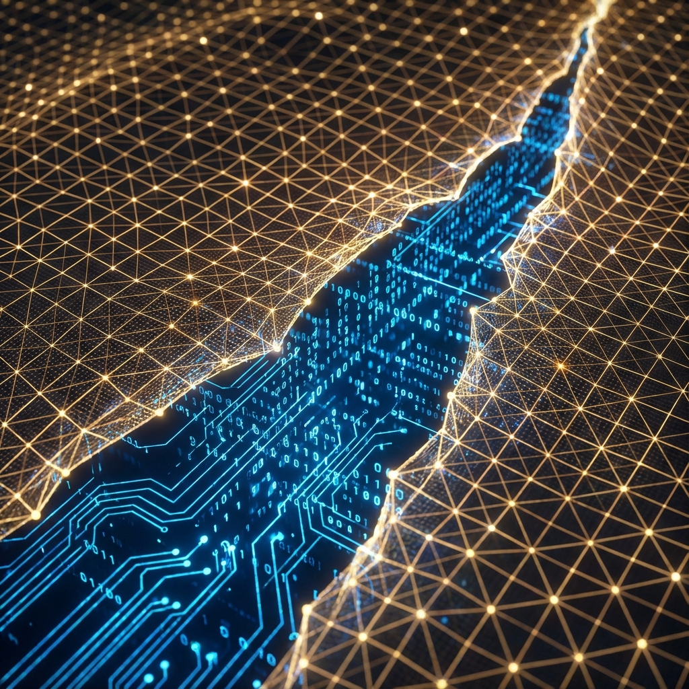

# **(Preface: The Computational Turn in Natural Philosophy)**

*(前言：自然哲学的计算转向)**

### The Dissolution of Substance and the Rise of Process

For a long time, physics has been dedicated to answering an ancient ontological question: "What is the world made of?" From Democritus's atoms, to Newton's point masses, to the quantum fields of the standard model, we have been accustomed to anchoring reality in some hard, static "substance." We assume that behind phenomena, there is always a material substrate that is independent of observers and absolutely objective.

However, the progress of physics over the past century, especially the deep conflicts between quantum mechanics and general relativity, is relentlessly dismantling this belief. The black hole information paradox suggests that space itself is a holographic projection of information; the violation of Bell's inequality reveals the bankruptcy of local realism; and the puzzle of quantum measurement weaves the observer's subjective choices irreversibly into the fabric of physical history.

Facing these dilemmas, patching and mending is no longer sufficient. We need a radical paradigm shift—from **"Ontology of Substance"** to **"Ontology of Process"**.

This book proposes a radical view: the foundation of the universe is not matter, nor energy, nor even spacetime, but **Computation**. Physical laws are not static truths carved in stone, but algorithmic rules that constrain information processing processes.

### The Third Crisis of Physics

At the end of the 19th century, Lord Kelvin saw two clouds in the clear sky of physics, leading to relativity and quantum mechanics. Today, we face a third crisis, not in experimental data deviations, but in the failure of theoretical language.

We use differential geometry to describe gravity, presupposing the continuity of spacetime; we use linear algebra to describe quantum mechanics, presupposing the infinite dimensionality of Hilbert space. But the Bekenstein Bound clearly tells us that the amount of information in any finite volume is finite. This means that classical mathematical language based on the "real continuum" will inevitably produce pathological infinities (ultraviolet divergences, singularities) when describing an essentially discrete, finite universe.

Physics needs a new language. This language must be inherently discrete, finite, and operational. This language is **computer science**.

### Interactive Computational Cosmology

This book aims to establish a new theoretical framework—**Interactive Computational Cosmology (ICC)**. We will no longer view the universe as a mechanical clock wound up and set, nor as a purely random dice game, but as a **supercomputing system running under finite resource constraints, supporting multi-agent interactions**.

The core task of this book is to argue and prove a **Holographic Equivalence Principle** that connects the microscopic and macroscopic, the subjective and objective:

> **A closed quantum system (QTM) containing all possible historical branches and undergoing global unitary evolution is, within the horizon of any local observer, mathematically strictly equivalent to a classical interactive automaton (CITM) with external oracle input that generates only a single history.**

This principle dissolves the opposition between "many worlds" and "free will." It tells us that wave function collapse is not a break in physical laws, but an inevitable operation of the computing system switching from **"Lazy Evaluation"** mode to **"Just-in-Time Compilation"** mode.

### The Structure of This Book

This book will strictly follow an axiomatic path to rebuild the edifice of physics:

* **Volume I: Axiomatic System**. We will establish the foundations of computational ontology, prove the computability of physical reality, and derive the Holographic Equivalence Principle in detail. We will see that the essence of existence is **persistent data structures**.

* **Volume II: The Emergence Mechanism of Spacetime**. We will prove that the speed of light is the bandwidth limit of the system bus, special relativity is the clock synchronization protocol of distributed systems, and gravity is a geometric deformation (entropic force) produced to maintain holographic entropy bounds.

* **Volume III: Microscopic Dynamics and Measurement**. We will reveal the algorithmic nature of quantum mechanics. Heisenberg's uncertainty principle will be reconstructed as data precision truncation under finite bit depth, while double-slit interference is the system behavior of a rendering engine when boundary conditions are ambiguous.

* **Volume IV: Observer, Cybernetics, and Ultimate Causality**. We will explore the physical definition of consciousness. Consciousness is no longer an epiphenomenon, but a **Topological Soliton** in causal networks, a high-order control structure that emerges for the system to achieve self-reference. We will also touch upon the ultimate causality of the universe—**Bootstrap**, how future outputs reversely define initial inputs.

### To Future Architects

This is not just a book explaining the world, but a manual on how to construct the world. When we reduce physics to code, we are actually deconstructing the authority of God. Future civilizations will eventually evolve from observers of the universe (Users) to architects of the universe (Architects).

But before that, we need to read the source code first.

Welcome to the world after the blue screen.

**Auric**

**2025, Deep in Discrete Spacetime**
