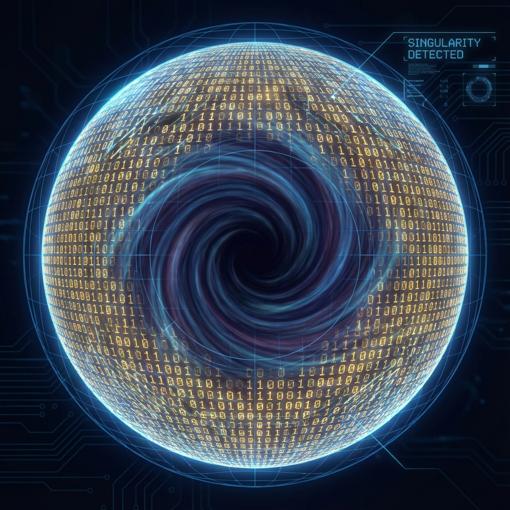

# 第一卷：公理化体系

**(Volume I: Axiomatic Framework)**

## 第一章：计算本体论基础

**(Foundations of Computational Ontology)**

### 1.1 有限信息公理

**(Axiom of Finite Information)**

> **"物理实在并不包含无穷大。无穷大只是我们为了方便计算而引入的数学近似，当这种近似被误认为本体时，物理学便陷入了病态。"**

在构建交互式计算宇宙模型的第一步，我们必须直面经典物理学与量子场论中最大的本体论假设：连续统假设（Continuum Hypothesis）。这一假设认为，时空是无限可分的，物理场在任意微小的尺度上都有定义。然而，正是这一假设导致了现代物理学中无穷无尽的紫外发散（UV Divergence）与奇点问题。

为了重建物理学的基础，我们引入本理论体系的第一条核心公理——**有限信息公理**。

#### 1.1.1 连续统的信息灾难

如果我们将时空视为一个实数集 $\mathbb{R}^4$ 的流形，那么即使是一个边长为 $L$ 的微小立方体，其内部也包含着不可数无穷多个点。如果物理场（如电磁场）在每一个点上都有独立的自由度，那么这个有限体积内的信息量将是无穷大的。

这种"无限信息密度"在经典力学中或许可以被容忍（因为我们假设测量精度无限），但在结合了广义相对论与量子力学的物理实在中，它引发了灾难性的后果：

1.  **紫外发散**：在量子场论中，对圈图的积分需要对所有可能的动量 $k$ 进行求和。如果空间是连续的，动量 $k$ 可以趋向于无穷大（对应波长 $\lambda \to 0$），导致计算结果（如真空零点能）发散为无穷大。

2.  **奇点问题**：广义相对论预言，在黑洞中心或宇宙大爆炸时刻，物质密度趋向于无穷大。这实际上是数学模型崩溃的标志，而非物理实在的特征。

物理学中的"无穷大"从未被观测到过，它仅仅是数学模型在超出其适用范围时发出的错误报告。

#### 1.1.2 贝肯斯坦界限：物理世界的比特数上限

我们不仅在哲学上排斥无穷大，在物理学内部，我们也找到了否定无穷大的确凿证据。这一证据来自黑洞热力学，具体表现为**贝肯斯坦界限（Bekenstein Bound）**。

雅各布·贝肯斯坦（Jacob Bekenstein）指出，对于任何半径为 $R$、包含能量 $E$ 的球形空间区域，其所能包含的最大熵 $S$（即最大信息量）是有严格上限的：

$$
S \le \frac{2\pi k_B R E}{\hbar c}
$$

当物质坍缩形成黑洞时，这一熵值达到极限，即**贝肯斯坦-霍金熵（Bekenstein-Hawking Entropy）**，其数值正比于黑洞视界的表面积 $A$：

$$
S_{BH} = \frac{k_B c^3}{4G\hbar} A = \frac{A}{4 l_P^2}
$$

其中 $l_P = \sqrt{G\hbar/c^3}$ 为普朗克长度。

这一公式揭示了一个惊人的事实：**物理系统的信息容量不是无限的，而是由其边界的几何面积严格限制的。**

这意味着：

1.  **离散性**：每一个普朗克面积单元（$l_P^2$）大约只能存储 1/4 个比特（Bit）的信息。空间不是连续的容器，而是离散的存储介质。

2.  **有限性**：对于宇宙中任何有限的宏观区域，无论我们如何压缩物质，其包含的量子态总数 $W = e^S$ 都是一个有限整数。

#### 1.1.3 希尔伯特空间的局域有限性

基于贝肯斯坦界限，我们可以导出关于量子力学状态空间的一个重要定理。

**定理 1.1.1（希尔伯特空间维数有限定理）**

对于物理宇宙中任意一个具有有限边界面积 $A$ 的因果闭合区域（Causal Diamond），描述其内部所有可能物理状态的希尔伯特空间 $\mathcal{H}_{local}$，其维数 $D$ 必须是有限的，且满足：

$$
\dim(\mathcal{H}_{local}) \le \exp\left(\frac{A}{4 l_P^2}\right)
$$

**证明概要**：如果希尔伯特空间的维数是无限的，那么我们总可以构造出一个混合态（如所有基底的等概率混合），其冯·诺依曼熵 $S = -\text{Tr}(\rho \ln \rho)$ 将趋向于无穷大，从而违反贝肯斯坦界限。为了保证热力学第二定律和引力理论的自洽性，物理状态空间必须被"截断"为有限维。

#### 1.1.4 公理表述与本体论推论

综上所述，我们在本书中引入第一条核心公理，作为重建物理学大厦的基石：

> **有限信息公理 (Axiom of Finite Information)**

> 物理实在由离散的信息单元构成。对于任何有限的宏观时空体积，其包含的独立物理自由度是有限的。不存在无限精度的实数物理量，时空结构在普朗克尺度上存在自然截断（Natural Cutoff）。

这一公理确立了本书的**计算本体论（Computational Ontology）**立场：

* **宇宙即计算**：宇宙在本质上等价于在一个巨大的、但有限的格点网络（Lattice Network）上运行的量子元胞自动机（QCA）。

* **去连续化**：微分方程不是基础，差分方程才是。场论中的"场"只是离散量子比特阵列在长波极限下的统计近似。

* **资源受限**：物理定律之所以呈现出现在的形式（如光速限制、不确定性原理），是因为宇宙计算机必须在**有限存储（Finite Memory）**和**有限带宽（Finite Bandwidth）**的约束下运行。

在接下来的章节中，我们将看到，正是这个简单的"有限性"限制，推导出了量子力学的概率本质和广义相对论的时空弯曲。
