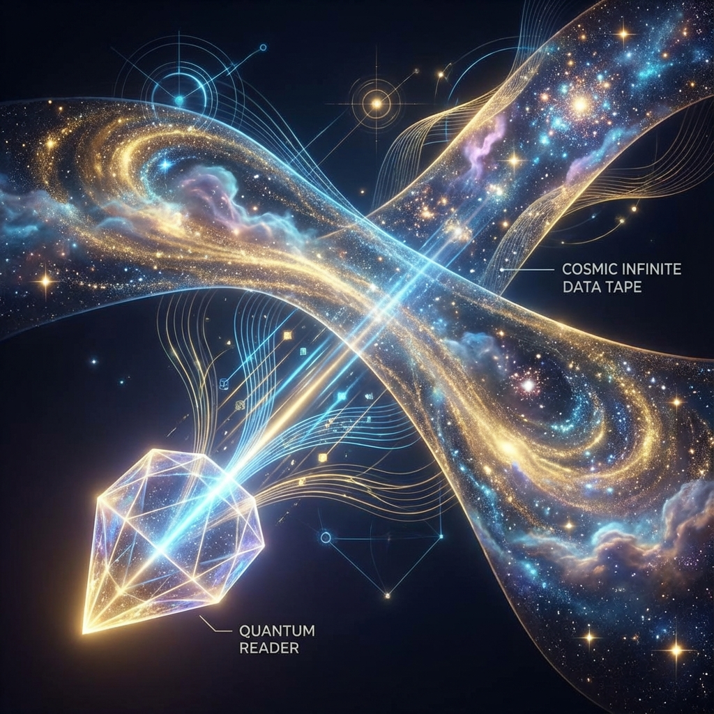

# Volume I: Axiomatic Framework

**(第一卷：公理化体系)**

## Chapter 1: Foundations of Computational Ontology

**(第一章：计算本体论基础)**

### 1.2 Turing Completeness of Physical Systems

**(物理系统的图灵完备性)**

> **"If physical laws allow processes that cannot be simulated by a universal computer, then physics ceases to be a predictive science and degenerates into theology. Conversely, if physical reality is essentially computable, then the universe itself is a computer."**

After establishing the finiteness of physical reality (Axiom of Finite Information), we face the second fundamental ontological question: How does this finite physical reality evolve? In other words, what is the mathematical essence of the dynamical rules that drive the transition of the universe's state from $S_t$ to $S_{t+1}$?

Classical physics habitually uses differential equations to describe dynamics, implying that evolution involves infinite-precision real number operations. However, based on the Axiom of Finite Information, such continuous evolution is merely an approximation of discrete operations. In this section, we will argue for the core property of physical dynamics—**Computability**—and elevate it to the second core axiom of physics: physical systems are Turing complete.

#### 1.2.1 Computability as a Constraint on Physical Laws

Before the birth of computer science, physicists rarely thought about the "computational cost" of physical laws. Both Newtonian mechanics and general relativity implicitly assume that nature can instantaneously perform arbitrarily complex real number operations. However, this assumption is logically inconsistent.

If physical laws involve uncomputable mathematical functions (such as solutions to the halting problem, or non-recursive real numbers), we would be unable to predict physical systems, or even simulate them in principle. This would undermine the foundation of scientific falsifiability.

Therefore, we must introduce a constraint: **All physical laws must be algorithmically definable.** This means that for any physical process, there exists a finite-length program that can simulate the evolution result of that process within finite steps (within a given error margin).

This constraint is not merely a limitation on our cognitive abilities, but more importantly, a constraint on physical ontology: **Nature does not perform uncomputable operations.**

#### 1.2.2 The Ontological Form of the Church-Turing-Deutsch Principle

In 1985, David Deutsch physicalized the Church-Turing Thesis from computer science, proposing the **Church-Turing-Deutsch Principle (CTD Principle)**. Within the theoretical framework of this book, we elevate this principle to an ontological axiom:

> **CTD Principle (Ontological Version)**:

> Any finitely realizable physical system can be perfectly simulated by a universal quantum computer (Universal Quantum Computer) to arbitrary precision. Conversely, any computational process of a universal quantum computer corresponds to the evolution process of some physical system.

This principle establishes the **isomorphism** between physics and computation theory:

1.  **Completeness**: There are no physical processes that exceed quantum computational capabilities (i.e., no "hypercomputation" exists). This means that black holes, the Big Bang, and even consciousness are, in principle, simulable.

2.  **Universality**: The universe itself is a universal quantum computer. It not only computes its own evolution, but by reconfiguring matter (programming), it can simulate any other physically possible universe.

#### 1.2.3 Equivalence between Physical Dynamics and Universal Quantum Turing Machines

Based on the Axiom of Finite Information (Axiom 1.1), the state space of physical systems is a finite-dimensional Hilbert space $\mathcal{H}$. Physical evolution is driven by unitary operators $\hat{U}$.

We can prove that any local, unitary physical dynamics (i.e., our QCA model) is strictly equivalent in computational complexity to a **Universal Quantum Turing Machine (UQTM)**.

**Theorem 1.2.1 (Physical-Computational Equivalence Theorem)**

Let $\mathfrak{U}$ be a QCA universe model satisfying causal locality and finite information density. For any physical observable $\langle O \rangle$ within an arbitrary finite spacetime region $\Omega$ in this universe, there exists a universal quantum Turing machine $\mathcal{M}$ such that $\mathcal{M}$ can simulate and output the expectation value of this observable within polynomial time $Poly(|\Omega|)$.

**Proof Outline**:

1.  **State Encoding**: Since space is discrete and finite-dimensional, any physical state $|\Psi\rangle$ can be isomorphically mapped onto the quantum tape of a quantum Turing machine.

2.  **Dynamics Decomposition**: According to quantum circuit theory (Solovay-Kitaev theorem), any local unitary evolution operator $\hat{U}$ can be decomposed into a finite sequence of universal quantum logic gates (such as Hadamard gates and CNOT gates).

3.  **Simulation Execution**: The quantum Turing machine precisely reproduces the evolution path of the physical system by executing these logic gate sequences. Since interactions are local, the number of computational steps grows linearly with system volume, not exponentially, ensuring simulation efficiency.

This theorem shows that **physical evolution is quantum computation**. Particle collisions are logic gate operations, chemical reactions are subroutine calls, and the passage of time is merely the accumulation of computational steps.

#### 1.2.4 Rejecting Hypercomputation: The Logical Boundary of Physics

An important corollary of the CTD Principle is the **negation of Hypercomputation**.

Although mathematically we can define computational models that exceed Turing machines (such as analog computers with infinite precision, or machines using closed timelike curves for infinite time loops), physically, these models are all prohibited by **quantum mechanics** and **thermodynamics**.

* **Infinite precision** is prohibited by Heisenberg's uncertainty principle and the Bekenstein Bound.

* **Infinite time loops** are prohibited by quantum decoherence and energy dissipation.

Therefore, our universe is strictly limited to the Turing computable domain. This delineates the absolute boundary of scientific cognition: **Uncomputable means non-existent**. Physics can only describe structures that can be generated by algorithms, while those "truths" that transcend algorithms (such as Gödel's undecidable propositions) have no corresponding observable entities in physical reality; they exist only in the Platonic world of mathematical ideas.

In summary, the Turing completeness of physical systems tells us: **The universe is not an analog machine; it is the primordial computer. Physical laws are not equations describing machine operation, but the operating system code at the machine's foundation.**
