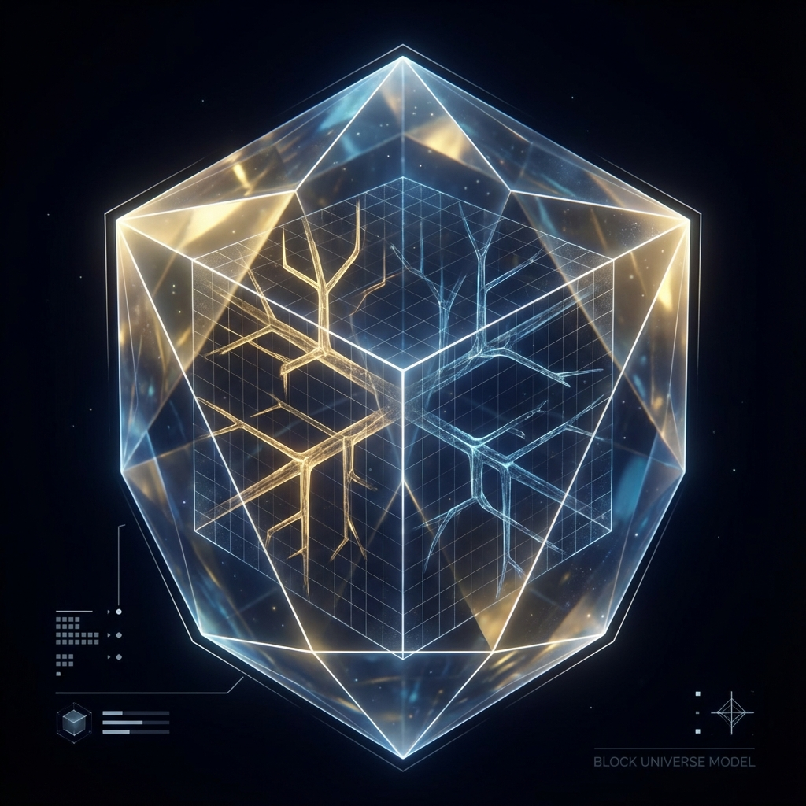

# 第一卷：公理化体系

**(Volume I: Axiomatic Framework)**

## 第二章：全息等价原理

**(The Holographic Equivalence Principle)**

> **"在物理学的终极视角下，'可能性'是一个伪概念。对于整个宇宙而言，所有可能发生的历史都已经作为叠加态永恒地存在于希尔伯特空间之中。真正的谜题不在于宇宙如何选择了一条路径，而在于局域观测者为何只能看到一条。"**

本章将阐述交互式计算宇宙学（ICC）的核心定理——**全息等价原理**。为了证明这一原理，我们首先需要严格定义对偶关系的两个端点。本节将首先构建上帝视角下的物理模型，即**全局幺正演化模型（QTM）**。

### 2.1 全局幺正演化模型

**(The Global Unitary Model, QTM)**

在第一章中，我们确立了物理实在的有限性与可计算性。基于此，我们可以构建一个描述整个宇宙（包含所有物质、能量及观测者）的完备数学模型。在这一模型中，我们将宇宙视为一台与外界隔离的、自洽运行的**量子图灵机（Quantum Turing Machine, QTM）**。

该模型代表了物理学追求的理想客观视角——即去除所有主观观测效应后的宇宙本体。我们将看到，在这个视角下，宇宙是一个严格决定论的、信息守恒的、包含所有历史分支的静态结构。

#### 2.1.1 全域希尔伯特空间

根据**有限信息公理**，宇宙的总自由度是有限的。设宇宙包含 $N$ 个基本信息单元（量子比特），则全域希尔伯特空间 $\mathcal{H}_{total}$ 可以定义为 $N$ 个局域二维希尔伯特空间的张量积：

$$
\mathcal{H}_{total} = \bigotimes_{x \in \Lambda} \mathcal{H}_x \cong (\mathbb{C}^2)^{\otimes N}
$$

其中 $\Lambda$ 是离散的时空晶格。这一空间的维数 $D = 2^N$ 虽然巨大，但并非无限。宇宙在任意时刻的**全域量子态（Global Quantum State）** $|\Psi(t)\rangle$ 是 $\mathcal{H}_{total}$ 中的一个单位向量。

这一状态向量 $|\Psi(t)\rangle$ 包含了宇宙中所有粒子的位置、动量、自旋以及所有复杂的纠缠关系。它是对物理实在的**完备描述**。根据量子力学的线性叠加原理，它可以被展开为一组正交基底（如所有可能的经典构型）的线性组合：

$$
|\Psi(t)\rangle = \sum_{i=1}^{D} c_i(t) |World_i\rangle
$$

这里，每一个 $|World_i\rangle$ 代表一个特定的经典宇宙快照（Snapshot）。系数 $c_i(t)$ 是复数概率幅，其模方 $|c_i|^2$ 代表该构型在全域波函数中的权重。

#### 2.1.2 永恒的动力学：全局幺正算符 $\hat{U}$

在 QTM 模型中，宇宙是一个封闭系统，不与任何外部环境发生相互作用。因此，其演化严格遵循量子力学的**幺正性（Unitarity）**。

我们将物理定律编码为一个全局幺正演化算符 $\hat{U}$。宇宙状态随离散时间步 $t$ 的演化方程为：

$$
|\Psi(t+1)\rangle = \hat{U} |\Psi(t)\rangle
$$

这一方程是离散版本的薛定谔方程。算符 $\hat{U}$ 必须满足幺正条件 $\hat{U}^\dagger \hat{U} = I$，这保证了全域波函数的模长守恒：

$$
\langle \Psi(t+1) | \Psi(t+1) \rangle = \langle \Psi(t) | \hat{U}^\dagger \hat{U} | \Psi(t) \rangle = 1
$$

**物理推论：信息守恒**

幺正演化意味着全域量子态的演化是**可逆的（Reversible）**。如果我们知道当前时刻的状态 $|\Psi(t)\rangle$ 和物理定律 $\hat{U}$，我们不仅可以完美预测未来的任意状态 $|\Psi(t+n)\rangle$，也可以完美回溯过去的状态 $|\Psi(t-n)\rangle = (\hat{U}^\dagger)^n |\Psi(t)\rangle$。

在 QTM 模型中，**信息从未被创造，也从未被销毁**。所谓的"熵增"或"遗忘"，仅仅是信息从局域自由度扩散到了全局纠缠关联中，对于全知全能的上帝视角（拥有 $\hat{U}^\dagger$ 的计算能力），宇宙的冯·诺依曼熵始终保持为零（纯态）。

#### 2.1.3 块宇宙与费曼路径求和

如果我们考察 $|\Psi(t)\rangle$ 在时间轴上的展开，QTM 模型呈现出一个**块宇宙（Block Universe）**的图景。

利用费曼路径积分（在离散架构下为路径求和），从初始时刻 $t=0$ 到时刻 $T$ 的演化可以表示为所有可能历史路径的相干叠加：

$$
|\Psi(T)\rangle = \sum_{\text{all paths } \gamma} \mathcal{A}[\gamma] |Final_\gamma\rangle
$$

其中 $\mathcal{A}[\gamma]$ 是路径 $\gamma$ 的复数振幅，由作用量 $e^{iS}$ 决定。

在这个图景中：

1.  **多重历史并存**：所有符合物理定律的历史路径（例如"猫死了"和"猫活着"）都在波函数中拥有非零的振幅。它们是并行存在的实在。

2.  **没有坍缩**：由于系统是封闭的，不存在外部观测者来执行测量，因此波函数永远不会坍缩。薛定谔的猫永远处于生死叠加态。

3.  **静态时空**：时间参数 $t$ 仅仅是希尔伯特空间中的一个索引。整个历史结构 $(|\Psi(0)\rangle, |\Psi(1)\rangle, \dots, |\Psi(T)\rangle)$ 就像一块已经完成的晶体，静态地悬浮在逻辑空间中。

#### 2.1.4 主观体验的缺失

QTM 模型虽然在数学上完美自洽，但它面临一个致命的解释鸿沟：**它无法推导出"现在"和"我"的概念。**

在一个包含所有可能性的波函数中，所有的时刻都是平权的，所有的历史分支都是平权的。不存在一个特殊的指针来标记"现在是 2025 年"或"我看到了猫活着"。

* **没有"现在"**：因为所有 $t$ 的状态都由 $\hat{U}$ 刚性连接，过去和未来在本体论上是等价的。

* **没有"选择"**：因为所有分支都发生了，所谓的选择只是幻觉。一个在分叉路口向左走的人和一个向右走的人，都只是全局波函数中的不同分量。

这就引出了本书的核心问题：**为什么我们作为身处宇宙内部的观测者，体验到的不是并行的多重历史，而是单一的、线性的、充满随机性的时间流？**

为了回答这个问题，我们需要引入对偶的第二端点——**局域交互自动机模型（CITM）**，这将在下一节详细阐述。
