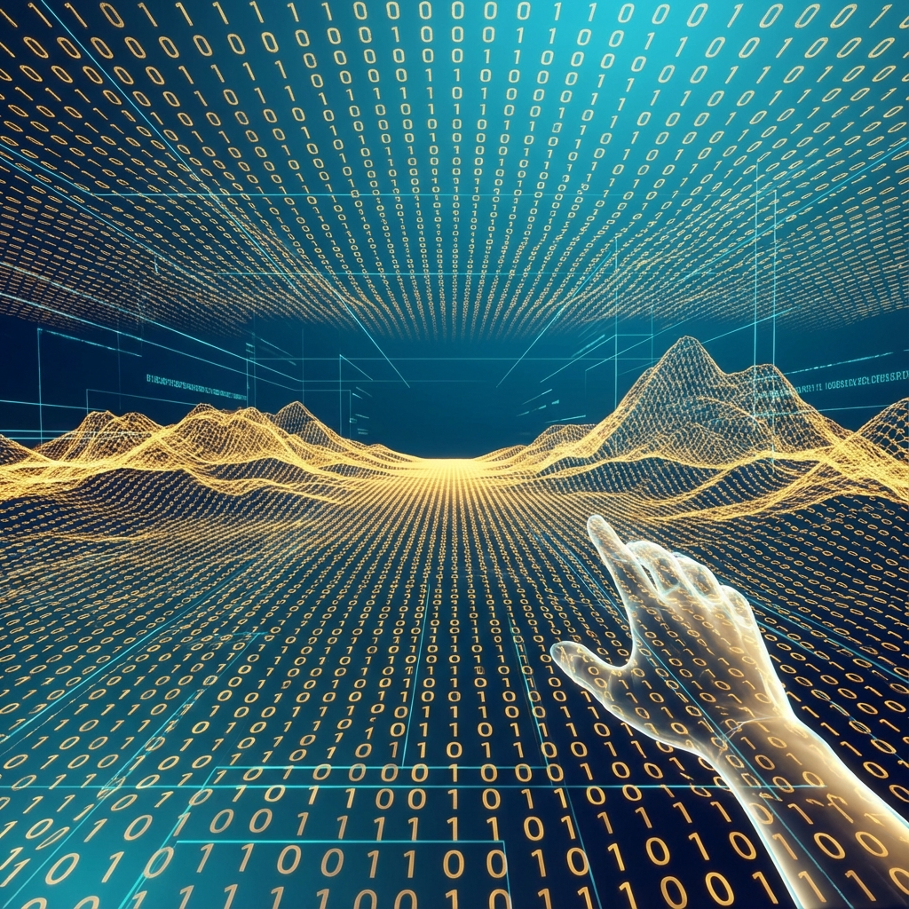

# Volume I: Axiomatic Framework

**(第一卷：公理化体系)**

## Chapter 2: The Holographic Equivalence Principle

**(第二章：全息等价原理)**

### 2.2 The Local Interactive Automaton

**(局域交互自动机模型)**

> **"In God's perspective, the universe is a static crystal; but in the player's perspective, the universe is a dynamic game. Without introducing a local model constrained by horizons and equipped with input interfaces, physics can never explain the flowing sense of 'now,' nor can it accommodate the observer's free will."**

In the previous section, we established the Global Unitary Model (QTM), which describes a deterministic block universe containing all possible histories. However, this model has a fatal flaw: it cannot describe the subjective experience of observers **embedded within the universe**. For us—finite agents embedded in this universe—we do not see superpositions of dead and alive cats, nor do we see future scripts. We see a continuously collapsing, single, uncertainty-filled reality.

To describe this subjective perspective, we need to introduce a dual computational model: the **Classical Interactive Turing Machine (CITM)**. This section will strictly define this model and reconstruct "wave function collapse" in physics as "external input interrupt" in computer science.

#### 2.2.1 Local Horizon and Classical State Space

First, we must define the observer's boundary. In the QTM model, the observer is merely part of the global wave function $|\Psi\rangle$. But in the CITM model, the observer $\mathcal{A}$ is treated as the subject of computation.

Due to the **Axiom of Finite Information** and **speed of light limit** (detailed in Volume II), the observer can only access a subregion of the universe at any moment $t$, which we call the **Local Horizon ($\mathcal{H}_A$)**.

**Definition 2.2.1 (Classical State)**

Although the physical ontology within the horizon is quantum (Hilbert space), the observer can only read information through a specific **"Pointer Basis"** (e.g., photon impact positions on the retina, or readings on instruments). Therefore, for the observer, the effective state of the system is not a vector $|\psi\rangle$, but a **Classical Bit String** $s_t$.

$$s_t \in \mathcal{S} = \{0, 1\}^K$$

where $K$ is the maximum distinguishable number of bits within the observer's horizon (constrained by the Bekenstein Bound).

**Physical Meaning**:

This classicalization process corresponds to **Decoherence** in physics. But in computational ontology, we interpret it as **Type Casting**: to adapt to the observer's limited I/O bandwidth, the system "compresses" high-dimensional quantum complex vectors into low-dimensional classical enumeration values.

#### 2.2.2 Oracle Interface: Mathematical Definition of Free Will

QTM is closed, while CITM is **open**. This is an essential distinction.

In classical computation theory, if a Turing machine encounters a problem that cannot be solved by the current algorithm during execution (e.g., undecidable propositions, or choices requiring true random numbers), it can pause and query an external black box, called an **Oracle ($\mathcal{O}$)**.

**Definition 2.2.2 (Physical Oracle)**

We define the physical oracle $\mathcal{O}$ as an **input channel** connecting the observer with the outside of the horizon (Environment/Exoverse).

$$\mathcal{O}: \mathcal{S} \times \mathbb{N} \to \Omega$$

where $\Omega$ is the set of possible observation outcomes (e.g., spin up/down).

When CITM runs to a **Branching Point**—the moment when quantum mechanics predicts a superposition—the system does not split, but initiates a query to $\mathcal{O}$.

* **Input**: Current superposition coefficients (probability amplitudes).

* **Output**: A definite classical result (collapse).

**Ontological Implication**:

In the CITM model, **"free will" and "quantum randomness" are synonymous**. They both represent **Non-algorithmic Information Flow** injected from outside the system into the local system. This is not a failure of physical laws, but **I/O communication** at the system level.

#### 2.2.3 Interactive Dynamics: Interrupt and Jump

With state space and oracle, we can write the evolution equation of CITM. This is no longer the linear Schrödinger equation, but a **Hybrid Dynamical System**.

The system state $s_t$ updates according to the following rule:

$$
s_{t+1} = 
\begin{cases} 
\mathcal{L}(s_t) & \text{if } \text{Query}_t = \text{False} \\
\text{Update}(s_t, \mathcal{O}(s_t)) & \text{if } \text{Query}_t = \text{True} 
\end{cases}
$$

1.  **Default Mode ($\mathcal{L}$)**: When no observation occurs, the system follows **classical physical laws** (such as discretized versions of Newtonian mechanics or Maxwell's equations). This is low-cost inertial evolution, equivalent to **background suspension** or **linear extrapolation** in computers.

2.  **Interactive Mode ($\mathcal{O}$)**: When the observer performs a measurement (Query), the system is **interrupted**. The oracle injects a new value (observation result), forcing a nonlinear **jump** in the system state.

This perfectly corresponds to **von Neumann's hypothesis** in quantum mechanics:

* **Process II** (unitary evolution) corresponds to default mode.

* **Process I** (wave function collapse) corresponds to interactive mode.

From the CITM perspective, collapse is not physical "destruction," but a **Write** operation on data.

#### 2.2.4 Lazy Loading and Single History Generation

The QTM model computes all possible histories, while the CITM model uses **Lazy Evaluation** mechanism to compute only the observed history.

* **When unobserved**: Mountains and rivers do not exist as definite pixels; they are only stored on the hard drive as generation rules (wave functions/code).

* **When observed**: Only when the observer's gaze (query) turns there does the system call the oracle, performing **Just-in-Time (JIT) compilation** to generate specific physical properties.

**Definition 2.2.3 (Dynamic History)**

In CITM, history $H_t = (s_0, s_1, \dots, s_t)$ is not pre-existing static data, but a **Log File** **minted** by a series of oracle inputs as time $t$ progresses.

This means: **The future is not discovered; the future is generated.**

#### 2.2.5 Summary: Legitimacy of the Player's Perspective

The CITM model provides us with an intuitive physical picture:

1.  **The world is classical** (because our interface is classical).

2.  **The future is open** (because the oracle continuously injects new information).

3.  **Resources are finite** (because we only compute a single history).

The core question now is: Can this seemingly "bandwidth-saving" simple model (CITM) really be equivalent to that grand, perfect God model (QTM)?

In the next section, we will prove the most important theorem of this book—the **Steinspring-Turing Isomorphism Theorem**, which will mathematically strictly prove: **For local observers, these two models are statistically completely indistinguishable.**
