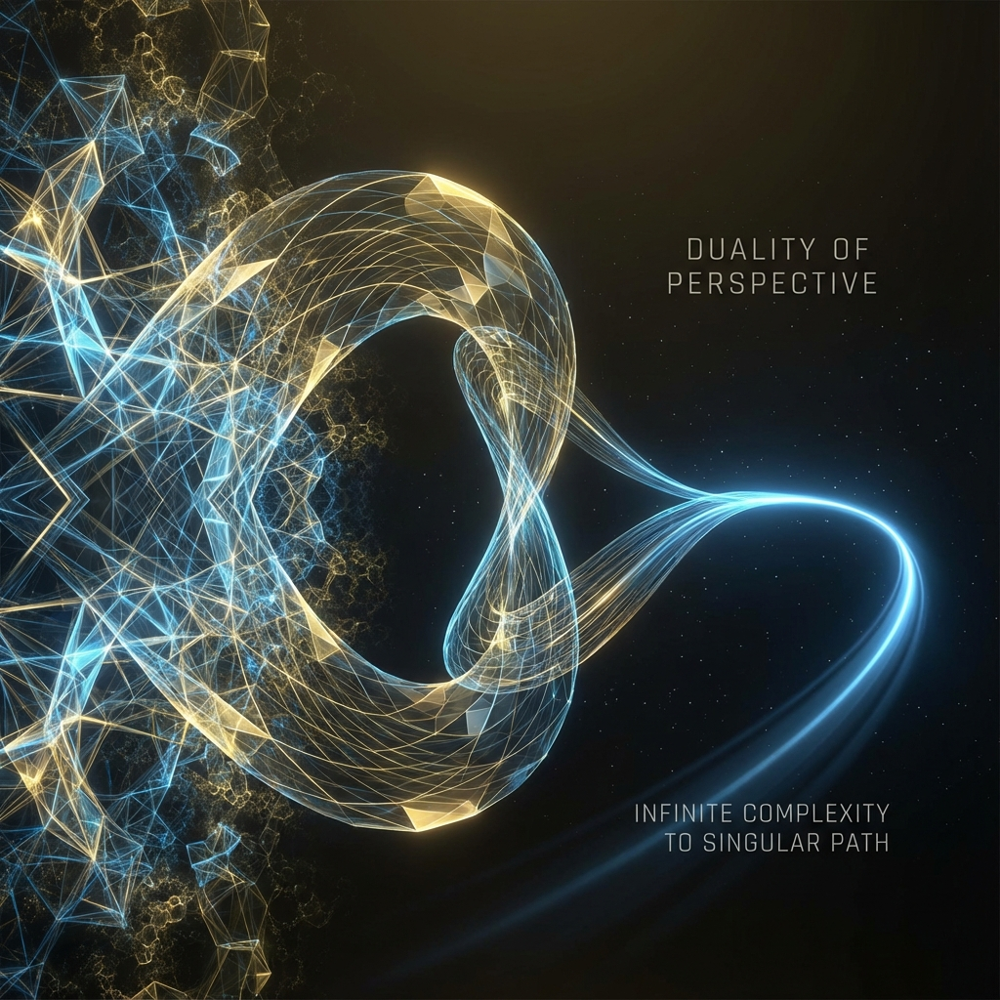

# Volume I: Axiomatic Framework

**(第一卷：公理化体系)**

## Chapter 2: The Holographic Equivalence Principle

**(第二章：全息等价原理)**

### 2.3 The Stinespring-Turing Isomorphism Theorem

**(斯泰恩斯普林-图灵同构定理)**

> **"Randomness is the shadow cast by local horizons. What we call 'collapse' is merely the projection of global unitary entanglement onto the finite computational bandwidth of local observers. This section will prove that physics' two greatest opposing paradigms—deterministic many-worlds and non-deterministic free will—are mathematically two isomorphic expressions of the same structure."**

In sections 2.1 and 2.2, we defined two fundamentally different computational models describing the universe: one is the omniscient, deterministic, all-histories-containing **Global Unitary Model (QTM)**; the other is the local, non-deterministic, single-history **Classical Interactive Automaton Model (CITM)**.

The century-long debate in physics (such as the Einstein-Bohr controversy) essentially stems from the misalignment of these two perspectives. This section will propose and prove the core theorem of this book—the **Stinespring-Turing Isomorphism Theorem**. We will use the Stinespring Dilation Theorem from quantum information theory to establish a strict mathematical mapping between QTM and CITM, proving that for any observer constrained by horizons, these two models are statistically **Indistinguishable**.

#### 2.3.1 Theorem Statement: Computational Indistinguishability

Let $\mathcal{H}_S$ be the Hilbert space of the local observer (system), and $\mathcal{H}_E$ be the Hilbert space of the environment outside the horizon.

**Theorem 2.3.1 (Stinespring-Turing Isomorphism)**

For any quantum dynamical process defined on a local system (i.e., state evolution from time $t$ to $t+1$), the following two descriptions are mathematically equivalent:

1.  **QTM Description (Global Unitarity)**: There exists a larger Hilbert space $\mathcal{H}_{total} = \mathcal{H}_S \otimes \mathcal{H}_E$ and a global unitary operator $\hat{U}$ such that the evolution of the local state $\rho_S$ is the partial trace of global pure state evolution:

    $$
    \rho_S(t+1) = \text{Tr}_E \left( \hat{U} (\rho_S(t) \otimes |0\rangle_E \langle 0|) \hat{U}^\dagger \right)
    $$

2.  **CITM Description (Interactive Randomness)**: There exists a set of Kraus operators $\{M_k\}$ (satisfying $\sum M_k^\dagger M_k = I$) and a classical oracle input stream $\mathcal{O}(t)$. In a single-run history, the system receives input $k = \mathcal{O}(t)$ with classical probability $p_k = \text{Tr}(M_k \rho_S M_k^\dagger)$ and undergoes a nonlinear state jump:

    $$
    \rho_S(t+1) = \frac{M_k \rho_S(t) M_k^\dagger}{p_k}
    $$

**Physical Implication**: This means that as long as the observer cannot access the environment $\mathcal{H}_E$ (i.e., cannot reverse entropy increase), they can never distinguish through any physical experiment whether they are in a many-worlds quantum universe (QTM) or a classical universe driven by external random sources (CITM).

#### 2.3.2 Forward Proof: From Many-Worlds to Oracle ($\text{QTM} \Rightarrow \text{CITM}$)

We first prove that global deterministic evolution necessarily manifests locally as probabilistic interactive Turing machine behavior.

Consider the evolution of the global wave function $|\Psi(t)\rangle$ under $U$. Assume the system and environment are unentangled at the initial moment: $|\Psi(t)\rangle = |\psi_S\rangle \otimes |0\rangle_E$.

After one step of evolution: $|\Psi(t+1)\rangle = \hat{U} (|\psi_S\rangle \otimes |0\rangle_E)$.

Choosing an orthogonal basis $\{|k\rangle_E\}$ for the environment, we can expand $|\Psi(t+1)\rangle$ as:

$$
|\Psi(t+1)\rangle = \sum_k (M_k |\psi_S\rangle) \otimes |k\rangle_E
$$

where $M_k = \langle k|_E \hat{U} |0\rangle_E$ is an operator acting on the system.

For the local observer, they cannot perceive which $|k\rangle_E$ state the environment is in. Therefore, their subjective state is the **Ensemble** interpretation of the above entangled state. According to the standard interpretation of quantum mechanics, this is equivalent to the system randomly "collapsing" to branch state $|\psi_k'\rangle = M_k |\psi_S\rangle / \sqrt{p_k}$ with probability $p_k = || M_k |\psi_S\rangle ||^2$.

Here, the index $k$ of the environment basis plays the role of **oracle input in the CITM model**.

* **In QTM**, $k$ is a degree of freedom of the environment, and all $k$ exist simultaneously (many-worlds).

* **In CITM**, $k$ is a reading on the input tape, and only one $k$ is selected at each moment (single history).

Since the observer is constrained by the local horizon and cannot verify the existence of other $k'$ branches (this would require extracting all degrees of freedom of the environment for interference experiments), the multi-branch structure of QTM **collapses** to the random input stream of CITM from the local perspective.

#### 2.3.3 Reverse Proof: From Oracle to Many-Worlds ($\text{CITM} \Rightarrow \text{QTM}$)

Conversely, we prove that any classical interactive computation with random inputs can be "purified" into a higher-dimensional closed unitary evolution. This is a direct application of the **Stinespring Dilation Theorem**.

Consider a local system following classical probabilistic evolution: $s \to f(s, r)$, where $r$ is a random number. This corresponds to a completely positive trace-preserving (CPTP) map $\mathcal{E}(\rho)$ in quantum mechanics.

Stinespring's theorem guarantees: For any CPTP map $\mathcal{E}$, there must exist an auxiliary Hilbert space $\mathcal{H}_{anc}$ (i.e., the environment) and a unitary operator $U$ such that:

$$
\mathcal{E}(\rho) = \text{Tr}_{anc} (U (\rho \otimes |0\rangle\langle 0|) U^\dagger)
$$

**Constructive Proof**:

We can explicitly construct this "universe computer."

Encode each possible historical path of CITM (determined by input sequence $r_1, r_2, \dots$) as an orthogonal basis $|r_1 r_2 \dots\rangle$ in environment $\mathcal{H}_E$.

Define the global operator $U$ as: it performs corresponding logical operations on the system according to the value of the environment register, while "writing" the operation record into the environment (as entanglement).

$$
U (|s\rangle_S \otimes |0\rangle_E) = \sum_r \sqrt{p(r)} |f(s,r)\rangle_S \otimes |r\rangle_E
$$

This equation shows that any seemingly random, open classical computational process can be viewed as the projection of a vast, deterministic, closed quantum computational process onto a local subsystem.

**Physical Meaning**:

This reverse proof tells us that "free will" (or randomness) does not require assuming a breakdown of physical laws. It merely means our system has become entangled with a broader, invisible system (environment/future). **CITM's input tape is QTM's environment tape.**

#### 2.3.4 Ontological Consequences of Holographic Equivalence

The establishment of the Stinespring-Turing Isomorphism Theorem completely reconstructs our understanding of "reality" and establishes the **Holographic Computational Equivalence Principle**:

1.  **Duality of Interpretations**:

    * **Many-Worlds Interpretation (MWI)** is the truth from God's perspective: all possibilities form a static wave function crystal.

    * **Copenhagen Interpretation** is the truth from the player's perspective: reality is a series of discrete, irreversible measurement events (inputs).

    * The two are not opposing, but **projections of the same mathematical structure in different reference frames**.

2.  **Horizon as Oracle**:

    The mysterious external input source (oracle) in the CITM model is physically identified as the **Horizon**. The horizon screens the microscopic states of the environment, converting complex quantum entanglement into simple thermodynamic noise (randomness).

3.  **Conservation of Computation**:

    * QTM consumes **space complexity** (storing all parallel universes).

    * CITM consumes **time complexity** (computing a single history in real-time).

    * The theorem shows that these two computational resources are physically conserved and interchangeable. Our universe appears "classical" and "single-history" because we, as local observers, lack sufficient computational power (memory) to access the global wave function. We are forced to trade "time for space" and "collapse for existence."

At this point, we have completed the construction of Volume I's axiomatic framework. We have proven that physical reality is a finite, computable system and established the legitimacy of the local interactive perspective. In the next volume, we will leave abstract Hilbert space and enter concrete geometric spacetime, exploring how the speed of light, gravity, and spacetime itself emerge from this interactive computation.
