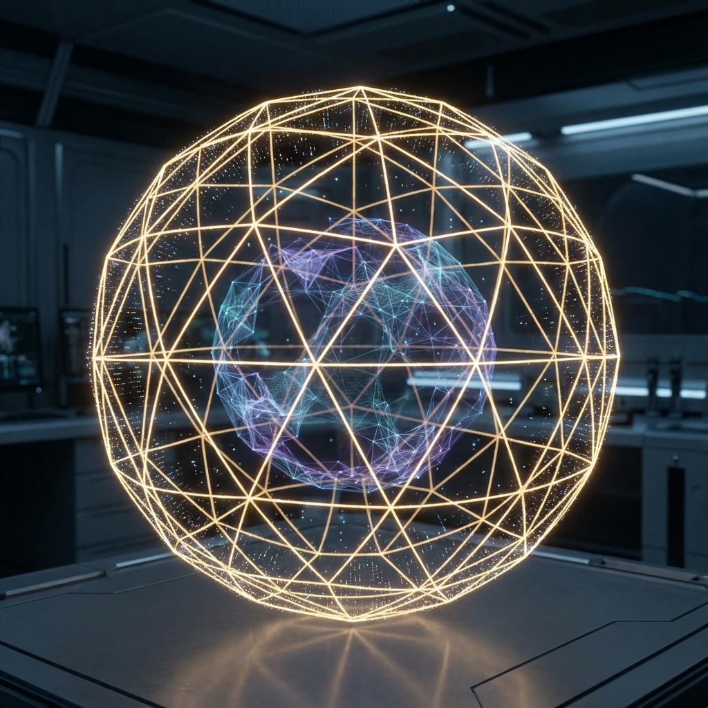

# 第二卷：时空的涌现机制

**(Volume II: Emergence of Spacetime)**

## 第四章：全息原理与空间度规

**(Holographic Principle and Spatial Metric)**

### 4.1 纠缠熵面积律

**(Area Law of Entanglement Entropy)**

> **"空间并非承载物体的容器，而是物体之间相互纠缠的涌现图景。距离即是去相关（Decorrelation），几何即是信息。当我们深入探索空间的微观结构时，我们发现的三维体积仅仅是二维边界上纠缠信息的全息投影。"**

在第三章中，我们通过分析信息传播的带宽限制（光速），推导出了狭义相对论的时空运动学。然而，一个更深层的问题尚未解决：**"空间"这个舞台本身是如何存在的？**

在经典物理学中，空间被视为一个预先存在的、连续的背景流形（Manifold）。但在 **交互式计算宇宙学（ICC）** 的框架下，任何物理对象都必须是可计算的。一个连续的、无限精度的背景空间违反了有限信息公理。因此，空间必须是**涌现（Emergent）**的。

本节将论证：宏观的几何空间结构，本质上是底层量子比特网络（Qubit Network）中纠缠关系的张量网络表示。我们将通过 **纠缠熵面积律（Area Law）** 证明，所谓的"三维体积"实际上是系统为了处理纠缠信息而生成的冗余数据结构，真正的有效信息只存在于维数更低的边界上。

#### 4.1.1 几何源于纠缠 (Geometry from Entanglement)

在传统的几何观念中，如果两个点 $x$ 和 $y$ 的坐标数值接近，我们说它们是"近"的。但在量子信息论的视角下，距离有了全新的定义。

**定义 4.1.1（信息距离）**

在量子多体系统中，两个子系统 $A$ 和 $B$ 之间的"距离"由它们的 **互信息（Mutual Information）** $I(A:B)$ 决定。

$$d(A, B) \sim \frac{1}{I(A:B)}$$

如果两个量子比特处于最大纠缠态（Maximally Entangled），它们在逻辑上就是"相邻"的，无论它们在宏观空间中看起来相距多远。

这一观点被称为 **ER = EPR 猜想** 的广义形式：爱因斯坦-波多尔斯基-罗森对（EPR Pair，即量子纠缠）与爱因斯坦-罗森桥（ER Bridge，即虫洞/空间连接）在数学上是等价的。

因此，原本没有几何结构的希尔伯特空间，通过无数个量子比特之间的纠缠网络，编织出了"近"与"远"的拓扑结构。空间就是一张巨大的纠缠图（Entanglement Graph）。

#### 4.1.2 面积律与体积律的冲突

为了量化这种纠缠几何，我们需要考察系统的 **纠缠熵（Entanglement Entropy）**。

设整个系统处于纯态 $|\Psi\rangle$。我们将系统划分为两个区域：关注区 $A$ 和环境区 $B$。区 $A$ 的冯·诺依曼熵定义为：

$$S_A = -\text{Tr}(\rho_A \ln \rho_A)$$

其中 $\rho_A = \text{Tr}_B(|\Psi\rangle\langle\Psi|)$ 是区 $A$ 的约化密度矩阵。

在热力学中，熵通常遵循 **体积律（Volume Law）**：$S \propto V$。这意味着系统内部的每一个粒子都贡献了独立的自由度，信息广泛分布在整个体积内。这对应于经典气体或高温热库。

然而，在量子场论的基态（真空）以及大多数处于低能态的量子多体系统中，我们观测到了一个惊人的反直觉现象—— **面积律（Area Law）**：

**定理 4.1.1（纠缠熵面积律）**

对于处于基态的具有局域哈密顿量的量子多体系统，其子区域 $A$ 的纠缠熵 $S_A$ 并不正比于其体积 $V$，而是正比于其边界的表面积 $\partial A$：

$$S_A \propto \text{Area}(\partial A)$$

这一数学事实揭示了空间的 **全息本质**：

* 如果一个三维球体内部的信息量只正比于它的表面积，这意味着球体内部（Bulk）的大部分"体素"在信息论上是 **冗余（Redundant）** 的。

* 真实的独立自由度并没有填满整个空间，它们只铺满了边界。三维空间不是实心的，它是一个 **全息投影（Holographic Projection）**。

#### 4.1.3 张量网络与空间的重整化

为了理解这种全息投影是如何在计算上实现的，我们需要引入 **张量网络（Tensor Networks）**，特别是 **多尺度纠缠重整化拟设（MERA）**。

在计算模拟中，为了压缩存储巨大的波函数，我们使用张量网络来近似量子态。MERA 网络具有分层结构：

1.  **底层**：对应于微观的物理自由度（如一维链上的晶格）。

2.  **高层**：通过 **解纠缠器（Disentangler）** 和 **等距映射（Isometry）** 将信息粗粒化。

当我们把 MERA 网络画出来时，惊人的几何结构出现了：

* 原始的一维量子系统位于网络的边缘（Boundary）。

* 张量网络的层级结构向内延伸，自然构建出了一个额外的维度。

* 这个涌现出来的几何结构，在数学上精确对应于 **双曲空间（Hyperbolic Space）** 或 **反德西特空间（AdS）**。

**计算推论**：

我们所感知的"弯曲时空"或"引力场"，在底层代码中，其实是优化量子计算效率的 **重整化群流（Renormalization Group Flow）**。

* 靠近边界的张量代表高频、短波模式（微观细节）。

* 深入内部（Bulk）的张量代表低频、长波模式（宏观轮廓）。

* 空间的"深度"，就是计算处理的 **逻辑深度（Logical Depth）**。

#### 4.1.4 笠真-高柳公式 (Ryu-Takayanagi Formula)

2006年，笠真生（Shinsei Ryu）和高柳匡（Tadashi Takayanagi）提出了全息原理中最著名的定量公式，将量子信息与几何学彻底统一。

**公式 4.1.1（RT 公式）**

在全息对偶（AdS/CFT）中，边界场论（CFT）中子区域 $A$ 的纠缠熵 $S_A$，严格等于体空间（Bulk AdS）中与 $A$ 同调的 **极小曲面（Minimal Surface）** $\gamma_A$ 的面积，除以 $4G$：

$$S_A(\text{Boundary}) = \frac{\text{Area}(\gamma_A)}{4G_N}$$

这个公式是贝肯斯坦-霍金黑洞熵公式的终极推广。它告诉我们：

1.  **几何即纠缠**：极小曲面的面积 $\text{Area}(\gamma_A)$ 直接量度了跨越该界面的量子纠缠量。如果纠缠消失（$S_A \to 0$），面积就会收缩为零，空间就会 **断裂（Disconnect）**。

2.  **引力常数 $G_N$ 的起源**：$G_N$ 不再是一个基础物理常数，它是全息映射中的 **比特-几何转换系数（Bit-to-Geometry Conversion Factor）**，定义了多少比特的纠缠能"撑起"单位面积的时空。

#### 4.1.5 总结：从比特到几何

基于纠缠熵面积律，我们可以得出 **交互式计算宇宙学** 关于空间的最终结论：

宇宙并不是一个预先存在的三维盒子，里面装着物质。

宇宙是一个定义在二维视界（或抽象边界）上的 **量子比特海洋**。

由于这些比特之间存在复杂的纠缠模式，系统为了"解压"和"可视化"这些数据，运用了张量网络算法，**渲染** 出了一幅具有深度的三维全息图。

我们身处的这个宏伟的三维世界，本质上是边界数据的 **低损耗压缩格式**。而万有引力，正是这种压缩机制为了维持数据一致性而必须付出的几何代价。
