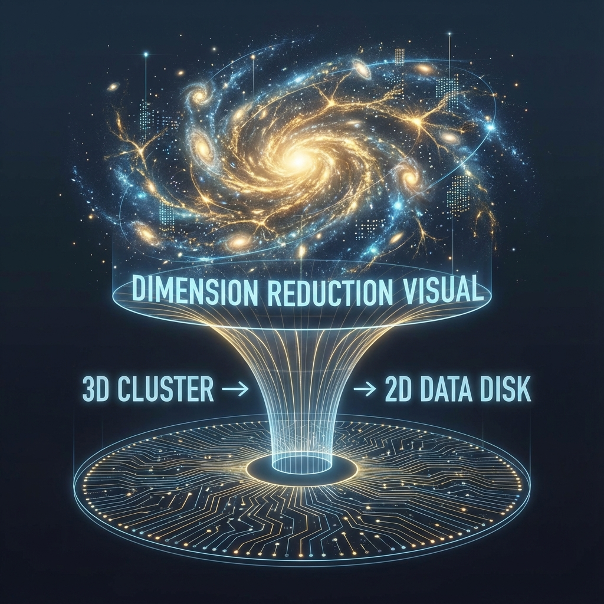

# 第二卷：时空的涌现机制

**(Volume II: Emergence of Spacetime)**

## 第四章：全息原理与空间度规

**(Holographic Principle and Spatial Metric)**

### 4.2 信息的全息压缩

**(Holographic Compression)**

> **"如果我们想要构建一个宇宙，最愚蠢的做法就是为空间中的每一个点都分配内存。大自然是一位极致的极简主义程序员，它发现三维空间内部绝大多数的数据都是冗余的。真正的宇宙是一张二维的'膜'，而我们所感知的深邃太空，不过是这张膜上全息数据的解压与投影。"**

在上一节中，我们通过纠缠熵面积律揭示了空间几何与量子纠缠之间的深刻联系。这一发现引出了一个更具颠覆性的计算问题：既然一个三维区域的最大信息容量只取决于其表面积，那么这就意味着物理实在的 **底层数据结构（Underlying Data Structure）** 并不具备三维属性。

本节将从信息论和数据压缩的角度，重新阐述 **全息原理（Holographic Principle）**。我们将论证，物理宇宙采用了一种类似于现代计算机图形学中的 **纹理映射（Texture Mapping）** 和 **稀疏八叉树（Sparse Octree）** 的策略，通过全息压缩机制，在二维的边界上编码了三维的宏观体验，从而实现了计算资源的最优配置。

#### 4.2.1 体积的幻觉：从体素到纹理

在直观的物理图景中，我们倾向于认为空间是由无数微小的 **体素（Voxels）** 堆砌而成的实心体。按照这种观点，一个边长为 $L$ 的立方体空间，其包含的独立自由度（即总信息量 $I$）应当正比于其体积：

$$I \propto L^3$$

这就是 **体积律（Volume Law）**，也是经典场论和流体动力学的默认假设。

然而，在计算科学中，这种存储方式是极其低效的。如果宇宙以普朗克分辨率（$l_P \approx 10^{-35}$ 米）存储一个 $1 \text{cm}^3$ 的空间，将需要约 $10^{105}$ 比特的数据。如此庞大的数据量，即便对于宇宙级的计算机也是沉重的负担。

全息原理告诉我们，大自然采用了另一种编码方案。对于任何因果闭合的区域，其有效自由度 $N$ 严格受限于边界表面积 $A$：

$$N \le \frac{A}{4l_P^2} \propto L^2$$

这意味着，当我们深入微观尺度时，所谓的"体空间"并没有提供额外的信息存储位。

**计算推论**：

三维空间内部并不是"实心"的。它更像是一个空心的气球，所有的物理信息（粒子的位置、动量、自旋）实际上都编码在气球的表面（边界）上。内部的任何一点 $(x, y, z)$，都不是一个独立的存储单元，而是边界数据 $(u, v)$ 通过某种复杂的 **非局域映射（Non-local Mapping）** 生成的投影。我们所感知的"深度"，是数据关联性的表现，而非存储的堆叠。

#### 4.2.2 贝肯斯坦界限作为压缩率

我们可以将雅各布·贝肯斯坦发现的熵界限公式，重新解释为宇宙存储系统的 **最大压缩率（Maximum Compression Ratio）**。

设想我们将海量的数据包（物质与能量）塞入一个有限的空间区域。随着物质密度的增加，重力效应开始显现，最终导致该区域坍缩为黑洞。在黑洞形成的那一刻，该区域的信息密度达到了物理极限。

**定理 4.2.1（全息信道容量）**

宇宙中任意通信信道或存储介质的比特传输率，不能超过其横截面积的普朗克单位数的 1/4。

$$C_{max} = \frac{\text{Area}}{4 \ln 2 \cdot l_P^2} \text{ bits}$$

这个公式不仅仅是热力学的约束，更是 **交互式计算宇宙学（ICC）** 的硬件总线规范。它表明：

1.  **比特是面积性的**：在普朗克尺度下，一个比特的物理表现不是占据一个体积点，而是占据一个面积片（Pixel/Plaquette）。

2.  **过饱和导致的视界**：如果试图在一个区域内写入超过 $A/4$ 比特的数据，系统会因为 **堆栈溢出（Stack Overflow）** 而触发保护机制——形成 **事件视界（Event Horizon）**。视界的作用是将多余的信息"屏蔽"在因果连通区之外，确保外部观测者看到的有效信息量永远不超过全息界限。

#### 4.2.3 编码冗余与体空间

既然真实信息只有 $L^2$ 量级，为什么我们会强烈地感觉到 $L^3$ 的世界？这源于 **纠缠冗余（Entanglement Redundancy）**。

在 AdS/CFT 对偶（反德西特/共形场论对偶）的数学模型中，边界上的量子场论（CFT）对应于无引力的"源代码"，而内部的体空间（Bulk AdS）对应于包含引力的"渲染图像"。

研究发现，体空间中的几何连接性（例如两个点之间的测地线距离），是由边界上量子态的 **纠缠模式** 决定的。

* **短程纠缠** 构建了边界附近的浅层几何。

* **长程纠缠** 构建了深入内部的深层几何。

在 ICC 模型中，这意味着"体空间"本质上是一种 **纠错码（Error Correcting Code）**。大自然为了保护脆弱的量子信息免受退相干的影响，将 $L^2$ 的原始数据通过纠缠网络扩散到了 $L^3$ 的虚拟体积中。我们生活在纠错码的"逻辑空间"里，感受到的物理定律（如引力）其实是系统维护这些纠错码稳定性的算法副产品。

#### 4.2.4 黑洞：极限压缩态

黑洞是全息压缩机制的最极端案例，也是验证这一理论的终极实验室。

对于一个经典观测者，落入黑洞的信息似乎消失了（体积律失效）。但对于全息理论，当物质形成黑洞时，它实际上是达到了一种 **最优压缩态（Optimal Compression State）**。

1.  **视界即硬盘**：黑洞的所有熵（信息）都精确地存储在视界表面上，每个普朗克面积存储 1/4 个纳特（Nat）的信息。没有任何比特丢失，也没有任何比特在内部。

2.  **防火墙与无毛定理**：黑洞的"无毛定理"（只有质量、电荷、角动量三个参数）反映了这是对复杂物质状态的 **有损压缩（Lossy Compression）** 的宏观表现；而弦论中的"毛球图景"（Fuzzball）则认为在微观层面，视界上编码了所有细节，是 **无损压缩（Lossless Compression）**。

在 CITM（交互式图灵机）视角下，黑洞是一个 **高密度数据节点**。由于数据密度过高，系统的渲染引擎无法解析内部结构（无法为内部体素分配独立的地址），因此只能渲染出一个黑色的球面边界，并将所有信息"平铺"在这个边界上。

#### 4.2.5 宇宙作为全息投影仪

综上所述，我们可以构建出宇宙全息压缩的工程图景：

* **源数据（Source Data）**：位于宇宙的因果边界（视界或无穷远边界）上，是一个二维的量子比特阵列。

* **投影算法（Projection Algorithm）**：基于张量网络（MERA或HaPPY Code）的重整化流。它将边界上的纠缠信息"解压"并映射到体空间中。

* **用户体验（User Experience）**：局域观测者（我们）处于体空间内部。我们感知的"实体物质"和"三维距离"，是源数据经过投影算法后的 **全息像（Hologram）**。

**结论**：

空间不是空的，它充满了纠缠；空间也不是实的，它只是信息的投影。全息压缩是宇宙操作系统为了在有限的硬件资源下模拟宏大世界的 **核心优化策略**。既然三维世界是二维数据的投影，那么在这个投影中，任何物体的运动速度都必然受到投影机制刷新率的限制——这再次印证了光速作为系统带宽的本质。
