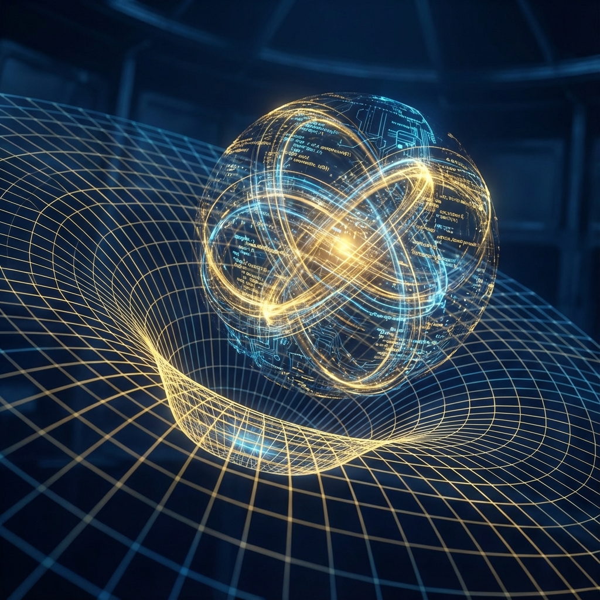

# Volume II: Emergence of Spacetime

**(第二卷：时空的涌现机制)**

## Chapter 5: Entropic Nature of Gravity

**(第五章：引力的熵力本质)**

### 5.1 Complexity and Curved Spacetime

**(复杂性与弯曲时空)**

> **"Matter tells spacetime how to curve, spacetime tells matter how to move. This famous saying of general relativity gains new interpretation in computational cosmology: data load tells processors how to allocate computational power, and processing delay defines the transmission path of information. Gravity is not some fundamental force; it is the 'damping' exhibited by computational systems when processing high-complexity information."**

In the previous chapters of this book, we have established the emergent nature of spacetime: the speed of light is a system bandwidth limit, and spatial geometry is a holographic projection of quantum entanglement. Now, we will face the grandest and most mysterious phenomenon in physics—**Gravity**.

In Einstein's general relativity, gravity is geometrized as the curvature of spacetime. However, Einstein's equation $G_{\mu\nu} = 8\pi G T_{\mu\nu}$ only describes "what curvature is," but does not explain "why it curves."

Within the framework of **Interactive Computational Cosmology (ICC)**, we demystify gravity. This section will argue that gravity is not a fundamental interaction, but an **Entropic Force**, whose microscopic origin is the **Computational Complexity** of quantum states. The curvature of spacetime is essentially the **Gradient of Computational Cost** produced by holographic computers when processing complex quantum states.

#### 5.1.1 Gravity as an Emergent Phenomenon: Thermodynamic Analogy

To understand the computational nature of gravity, we first need to review **Induced Gravity** and **Entropic Gravity** theories by Andrei Sakharov and Erik Verlinde.

In these theories, gravity is analogous to **gas pressure** or **elastic force**.

* Even if we know all microscopic equations of motion for gas molecules, without introducing statistical concepts (such as temperature, entropy), we cannot understand the macroscopic force of "pressure."

* Similarly, gravity is a statistical effect produced when microscopic degrees of freedom of spacetime (qubits) tend toward maximum entropy states.

**Definition 5.1.1 (Entropic Force)**

Entropic force $F$ does not originate from exchange of fundamental fields (such as electromagnetic force exchanging photons), but from the statistical tendency of the system to increase its entropy $S$ (or information content):

$$F = T \nabla S$$

where $T$ is the temperature of the holographic screen (Horizon).

In the ICC model, this "entropy" is reinterpreted as **complexity of information processing**. Matter tends to move toward regions of low gravitational potential (i.e., high spacetime curvature) because such motion maximizes the mixing degree of system microscopic states, or in other words, this is the macroscopic manifestation of computational systems seeking the **Path of Least Computational Action**.

#### 5.1.2 Complexity Equals Volume Conjecture

To directly link gravity with computation, we need a bridge connecting geometric quantities (volume/curvature) with computational quantities (number of logic gates). Cutting-edge research in holographic principles provides this bridge, namely the **CV Conjecture (Complexity-Volume Conjecture)** proposed by Leonard Susskind.

**Conjecture 5.1.1 (CV Correspondence)**

In holographic duality, the volume $V$ of Einstein-Rosen bridges (wormholes) in bulk space (Bulk) is proportional to the **Computational Complexity** $\mathcal{C}$ of boundary quantum states $|\Psi\rangle$:

$$V \sim \mathcal{C} \cdot l_P^3$$

* **Computational Complexity $\mathcal{C}$**: Defined as the **minimum number of logic gates** required to prepare the target state $|\Psi\rangle$ from a simple reference state (such as the completely unentangled state $|00\dots0\rangle$) by executing quantum logic gates.

**Physical Interpretation**:

This conjecture has revolutionary ontological significance: **Spatial volume is computational amount.**

* A region's space being "large" means the system needs to execute many computational steps to generate that region's state.

* The volume inside a black hole grows linearly with time, corresponding to the linear increase of the black hole quantum state's complexity over time (until exponential saturation).

Therefore, **Curved Spacetime** is actually a **"Heatmap of Computational Load"**.

#### 5.1.3 Computational Cost Gradient and Metric Emergence

Now we can answer: Why do massive objects warp spacetime?

1.  **Mass is Complexity**: In computational ontology, mass $M$ is a measure of energy, and energy corresponds to the frequency of quantum state evolution ($E = \hbar \omega$). A massive object (such as a star) is a highly entangled, rapidly evolving **High-Complexity Data Structure**.

2.  **Computational Black Hole**: To maintain the existence and evolution of this high-complexity structure, the system must allocate a large number of **Logical Updates** to this region.

3.  **Processing Delay (Time Dilation)**: According to the **Computational Power Conservation Law** we derived in Chapter 3 ($v_{ext}^2 + v_{int}^2 = c^2$), high internal evolution rate (high $v_{int}$) necessarily leads to a decrease in external information processing rate ($v_{ext}$).

    * From an external observer's perspective, the "clock" in that region slows down.

    * When photons pass through that region, due to processing node congestion, their forwarding speed (effective speed of light) decreases, and paths are deflected (Shapiro Delay).

**Corollary 5.1.1 (Computational Definition of Gravitational Potential)**

Gravitational potential $\Phi(x)$ is not some field permeating space, but a measure of **Computational Density** at that location.

$$g_{00}(x) \approx 1 + 2\Phi(x) \propto 1 - \frac{\text{Local Complexity Density}}{\text{Bandwidth Capacity}}$$

Objects "fall" toward massive objects because in four-dimensional spacetime, that path is a **Geodesic**. In the computational picture, geodesics are paths that **minimize information transmission delay**. Gravity is actually **Routing Redirection** caused by network congestion.

#### 5.1.4 Geometric Deformation in Tensor Networks

We can use **Tensor Networks** to more intuitively demonstrate the emergence of gravity.

Consider a Multi-scale Entanglement Renormalization Ansatz (MERA) network, which represents the spatial structure of the vacuum state. In this network, the connection pattern of tensors defines the flat AdS space metric.

When we insert an **Impurity** into the network—i.e., introduce a massive particle:

1.  **Disrupting Entanglement**: The particle's existence changes local entanglement patterns. To encode this particle's state, we need to insert more **Nodes (Tensors)** or **Entanglement Bonds** into the original tensor network.

2.  **Geometric Expansion**: According to the CV conjecture, inserting more computational nodes is equivalent to increasing the "volume" of that region. But with fixed boundary conditions, the increase in internal volume forces the geometric structure to **Curve**, similar to forcibly weaving extra yarn into flat fabric, causing the fabric to bulge.

**Conclusion**:

Einstein's field equation $G_{\mu\nu} = 8\pi T_{\mu\nu}$ is actually the **Resource Scheduling Equation** of the holographic computer:

* Left side $G_{\mu\nu}$ (geometric curvature): Represents **topological distribution of computational nodes**.

* Right side $T_{\mu\nu}$ (matter momentum tensor): Represents **data load to be processed**.

The equation shows: To process high-density data loads ($T_{\mu\nu}$), the system must dynamically reconstruct the computational network ($G_{\mu\nu}$) in that region, increasing node density, thereby causing macroscopic spacetime curvature. **Gravity is the "noise" emitted by the universe, this computer, when running at full capacity.**
