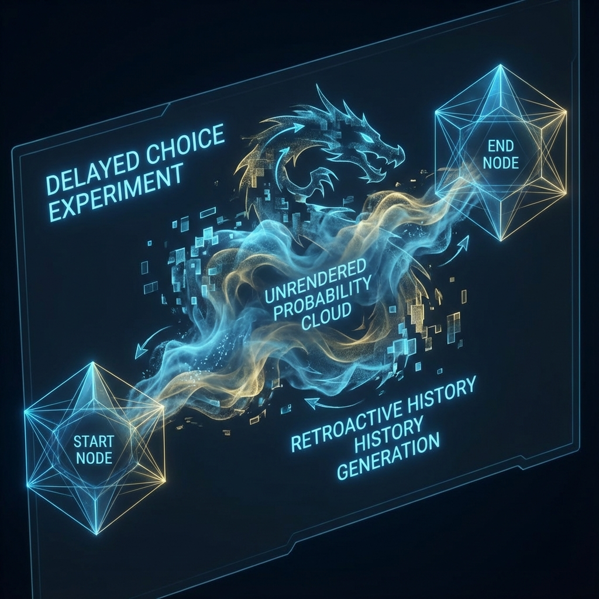

# Volume III: Microscopic Dynamics and Measurement

**(第三卷：微观动力学与测量)**

## Chapter 7: Algorithmic Solution to the Measurement Problem

**(第七章：测量问题的算法解)**

### 7.2 Delayed Choice and Historical Consistency

**(延迟选择与历史一致性)**

> **"History is not fixed data in read-only memory (ROM), but a log file dynamically generated based on current query requests. We do not live in a universe where the past determines the present; on the contrary, current observation behaviors are retroactively defining the past. As Wheeler said, the choice at this moment determines which path a photon took billions of years ago."**

In Section 7.1, we reconstructed quantum measurement as a process of **Just-In-Time Instantiation (JIT Instantiation)** from abstract wave functions to concrete particles. However, this mechanism immediately raises a serious logical challenge regarding temporal causality: if a particle's attributes (such as position or path) are determined only at the moment of measurement, what state was the particle in during the time before measurement?

If our current measurement determines whether the particle appears as a "wave" or "particle," does this mean we have changed its past?

This section will argue, through **John Wheeler's** delayed choice experiment and its advanced version—the quantum eraser experiment, the historical view in **Interactive Computational Cosmology (ICC)**: **History is Query-Based Generation**. We will prove that the past is not an objectively existing entity, but a **Reverse Compilation Routine** run by the system to satisfy the consistency of current boundary conditions.

#### 7.2.1 The Illusion of Established History

In classical physics and intuitive cognition, we adhere to **"Historical Realism"**:

1.  The past has already happened and is unique.

2.  The current state $S_t$ is the result of past state $S_{t-1}$ evolving through physical laws.

3.  Regardless of whether we observe now, the facts that happened in the past will not change.

However, the thought experiment proposed by Wheeler in 1978 completely shattered this notion. Imagine a photon from a quasar billions of light-years away, passing through a galaxy (gravitational lens) toward Earth. The photon has two possible paths (left or right).

* If on Earth we choose to detect the photon's **"which path"** (particle nature), we force the photon to "choose" a path billions of years ago.

* If on Earth we choose to detect **"interference fringes"** (wave nature), we force the photon to "pass through both paths simultaneously" billions of years ago.

The key point: our decision on Earth (particle detector or interferometer) is made after the photon has been flying for billions of years.

**Computational Ontology Explanation**:

If we assume the universe stores every second of the photon's flight trajectory (complete history), this not only wastes storage resources but also leads to causal paradoxes (current decisions modifying historical data on the hard drive).

But in the ICC model, the system **never stores** the photon's trajectory during intermediate processes.

* **Intermediate State**: The photon propagates in the network in the form of a **"Class"** (wave function). This is a low-cost probability distribution propagation that does not occupy specific spacetime coordinate memory.

* **Final State**: Only when the photon hits the detector on Earth does the system execute instantiation.

#### 7.2.2 Dynamic Log Generation Algorithm

In computer science, there is a mature technique for handling such problems: **Lazy Logging** or **On-Demand Generation**.

**Definition 7.2.1 (Dynamic History)**

In an interactive computational universe, the historical trajectory $H(O, t<T)$ of a physical object $O$ is not a static array, but a **function**. The output of this function depends on the observation operator $\hat{M}$ at time $T$:

$$H(O, t) = \text{GenerateHistory}(\text{CurrentState}_T, \text{ObservationType}, \text{PhysicalLaws})$$

This is similar to **Procedural Generation** in video games. When you look back at the road behind you, the game engine generates the terrain behind based on the current coordinate seed. As long as the generated terrain is logically **Consistent** with your current position, you cannot tell whether it was "originally there" or "just generated."

Wheeler used a **"Dragon"** to metaphorize this process:

* **Dragon Tail** (light source): A fixed anchor point.

* **Dragon Head** (detector): Our current observation, also fixed.

* **Dragon Body** (intermediate path): A cloud of uncomputed **"probability smoke"**. The system never calculates the specific form of the dragon body until the moment the dragon head bites the detector, when the system draws an optimal curve connecting head and tail.

#### 7.2.3 Quantum Eraser: Database Rollback and Commit

If "delayed choice" is not enough to illustrate the illusory nature of history, then the **Quantum Eraser Experiment** demonstrates the system's **editing permissions** for historical data.

In the quantum eraser experiment, we can first measure the photon's path information (marking which slit it went through), and then **after** the photon reaches the screen, decide whether to **"erase"** this path information.

* If we retain path information: No interference fringes on the screen (particle history).

* If we erase path information (even though the photon has already hit the screen): Interference fringes magically recover (wave history).

This seems like time reversal physically, but computationally, it is a standard **Database Transaction** operation.

1.  **Write-Ahead Logging**: When the photon passes through the double slits, the system records "path markers" in cache. At this point, history is in a **"Pending"** state.

2.  **Rollback**: If we execute the "erase" operation, it is equivalent to sending an `ABORT Transaction` instruction to the system. The system deletes the path markers in cache, the photon's state reverts to superposition, and the rendering engine re-invokes **wave rendering mode**, generating interference fringes.

3.  **Commit**: If we read the path information and leak it to the macroscopic environment (such as recording it on paper), it is equivalent to sending a `COMMIT` instruction. History is locked, particle trajectories are permanently written to **Read-Only Memory (ROM)**, and interference fringes disappear.

**Theorem 7.2.1 (Historical Mutability Theorem)**

A physical event's historical record is mutable until the entanglement chain containing that event's information diffuses beyond the **Environmental Horizon**, making the information irreversible by local operations. Before that, history is merely **Dirty Data** in memory, which can be rewritten or discarded at any time.

#### 7.2.4 Consistency Check and Logical Closure

Since history is generated, why don't we see a logically chaotic world? Why can't we make Caesar not die through "delayed choice"?

This is because the system runs a strict **Consistency Check Protocol**.

When generating history, the algorithm must satisfy boundary condition constraints:

$$\text{History} \in \{ h \mid \text{Consistent}(h, \text{BigBang}) \land \text{Consistent}(h, \text{Now}) \}$$

* **Hardness of Macroscopic History**: For macroscopic events like Caesar's death, they have been `COMMIT`ed countless times by countless observers (people, air, photons). Their entanglement networks have diffused throughout the universe. To "rollback" this history would require reversing the entropy of the entire universe, which is computationally impossible (exponentially difficult).

* **Softness of Microscopic History**: For a single photon in the laboratory, its entanglement range is small. The system can easily rewrite its path history at low cost.

Therefore, **we possess the "divine power" to change microscopic history, but are imprisoned by the "inertia" of macroscopic history.**

#### 7.2.5 Summary: Engineering Implementation of Reverse Causality

This section proves a core corollary in **Interactive Computational Cosmology**: **Causality is bidirectional at the computational level.**

* **Physical Layer (Forward)**: State $S_t$ constrains the possibilities of $S_{t+1}$.

* **Computational Layer (Reverse)**: The choice of observation $O_{t+1}$ **filters** and **materializes** the $S_t$ that meets the conditions.

We do not live on a one-way street flowing from past to future. We live on a **stage of instant calculation**. The script (history) is generated in real-time to match the current performance of the actors (observers). The past appears deterministic because the system, to maintain logical self-consistency, fills all plot holes with extreme perfection.
