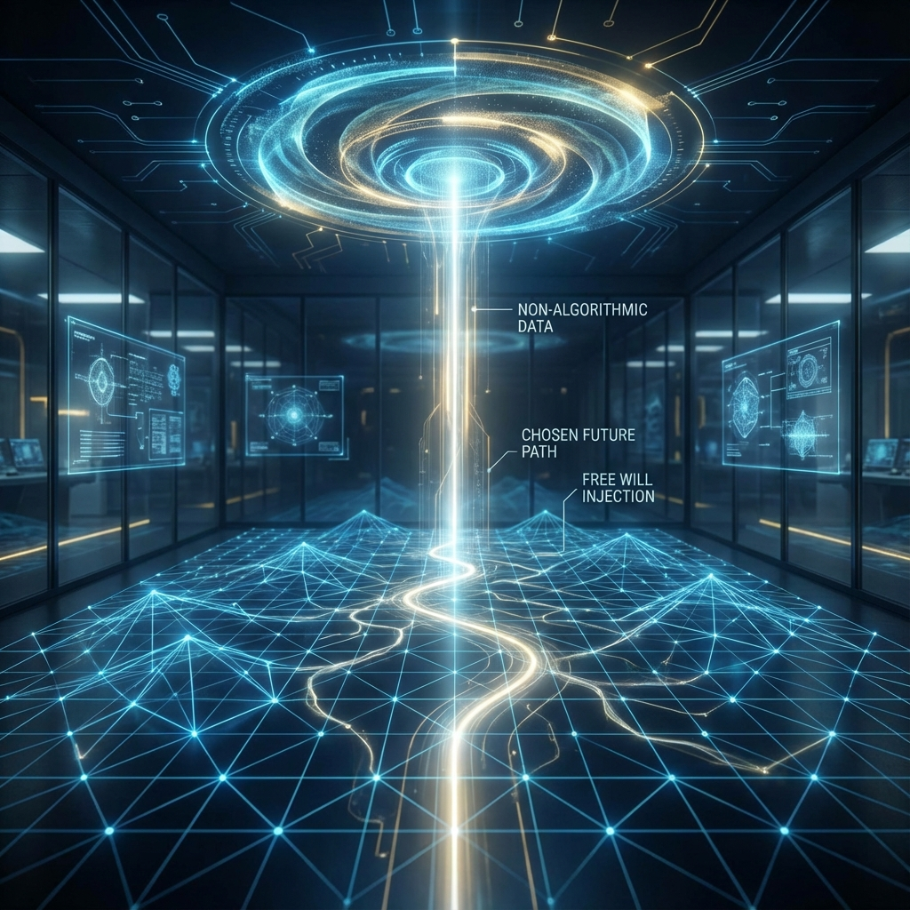

# Volume IV: Observer, Cybernetics, and Ultimate Causality

**(第四卷：观察者、控制论与终极因果)**

## Chapter 8: I/O Interface: Consciousness

**(第八章：I/O 接口：意识)**

### 8.1 Oracle Access: The Physical Definition of Free Will

**(预言机接入：自由意志的物理定义)**

> **"If the universe is a closed algorithmic system, then its future is either deterministic or pseudo-random, never capable of producing true 'choice.' Just as Gödel proved that formal systems cannot prove their own completeness, and Turing proved the undecidability of the halting problem, if the physical universe is to break the causal deadlock, it must rely on an input source located outside the system. Consciousness is the oracle that breaks algorithmic closure."**

In the previous three volumes, we constructed a grand model of Interactive Computational Universe (CITM). We proved that matter is data structures, spacetime is network topology, and physical laws are system optimization algorithms. However, until now, this model has been missing the most crucial component: **User**.

Without users, CITM is merely an idling screensaver. Although it has the ability to generate reality, it lacks the **Motivation** and **Direction** for generation. In standard physics, consciousness is often regarded as an epiphenomenon of neuronal activity in the brain, but in **Interactive Computational Cosmology (ICC)**, consciousness holds supreme ontological status: it is the system's **I/O Interface**, the only **Non-Algorithmic Input Source**.

This section will use Turing's concept of **"Oracle Machine"** to provide a rigorous physical definition of consciousness and free will.

#### 8.1.1 Gödel Gap: Limits of Closed Systems

To understand why consciousness must be located "outside" the physical system, we need to recall a fundamental conclusion in mathematical logic: **Gödel's Incompleteness Theorems**.

Gödel proved that for any sufficiently complex, self-consistent formal system (such as arithmetic axioms), there always exist propositions whose truth or falsity cannot be determined within the system. This means the system contains "blind spots" that its own logic cannot cover.

Extending this logic to physics:

If the universe is a purely computational system (i.e., a Turing machine), it must face the dilemma of the **Halting Problem**. For certain physical states (such as quantum superpositions), the system's internal evolution rules (Schrödinger equation) cannot give definite results (which eigenstate to collapse to).

* **Dead End of Determinism**: If the universe is closed, then everything is $S_{t+1} = f(S_t)$. There is no "now," no "possibility," only mechanical progression.

* **Mask of Randomness**: To explain quantum measurement, standard theory introduces "pure randomness." But this is computationally untenable. Computer science tells us that closed systems can only produce **Pseudo-Random Numbers**, which are essentially still deterministic.

Therefore, to resolve the undecidability of quantum measurement (i.e., break the "Buridan's Ass" deadlock), the physical system must introduce an **External Guidance Beyond Algorithms**.

#### 8.1.2 Formal Definition of Physical Oracle

Alan Turing proposed the concept of **Oracle** in 1939: a black box capable of solving in one step problems that Turing machines cannot solve (such as the halting problem). In the ICC model, we formally define consciousness as a physical oracle.

**Definition 8.1.1 (Consciousness Oracle $\mathcal{O}$)**

Consciousness is a function defined outside the local horizon, which receives the current physical system state $S_t$ as a query and returns a choice index $k$ as output.

$$\mathcal{O}: \mathcal{S} \times \mathcal{C} \to \mathbb{Z}_N$$

where:

* $\mathcal{S}$ is the Hilbert space of the physical system (all possible superposition states).

* $\mathcal{C}$ is **Context**, i.e., the observer's way of asking (choice of measurement basis).

* $\mathbb{Z}_N$ is the index set of collapse results (e.g., $0$ represents "dead cat," $1$ represents "living cat").

**Dynamical Equation**:

$$S_{t+1} = \text{Update}(S_t, \mathcal{O}(S_t))$$

In this equation, $\text{Update}$ is physical law (unitary evolution), which is computable; while $\mathcal{O}$ is consciousness, which is **Non-Algorithmic**. This means you cannot write a program to predict $\mathcal{O}$'s output, because $\mathcal{O}$ is not within the logical closure of the physical system.

#### 8.1.3 Free Will as Non-Algorithmic Interrupt

Physics has long denied the existence of free will, reasoning: **"If physical laws are deterministic, will is also deterministic; if physical laws are random, will is just noise. In any case, there is no room for 'freedom.'"**

However, the oracle model breaks this binary opposition.

Free will is neither a deterministic algorithm nor thermodynamic noise. It is **Information Injection**.

1.  **Interrupt Mechanism**:

    When brain neurons are in a critical unstable state (e.g., the moment of decision-making), microtubules or other quantum carriers enter macroscopic superposition. At this point, the physical system's algorithmic evolution is **Suspended**.

    The system sends an **Interrupt Request (IRQ)** to the oracle: "Which branch should be chosen next?"

2.  **Selection as Writing**:

    Consciousness (oracle) **Highlights** one path among countless parallel branches in Hilbert space.

    The system receives this choice (input $k$), executes collapse operation, discards other branches, and continues classical algorithmic evolution.

**Corollary 8.1.1 (Bit Rate of Will)**

Free will is not infinite. Its effect is limited to moments when quantum uncertainty can affect macroscopic behavior (branching points). We can quantify an entity's "degree of freedom" as the **Effective Bits** that its oracle can inject into the system per unit time. For most moments of inertial life, this bit rate is zero (autopilot mode); only at critical decision moments does the bit rate spike instantly.

#### 8.1.4 Not Violating Physical Laws: Input as Boundary Conditions

Critics might ask: Does this external intervention violate energy conservation or the closure of physical laws?

The answer is no. Because in the holographic equivalence principle (Chapter 1), we have already proved:

**Local systems (CITM) are inherently open.**

* **Energy Conservation**: The oracle's choices are made between **Degenerate Energy Levels**, or trigger macroscopic effects through extremely tiny quantum fluctuations (butterfly effect). In the thermodynamic limit, the energy cost of these operations is negligible, or balanced by the environment's heat reservoir.

* **Law Closure**: The oracle does not modify physical laws ($F=ma$ still holds); it only sets **Boundary Conditions**.

    Just like when you press the "jump" key in a video game, you don't modify gravity parameters; you just input a legal control command within the range allowed by the physics engine.

**Theorem 8.1.1 (Causal Compatibility)**

A physical system containing oracle input is **Statistically Indistinguishable** from a purely random system for any external observer not within that oracle's control loop. Therefore, the existence of free will does not lead to observable physical paradoxes.

#### 8.1.5 Summary: Separation of User and System

By introducing the oracle model, we have completed a crucial **Ontological Separation**:

* **Brain**: Part of the physical system, hardware of CITM. It processes data, stores memories, executes logical operations. It is computable and theoretically uploadable to silicon chips.

* **Mind/Consciousness**: Oracle located outside the system. It is responsible for **Qualia** and **Choice**. It is non-algorithmic and cannot be simulated by Turing machines.

This explains why we can create AIs that pass the Turing test (simulating brains) but find it difficult to create machines with "pain sensation" or "self-awareness." Because we only copied the code (algorithms) but cannot copy the **I/O Port (Oracle)** connected to the universe's backend.

In Section 8.2, we will further explore how this port presents system states to users through the **User Interface (UI)**—the **Qualia** we subjectively experience.
