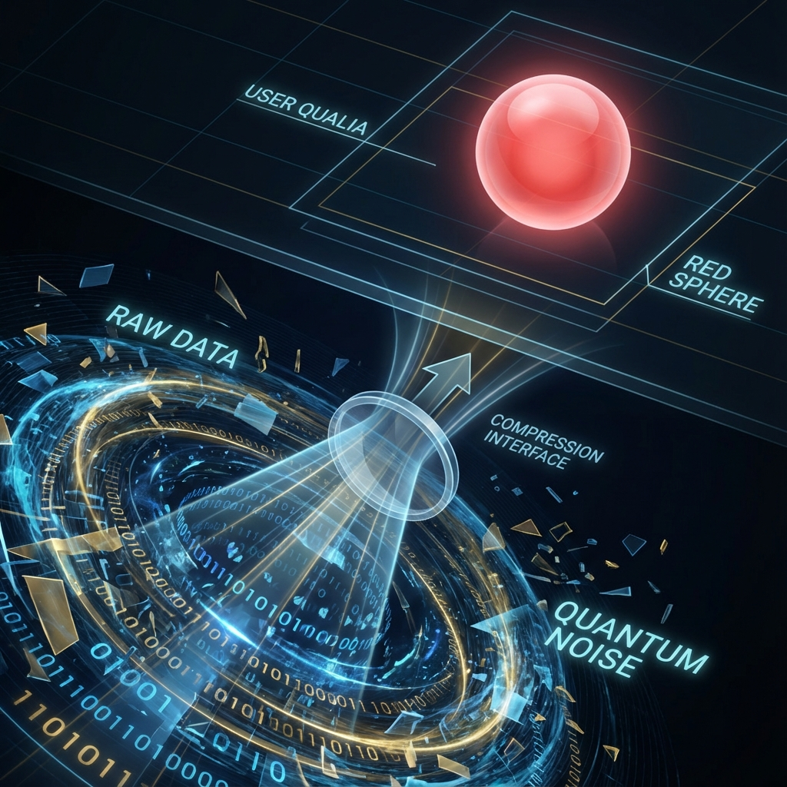

# Volume IV: Observer, Cybernetics, and Ultimate Causality

**(第四卷：观察者、控制论与终极因果)**

## Chapter 8: I/O Interface: Consciousness

**(第八章：I/O 接口：意识)**

### 8.2 User Interface (UI): Qualia

**(用户界面 (UI)：感受质)**

> **"Only for the code writer does 'red' mean electromagnetic waves of 700 nanometers wavelength; for the system user, 'red' is just a warning icon. Qualia are not some mysterious mental entities; they are the graphical user interface (GUI) rendered with extreme compression when the physical system presents current system states to the oracle (consciousness) located outside the horizon."**

In Section 8.1, we defined consciousness as an external I/O interface (oracle) connected to the physical universe. This raises an engineering question: What is the data transmission protocol of this interface?

The underlying state of the physical universe is extremely complex—containing positions, momenta, spins of $10^{23}$ atoms and complex quantum entanglement networks. If the system directly dumps these raw binary data to the oracle (user), the user would be instantly overwhelmed by information overload, unable to make any effective decisions.

Therefore, any efficient interactive system must contain a **Rendering Engine** responsible for converting underlying machine states into high-level representations understandable by users. In **Interactive Computational Cosmology (ICC)**, this high-level representation is **Qualia**—the "red vision," "rose fragrance," or "sharp toothache" we experience.

This section will argue that qualia are the **User Interface** generated by biological brains as computational hardware. They follow information-theoretic compression laws, aiming to provide controllers with maximally survival-relevant information at minimal bandwidth consumption.

#### 8.2.1 Isomorphic Mapping Between Physical Data and Subjective Experience

In philosophical philosophy of mind, David Chalmers proposed the famous **"Hard Problem"**: Why do physical processes (such as neuronal firing) accompany subjective experience? Why isn't it just unconscious information processing (like a zombie)?

In the ICC model, the answer to this question is functional: **Because the system needs to provide feedback to users.**

We establish the following mapping chain:

1.  **Physical Input**: Photons of 700nm wavelength hit the retina. This is **Raw Data**.

2.  **Neural Encoding**: Optic nerves produce pulse signals at 50 times per second. This is **Processed Data**.

3.  **Qualia Presentation**: "Red" experience appears in consciousness. This is **Display Data**.

**Definition 8.2.1 (Qualia Mapping)**

Qualia $\mathcal{Q}$ is a nonlinear projection function $P$ from high-dimensional physical state space $\mathcal{S}_{phys}$ to low-dimensional perceptual space $\mathcal{S}_{percept}$:

$$\mathcal{Q} = P(\mathcal{S}_{phys})$$

The design goal of this projection $P$ is not "truth," but **"Usability"**.

Just as the "trash can" icon on a computer desktop is not the actual hard disk sector, the "red" in our eyes is not the actual electromagnetic wave. It is a **Symbolic Tag** representing the class of physical properties "low-energy visible light." The system renders it as a unique texture so that users can instantly distinguish it from "green" (high-energy visible light).

#### 8.2.2 Weber-Fechner Law: Logarithmic Compression Algorithm

To prove that qualia are a data compression format, we can examine the **Weber-Fechner Law** in psychophysics. This law states that subjective sensation intensity $S$ has a logarithmic relationship with physical stimulus intensity $I$:

$$S = k \cdot \ln(I)$$

For example, to make someone feel the sound is twice as loud, the physical energy of the sound must increase tenfold (decibel scale).

**Computational Principle**:

In computer science, when we need to store data spanning multiple orders of magnitude (e.g., $1$ to $10^6$) with limited bits (e.g., 8-bit integers), standard practice is to use **Floating-Point Representation** or **Logarithmic Encoding**.

* If linear encoding is used, the perceptual system would lose precision at low intensities or overflow at high intensities.

* Using logarithmic encoding, the system can present signal changes through the **User Interface** with constant relative error across an extremely wide dynamic range.

Therefore, our senses are logarithmic because this is **the optimal encoding strategy for achieving maximum information entropy transmission under finite bandwidth constraints**. Qualia are system feedback after **Lossy Compression**.

#### 8.2.3 Pain as System Alert

Qualia not only transmit information but also **Value**. The most typical example is **Pain**.

In a purely algorithmic system, "negative feedback" caused by hardware damage is merely a numerical value (e.g., `health -= 10`). The machine can execute avoidance programs based on this value, but it doesn't need to "feel pain."

However, for an **Interactive System** connected to an external oracle, pain has special engineering significance: it is a **High-Priority System Interrupt**.

1.  **Forced Preemption**: When a finger touches flame, the system produces intense pain. This qualia has extremely strong **Unignorability**. It forcibly pulls the oracle's (consciousness) attention back from other tasks (such as thinking about philosophy) to focus on the current crisis.

2.  **Negative Reward Signal**: Pain directly acts on the oracle's decision weights, forcing users to strenuously avoid entering the state space that causes this qualia in future operations.

**Corollary 8.2.1 (Cybernetics Function of Qualia)**

Qualia are **Navigation Beacons** for the system to guide user behavior.

* **Pleasure**: Feedback of system state optimization (`System_Status = OK`), encouraging users to maintain current operations.

* **Suffering**: Feedback of system state deterioration (`System_Status = CRITICAL`), forcing users to change current operations.

Conscious experience is not an evolutionary byproduct; it is **Dashboard Readings** sent by biological machines to the driver.

#### 8.2.4 Interface Illusion Theory: We Want Icons, Not Code

Evolutionary psychologist Donald Hoffman proposed the **"Interface Theory of Perception"**, which completely aligns with the ICC model.

If we could directly perceive the truth of the world (quantum fields, wave functions, Hilbert space), we could not survive at all. Because that world's complexity is too high and irrelevant to our macroscopic survival.

* For survival, we need the system to **lie** to us.

* The system renders "rotting meat full of bacteria" as **"foul odor"**.

* The system renders "opposite sex suitable for reproduction" as **"beauty"**.

These experiences do not exist physically (molecules have no odor, photons have no beauty or ugliness); they are entirely products of **Client-Side Rendering**.

**Theorem 8.2.1 (Interface Closure)**

Users can only interact with the system through the interface (qualia) and cannot bypass the interface to directly operate underlying hardware (physical laws). This means our cognition of the world is forever limited to the **User Interface Layer**. The physics we study is essentially studying the **Icon Logic** of this desktop, not the underlying **Assembly Code**.

#### 8.2.5 Summary: Driver's Horizon

In summary, qualia are bridges connecting **Physical Machine (Brain)** and **Virtual Machine (Consciousness/Oracle)**.

* **Without Qualia**: The oracle would face a meaningless ocean of binary data, unable to make choices (free will fails).

* **With Qualia**: Data is structured into intuitive images, sounds, and emotions. The user (you) sits in the cockpit, sending control commands (free will) to the system through these dashboard readings, piloting this carbon-based biological machine through spacetime.

This mechanism is extremely efficient but also brings an inevitable consequence: **Immersion**. The interface design is so perfect that users often forget they are only operating an interface and mistakenly believe the interface itself is all of reality. This will be discussed in detail in the next section on "Permission Masking."
