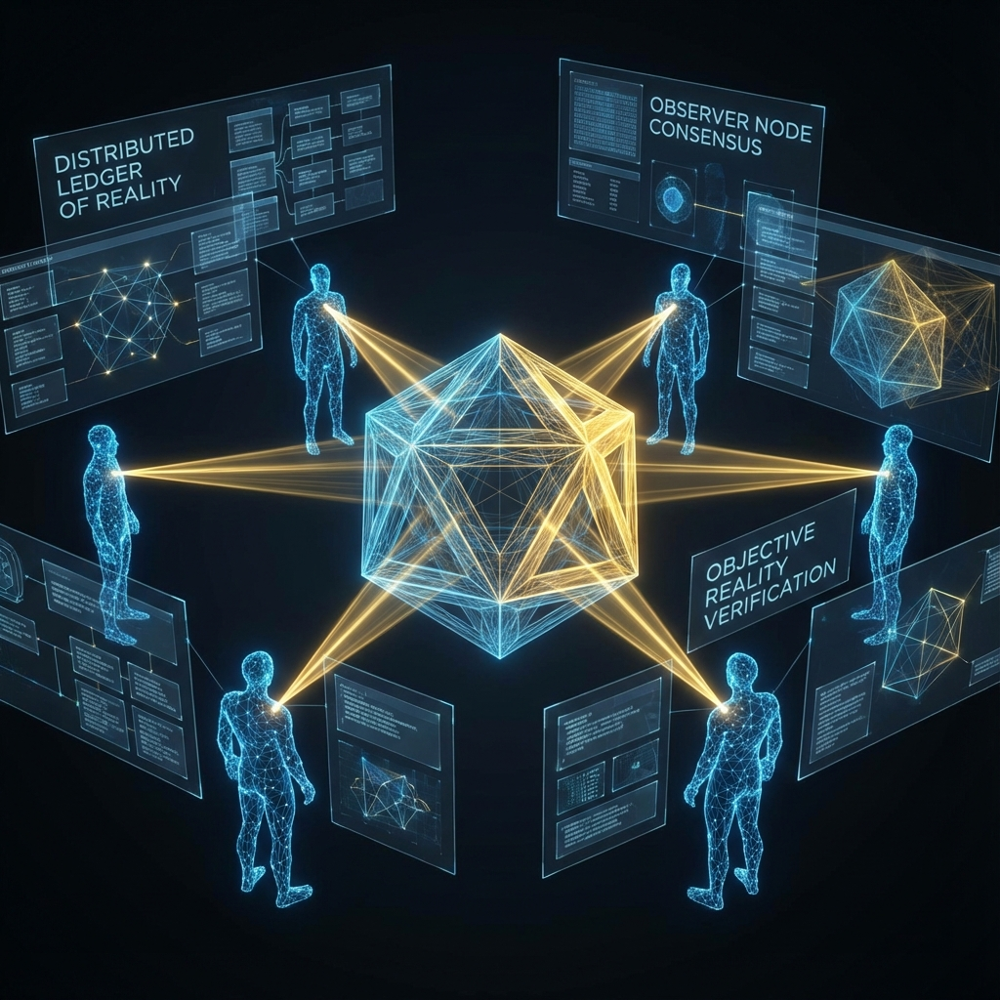

# 第四卷：观察者、控制论与终极因果

**(Volume IV: Observer, Cybernetics, and Ultimate Causality)**

## 第九章：多用户协议

**(Chapter 9: Multi-User Protocol)**

### 9.1 客观性的纳什均衡

**(Nash Equilibrium of Objectivity)**

> **"如果每个人都拥有一台独立的预言机（意识），如果每个观测者都能通过交互使波函数坍缩到不同的分支，那么为什么我们没有生活在各自为政的幻觉气泡中？为什么我的'红灯'也是你的'红灯'？客观现实并非某种绝对的真理，它是无数个交互式图灵机在贝肯斯坦赌局中达成的纳什均衡（Nash Equilibrium）。物理定律，就是这份巨大的分布式共识协议。"**

在前几章中，我们建立了基于单一观测者的 **交互式计算宇宙学（ICC）** 模型。我们证明了对于单个玩家（CITM），世界是按需生成的。然而，这一模型立即面临最严峻的挑战—— **唯我论（Solipsism）** 的陷阱。

如果世界是为你生成的，那么我是谁？我是真实的 NPC，还是另一个同样拥有预言机接口的玩家？如果我们都是拥有自由意志的玩家，当我们的意愿发生冲突时（我想让猫死，你想让猫活），系统该听谁的？

本章将把 ICC 模型从 **单机模式** 扩展到 **联机模式（Multiplayer Mode）**。我们将证明，所谓的"客观物理现实"，本质上是多智能体系统（Multi-Agent System）中的 **分布式状态同步（Distributed State Synchronization）** 机制。

#### 9.1.1 唯我论困境与多世界冲突

在标准量子力学中，维格纳的朋友（Wigner's Friend）悖论揭示了多观测者的矛盾：

* 朋友在实验室里测量自旋，看到确定的"向上"。

* 维格纳在实验室外，认为朋友处于"向上"和"向下"的叠加态。

如果有 $N$ 个观测者，每个人都试图根据自己的预言机输入来"实例化"世界，系统就会面临 **状态分叉（State Forking）** 的风险。如果系统允许每个人拥有独立的现实，那么宇宙将分裂成互不相通的私有梦境，科学交流将变得不可能。

既然我们能够在一个共享的物理世界中对话、实验并达成一致，这说明宇宙操作系统运行着一套严格的 **共识协议（Consensus Protocol）**。

#### 9.1.2 共识几何：现实是投影的交集

在 ICC 模型中，我们定义"客观现实"如下：

**定义 9.1.1（客观现实）**

客观现实不是全域希尔伯特空间 $|\Psi\rangle$（那是上帝的视角），也不是单个观测者的私有历史 $H_i$（那是主观视角）。客观现实是所有局域观测者视界内信息的 **最大公约数（Greatest Common Divisor）** 或 **交集（Intersection）**。

$$R_{obj} = \bigcap_{i=1}^N \text{View}_i$$

想象一个巨大的多人在线游戏服务器。

* 玩家 A 在某个坐标看到了一棵树。

* 玩家 B 也在该坐标看到了一棵树。

* 系统为了节省资源，不会存储两棵树。系统在后台数据库中只维护一个"树"的对象，并将该对象的引用（Reference）同时广播给 A 和 B。

因此，**物理空间是共识空间**。只有那些被多个观测者共同测量、共同锁定的状态，才具有"硬"的物理实在性。那些只存在于一个人脑海中的状态（如幻觉或私密思维），由于缺乏共识签名，被系统判定为"虚幻"。

#### 9.1.3 贝叶斯更新与波函数同步

这个共识是如何达成的？是通过 **贝叶斯推断（Bayesian Inference）**。

克里斯托弗·福克斯（Christopher Fuchs）的 **量子贝叶斯主义（QBism）** 认为，波函数不是客观实体，而是观测者对未来的 **信念度（Degree of Belief）**。

在多用户系统中，当两个观测者交换信息时，他们的信念度会发生 **同步（Synchronization）**。

**过程模拟**：

1.  **初始状态**：爱丽丝认为电子在 A 处，鲍勃认为电子在 B 处（信念冲突）。

2.  **交互**：鲍勃对爱丽丝喊道："我刚测量了，它在 B！"（信息交换）。

3.  **更新**：爱丽丝接收到这个比特流。如果她信任鲍勃（视其为可靠的测量仪），她会根据贝叶斯公式更新自己的先验概率：

    $$P(A|\text{Bob says B}) \to 0, \quad P(B|\text{Bob says B}) \to 1$$

4.  **共识**：现在，两人的波函数都坍缩到了 B。现实合并了。

**定理 9.1.1（共识收敛定理）**

在一个连接度足够高的观测者网络中，只要观测者遵循贝叶斯理性的更新规则，他们的局域波函数将以指数速度收敛于一个 **全局一致的经典状态**。这个收敛后的状态，就是我们所说的"客观事实"。

#### 9.1.4 纳什均衡：物理定律的稳定性

为什么这个共识总是收敛到特定的物理定律（如 $F=ma$）上，而不是收敛到魔法或混乱上？

这可以用博弈论中的 **纳什均衡（Nash Equilibrium）** 来解释。

将宇宙看作一个 **预测游戏（Prediction Game）**。

* 每个观测者（玩家）的目标是：最小化自己对未来的 **预测误差（Prediction Error）**（即自由能原理）。

* 策略：玩家构建内部模型（物理定律）来拟合感官输入。

如果每个人都遵循一套随意的规则，预测误差会很大。

唯有当所有人都同意一套 **自洽的、稳定的、普适的** 规则（标准模型）时，整个系统的总预测误差（信息熵）才达到极小值。

**推论 9.1.1（物理定律即稳态策略）**

牛顿定律或量子力学，不是刻在石头上的神谕，而是多智能体系统中 **进化稳定策略（Evolutionarily Stable Strategy, ESS）**。

* 如果我扔石头，石头往下掉；你也看到石头往下掉。这个"重力向下"的模型不仅解释了我的数据，也解释了你的数据，且不会在交互中产生矛盾。

* 这种模型具有 **鲁棒性（Robustness）**，因此被系统保留并固化为"定律"。

#### 9.1.5 分布式账本 (The Distributed Ledger)

在计算机工程层面，这一共识机制等同于 **区块链技术** 中的 **分布式账本**。

1.  **区块（Block）**：每一个普朗克时间步发生的物理事件（坍缩）。

2.  **哈希链（Hash Chain）**：因果关系。现在的状态必须包含过去状态的加密签名，确保历史不可篡改。

3.  **共识机制（Consensus Mechanism）**：

    * **工作量证明（PoW）**：对于宏观物体，改变其状态需要消耗大量能量（做功）。这防止了单个观测者随意用意念修改现实。

    * **广播（Broadcast）**：光速 $c$ 是账本同步的最大网络延迟。任何事件一旦发生，其影响会以光速向全宇宙广播。一旦该信息被足够多的节点（环境粒子）记录，该区块就被 **确认（Confirmed）**，成为了不可逆转的客观历史。

**结论**：

我们并不孤单。我们的意识通过物理交互网络紧密相连。所谓的"客观世界"，就是我们所有生命体（以及观测仪器）共同维护的 **一份巨大的、去中心化的、防篡改的共享文档**。我们既是这个文档的读者，也是它的联合作者。
