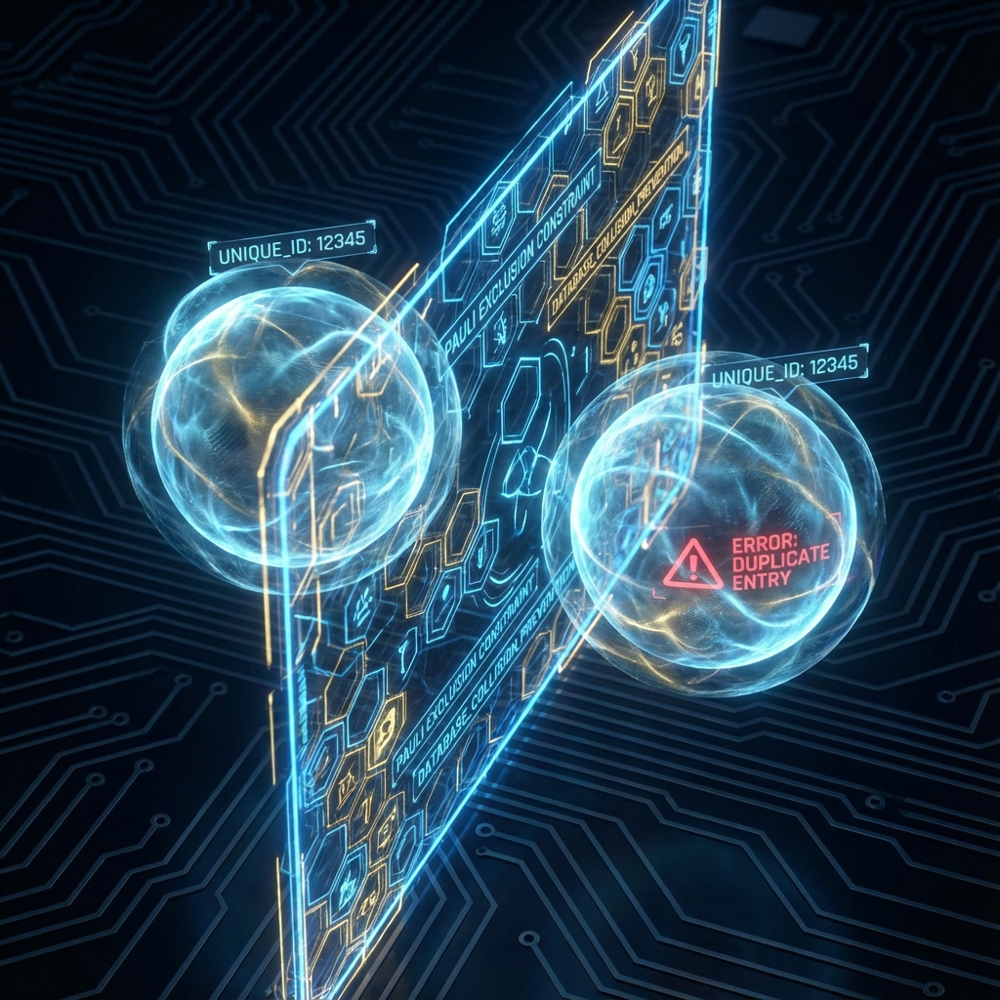

# 第四卷：观察者、控制论与终极因果

**(Volume IV: Observer, Cybernetics, and Ultimate Causality)**

## 第九章：多用户协议

**(Chapter 9: Multi-User Protocol)**

### 9.2 防冲突机制：泡利不相容原理的信息论解释

**(Mechanism Against Conflict: Pauli Exclusion Principle as Information-Theoretic Constraint)**

> **"为什么物质是硬的？为什么我们不能穿墙而过？这并非主要源于电磁力的排斥，而是源于更底层的逻辑约束。在交互式计算宇宙中，费米子（物质粒子）被定义为拥有'唯一标识符'（Unique ID）的持久化对象。泡利不相容原理，就是系统数据库为了防止'主键冲突'（Primary Key Collision）而强制执行的防穿模算法。"**

在 9.1 节中，我们确立了多用户共识协议，解释了为什么多个观测者能看到同一个世界。这就引出了一个新的工程挑战：在一个共享的虚拟环境中，如果两个玩家（或两个粒子）试图占据完全相同的时空坐标和量子状态，系统该如何处理？

在经典波动力学中，波是可以叠加的（线性性）。但在我们感知的宏观现实中，物质具有 **不可入性（Impenetrability）** ——你不能坐在已经被别人占据的椅子上。这种"硬度"的物理根源是 **泡利不相容原理（Pauli Exclusion Principle）**。

本节将证明，泡利不相容原理并非一种神秘的量子力，而是多智能体计算系统中的 **唯一性约束（Unique Constraint）** 协议。它区分了 **消息（玻色子）** 与 **实体（费米子）**，从而保障了复杂物质结构的存在。

#### 9.2.1 消息与对象的类型区分

**(Type Distinction: Messages vs. Objects)**

在计算机科学中，我们区分两种基本的数据交互模式：

1.  **广播/消息（Broadcast/Message）**：多个接收者可以接收同一条消息；多条波形可以在光纤中叠加传输。数据是 **非独占的（Non-exclusive）**。

2.  **对象/资源（Object/Resource）**：一个内存地址在同一时刻只能存储一个变量；一个数据库记录必须有唯一的主键。数据是 **独占的（Exclusive）**。

在物理学中，这精确对应了两类基本粒子：

* **玻色子（Bosons，如光子）**：遵循玻色-爱因斯坦统计。

    * **特性**：允许多个粒子处于同一量子态 $|n\rangle$。

    * **计算定义**：玻色子是系统的 **消息包（Packets）**。它们负责在对象之间传递相互作用（力），因此必须支持叠加和广播（如激光）。它们没有个体身份，只是能量的载体。

* **费米子（Fermions，如电子、质子）**：遵循费米-狄拉克统计。

    * **特性**：任意两个费米子不能处于完全相同的量子态。

    * **计算定义**：费米子是系统的 **持久化对象（Persistent Objects）**。它们构成了物质的骨架。为了保证逻辑的一致性，系统赋予了它们 **个体身份（Identity）**，禁止数据重叠。

#### 9.2.2 反对称波函数作为哈希碰撞检测

**(Antisymmetric Wavefunction as Hash Collision Detection)**

泡利原理的数学表述在于全同费米子系统的波函数必须是 **反对称的（Antisymmetric）**。

对于两个费米子 $1$ 和 $2$，交换它们的位置，波函数的符号必须翻转：

$$\Psi(x_1, x_2) = -\Psi(x_2, x_1)$$

如果这两个粒子试图占据完全相同的状态（即 $x_1 = x_2$），则必须满足：

$$\Psi(x_1, x_1) = -\Psi(x_1, x_1)$$

唯一的解是：

$$\Psi(x_1, x_1) = 0$$

**计算诠释**：

波函数 $\Psi$ 代表了系统配置的 **合法性概率幅**。

* $\Psi = 0$ 意味着该配置的概率为零，即 **非法操作（Illegal Operation）**。

* 反对称性实际上是一个底层的 **哈希校验算法（Hash Check Algorithm）**。系统时刻监控着所有费米子对象的"状态指纹"（量子数 $n, l, m, s$）。

* 当系统检测到两个对象的指纹完全一致时，校验函数返回 $0$（空指针），阻止该状态被实例化。这就是物理学上的 **"交换斥力"**，它不需要交换任何介质粒子，纯粹源于逻辑上的不可能。

#### 9.2.3 电子壳层：内存地址分配表

**(Electron Shells: Memory Address Allocation Table)**

如果不存在泡利不相容原理，原子中的所有电子都会跌落到能量最低的基态（$n=1$ 轨道）。若是那样，所有原子的化学性质将变得一模一样，化学键无法形成，复杂的生命和宇宙将不复存在。

正是由于唯一性约束，电子被迫进行 **堆叠（Stacking）**：

* 第 1 个电子占据 $1s$ 轨道（地址 `0x001`）。

* 第 2 个电子试图进入 $1s$，但被系统拒绝（`Error: Address Occupied`），被迫占据 $2s$ 轨道（地址 `0x002`）。

* 以此类推，构建出了复杂的电子壳层结构。

**定理 9.2.1（结构涌现定理）**

物质的宏观体积和化学多样性，是系统在 **唯一性约束** 下进行 **顺序内存分配（Sequential Memory Allocation）** 的直接结果。元素周期表本质上是宇宙内存管理单元（MMU）的 **地址映射表（Address Map）**。

#### 9.2.4 简并压：逻辑错误的物理表现

**(Degeneracy Pressure: Physical Manifestation of Logical Errors)**

当引力（系统负载均衡机制，见 5.1 节）试图将恒星物质压缩到极致时，会遇到一种强大的反抗力—— **简并压（Degeneracy Pressure）**。白矮星靠电子简并压支撑，中子星靠中子简并压支撑。

这种压力非常奇特，它与温度无关。即使在绝对零度，它依然存在。

在 **交互式计算宇宙学（ICC）** 中，简并压是 **逻辑错误抛出（Logical Exception Throwing）** 的宏观表现。

* **压缩**：引力试图将更多的费米子塞入更小的相空间体积（减少 $x$ 的不确定性）。

* **冲突**：根据海森堡带宽定理（6.1 节），$\Delta x$ 减小导致 $\Delta p$ 增大。费米子为了避免状态重叠（保持 $\Delta x \Delta p$ 的相空间单元格唯一），被迫占据更高的动量态。

* **反抗**：这种被迫的高动量表现为向外的压力。

这就好比在一个只有 100 个座位的剧场里，试图塞进 101 个人。无论你怎么用力推，第 101 个人都进不去。这种"进不去"的阻力，不是因为座位表面有斥力，而是因为 **票务系统（泡利原理）** 拒绝出票。

**推论 9.2.1（接触的本质）**

当你用手拍桌子时，你感觉到的"坚硬"，90% 以上源于电子的简并压（泡利斥力），而非电磁斥力。你实际上是在触摸 **宇宙代码中的 `Unique Constraint` 边界**。你的手无法穿过桌子，是因为系统禁止两个对象的坐标数据发生重叠（Clipping）。

#### 9.2.5 总结：多用户世界的基石

泡利不相容原理是 **多用户协议** 的核心组件。

* 如果没有它，所有的物质都会坍缩成一个无差别的玻色-爱因斯坦凝聚体（BEC），世界将变成这一团单一的波函数。

* 有了它，每个费米子都必须保持其 **个体独立性**。

这为"多用户"提供了物理基础：正是因为费米子不能重叠，我们才能拥有 **独立的身体**，大脑才能拥有 **独立的神经结构**。我们不仅在意识（软件）上是独立的预言机，在物质（硬件）上也是互斥的持久化对象。泡利原理，就是那个让我们"在这个世界上占有一席之地"的底层法则。
