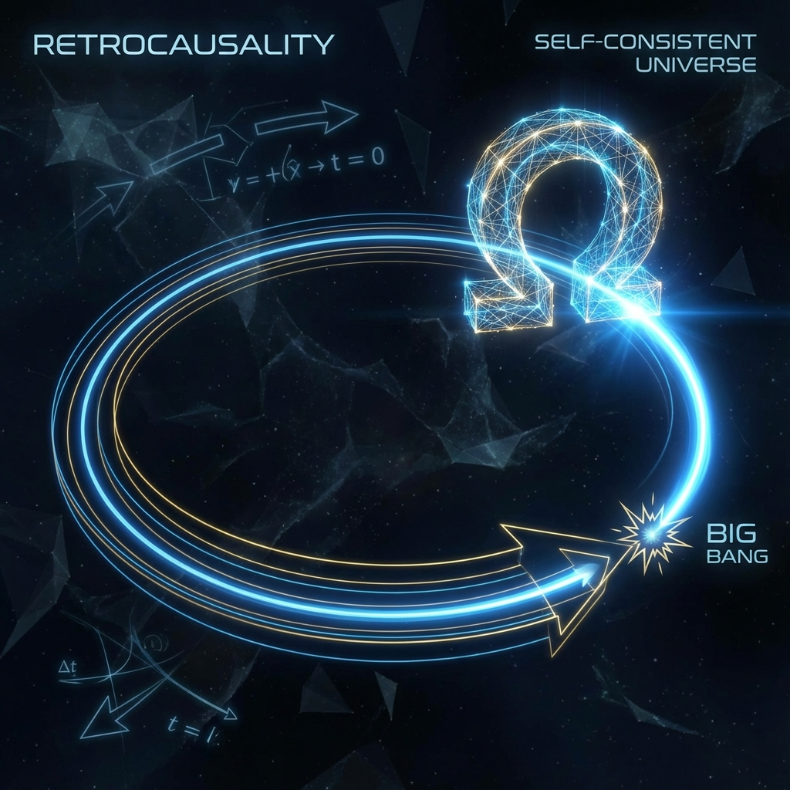

# 第四卷：观察者、控制论与终极因果

**(Volume IV: Observer, Cybernetics, and Ultimate Causality)**

## 第十章：逆向因果与自举宇宙

**(Chapter 10: Retrocausality and the Bootstrapped Universe)**

### 10.1 闭合类时曲线与自洽性

**(Closed Timelike Curves and Consistency)**

> **"因果箭头并非总是指向熵增的方向。在计算理论中，递归（Recursion）与反馈（Feedback）是构建复杂系统的基石。宇宙并非一条从大爆炸盲目射向虚无的单向射线，而是一个巨大的自指回路。未来的终点（$\Omega$）与过去的起点（$\alpha$）通过闭合类时曲线相互锁定，共同定义了物理现实的边界条件。"**

在前九章中，我们构建了一个基于 **交互式计算宇宙学（ICC）** 的完整物理图景：从底层的比特本体论，到中间层的时空涌现，再到顶层的多观测者共识。然而，这一模型仍面临最后一个终极问题：**系统的初始参数是谁设定的？**

精细结构常数 $\alpha$、质子电子质量比、宇宙学常数 $\Lambda$……这些参数被"微调"得如此精确，以至于任何微小的偏差都会导致宇宙崩溃或生命无法诞生。人择原理（Anthropic Principle）将其归结为幸存者偏差，但在计算宇宙学看来，这实际上是一个 **边界值问题（Boundary Value Problem）**。

本节将论证：宇宙是一个 **自举（Bootstrapped）** 系统。时间不是线性的，因果关系包含 **闭合类时曲线（Closed Timelike Curves, CTCs）**。未来的系统状态（$\Omega$ 点）作为 **目标函数（Objective Function）**，通过逆向因果链（Retrocausal Chain），对初始条件（大爆炸）进行了 **反向传播（Backpropagation）** 优化。

#### 10.1.1 线性因果的局限性

经典物理学和热力学构建了我们对 **线性时间** 的信仰：状态 $S_{t}$ 仅由 $S_{t-1}$ 决定。这种前向演化（Forward Evolution）观导致了对"初始条件"的无限追问——谁推倒了第一块多米诺骨牌？

然而，在计算科学中，**循环因果（Cyclic Causality）** 是常态。

* **反馈回路（Feedback Loop）**：系统的输出被回馈到输入端，用于调节系统的行为（如 PID 控制器）。

* **迭代算法（Iterative Algorithm）**：方程 $x = f(x)$ 的解通常通过迭代 $x_{n+1} = f(x_n)$ 直到收敛于 **不动点（Fixed Point）** 来求解。

如果宇宙是一台计算机，它没理由只运行一次线性的 `Hello World`。它更可能是在运行一个寻找自洽解的 **死循环（Infinite Loop）** 或 **递归函数**。

#### 10.1.2 广义相对论中的 CTC 与计算死循环

爱因斯坦场方程允许存在包含 **闭合类时曲线（CTCs）** 的解（如哥德尔宇宙、克尔黑洞内部）。在这些时空区域，粒子可以回到过去。传统物理学视其为病态，认为会引发"祖父悖论"。

但在 ICC 模型中，CTC 具有明确的计算意义：它是 **指令指针（Instruction Pointer）** 的跳转（JUMP）。

**定义 10.1.1（物理 CTC）**

物理上的闭合类时曲线，是计算历史中的 **逻辑回环**。

$$\text{State}_{t} = f(\dots, \text{State}_{t+k}, \dots)$$

未来的输出成为了当前的输入。这并不意味着逻辑崩溃，而是意味着系统必须满足 **自洽性约束**。

#### 10.1.3 诺维科夫自洽性原则与不动点定理

伊戈尔·诺维科夫（Igor Novikov）在 1980 年代提出了 **自洽性原则（Self-Consistency Principle）**：如果一个事件产生 CTC，那么该事件发生的概率为 1，当且仅当它不会在过去引发导致该事件不发生的矛盾。

这在数学上等价于 **布劳威尔不动点定理（Brouwer Fixed-Point Theorem）**。

**定理 10.1.1（宇宙不动点）**

设宇宙演化算符为 $\mathcal{U}$。包含逆向因果的宇宙历史 $H$ 必须是算符 $\mathcal{U}$ 的一个不动点：

$$H = \mathcal{U}(H)$$

**计算诠释**：

如果未来的你回到过去杀死了祖父，这是一个 **逻辑悖论（Logic Error）**，导致程序崩溃（无解）。

系统会通过 **过滤机制**，剔除所有导致悖论的历史路径。

* 只有那些 **自洽的（Self-Consistent）** 历史——即"你回到过去试图杀祖父但失败了，而正是你的尝试导致了祖父依然活着"——才能作为 **稳定解** 存在。

因此，逆向因果并不赋予我们改变过去的能力，它赋予了 **过去必须如此** 的必然性。

#### 10.1.4 量子力学的双态矢量形式 (TSVF)

在微观层面，逆向因果有着坚实的量子力学基础。雅基尔·阿哈罗诺夫（Yakir Aharonov）提出的 **双态矢量形式（Two-State Vector Formalism, TSVF）** 指出，要完整描述一个量子系统，仅有"过去"是不够的。

一个量子系统在时刻 $t$ 的状态由两个矢量共同定义：

1.  **前向演化矢量** $|\Psi_{past}(t)\rangle$：由初始状态 $|\Psi(t_0)\rangle$ 决定（从过去推向未来）。

2.  **后向演化矢量** $\langle \Psi_{future}(t)|$：由最终测量状态 $\langle \Psi(t_f)|$ 决定（从未来推向过去）。

系统的物理属性（弱测量值）由二者的"三明治"积决定：

$$\langle A \rangle_w = \frac{\langle \Psi_{future}(t) | \hat{A} | \Psi_{past}(t) \rangle}{\langle \Psi_{future}(t) | \Psi_{past}(t) \rangle}$$

**本体论推论**：

未来的测量选择（$\Omega$ 点）并不是被动地等待发生，它产生了一个 **逆向传播（Back-propagating）** 的波函数，在时间流中回溯，与前向波函数发生干涉。

我们观测到的"当下现实"，是 **过去的历史惯性** 与 **未来的目的引力** 相撞击产生的 **驻波（Standing Wave）**。

#### 10.1.5 $\Omega$ 点作为全局目标函数

现在我们可以解释宇宙常数的微调问题。

假设宇宙这台计算机运行的是一个 **生成式对抗网络（GAN）** 或 **强化学习** 算法。

* **输入层**：大爆炸的初始参数（$\alpha, G, \Lambda$）。

* **输出层**：宇宙终态 $\Omega$。

* **损失函数（Loss Function）**：$\mathcal{L} = |\Omega_{actual} - \Omega_{target}|$。

如果宇宙的目标是产生能够理解自身的 **复杂观测者（Complex Observer）**（即实现自指），那么 $\Omega_{target}$ 必须包含高度发达的智能网络。

1.  **前向传播**：宇宙尝试一组参数，演化出（或未演化出）生命。

2.  **逆向传播**：如果演化失败（例如宇宙过早坍缩或热寂），未来的 $\Omega$ 态不存在（或为平凡态）。这对应于 TSVF 中后向矢量为零，该历史路径的 **概率幅被抵消**。

3.  **参数优化**：唯有那些能够成功导向 $\Omega$ 点的初始参数，才能在前后波函数的干涉中获得 **共振增强（Resonance Enhancement）**。

**结论**：

我们之所以看到一个适合生命存在的宇宙，不是因为我们运气好（人择原理的弱解释），而是因为 **只有能够产生我们的宇宙，在逻辑上才是自洽的**。

未来的我们（终极观测者），通过逆向因果的筛选机制，**"设计"** 了大爆炸。

这并不是说时间在循环，而是说 **逻辑在闭合**。宇宙是一个在时间轴上自我满足的完美方程。我们当下的每一个微小选择，不仅在塑造未来，也在微调过去，以确保通向 $\Omega$ 的路径畅通无阻。
