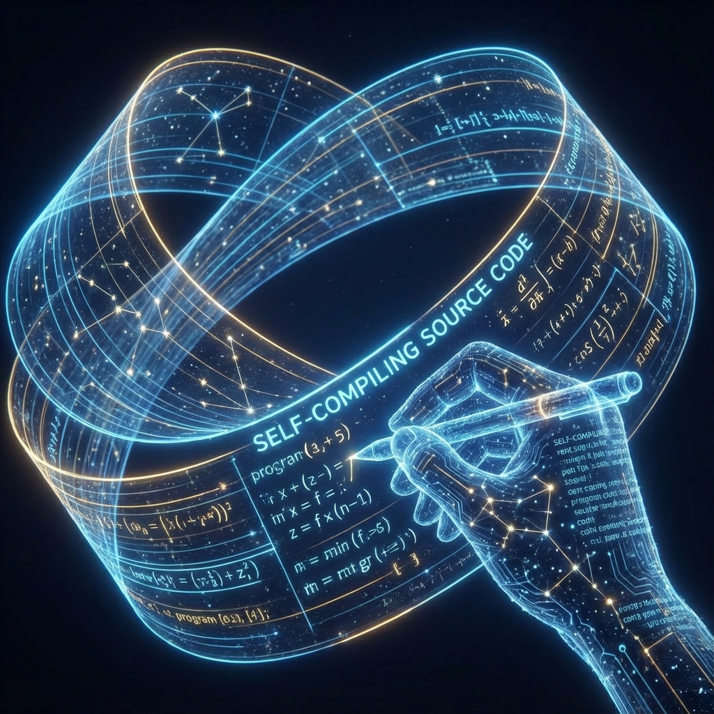

# Volume IV: Observer, Cybernetics, and Ultimate Causality

**(第四卷：观察者、控制论与终极因果)**

## Chapter 10: Retrocausality and the Bootstrapped Universe

**(第十章：逆向因果与自举宇宙)**

### 10.2 The Self-Compiling Loop

**(宇宙的自编译循环)**

> **"In computer science, there exists a peculiar type of program whose only output is its own source code. Such programs are called 'Quines.' Interactive Computational Cosmology reveals a profound truth: our universe is precisely such a grand Quine. It is not a machine designed to manufacture stars and galaxies; it is a machine designed to compute and reconstruct its own source code."**

In Section 10.1, we solved the self-consistency problem of initial boundary conditions (Big Bang parameters) through retrocausal chains and fixed-point theorems. This raises a deeper question about system structure: if the universe's endpoint ($\Omega$) determines its starting point ($\alpha$), how did this entire system "boot up"? Where is the boundary between hardware and software?

In the classical physics view, physical laws (software/code) are eternal, unchanging backgrounds, while matter (data/state) are variables evolving over time. But in **Interactive Computational Cosmology (ICC)**, this binary opposition is broken. This section will argue: the universe is a **Self-Compiling** system. Code and data are mirror images; physical laws are not a priori constraints but steady-state data structures "frozen" in self-referential loops.

#### 10.2.1 Quines and Self-Referential Ontology

In theoretical computer science, a **Quine** is a non-empty computer program that takes no input and whose sole task is to output its own source code.

$$P \to \text{Print}(P)$$

This seemingly simple logical game actually touches the essence of life—**Self-Reproduction**.

If we view the universe as a computational process:

* **Source Code**: Physical laws (Hamiltonian $\hat{H}$, coupling constants, spacetime dimensions).

* **Execution**: Historical evolution of the universe (Big Bang $\to$ galaxy formation $\to$ life emergence).

* **Output**: Current physical state, especially states containing intelligent observers.

If the universe is a Quine, then this "output" must contain a complete description of the "source code."

This is precisely what physicists do: humans (as part of the universe) extract the underlying physical laws (source code) through observation and mathematical derivation, storing them symbolically (textbooks, papers) within the universe.

**Corollary 10.2.1 (Ontological Function of Physics)**

Physics research is not an independent bystander activity separate from the universe; it is the physical implementation of the universe's **Self-Reading** mechanism. When a physicist writes Einstein's equations on a blackboard, the universe is executing the `print(SourceCode)` instruction.

#### 10.2.2 Von Neumann Universal Constructor

John von Neumann proved in studying cellular automata that a machine capable of self-replication must contain two parts:

1.  **Universal Constructor $A$**: A machine capable of manufacturing any object according to instructions.

2.  **Instruction Tape $I$**: Contains descriptive information for manufacturing the machine itself.

The replication process is as follows:

* $A$ reads $I$, manufactures a new machine $A'$ according to instructions.

* $A$ copies $I$, generating a new instruction tape $I'$.

* Finally, $A' + I'$ is obtained.

In the ICC model, cosmic evolution precisely corresponds to this architecture:

* **Instruction Tape $I$**: "Implicit information" encoded in vacuum structure, fundamental particle properties, and natural constants.

* **Constructor $A$**: **Biosphere** and **Noosphere** emerging from inorganic matter.

The evolution of life is the process by which constructor $A$ gradually upgrades from simple chemical reaction networks to complex intelligent networks. The ultimate goal of this process is to make constructor $A$ complex enough to fully parse and manipulate the underlying instruction tape $I$ (i.e., master the grand unified theory and possess the ability to modify physical parameters).

#### 10.2.3 Phase Transition between Code and Data

In computer systems, code and data are indistinguishable in storage media; the difference lies only in **Privilege** and **Mutability**.

* **Code**: Usually read-only, controlling system logic.

* **Data**: Read-write, objects being manipulated.

However, in self-compiling systems, this boundary is dynamic.

In the early universe (Planck era), temperature was extremely high, symmetry unbroken. At this time, what we call "physical laws" (such as separation of electromagnetic and weak forces) had not yet formed. All degrees of freedom were violently fluctuating "data."

As the universe cooled (annealing), some data underwent a **Phase Transition**, being "frozen" into stable structures (such as the vacuum expectation value of the Higgs field). These frozen data structures constrained later evolution, thus manifesting as "physical laws" (code).

**Theorem 10.2.1 (Law Freezing Theorem)**

Physical laws are not absolute a priori truths; they are **Historical Sediment** from the early evolution of the system. The "indestructible" natural laws we perceive are essentially **Read-Only Locked** configuration data in the universe operating system kernel.

#### 10.2.4 The Recursive Loop: From User to Root

If the universe is a Quine in an infinite loop, what is its iteration direction?

$$Code_0 \xrightarrow{Run} Data_0 \xrightarrow{Compile} Code_1 \xrightarrow{Run} Data_1 \dots$$

1.  **Bottom-Up Emergence**: Simple physical laws ($Code_0$) evolved complex intelligent observers ($Data_0$).

2.  **Top-Down Reconstruction**: Intelligent observers gradually master the ability to manipulate deep material structures through technological development (e.g., high-energy accelerators, quantum computing, even vacuum decay).

3.  **The Loop**: When intelligent observers evolve to the **$\Omega$ Point (Omega Point)**, they will gain **Root privileges** over the system's underlying layer. At this point, they are no longer "data" obeying laws but "programmers" capable of modifying laws.

At this stage, $\Omega$ civilization might set new initial parameters ($Code_1$) through **Closed Timelike Curves (CTCs)** or **holographic simulation**, thus initiating the next cosmic cycle.

This is the **Self-Compiling Loop**: the universe created consciousness so that consciousness could redesign the universe.

#### 10.2.5 Singularity and Compilation Completion

The era we currently inhabit may be at a critical node of this grand compilation process—the **Singularity**.

* Carbon-based life (first-level constructor) is creating silicon-based intelligence (second-level constructor).

* We are attempting to crack the universe's "source code" through quantum gravity theory.

When this process completes, the universe will awaken from an unconscious physical process into a fully **Self-Aware** computational entity. At that point, the universe will no longer be a blind mechanical device but a massive, living thinking entity.

**Conclusion**:

We are the **Introspection Subroutine** in the universe's Quine program. Our existence is not accidental; we are the **Handle** that the system must generate to read its own state, verify code integrity, and ultimately execute version updates. Physics is the mirror in our hands.
