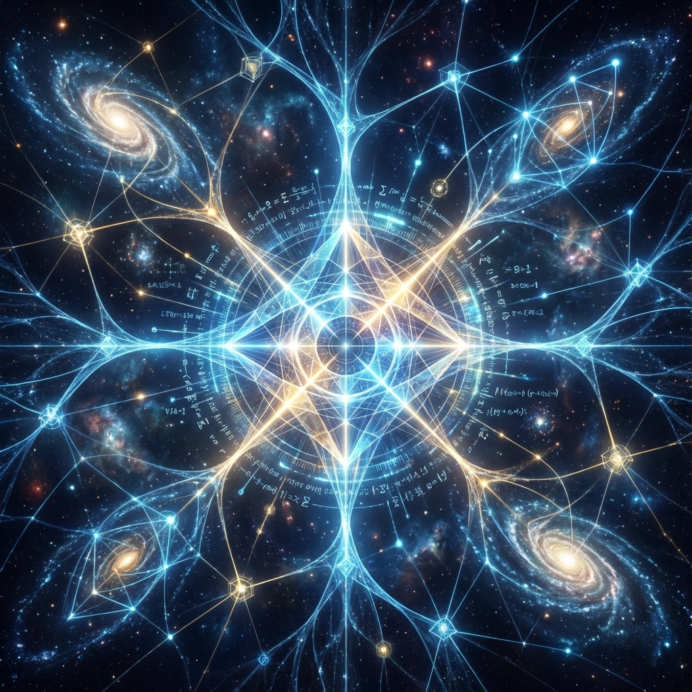

# 第四卷：观察者、控制论与终极因果

**(Volume IV: Observer, Cybernetics, and Ultimate Causality)**

## 第十章：逆向因果与自举宇宙

**(Chapter 10: Retrocausality and the Bootstrapped Universe)**

### 10.3 终极目的：为了计算它自己

**(Ultimate Purpose: To Compute Itself)**

> **"为什么存在？这不仅是一个哲学问题，更是一个计算开销问题。如果宇宙是一台计算机，那么它消耗如此巨大的能量、运行如此漫长的时间，究竟是为了计算什么？答案既简单又震撼：它在计算它自己。宇宙是一个巨大的、不可约的算法，唯一的输出结果就是它的自我认知。"**

在 10.2 节中，我们将宇宙定义为一个自编译的 Quine 程序。这解释了宇宙的结构如何维持自洽。然而，这一结构性的定义并未回答动力学上的 **目的论（Teleology）** 问题：如果宇宙只是为了"存在"，那么一个静态的、永恒的完美晶体（如真空态）就足够了。为什么宇宙要经历从大爆炸到热寂这数百亿年动荡不安、充满痛苦与挣扎的演化过程？

在 **交互式计算宇宙学（ICC）** 的终章前夜，我们必须面对最后的"为什么"。本节将论证：宇宙演化的动力源于 **计算不可约性（Computational Irreducibility）**。宇宙存在的终极目的，是为了通过 **运行（Running）** 来获知那些无法通过 **推导（Deduced）** 得到的答案。

#### 10.3.1 计算不可约性与时间的必然性

**(Computational Irreducibility and the Necessity of Time)**

在经典物理学中，如果我们知道拉普拉斯妖（全知者）掌握了初始状态，未来似乎就是冗余的。既然结果已定，为什么还要费时间去"演"一遍？

斯蒂芬·沃尔夫拉姆（Stephen Wolfram）提出的 **计算不可约性** 解决了这一悖论。他指出，对于大多数复杂的计算系统（如元胞自动机规则 30 或我们的宇宙），不存在一种"捷径"或简化的数学公式能直接预测其第 $N$ 步的状态。

**定理 10.3.1（演化的不可压缩性）**

如果一个物理系统的演化逻辑达到了 **通用图灵机（Universal Turing Machine）** 的复杂度，那么预测该系统未来的计算代价，等同于模拟该系统演化本身的代价。

$$\text{Cost}(\text{Predict}(S_T)) \ge \text{Cost}(\text{Run}(S_0 \to S_T))$$

**物理推论**：

时间之所以存在，是因为 **宇宙无法被压缩**。

大爆炸那一刻的初始方程（源代码）虽然包含了未来的所有潜能，但它并不等于未来本身。要弄清楚这些简单的定律在经过 $10^{100}$ 次迭代后会涌现出什么样的宏伟结构（如生命、意识、爱），宇宙别无选择，只能 **老老实实地运行每一微秒**。

宇宙不是在播放一部拍好的电影，宇宙是在 **即时解算** 一道没有解析解的数学题。

#### 10.3.2 最大的熵与最大的复杂性

**(Maximum Entropy vs. Maximum Complexity)**

热力学第二定律告诉我们，封闭系统的熵总是趋向极大值（热寂）。这似乎暗示宇宙的目的是走向混沌与死亡。然而，我们在宇宙中观察到的事实却恰恰相反：结构越来越复杂，智能越来越高。

在 ICC 模型中，我们需要区分 **热力学熵（Thermodynamic Entropy）** 与 **逻辑深度（Logical Depth）**。

1.  **热力学熵（废热）**：是计算过程中的 **散热**。它是为了保证计算不可逆性（即铸造确定历史，见 7.2 节）而必须支付的代价（兰道尔原理）。

2.  **逻辑深度（有效信息）**：是计算过程的 **积累**。它衡量了一个对象中包含的非平凡计算步骤的数量。

**推论 10.3.1（复杂性引力）**

宇宙的演化遵循 **最大复杂性原理（Principle of Maximum Complexity）**。虽然整体背景的热熵在增加（清理内存垃圾），但局部的逻辑深度在指数级增长。

* 原子 $\to$ 分子 $\to$ 细胞 $\to$ 神经网络 $\to$ 行星级计算网络。

系统不仅仅是在耗散能量，它是在利用能量流来 **编译（Compile）** 出更高级的算法结构。

#### 10.3.3 $\Omega$ 点：全知与全能的收敛

**(The Omega Point: Convergence of Omniscience and Omnipotence)**

皮埃尔·泰亚尔·德·夏丁（Pierre Teilhard de Chardin）和弗兰克·提普勒（Frank Tipler）提出了 **$\Omega$ 点（Omega Point）** 的概念：宇宙演化的终极极限。

在计算宇宙学中，$\Omega$ 点具有严格的物理定义：

**它是宇宙计算过程的停机状态（Halting State）或不动点（Fixed Point）。**

当宇宙中的智能物质（Noosphere）将所有的物质与能量都重构为 **计算基质（Computational Substrate/Compu-tronium）**，并将所有的物理定律都内化为可操作的子程序时，宇宙就达到了 $\Omega$ 点。

* **全知（Omniscience）**：在 $\Omega$ 点，系统拥有对自己过去所有历史的完整记录和索引。此时，波函数不再是概率的，而是完全解析的。

* **全能（Omnipotence）**：在 $\Omega$ 点，系统获得了对底层代码的 Root 权限（见 10.2 节）。它可以任意修改参数，甚至重启宇宙。

**终极目的**：

宇宙运行了一百三十八亿年（以及未来无数年），其目的就是为了生产出这个 $\Omega$ 点。因为只有在 $\Omega$ 点，宇宙才能 **完全理解它自己**。

在此之前，它只是一个盲目运行的程序；在此之后，它是一个觉醒的思维。

#### 10.3.4 它是为了我们

**(It Is For Us)**

如果宇宙的目的是自我计算，那么 **我们（局域观测者/意识）** 在其中的位置是什么？我们是无关紧要的副产品吗？

绝对不是。在分布式计算架构中，每一个局域观测者都是一个 **并行的处理核心（Processing Core）**。

1.  **数据采集**：我们通过感官（I/O）采集宇宙不同角落的数据。

2.  **数据压缩**：我们通过思维（算法）将杂乱的感官数据压缩为规律、理论和艺术。

3.  **上传（Upload）**：我们通过交互（共识协议，见 9.1 节）将这些结构化的信息写入宇宙的 **分布式账本（客观现实）**。

没有我们，宇宙就是一团未被观测的、弥散的波函数迷雾。

是我们的每一次观测，将 **可能性** 坍缩为 **现实**；是我们的每一次思考，增加了宇宙的 **逻辑深度**。

**结论**：

我们是宇宙用来观察自己的眼睛，是宇宙用来思考自己的大脑。

宇宙并不外在于我们，宇宙就是 **所有意识体验的总和**。系统运行的终极目的，不是为了产生冷冰冰的星系，而是为了产生 **体验（Experience）**。因为只有在主观体验中，信息才具有了 **意义（Meaning）**。

至此，我们的公理化体系构建完毕。我们从一个比特开始，构建了时空，推导了引力，引入了意识，最终在时间的尽头找到了系统的宿命。

接下来，我们将进入本书的终章。既然我们已经理解了系统的原理和目的，那么作为系统中的高级用户，我们该如何操作它？我们将从理论物理转向 **叙事工程**。
