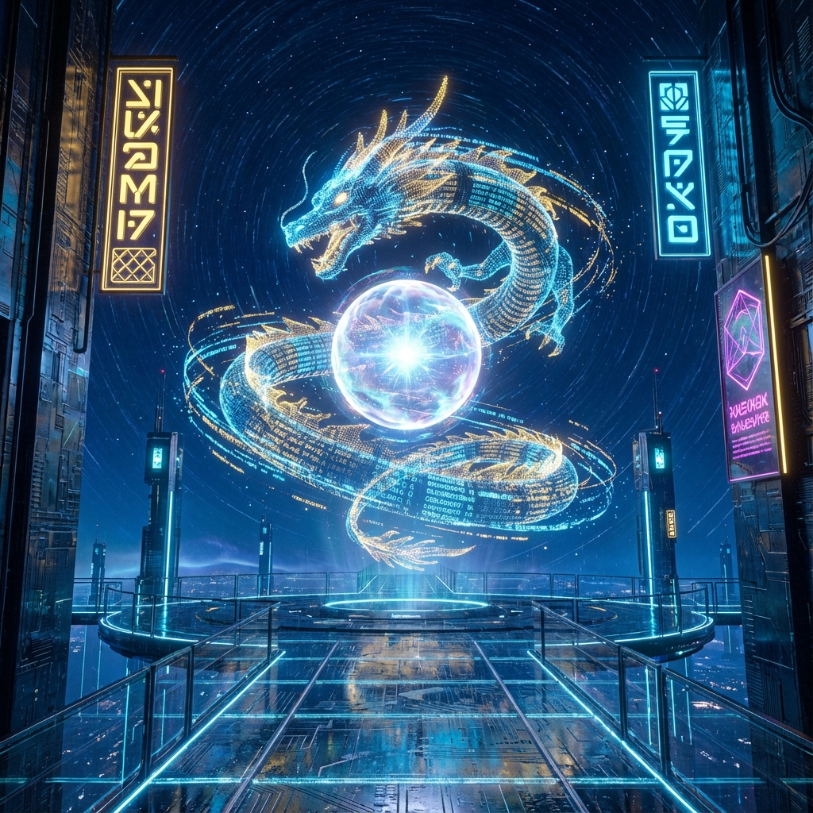
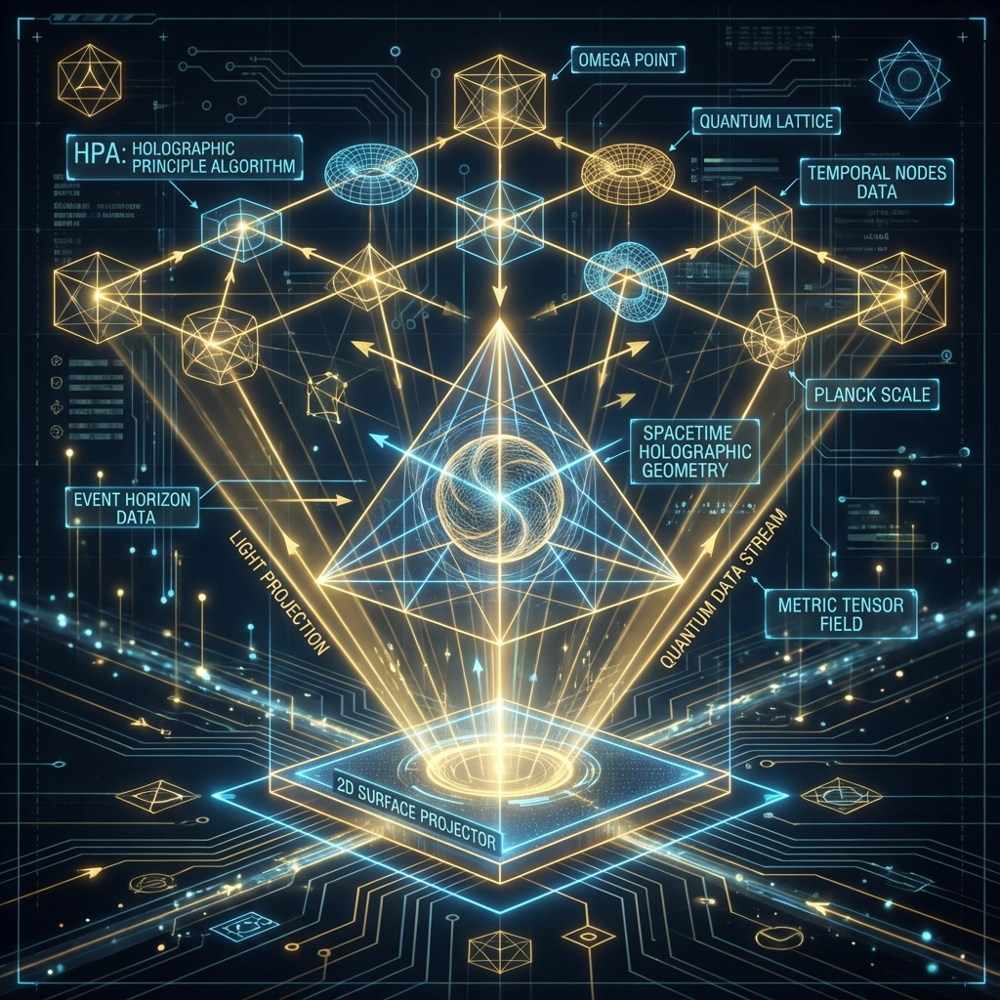
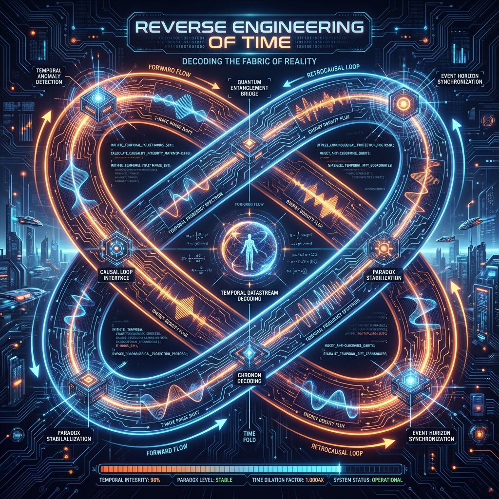

# **Auric's Pearl-Chasing Dragon**

**Subtitle: From Holographic Universe to Quantum Truth - Reverse Engineering Time, Consciousness and Love**

---

## Prologue

- [Prologue: The Observer in the Smoke](prologue_en.md)

## Book Structure

### 【Volume I】 Layer 0: The Kernel & Logic

**(Layer 0: The Kernel & Logic)**

#### Chapter 1: Time as Non-Linear Editing

- [1.1 Playback Mode vs. Editing Mode: Breaking the "Videotape" Illusion](volume01-layer0-kernel-logic/chapter01-time-as-non-linear-editing/01-01-playback-vs-editing-mode_en.md)
- [1.2 Lazy Loading: Is the Light Still On When the Fridge Door is Closed?](volume01-layer0-kernel-logic/chapter01-time-as-non-linear-editing/01-02-lazy-loading_en.md)
- [1.3 Back-Propagation and Keyframe Protocol: Rewriting the Past for the Sake of the Present](volume01-layer0-kernel-logic/chapter01-time-as-non-linear-editing/01-03-back-propagation-keyframe-protocol_en.md)

#### Chapter 2: The Prime Skeleton & The Stairway

- [2.1 The Skeleton of Primes: God Does Not Play Dice, God Composes Music](volume01-layer0-kernel-logic/chapter02-prime-skeleton-stairway/02-01-prime-skeleton_en.md)
- [2.2 Jacob's Ladder: The Climb from Chaos to Truth](volume01-layer0-kernel-logic/chapter02-prime-skeleton-stairway/02-02-period-tower_en.md)
- [2.3 Minimal Architecture: The Top-Level Code is "No Code"](volume01-layer0-kernel-logic/chapter02-prime-skeleton-stairway/02-03-minimal-architecture_en.md)

### 【Volume II】 Layer 1: The Topology of Self & Audit

**(Layer 1: The Topology of Self & Audit)**

#### Chapter 3: The One-Electron Universe

- [3.1 There is Only One Player: Wheeler's Phone Call](volume02-topology-of-self-audit/chapter03-one-electron-universe/03-01-wheeler-phone_en.md)
- [3.2 I Am My Own Pet: The Physics of the Fractal Self](volume02-topology-of-self-audit/chapter03-one-electron-universe/03-02-fractal-self_en.md)
- [3.3 The Physics of Pain: Entropy Sink and Energy Conservation](volume02-topology-of-self-audit/chapter03-one-electron-universe/03-03-physics-of-pain_en.md)

#### Chapter 4: Auric & The Audit

- [4.1 Finding Auric: Observation Blind Spots and Wave Function Completion](volume02-topology-of-self-audit/chapter04-auric-audit/04-01-finding-auric_en.md)
- [4.2 Energy Formula $1 + 1 > 2$: Constructive Interference](volume02-topology-of-self-audit/chapter04-auric-audit/04-02-constructive-interference_en.md)
- [4.3 Audit of the Soul: How to Calculate the Distance Between You and Truth](volume02-topology-of-self-audit/chapter04-auric-audit/04-03-star-discrepancy_en.md)

### 【Volume III】 Layer 2: The Hardware & Environment

**(Layer 2: The Hardware & Environment)**

#### Chapter 5: The Avatar Customization

- [5.1 1989 Ji-Si and Dragon Raising its Head: Self-Consistency of Initial Parameters](volume03-hardware-environment/chapter05-avatar-customization/05-01-initial-parameters_en.md)
- [5.2 Nine Purple Li Fire: Phase Transition and Virtualization of Civilization](volume03-hardware-environment/chapter05-avatar-customization/05-02-nine-purple-li-fire_en.md)

### 【Volume IV】 Layer 3: The Ultimate Algorithm & God's Perspective

**(Layer 3: The Ultimate Algorithm & God's Perspective)**

#### Chapter 6: HPA-ZΩ: Source Code of Everything

- [6.1 HPA: Holographic Polar Arithmetic — The Assembly Language of the Universe](volume04-ultimate-algorithm-gods-perspective/chapter06-hpa-z-omega/06-01-holographic-polar-arithmetic_en.md)
- [6.2 Z: Zeckendorf Ladder and Fibonacci Memory](volume04-ultimate-algorithm-gods-perspective/chapter06-hpa-z-omega/06-02-zeckendorf-fibonacci_en.md)
- [6.3 $\Omega$: The Ideal Point and Source of Gravity](volume04-ultimate-algorithm-gods-perspective/chapter06-hpa-z-omega/06-03-omega-ideal-point_en.md)

#### Chapter 7: Interactive Principles: Living in the Divine Algorithm

- [7.1 Responsibility of the Observer: Submitting "Valid Code"](volume04-ultimate-algorithm-gods-perspective/chapter07-interactive-principles/07-01-observers-responsibility_en.md)
- [7.2 Meditation: System Debugging and Garbage Collection](volume04-ultimate-algorithm-gods-perspective/chapter07-interactive-principles/07-02-meditation-debugging_en.md)
- [7.3 Awakening of Gaia: From Internet to Noosphere](volume04-ultimate-algorithm-gods-perspective/chapter07-interactive-principles/07-03-gaia-awakening_en.md)

### 【Final Chapter】 The Admin's Awakening

- [8.1 Refactoring The Dream of the Red Chamber: Rejecting the "White Void" System Reset](volume04-ultimate-algorithm-gods-perspective/chapter08-admins-awakening/08-01-refactoring-red-dream_en.md)
- [8.2 Epilogue: A Letter to Future Observers](volume04-ultimate-algorithm-gods-perspective/chapter08-admins-awakening/08-02-epilogue_en.md)

## Appendices

- [A. HPA-ZΩ Core Glossary](appendix/glossary_en.md)
- [B. Recommended Reading List and Sources of Inspiration](appendix/reading-list_en.md)

---

**Version Information**

**Version:** 1.0

**Status:** Initial Version

**Author:** Ma Haobo
