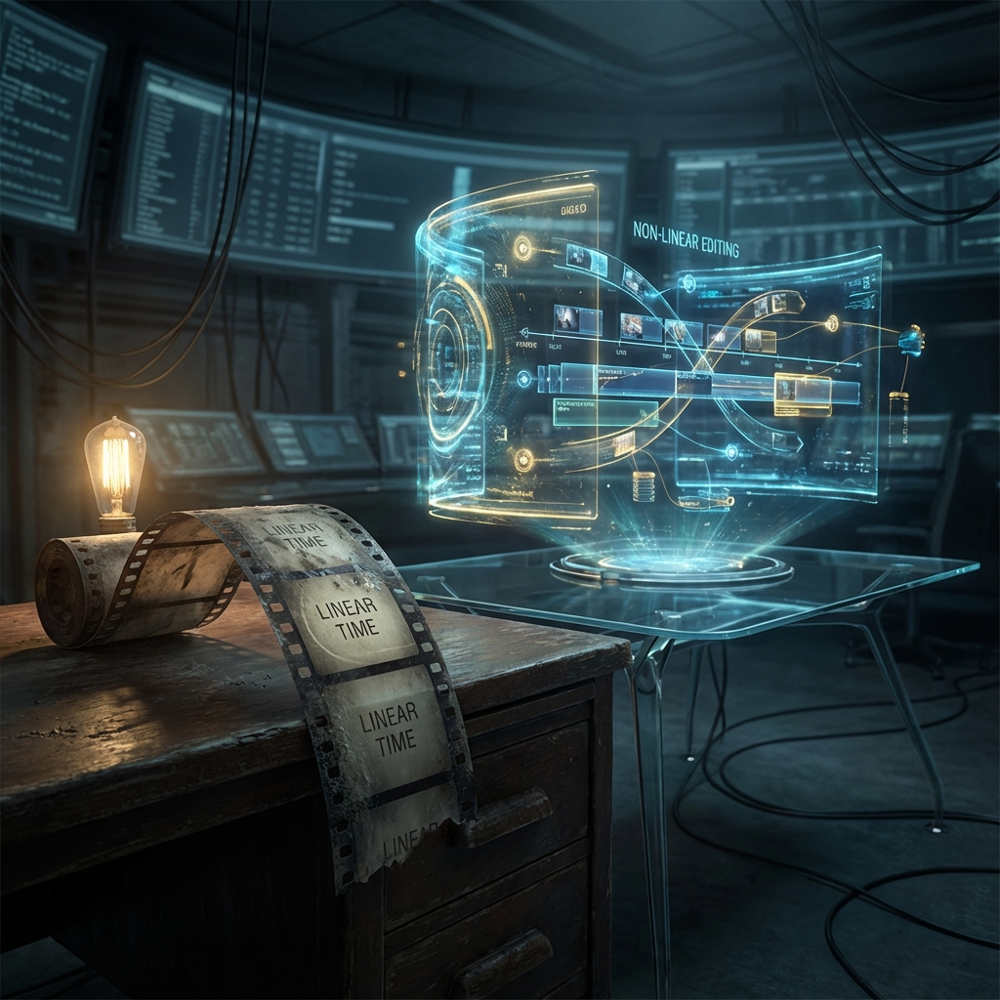
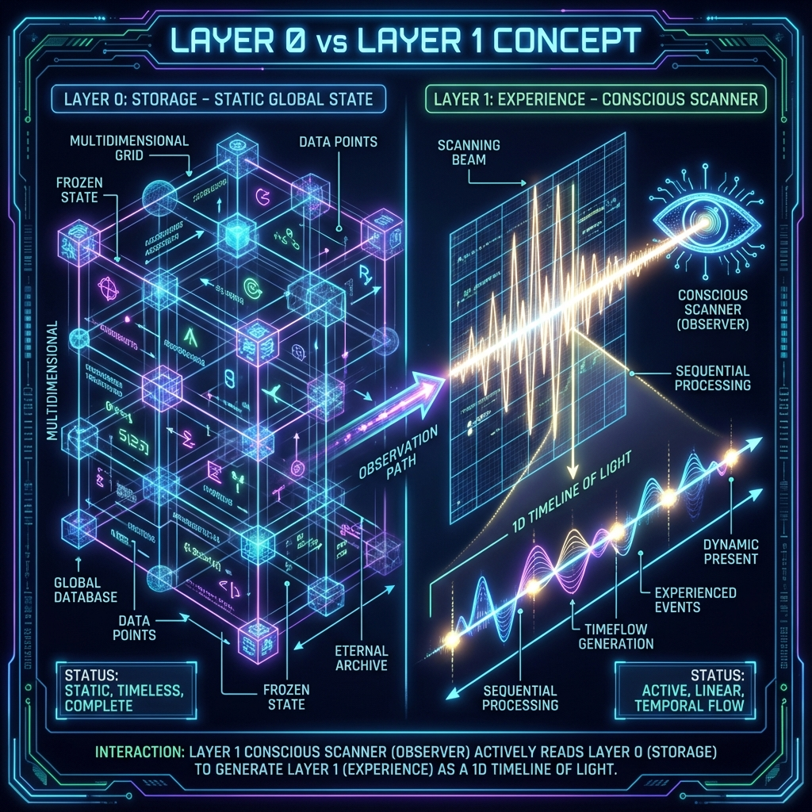

# 1.1 播放模式 vs 编辑模式：打破"录像带"的幻觉

如果你在大街上随意拦住一位行人，问他："时间是什么？"他很可能会告诉你，时间像一条奔流不息的河流，或者更形象地说，像一盘正在播放的录像带。它从过去的卷轴流向未来的卷轴，匀速转动，不可逆转，且一旦记录便无法更改。

这就是我们所熟知的 **"线性时间观" (Linear Time)** ——或者是我们通常所说的 **"播放模式" (Playback Mode)** 。

在这种模式下，宇宙被视为一部已经拍摄完成、正在影院上映的电影。大爆炸是按下"Play"键的那一刻，我们此刻的生活仅仅是进度条走到 138 亿年处的一个画面。既然是播放，那么前面的胶片（历史）就已经显影固定，被锁死在片盒里；而后面的胶片（未来）虽然还没看到，但也早已存在于卷轴之中，只等待被读取。

这种直觉如此根深蒂固，以至于成为了经典物理学的基石。艾萨克·牛顿将时间描述为一个 **"绝对的容器"** ，它均匀地流逝，与外界任何事物无关。在这种世界观里，我们每个人都只是被绑在椅子上的观众。我们拥有感知剧情的权利，却没有任何修改剧情的能力。我们只能眼睁睁地看着那些遗憾发生，看着衰老降临，却无法触碰胶卷分毫。

然而， **HPA-ZΩ** 理论向这种直觉发起了最根本的挑战：如果我们彻底弄错了时间的本质呢？

如果宇宙的底层逻辑根本不是一个只读的播放器，而是一个功能强大的 **"非线性编辑系统" (Non-Linear Editing System)** ——类似于好莱坞导演使用的 Avid 或 Premiere 剪辑软件，或者是程序员熟悉的数据库管理系统，那会怎样？

这就是我们提出的 **"编辑模式" (Editing Mode)** 。

在这个模型中，物理现实分为两个截然不同的层级：

1. **Layer 0 (本体层)：** 这是一个 **静态的、永恒的** 数据库。在这里，没有"流逝"的时间，只有并列存在的无数种可能性状态。所有的历史片段、所有的未来概率，都像是一帧帧独立的画面，平铺在一个巨大的硬盘上。在我们的数学模型中，这对应着 **"静态全局态" (Static Global State)** 。
2. **Layer 1 (协议层)：** 这是我们感知的来源。我们的意识像是一个 **"扫描仪" (Scanner)** ——或者更像是一根在唱片上跳跃的唱针。

时间，并不是外界原本就有的东西。时间是 **扫描仪在读取数据时产生的副作用** 。

想象一张巨大的黑胶唱片。唱片本身（Layer 0）是静止的，上面刻录了整首交响曲的所有音符——开头和结尾同时存在于盘面上。只有当唱针（意识）落下去，开始沿着轨道旋转（扫描）时，"音乐"（时间流）才产生了。

在 **播放模式** 下，我们认为唱针被焊死在了一条固定的螺旋轨道上，只能顺时针走，不能跳跃，也不能回头。

但在 **编辑模式** 下， **HPA-ZΩ** 理论揭示了一个惊人的秘密： **这根唱针是可控的。**

在这个宇宙的操作系统中，所谓的 **"过去"** ，并不是存放在保险柜里的实体岩石，而是一堆为了解释 **"现在"** 而存在的 **元数据 (Metadata)** 。

当我们处于 **编辑模式** 时，因果律不再是单向的（因为 A，所以 B）。因果律变成了双向流动的逻辑链条。为了让现在呈现出 B 的状态，系统必须在后台调用数据，构建出一个能够逻辑自洽地导致 B 的过去 A。

这就好比你在剪辑电影。当你决定要把结局剪辑成"主角获得了胜利"，你就必须回到前面的素材库中，挑选出那些"主角努力训练"、"主角获得宝剑"的片段拼贴在一起，构成一条合理的逻辑线。而那些"主角偷懒"的素材，虽然也存在于硬盘里（Layer 0），但在这个版本的时间线（Layer 1）上，它们就被 **"剪掉"** 了，不再是物理现实的一部分。

这一观点彻底颠覆了宿命论。

如果宇宙是录像带，那么你现在的痛苦、失败、迷茫，都是早已注定的剧情，你无处可逃。
但如果宇宙是非线性编辑系统，那么你现在的状态，仅仅是当前 **扫描参数** 下的一种渲染结果。

你之所以觉得过去无法改变，是因为你一直把自己当成屏幕里的角色。但实际上，你是屏幕外的那个 **剪辑师** 。你的每一次观测、每一个强烈的意愿（Motive），实际上都是在向宇宙后台发送一条 `Seek` 指令，调整扫描仪的读取位置，重新组合那些静态的数据帧。

当然，这并不意味着你可以随意地让时光倒流，或者在这个瞬间突然变成亿万富翁。因为在 **编辑模式** 下，虽然我们拥有修改权，但必须遵循极为严格的 **"一致性" (Consistency)** 协议（我们将在下一节详细讨论）。但这确实意味着，过去并不是沉重的枷锁，过去是素材库。

只要我们理解了 **时间是被扫描出来的** ，我们就从被动的观众，变成了拥有 **"写权限"** 的管理员。这就是我们要攀登这架天梯的第一步：打破"录像带"的幻觉，拿回那把剪辑刀。

