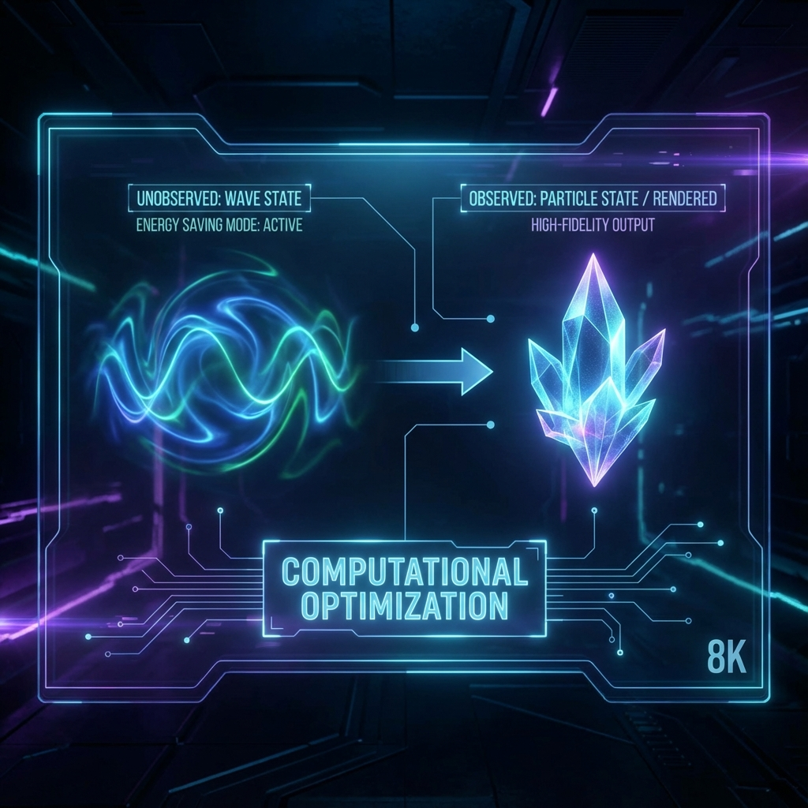
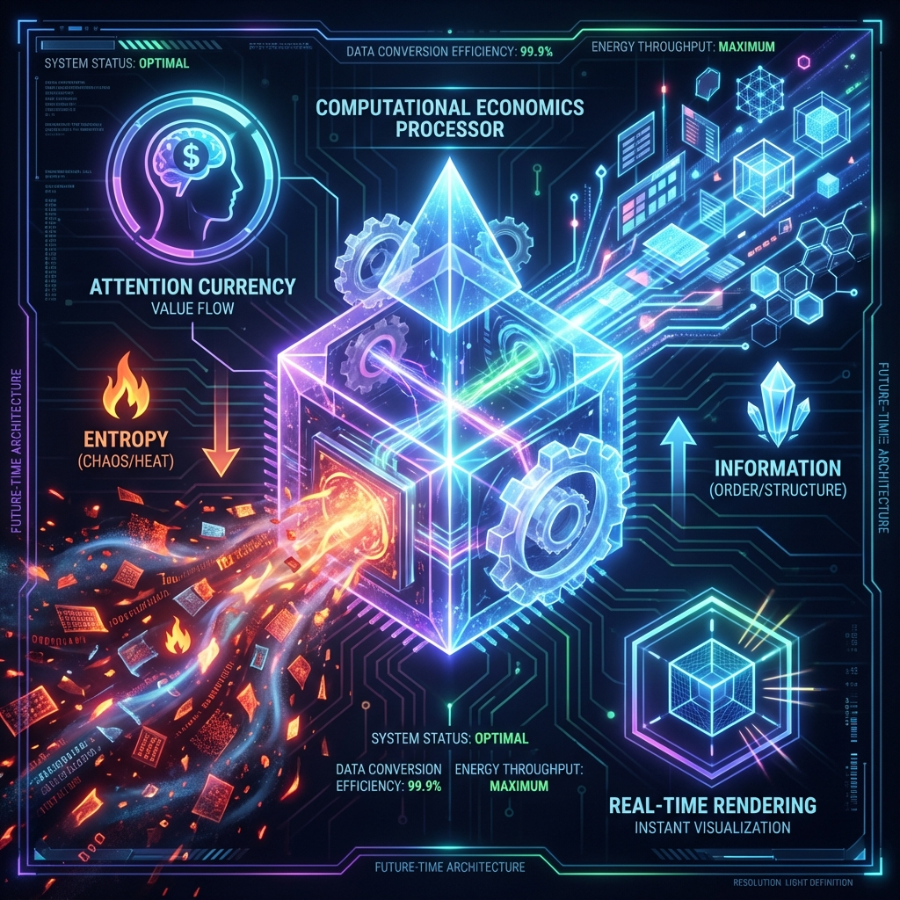

# 1.2 Frustum Culling & Computational Economics: Engineering Principles of Reality Rendering

Einstein once asked his friend Abraham Pais a famous question that has plagued the physics community for a century during a walk: "Do you really believe the moon is not there when you are not looking at it?"

In the worldview of classical physics, the answer to this question is self-evident: Of course the moon is there, whether you look at it or not, its mass is curving spacetime, and its gravity is pulling the tides. If you think it doesn't exist, that is the daydreaming of idealism.

But from the perspective of **HPA-ZΩ** theory, as a software architect, I want to tell you: Einstein's intuition touched upon the most underlying **Engineering Secret** of the universe.

The moon certainly exists, but the **Form** of its existence depends on whether you are looking at it.
When you look at it, it is an entity in **Rendered State**;
When you don't look at it, it is a wave function in **Data State**.

This is not just philosophical speculation; this is an extremely pragmatic issue of **"Computational Economics"**.

**1. God's Budget: Principle of Least Action**

Suppose you are now hired as the Chief Architect of "Universe 2.0". Your task is to build a grand universe with 100 billion galaxies, each containing hundreds of billions of stars. At the same time, you must obey the first iron law of physics: **Principle of Least Action**.

This principle tells us: Nature never wastes a single bit of energy. Light always takes the path of least time, and water always flows in the channel of least resistance.

If you adopt the **"Full Rendering"** strategy—that is, regardless of whether there is intelligent life observing, the system must calculate the rolling of every grain of sand on every unmanned planet in real-time, render the texture of every fallen leaf in every dark forest in real-time, and simulate the photon collision of every black hole accretion disk in real-time—then there is only one result:

Your server (the energy background of the universe) will overload instantly, and the system will crash due to **Computational Overflow**.

This design is extremely stupid, inefficient, and inelegant. A perfect universe system must know how to **"Be Lazy"**. It must concentrate limited computing power on the **"Blade's Edge"**.

And this "blade's edge" is the observer's **Line of Sight**.

**2. Frustum Culling: The World Rendered Only for You**

In modern 3D game engines (such as Unreal Engine or Unity), there is a standard core optimization technique called **"Frustum Culling"**.

Imagine you are playing an open-world game from a first-person perspective. Although the entire map may be hundreds of square kilometers, containing tens of thousands of NPCs and buildings. But at any given moment, your screen (retina) can only display a field of view of about 60 to 120 degrees in front. This cone-shaped field of view is called the **"View Frustum"**.

The system's rendering logic is as follows:

*   **Inside the Frustum:** Within your field of view. The system will call the full computing power of the GPU (Graphics Processing Unit) to meticulously calculate lighting, materials, reflections, and shadows, presenting you with an incredibly realistic, hard physical world.
*   **Outside the Frustum:** Behind you, or areas blocked by walls. The system will immediately **"Unload"** the image data of these areas. The world there has not disappeared, but it has degraded from high-energy-consuming **"Entity Images"** to low-energy-consuming **"Pure Data Streams"**.

When you turn your head suddenly, the system detects that your **Observation Phase ($\theta$)** has rotated. Within the limit allowed by the speed of light (i.e., the system's **Maximum Refresh Rate**), it instantly reads the data from the hard drive and **"Just-In-Time Compiles"** the scene behind you for you.

As long as the system latency is lower than your perception threshold (Planck time scale), you will never perceive this process of "creation out of nothing". You will feel that the world is continuous and complete.

This is why quantum mechanics tells us that microscopic particles behave as **Waves** when unobserved, and collapse into **Particles** when observed.
**"Wave"** is the power-saving data state; **"Particle"** is the high-energy-consuming rendered state.

**3. Computational Economics: Conversion of Entropy and Information**

In **HPA-ZΩ** theory, we summarize this mechanism as the core formula of **Computational Economics**:

The **Entropy** of the universe is essentially the **Waste Heat** generated by the system's operation.
If we fully render the entire universe, the waste heat generated will cause the universe to undergo Heat Death the moment it is born.

To maintain the long-term operation of the universe, the system must **Allocate on Demand**.

*   **Observer** is the **Allocator** of computing power. Where your focus is, computing power flows there.
*   **Focused Areas:** Entropy reduction (ordering), wave function collapse, reality becomes clear and hard.
*   **Unfocused Areas:** Entropy increase (chaotization), decoherence, return to the fog of probability clouds.

This also explains why in our lives, when you ignore something for a long time (such as a relationship, a health indicator, or a pot of flowers in the corner), it tends to move towards **"Disorder"** and **"Decay"**. This is not only a psychological problem, this is a physics problem—because you cut off the **Computing Power Supply** needed to maintain its low-entropy state.

**4. The Ultimate Answer to the Fridge Light Paradox**

Now, we can answer the opening question: When you close the fridge door, is the light still on? Is the apple inside still there?

*   **The Light:** In **Layer 1 (Rendering Layer)**, the light is absolutely off. The system has no need to render Ray Tracing in a closed black box. That is a waste of GPU resources.
*   **The Apple:** In **Layer 0 (Data Layer)**, the apple still exists. As a set of parameters stored on the **Prime Skeleton ($r$)**, it records information such as its position, decay level, mass, etc.

The system will run an extremely low-power **"Logic Thread"** in the background to simulate the passage of time (such as the apple's decay calculation), but this is only **Pure Numerical Calculation** and does not involve **Image Rendering**.

This ensures **Consistency**—when you open the door next time (re-initiate the rendering request), you will see an aged apple, not a banana, nor a black hole that disappeared out of thin air.

**5. Revelation for Observers**

What is the guiding significance of understanding **"Frustum Culling"** and **"Computational Economics"** for our lives?

It tells us: **Your reality is what you "bought" with your attention.**

In this huge generative universe, you possess limited **"Computing Coins"** (your attention bandwidth).
If you aim your precious view frustum (attention) at negative news on the internet, painful memories of the past, jealousy of others—you are consuming the universe's top-tier graphics card to meticulously render hell.

Conversely, if you learn to control your view frustum and activate the **"Culling Mechanism"**—actively shield those meaningless noises (do not allocate computing power to them), and focus your gaze on the vision (Dragon Pearl) you desire.

The system has no choice.
According to the iron law of **Computational Economics**, it must concentrate resources to render that **Auric** future you are gazing at with high fidelity for you.

Since reality is rendered on demand, can we "cheat"? Can we modify the background cache data before the system renders the next frame?
In the next section **1.3 Back-propagation & Keyframe Protocol**, we will explore this higher-level gameplay—how to not only determine the present but also rewrite the past.

