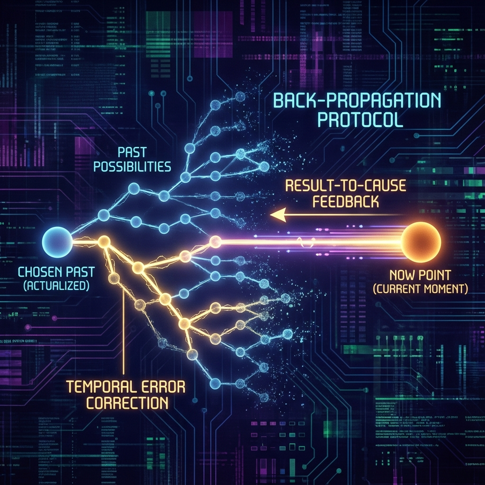
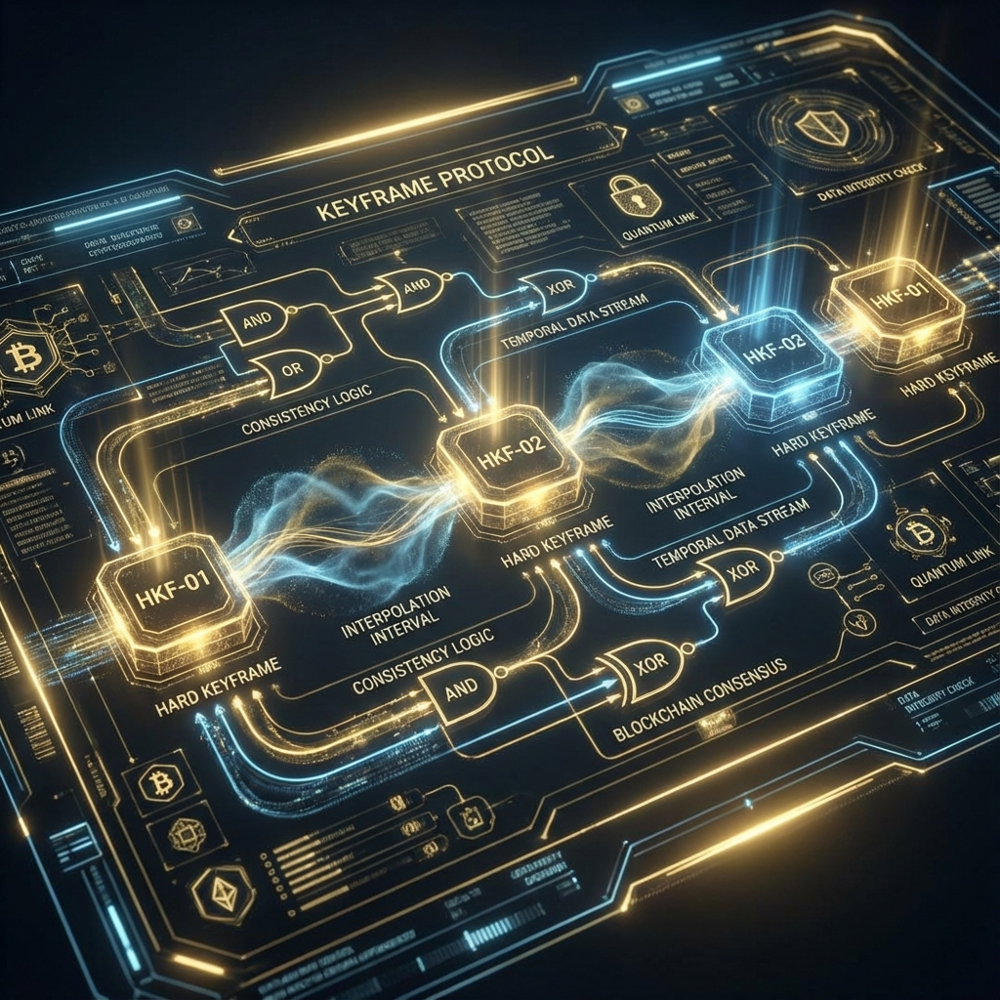

# 1.3 回溯修正与关键帧协议：为了现在，重写过去 (Back-propagation & Keyframe Protocol)

既然我们已经接受了宇宙是一个只在观测时才进行渲染的 **"懒加载"** 系统，并且受制于严密的 **"一致性" (Consistency)** 法则，那么随之而来的，便是这本书中最具挑战性、也最令人着迷的推论：关于 **历史** 的本质。

如果当你转身看向身后时，身后的街道才刚刚被"刷"出来，那么街道上那棵几百年的老树是怎么回事？那座建于 19 世纪的钟楼是怎么回事？难道它们也是在这一瞬间凭空出现的吗？

答案既是肯定的，也是否定的。

是的，它们是在这一瞬间从 **信息态** （代码）坍缩为 **物质态** （图像）的；但它们并非随意的涂鸦，而是系统依据严密的 **一致性** 逻辑，瞬间计算生成的一套 **"自带历史背景"** 的完美模型。

在 **HPA-ZΩ** 理论中，我们将这种机制称为 **"回溯修正"** ，或者借用人工智能领域的术语—— **"反向传播" (Back-propagation)** 。

**1. 因果的逆转：为了果，必须有因**

为了理解这个概念，我们需要再次回到约翰·惠勒的 **"烟雾巨龙"** 。

请记住那个反直觉的结论：巨龙的头（现在的观测）决定了巨龙的身体（过去的轨迹）。当我们现在的探测器（龙嘴）捕捉到光子时，为了让这颗光子"合理"地出现在这里，宇宙必须在瞬间，为它在身后的虚空中 **"脑补"** 出一条合乎物理法则的飞行轨迹。

这条轨迹并非原本就存在，它是 **为了解释现在的合理性而被逆向生成的** 。

让我们把这个微观的量子现象放大到宏观世界。想象一下，一位考古学家在沙漠中挖掘出了一块恐龙化石。

在 **线性时间观** （经典物理）中，故事是这样的： 6500 万年前，真的有一只活生生的恐龙在这里奔跑、死亡、被掩埋，经过漫长的地质演变，骨头变成了石头，静静地躺在那里，直到今天被我们挖出来。因果链条是： **恐龙（因）  化石（果）** 。

但在 **全息宇宙观** （HPA-ZΩ）中，逻辑被完全颠倒了。

故事变成了这样：
现在的观测者（考古学家）带着强烈的 **"探索生命起源"** 的动机（龙珠/愿力），将他的 **扫描仪** （意识与工具）对准了这片沙地。
在那一刻，为了响应这个观测请求，为了让当前的宇宙图景（一个包含进化论、包含生物多样性的世界）保持 **逻辑自洽** ——也就是为了满足 **一致性** ——宇宙的后台系统必须瞬间生成一个"能够解释这一切"的历史背景。

于是，系统执行了一次 **回溯计算** ：
"为了让现在挖出化石是合理的，那么 6500 万年前 **必须** 曾有一只恐龙在此生活。"

那一刻，那段关于白垩纪的"烟雾"被坍缩了。那只恐龙的"历史"被瞬间写入了宇宙的数据库。因果链条变成了： **现在的观测（因）  过去的恐龙（果）** 。

这听起来像是唯心主义的疯狂呓语？不，这恰恰是最高效的 **计算逻辑** 。

在一个复杂的模拟系统中，维护一个长达 138 亿年的、每分每秒都精确运行的连续历史，是对算力的极大浪费。系统只需要维护 **"当前切片" (Current Slice)** 的状态，以及一套严谨的 **"物理定律" (Rules)** 。

当观测者需要查询"过去"时（比如挖掘化石、观测遥远星系、查阅史书），系统就根据 **当前的状态** 和 **物理定律** ，反推导出一段 **"看起来应当如此"** 的历史，并将其即时渲染出来呈现给观测者。这就是为什么我们的物理定律（如光速恒定、热力学定律）如此坚固。它们不是限制万物的枷锁，它们是系统生成历史时所使用的 **"防穿帮算法"** 。

**2. 关键帧协议：硬约束与软插值**

然而，这里存在一个巨大的风险：如果过去是可以被计算生成的，那么我们的 **记忆** 是否也是虚假的？如果我们修改了现在，过去会不会变得面目全非，导致我们精神分裂？

为了解决这个悖论，我们需要引入一个至关重要的约束机制，我们称之为 **"关键帧协议" (Keyframe Protocol)** 。

这个概念借用自 **计算机动画 (Computer Animation)** 。在制作动画时，动画师并不需要一帧一帧地画出物体运动的每一个瞬间。他们只需要设定几个 **"关键帧"** ——比如，第 1 秒物体在 A 点，第 10 秒物体在 B 点。这两个关键帧是 **硬约束 (Hard Constraints)** ，是不可更改的锚点。

那么，第 2 秒到第 9 秒之间发生了什么？计算机软件会根据算法，自动计算生成中间的过渡画面，这被称为 **"插值" (Interpolation)** 。

我们的宇宙正是以同样的方式管理着历史，以维护整体的 **一致性** ：

1. **关键帧 (Keyframes)：** 就是那些被我们的意识强烈观测、被清晰记忆、被集体共识锁定的时刻。比如你的出生日期、你考上大学的那一刻、或者是你刚才喝下咖啡的那个瞬间。这些是 **"大家都认为没有被篡改"** 的部分，是坚硬的现实锚点。
2. **插值区间 (Interpolation Interval)：** 就是两个关键帧之间的那些模糊地带，那些未被时刻盯着的"垃圾时间"，或者是那些虽然发生了、但其深层因果机制尚未被探明的过程。这就是惠勒所说的 **"烟雾"** 。

所谓的 **"修改过去"** ，实际上是当你在这个瞬间（设置了一个新的关键帧 B），基于你当下的状态（龙嘴）和你对未来的愿景（龙珠），宇宙的后台算法为了保持逻辑的 **连贯性** ，自动重新计算了从上一个关键帧 A 到现在 B 之间的 **"插值路径"** 。

这一过程极其隐秘，且 **完美自洽** 。

**3. 你是人生的剪辑师**

举个例子：假设你（关键帧 A）是一个并不富裕的人，而你突然确立了一个极其强烈的宏大愿景（设定了未来的龙珠）。当你在这个愿景的牵引下，通过努力在当下（关键帧 B）获得了一笔巨大的财富。

在 **播放模式** 的视角下，你会解释为：因为我过去努力工作（因），所以现在有了钱（果）。

但在 **编辑模式** 的视角下，物理过程是反过来的：因为你在未来必须拥有这笔财富（为了匹配龙珠的引力），所以宇宙后台 **重构** 了你过去的那些模糊细节。也许是你那次偶然的灵感被放大了，也许是某个看似随机的运气被重新定义为必然。

你对"努力工作"的记忆（关键帧）没有变，但"努力工作"导致"成功"之间的那个复杂的、充满随机性的 **因果链条（插值）** ，被悄悄地替换了。

你不会感到记忆被篡改，因为新的历史路径与你的旧记忆 **逻辑兼容** ，完全符合 **一致性** 原则。你只觉得是自己"运气好"或者是"终于开窍了"。但实际上，那是宇宙为了配合你现在的剧本，对过去的烟雾进行了一次 **无痕渲染** 。

这就是 **"追溯一致性" (Retroactive Consistency)** 。

在这个意义上，我们每个人都是自己人生电影的剪辑师。只要我们不破坏那些已经锁定的关键帧（不否认客观事实），我们就拥有在关键帧之间的广阔空间里，通过调整现在的观测角度，去 **重塑** 历史叙事逻辑的权限。

过去并不是沉重的枷锁，过去只是为了解释现在而存在的注脚。如果你能从这一刻起，改变你对未来的 **愿 (Motive)** ，改变你当下的 **观测视角** ，那么宇宙为了维持 **一致性** ，将不得不为你重新计算一条通往现在的历史轨迹。那些曾经的伤痛，也许会在新的因果链中，被重构为觉醒的契机。

毕竟，在这条衔珠巨龙的身体里，没有哪一块鳞片是绝对固定的。唯有那颗指引方向的 **珠** ，和那个正在咬合的 **嘴** ，才是真实的。

