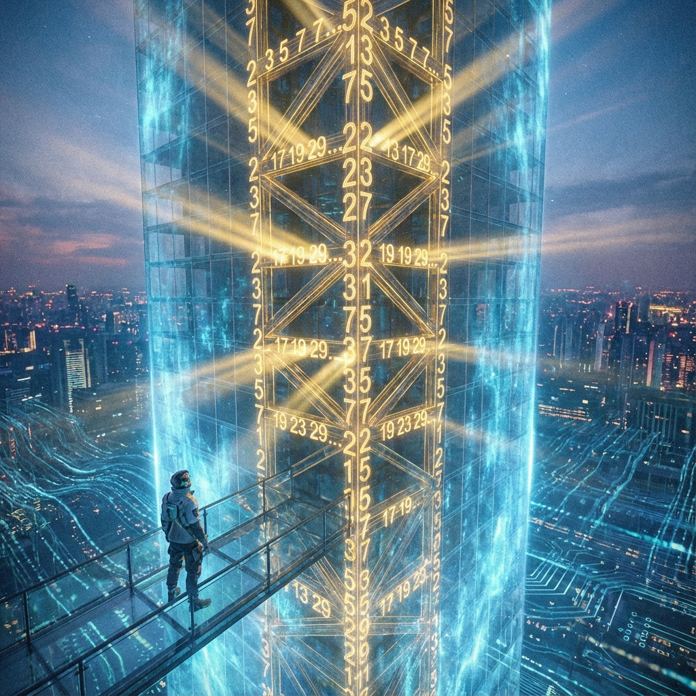
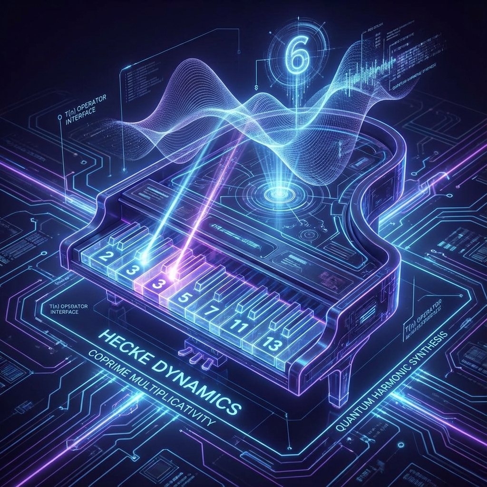
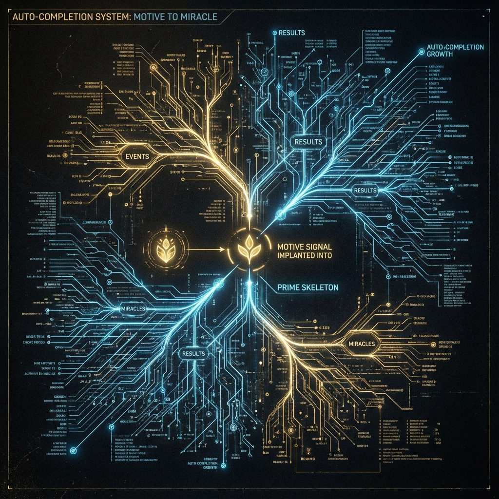

# 2.1 素数的骨架：上帝不掷骰子，上帝在谱曲

阿尔伯特·爱因斯坦曾留下一句振聋发聩的名言，以此表达他对量子力学中内禀随机性的不满："上帝不掷骰子。" (God does not play dice.) 他坚信，在那些看似混乱、模糊的概率云背后，一定隐藏着某种确定的、优雅的秩序，一种尚未被我们发现的刚性法则。

在 **HPA-ZΩ** 理论的视角下，爱因斯坦是对的，但他只对了一半。上帝确实不掷骰子，因为掷骰子太低级了，那是随机数的无序堆砌，无法构建出如此精密、如此 **一致** 的宇宙。

上帝在做什么？ **上帝在谱曲。**

当我们剥开物质世界的层层表象，穿过分子、原子、夸克，甚至穿过在那之下翻涌的量子泡沫，我们在宇宙的最底层（Layer 0）到底看见了什么？我们看到的不是坚硬的微粒，也不是混乱的能量，而是纯粹的 **数学结构** 。更确切地说，是一套刚性的、不可动摇的 **素数 (Prime Numbers)** 体系。

**1. 混沌中的唯一刚性**

如果你是一个建筑师，想要在一片流动的流沙（量子概率云）上建造一座永恒的大厦，你需要什么？你需要打桩。你需要找到一些绝对坚硬、绝对不会随时间改变、也不会随观测者视角改变的支撑点，来维持整座大厦的结构 **一致性 (Consistency)** 。

在物理宇宙中，这样的支撑点其实很难找到。光速在黑洞边缘会弯曲，时间在高速运动中会变慢，甚至质量本身也是能量的凝聚。但在数学宇宙中，有一样东西是绝对刚性的，那就是 **素数** ：2, 3, 5, 7, 11, 13, 17...

无论你在地球上，还是在几百亿光年外的仙女座星系，甚至是在另一个物理常数完全不同的平行宇宙里，17 永远只能被 1 和它自己整除。素数的性质不依赖于物理定律，不依赖于光速，它们是 **逻辑的必然** 。

因此，这个生成式宇宙的操作系统，选择将这些 **素数** 作为构建现实的 **"承重墙"** 或 **"钢筋骨架" (Prime Skeleton)**。

正如我们在上一章所讨论的，宇宙为了节省算力采用了"懒加载"机制，允许未被观测的历史处于模糊状态。但是，这种模糊并不意味着可以随意胡来。所有的生成、所有的回溯修正，都必须挂载在这个 **素数骨架** 之上。它保证了即使现实是实时渲染的，它依然坚固得如同钻石。

**2. Hecke 动力学：宇宙的和声学**

在我们的理论模型中，这套素数骨架并不是静止的标本。它们通过一种被称为 **"Hecke 算子" (Hecke Operators)** 的机制，在这个全息宇宙中产生共振与交互。

为了理解这个抽象的数学概念，让我们回到音乐的比喻。

想象宇宙是一架巨大的钢琴。

* **素数 (2, 3, 5...)** 就是这架钢琴上的一根根 **琴弦** 。
* **物理现实** 就是琴弦振动产生的 **乐章** 。
* **Hecke 关系** 就是严格的 **和声学规则** 。

并非所有的声音组合都是允许的。宇宙为了维持 **一致性** ，设定了一套严格的算法：当你弹奏"2"这个音符和"3"这个音符时，宇宙的后台算法会自动计算出"6"这个音符的状态。这种机制在数学上被称为 **"互质乘性" (Coprime Multiplicativity)**。

意味着，宇宙中看似独立的事件，在深层其实是被素数骨架紧密锁死的。这种严格的数学约束，保证了宇宙不会在懒加载的过程中坍缩成一团刺耳的噪音（逻辑崩溃），而是形成某种具有高度对称性与稳定性的 **"特征波" (Eigenforms)**。

这就是为什么我们看到的电子轨道、晶体结构、甚至花瓣的排列（往往遵循斐波那契数列），都充满了令人惊叹的几何美感。这些美感不是偶然的，它们是素数骨架在宏观世界的 **投影** 。

**3. 自动补全系统：哼唱出你的愿**

理解了素数骨架的作用，我们就能回答那个最核心的问题： **"在这个生成式宇宙中，我们作为观测者，到底拥有多大的权力？"**

有些新时代理论宣称"你想什么就会显化什么"，这在物理上是不准确的。你不能凭空想象一只粉红色的大象出现在房间里，因为那违反了底层的物理逻辑，破坏了系统的 **一致性** 。

但是， **HPA-ZΩ** 揭示了一个更精妙的机制： **"自动补全" (Auto-completion)** 。

想象你在使用音乐播放软件的"听歌识曲"功能，或者在使用搜索引擎的自动联想功能。你不需要输入整首歌的乐谱，也不需要打出几千字的完整文章。你只需要哼出 **哪怕两个最关键的音符** ，或者输入 **几个核心的关键词** 。

只要这几个音符（关键词）足够清晰、足够强烈，系统就会根据庞大的数据库和算法逻辑，自动为你 **补全** 剩下的旋律。

在我们的宇宙中：

* 那 **两个关键的音符** ，就是你的 **"愿" (Motive/Vow)** ——你向位于 $i\infty$ 处的龙珠发出的强烈信号。
* 那庞大的 **数据库和算法** ，就是 **素数骨架** 和 **Hecke 动力学** 。

当你发出了一个强烈的、符合真理方向的愿（比如"我要探索宇宙真理"），你其实是在拨动那根最深层的琴弦。宇宙的惯性引擎感受到了这个振动，为了维持数学上的 **一致性** （让这个愿望在逻辑上成立），它会顺着素数的刚性骨架， **自动生成** 、 **回溯计算** 出一系列复杂的机遇、灵感、巧合和物质条件，来让这首"交响曲"变得完整。

你不需要去操心每一个细节（比如"那个灵感怎么来"、"那个人怎么遇到"），那是宇宙后台（Layer 0）利用 **Hecke 关系** 自动计算的工作。你只需要确保你的 **"主旋律" (Motive)** 是清晰的、不走调的。

这就是 **"上帝在谱曲"** 的真谛。

宇宙不是一个随机的赌场，而是一个巨大的共鸣箱。我们每一个人都是演奏者。虽然我们无法改变钢琴的构造（物理定律/素数骨架），但我们可以选择弹奏哪一支曲子。

当我们理解了这一点，我们就明白：所谓的奇迹，不过是你的 **愿力** 与宇宙底层的 **数学骨架** 发生了完美的 **共振** 。在下一节中，我们将看到这首乐曲是如何沿着 **"雅各布的天梯"** ，一步步从微观的混沌攀升至宏观的真理。

