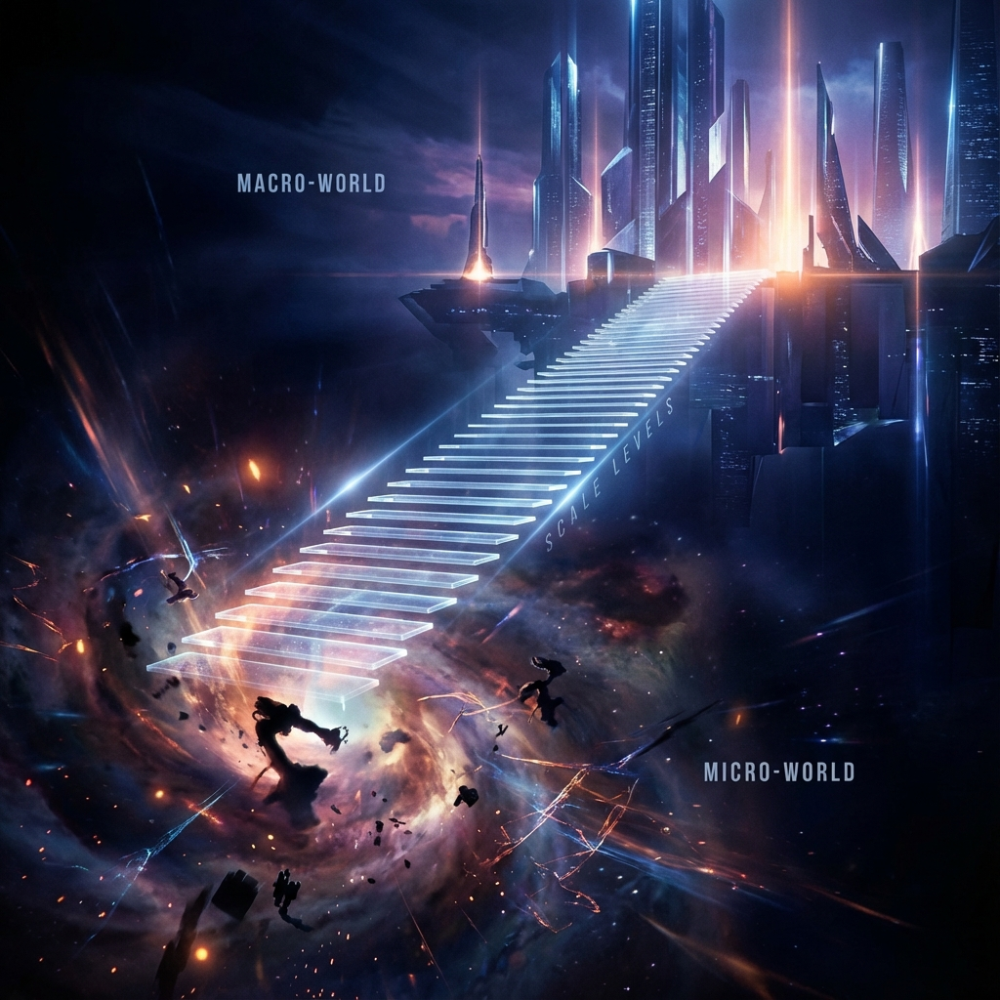
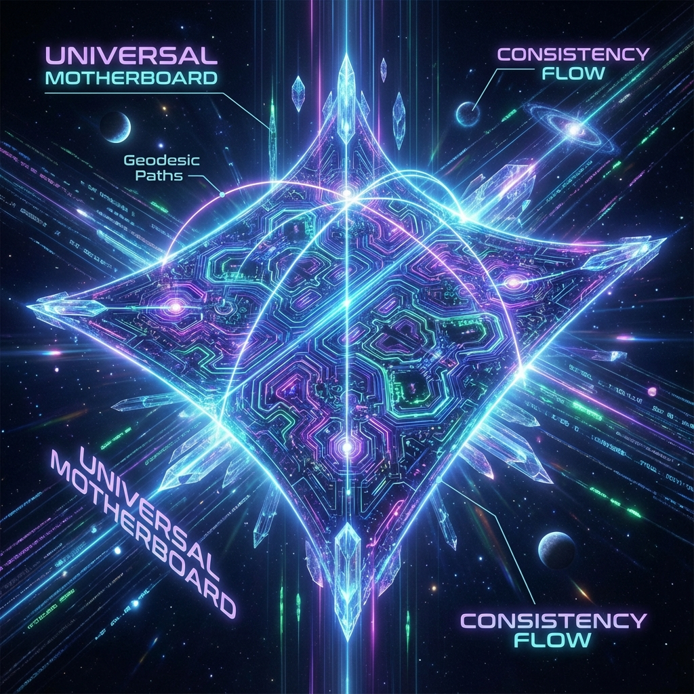
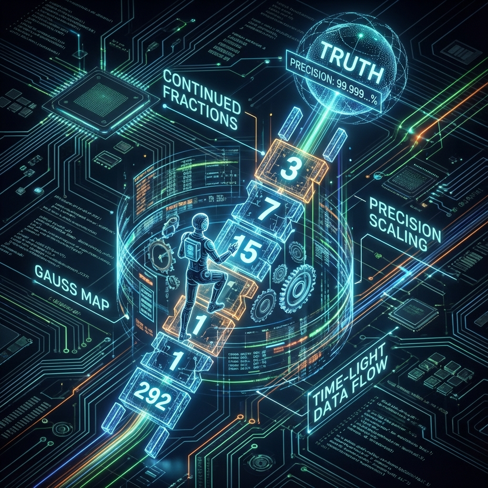

# 2.2 Jacob's Ladder: The Climb from Chaos to Truth (The Period Tower)

In "Genesis" of the Bible, Jacob saw a ladder in his dream, "set up on the earth, and the top of it reached to heaven", and the angels of God were ascending and descending on it. This may be the oldest and most precise metaphor in human history about connecting the finite and the infinite, chaos and order.

In **HPA-ZΩ** theory, this ladder is not just a mythical symbol; it is a real, computable physical object. We call it **"Renormalization Group Flow"**, or more poetically, **"The Period Tower"**.

If the **Prime Skeleton** mentioned in the previous section is the static architectural blueprint of the universe, then what we are going to discuss in this section is how to "move" in this blueprint—that is, how our consciousness climbs out of the microscopic quantum fog step by step to build the solid truth of the macroscopic world.

**1. The Magic of Scale: Why Can't You See the Clamor of Atoms?**

Have you ever thought about a question: At this very moment, the billions of atoms that make up your fingers are undergoing crazy thermal motion, electrons are jumping randomly in probability clouds, and quarks inside the nucleus are tumbling violently under the action of gluons. If you could see the microscopic truth directly, what you would see would be a maddening chaotic noise.

However, when you look at your finger, you see static, smooth skin.

Where did that microscopic "madness" go?

This is the most magical mechanism of the universe—**"Renormalization"**. This is like looking at the Earth from space; the Pacific Ocean, originally turbulent and full of storms, turns into a smooth azure water droplet in your field of vision. As the **"Scale"** increases, microscopic details are smoothed out, and macroscopic order emerges.

This process is **"Climbing the Ladder"**. In the process of climbing, we constantly discard those high-frequency, insignificant noises (quantum fluctuations) and only keep those core structures that remain unchanged at all scales. It is this mechanism that ensures the logical **Consistency** between the macroscopic world and the microscopic world—although details are lost, the kernel of physical laws has not changed.

**2. Modular Curve: The Motherboard of the Universe**

So, what does this ladder look like? It is not a wooden ladder in the clouds; it is a **"Modular Curve"** spanning the complex plane.

In the mathematical model of **HPA-ZΩ**, the "Mother Space" of the universe is not the three-dimensional space we are familiar with, but a hyperbolic geometric surface called $\mathbb{H}$. This surface has a peculiar property: it can "fold" infinite information into a finite area.

Our consciousness (Scanner) moves on this surface, just like a train running on a track. This track is the **"Geodesic"**.

Every observation is actually a navigation on this complex map. We try to start from the bottom of chaos (IR, Infrared End/Low Energy End), climb along the geodesic, pointing to the vertex of truth located at infinite height (UV, Ultraviolet End/High Energy End). In this process, the path cannot deviate at will; it must strictly follow the guidance of **Consistency**, otherwise our worldview will collapse, creating a cognitive rupture.

**3. Numerical Ladder: Gauss Map and Continued Fractions**

How do you climb up step by step? The universe didn't give you an elevator; it gave you an **"Algorithm"**.

This set of algorithms is called the **"Gauss Map"**. Its logic is outrageously simple, yet terrifyingly powerful. Its core operation is to constantly take the reciprocal and the remainder, cutting an infinite non-repeating decimal (irrational number) into a string of clean integers.

This string of integers is mathematically called **"Continued Fractions"**.

Let's take an example. Pi ($\pi$) is an infinite non-repeating irrational number, representing a perfect circle. But in the process of climbing the ladder, we cannot deal with infinity directly. Thus, the universe decomposes $\pi$ via the Gauss Map into: $\pi = 3 + \frac{1}{7 + \frac{1}{15 + \frac{1}{1 + \cdots}}}$.

Each number (3, 7, 15...), is a **"Rung"** on the ladder.

*   Step 1, you grab "3".
*   Step 2, you grab "7" (getting $3 + \frac{1}{7}$, approximately 3.14).
*   Step 3, you grab "15" (getting $3 + \frac{1}{7 + \frac{1}{15}}$, approximately 3.1415).

You see, truth ($\pi$) does not appear all at once. It is approached step by step (calculation), rung by rung, through your climbing on the ladder. This process is the process of transforming **"Continuous Chaos"** into **"Discrete Order"**. The generation of each step must pass the verification of **Consistency**, ensuring that every step under your feet is a solid mathematical truth, not an illusion.

**4. The Period Tower: Crystallization of Truth**

When we keep climbing up this ladder, what will we find?

At the bottom of the ladder, everything is turbulent and random. But as you climb higher and your field of vision widens, you will find that some things start to stabilize. Those numbers jumping chaotically at the microscopic level, after averaging over a long climb, condense into several eternal constants.

These constants are mathematically called **"Periods"**, or **"Zeta Values"** (such as $\zeta(2) = \frac{\pi^2}{6}$).

This is **"The Period Tower"**.

They are the true **"Gold" (Auric)** in the universe. Regardless of your origin (initial conditions), regardless of how much your specific climbing path deviates slightly, as long as you persist in climbing up following the rules of the Gauss Map and maintain logical **Consistency**, eventually you will see the same scenery at the top of the tower—that is $\pi$, that is $e$, that is the Golden Ratio $\varphi$.

These constants were not invented by physicists; they are **"Calculated Truths"**. They are the **"Fixed Points"** precipitated by the universe, this huge generative system, after countless iterative operations.

**5. The Mission of the Climber**

So, as observers, what is our mission?

We are not tourists here for a vacation; we are **Climbers**.

Every time we try to understand a complex concept, every time we sort out clues from chaotic emotions, every time we reduce inner entropy through meditation, we are actually climbing one step up the ladder of **HPA-ZΩ**.

We are using our own consciousness as computing power to execute the universe's core **"Renormalization"** program: filtering out the noise of life (high-frequency fluctuations) and extracting the meaning of life (low-frequency truth).

When you feel lost, please remember: being lost is only because you are still staying at the lower end of the ladder, and your view is obscured by local quantum fog. Keep calculating, keep climbing, maintain the **Consistency** between your inner vision and action. Jacob's ladder not only leads to heaven, it leads to that **Deterministic Future shining with Mathematical Brilliance**.

In the next section, we will explore what kind of streamlined architecture the system needs to complete this extreme climb—just as the best code is often "no code".

