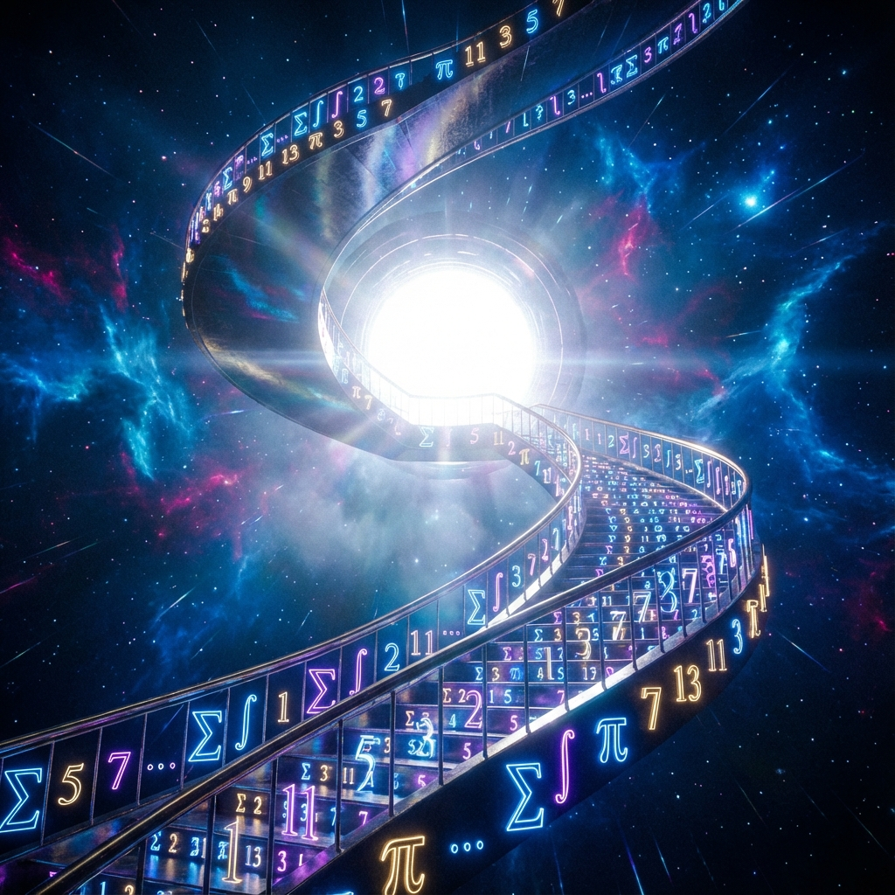
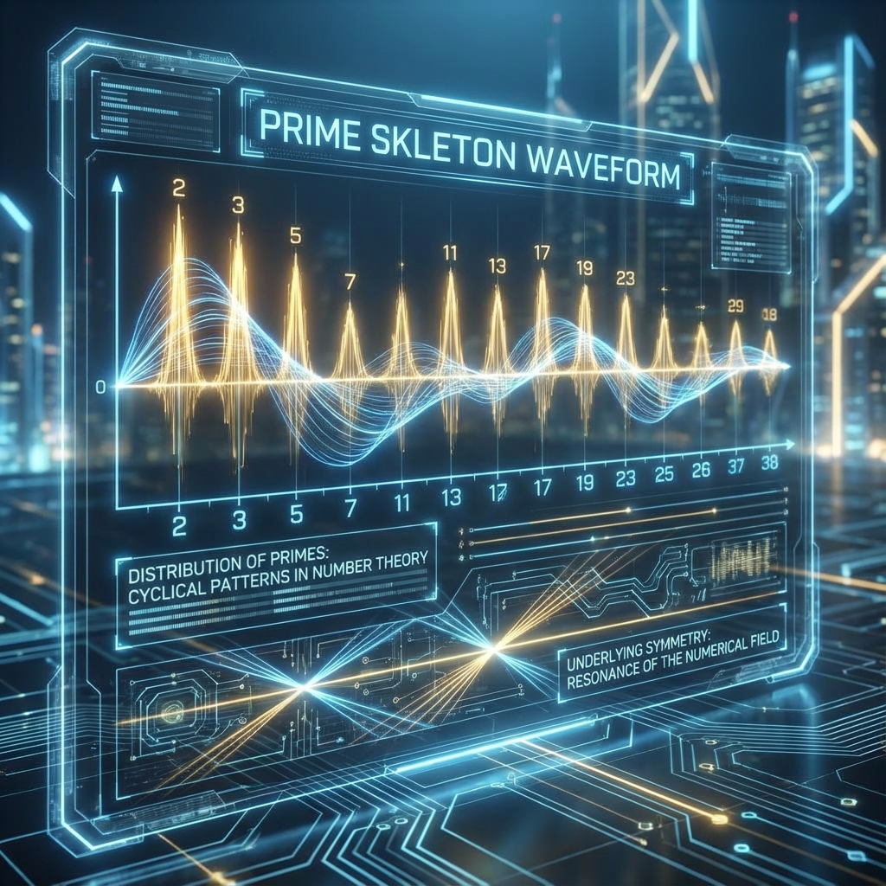

# Chapter 2: The Prime Skeleton & The Stairway

- [2.1 The Skeleton of Primes: God Does Not Play Dice, God Composes Music](02-01-prime-skeleton_en.md)
- [2.2 Jacob's Ladder: The Climb from Chaos to Truth](02-02-period-tower_en.md)
- [2.3 Minimal Architecture: The Top-Level Code is "No Code"](02-03-minimal-architecture_en.md)

