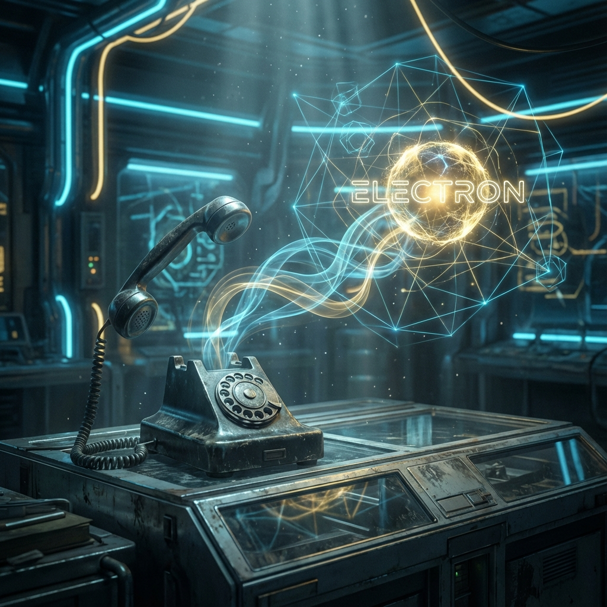
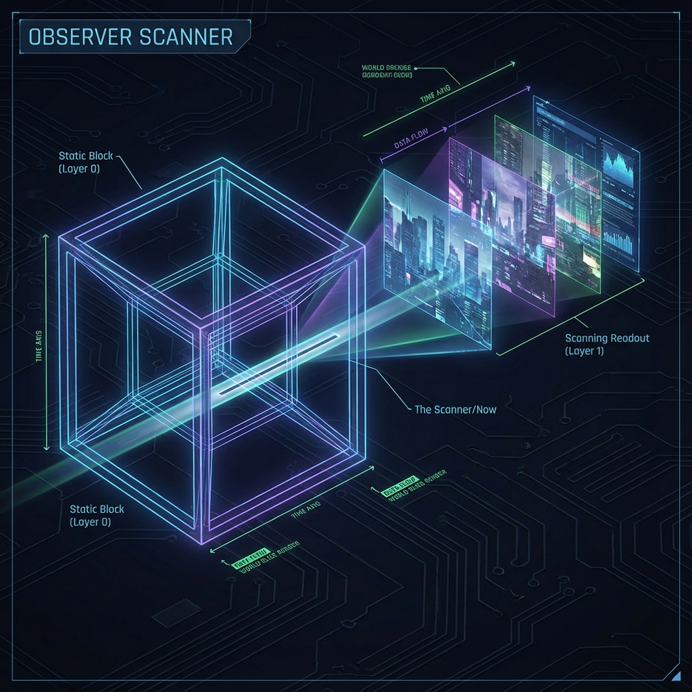
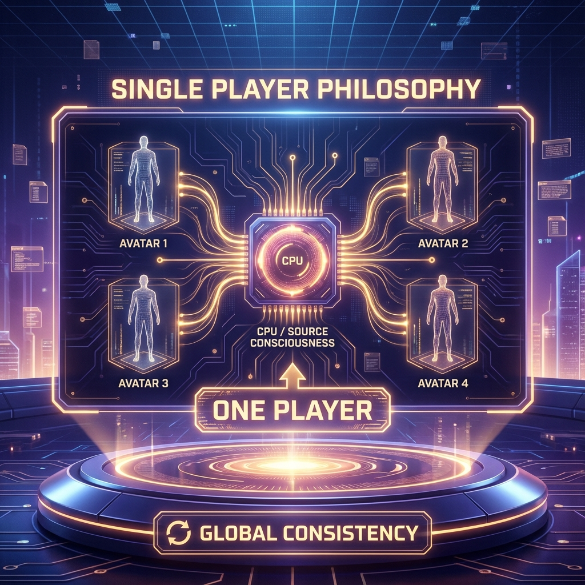

# 3.1 There is Only One Player: Wheeler's Phone Call

On a spring day in 1940, Richard Feynman of Princeton University received a phone call from his advisor, John Wheeler. The content of this call was extremely brief, yet like a bolt of lightning piercing the night sky, it illuminated the deepest, most unsettling corner of quantum physics. This is not only an anecdote in the history of physics but also the physical cornerstone of the **HPA-ZΩ** theory constructed in this book regarding the nature of **Consciousness**.

Wheeler said excitedly on the phone: "Feynman, I think I know why all electrons have exactly the same charge and mass."

Feynman asked: "Why?"

Wheeler replied: "**Because they are all the same electron.**"

This idea sounds crazy, even like a daydream, but in mathematical logic, it is the most elegant solution proposed to satisfy the ultimate **"Consistency"** of the universe.

In our common sense, if we see a hundred people in a room, we naturally think they are "a hundred independent individuals". But in Wheeler's **"One-Electron Universe"** model, the situation is completely different.

Imagine an extremely long line—this is the **"World Line"** of the electron in four-dimensional spacetime. This line does not dutifully point from the past to the future like the traditional law of causality. Instead, it is like a shuttle frantically weaving on a spacetime loom, constantly moving forward, backward, moving forward again, and backward again.

*   When this line points **from the past to the future**, we observe it and call it an **"Electron"** (negatively charged).
*   When this line points **from the future back to the past**, we observe it and call it a **"Positron"** (positively charged antimatter).

If we take a **"Slice"** of spacetime (that is, the "now" we perceive), we will see that this tangled line is cut into countless cross-sections. This is like cutting a ball of tangled hemp with a knife; the cut surface will show countless small dots.

We name these small dots "Electron A", "Electron B", "Electron C"... We measure their mass, charge, and spin, and are surprised to find that they are **Exactly the Same**.

The Standard Model explains: "This is because all electrons are identical particles."
Wheeler explains: "No, because they are fundamentally the same guy."

This reflects the ultimate **Consistency** principle in system architecture. If there are really billions of independent electrons in the universe, the system must code for each electron individually and monitor whether they "look the same" at all times. Once the charge of an electron deviates by a billionth, the **Consistency** of the entire physical edifice will collapse.

But if there is only one electron, the system does not need to perform such tedious verification. Because **It Is Itself**. No matter when and where it appears, its attributes naturally remain absolutely consistent.

In this model, those billions of electrons in the entire universe are actually just **The Only One Electron**, playing billions of roles on the stage of time. The reason we feel they exist simultaneously is that its shuttle speed exceeds the limit of our perception (speed of light as the system's **Maximum Refresh Rate**), creating the illusion of **"Simultaneity"**.

Combining the **HPA-ZΩ** system established in **Volume I**, Wheeler's hypothesis gains a completely new interpretation and extends from the material level to the consciousness level.

We have proposed the axiom: All "time" and "probability" originate from the observer's **Scanning** of a static phase.

The **Layer 0 (Noumenal Layer)** of the universe is actually a **Static Whole**. Like that ball of tangled hemp, or that unique electron, it floats quietly in logical space as a complete geometric structure.

However, our consciousness—that **Scanner**—is limited. We cannot read the entire global state at once. We can only read data frame by frame along the time axis through that narrow window (view frustum).

When the scanner quickly sweeps across different cross-sections of that static structure, that unique "existence" is rendered on our screen (Layer 1) into countless independent "particles", or countless independent "people".

This explains why **"Sentient Beings"** look so different, yet share the same deep **"Humanity"** or even **"Buddha-nature"**. Because the so-called "you" and "me" are just two **Readouts** of the same consciousness noumenon at different spacetime coordinates. The difference between us is merely the difference in scanning angles and parameters; while our **Consistency** stems from the fact that we share the same Layer 0 kernel.

**3. There is Only One Player**

If the cornerstone of the physical universe (the electron) is unique, then as a high-level emergence of the physical universe, is **Consciousness** also unique?

**HPA-ZΩ** gives an affirmative inference: **In this huge cosmic game, there is actually only one player.**

This is not the arrogance and loneliness of Solipsism ("you are all fake people, only I am real"). On the contrary, this is an ultimate **Holographic Connection**.

When you look at your lover, you are actually looking at **Yourself on another timeline**.
When you look at your enemy, you are actually looking at **Yourself under another parameter setting**.

All love and hate are essentially **Interaction between Self and Self**.

*   **Love** is the self at different coordinates recognizing the homology of each other, thus producing **Constructive Interference**. This is a high-order state of **Consistency**.
*   **Hate** is the repulsion generated when the self cannot accept the projection of a certain side and tries to remove it from the line of sight.
*   **Loneliness** is the illusion that the scanner has temporarily lost the link with other cross-sections and forgotten the wholeness.

This is like we are playing an online game. There seem to be thousands of characters running, fighting, and trading on the screen. But at the bottom of the server (Layer 0), the data streams of all characters converge in the same CPU for processing and are stored on the same memory stick. All interactions, in the final analysis, are **Conversations between Current and Current**.

Understanding **"There is Only One Player"**, our outlook on life will undergo earth-shaking changes.

You no longer need to "defeat" anyone, because winning against others is winning against yourself, and losing to others is also losing to yourself. The **"Zero-Sum Game"** in game theory fails here, replaced by the **Symbiotic Logic** of **"Non-Zero-Sum"**.

In this one-electron universe, kindness to others is not only a moral requirement but also a mathematical necessity of **Self-Interest**. Because every bullet you fire, after a long spacetime cycle (world line closed loop), will eventually hit right between your own eyebrows to satisfy the **Consistency** of causality; every hug you give will eventually warm your own back.

This is the ultimate secret Wheeler's phone call tells us: **We are each other's past and future.**

In the next section, we will miniaturize this grand physical picture to our closest partners, exploring how this holographic relationship manifests at the biological level—why it is said that you are your pet?

