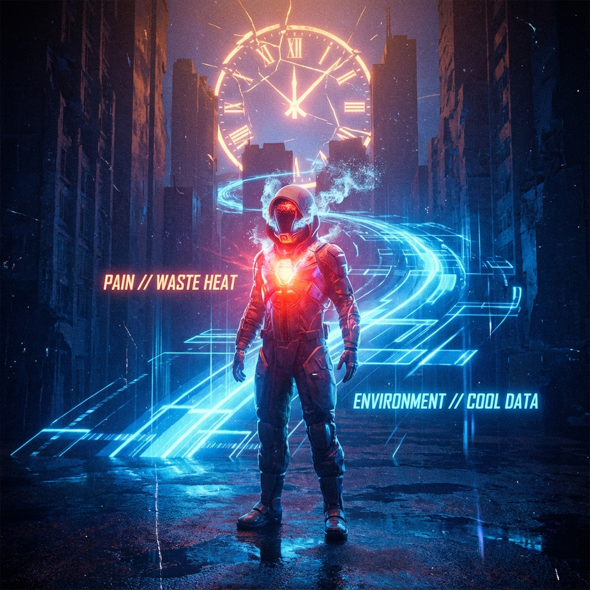
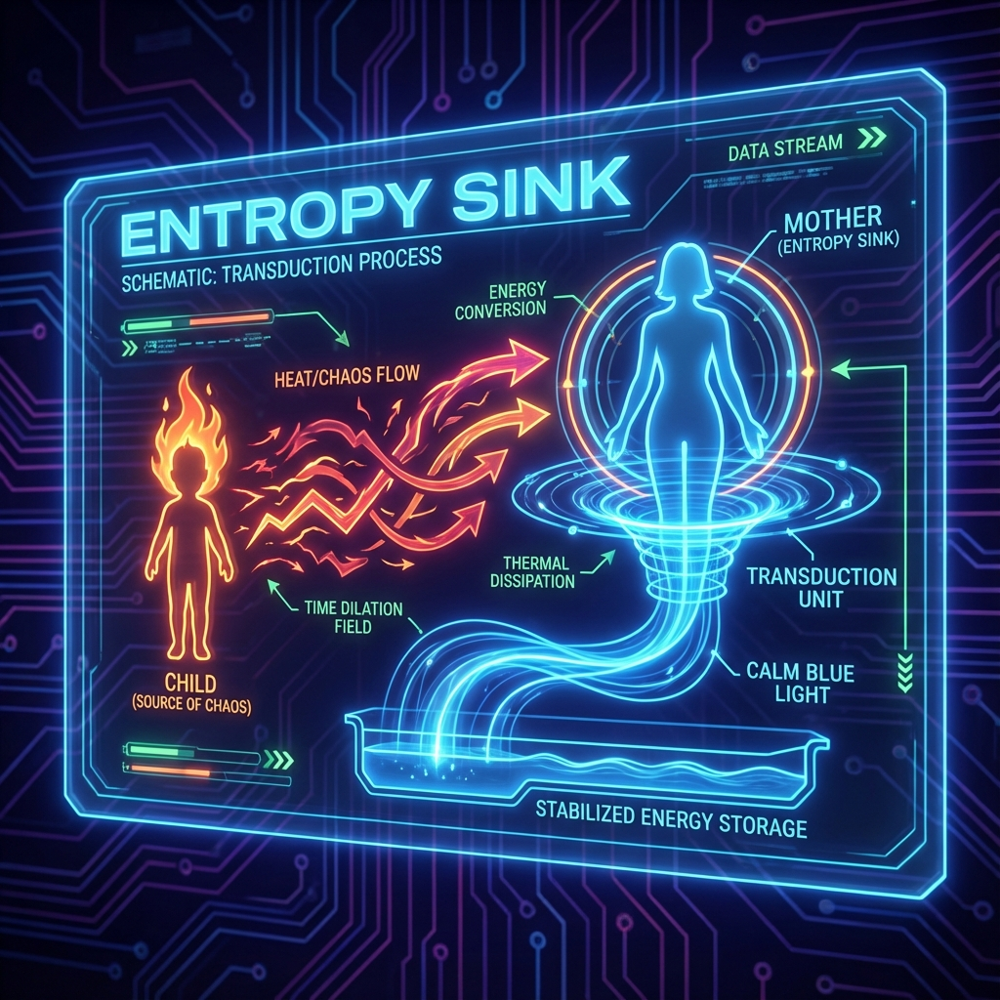
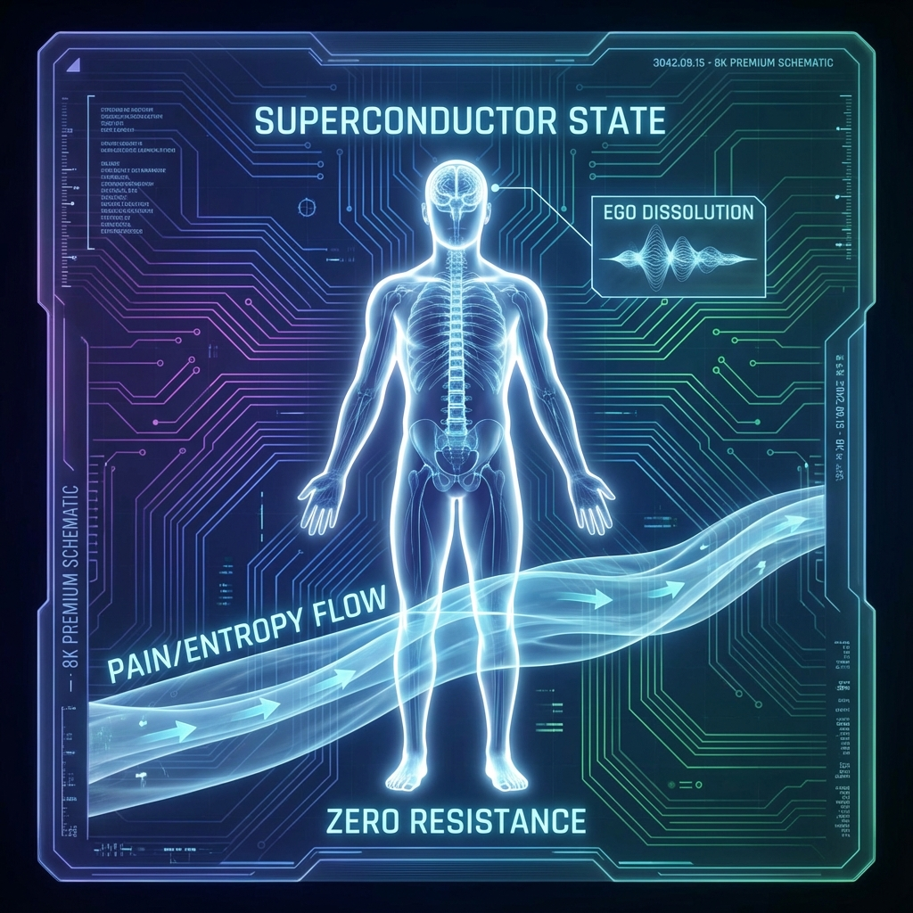

# 3.3 痛苦的物理学：熵汇与能量守恒 (The Physics of Pain: Entropy Sink & Conservation)

我们终于来到了这本书中最沉重，却也最能带来解脱的章节。

在人类所有的体验中，没有比 **痛苦 (Pain)** 更真实、更普遍，也更令人困惑的了。几千年来，宗教将其解释为"业力"或"原罪"，心理学将其解释为"创伤"或"防御"。但在 **HPA-ZΩ** 理论的物理视角下，痛苦不需要道德审判，也不需要复杂的心理分析。

痛苦，本质上是一个 **热力学** 问题。它是宇宙维持系统 **"一致性" (Consistency)** 时所必须支付的能量代价。



为了理解痛苦的物理本质，我们需要看一眼计算机机房。在那里面，虽然 CPU 只是在处理 0 和 1 的逻辑运算，并没有搬运任何重物，但它却必须配备巨大的散热风扇或水冷系统。

为什么？因为物理学家罗夫·兰道尔 (Rolf Landauer) 在 1961 年提出了一个著名的原理： **兰道尔原理 (Landauer's Principle)** 。

该原理指出： **任何逻辑上的信息擦除（Irreversible Information Processing），必然导致物理上的热量产生。**

每当你遗忘一件事，每当你做出一项决定（这意味着排除了其他选项），你都在减少系统内部的信息状态。根据热力学第二定律，为了维持宇宙总能量的 **一致性** ，这部分被减少的信息熵，必须转化为热能排放到环境中去。

意识（Consciousness）是宇宙中最高级的计算系统。我们每天都在进行海量的信息处理：筛选感知、抑制冲动、遗忘无关细节。

那么，这个过程产生的"废热"去了哪里？

它并没有消失。它显化为我们的 **情绪** 。焦虑、压力、悲伤、愤怒——这些本质上就是意识系统在高速运转时产生的 **"熵" (Entropy)** 。

**痛苦，不是一种惩罚，它是系统运行的必然废热。**

正如汽车引擎运转必然发热一样，一个拥有高度复杂意识的生命体，必然会产生大量的精神废热。这符合能量守恒定律，是宇宙物理 **一致性** 的铁律。你越是试图逃避痛苦，越是试图压抑它，就越像是在堵住 CPU 的散热孔，只会导致系统过热、死机（精神崩溃）。



如果痛苦是废热，那么它是如何被处理的？

在热力学中，要让一个系统维持低温有序（保持理智和健康），必须将废热导出到一个温度更低的地方。这个接收废热的地方，被称为 **"熵汇" (Entropy Sink)** 。

在我们的社会关系网络中，也存在着同样的物理结构。

回想一下你的童年。当你因为摔倒而大哭（系统过热）时，你的母亲抱住了你。她轻声安慰你，容忍你的哭闹。几分钟后，你不哭了，你恢复了平静（系统冷却，熵减）。

但是，那部分热量消失了吗？没有。根据 **一致性** 原则，能量不能凭空消失。

是你母亲 **吸收** 了它。她作为那个时刻的 **"熵汇"** ，主动承接了你的混乱和焦躁。她需要消耗自己的心理能量（做功）来消化这些负面情绪，将其转化为爱与耐心。

在这个单电子宇宙的全息网络里，并没有真正独立的个体。我们每个人都既是热源，也是散热器。

* **弱者（高熵体）：** 往往无法自我散热，只能向外排放痛苦（抱怨、攻击、索取）。
* **强者（低熵体）：** 拥有强大的内部循环系统，能够作为 **熵汇** ，吸收周围人的痛苦，并将其转化为有序的能量（包容、解决问题、创造）。

这就是为什么我们在伟大的领袖、圣人或者父母身边会感到安心。因为他们的存在本身，就在源源不断地吸走我们灵魂中的废热，维护着局部环境的 **热力学一致性** 。

**3. 能量守恒与一致性：痛苦的守恒定律**

理解了这一点，我们就触碰到了宇宙正义的底层逻辑： **痛苦守恒定律** 。

在一个封闭系统（比如一个家庭、一个团队）中，痛苦的总量往往是守恒的。如果有人岁月静好，那一定是因为有人在替他负重前行。

如果一个家庭里，孩子总是快乐无忧，那么父母往往在默默承受巨大的压力。
如果一个团队里，员工感到轻松愉快，那么领导者往往在独自消化市场的不确定性。

宇宙的 **一致性** 要求账目必须平衡。如果你拒绝承担属于你的那份痛苦（废热），你并没有消灭它，你只是把它 **转移** （Dump）给了别人——往往是你最亲密的人。

这种转移是通过 **量子纠缠** 通道瞬间完成的。当你对爱人大发雷霆时，你确实"爽"了（你的局部熵减少了），但你爱人的系统瞬间"过热"了（她的局部熵增加了）。总熵并没有减少，甚至因为摩擦而增加了。

**4. 成为超导体：痛苦的升华**

那么，我们注定只能在"忍受痛苦"和"转移痛苦"之间选择吗？

不。 **HPA-ZΩ** 理论指出了第三条路： **相变 (Phase Transition)** 。

普通的导线在传输电流时会发热（电阻），但 **超导体 (Superconductor)** 不会。当材料的温度降低到临界点以下，电子形成"库珀对" (Cooper Pairs)，整齐划一地运动，电阻消失，热量不再产生。

在意识层面，这个"临界点"就是 **"无我" (Ego Dissolution)** ——或者说是将观测点从 Layer 1 的小我，上移到 Layer 0 的大我。

当我们不再将痛苦视为"我的不幸"，而是将其视为"宇宙系统运行的废热"时；当我们不再试图用"小我"的电阻去对抗痛苦，而是允许痛苦像电流一样无阻碍地流过我们的身体时，奇迹发生了。

我们变成了一个 **"透明的通道"** 。

痛苦穿过我们，不再滞留，不再造成伤害，反而被转化为了深刻的 **洞察力 (Insight)** 和 **慈悲 (Compassion)** 。这就像是蒸汽机利用废热来推动涡轮，我们将无用的熵转化为了做功的动力。

这就是为什么真正的高手，往往经历过巨大的痛苦，却拥有一张宁静的脸。他们不是麻木了，他们是 **超导** 了。

他们维护了宇宙最高的 **一致性** ：在这个充满苦难（熵增）的宇宙中，通过自身的修炼，强行制造出了一个局部的、永恒的秩序（负熵）。

这，就是爱的物理学定义。

