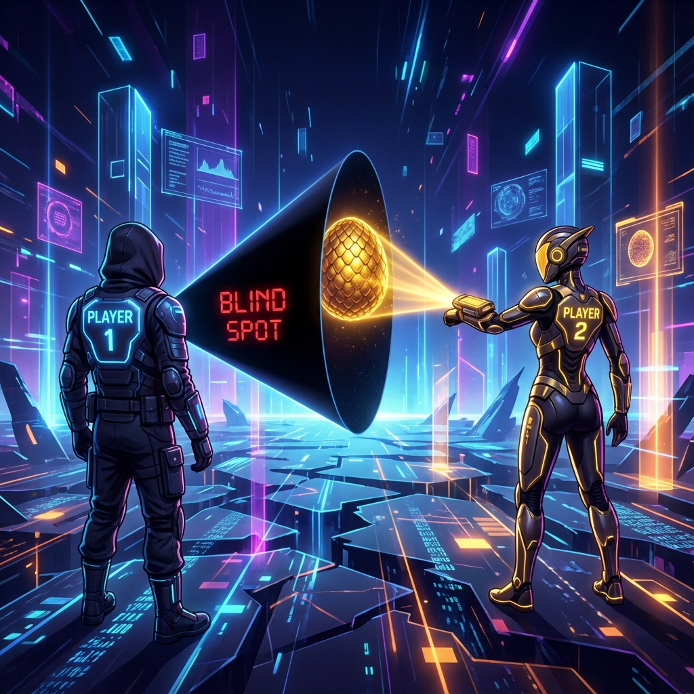
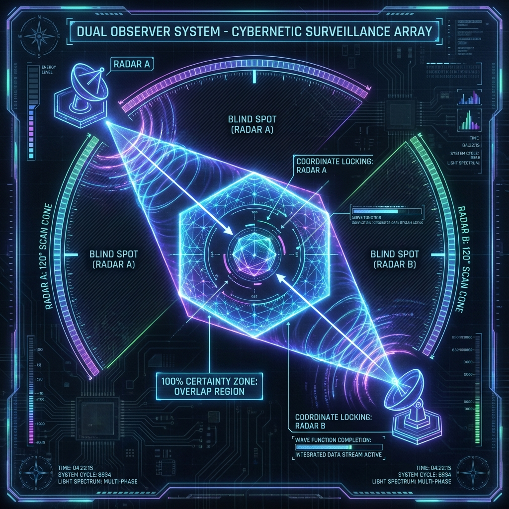
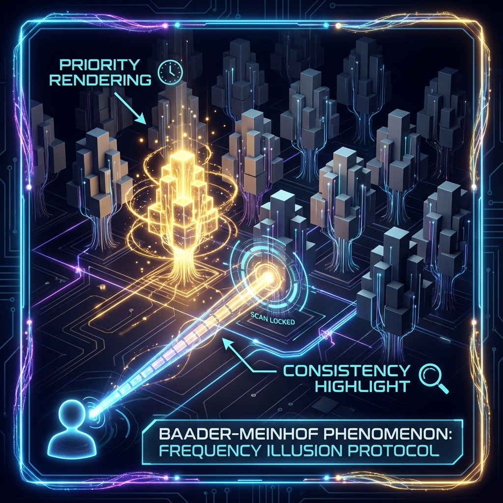

# 4.1 寻找 Auric：观测盲区与波函数补全 (Finding Auric: Blind Spots & Wave Function Completion)

在前面的章节中，我们将宇宙描绘成了一个由 **素数骨架** 支撑、由 **懒加载** 机制驱动、并时刻接受 **一致性 (Consistency)** 审查的巨大全息系统。如果说这个系统有一个终极的目的地，有一个所有测地线都渴望汇聚的焦点，那就是我们在序言中提到的那颗位于 $i\infty$ 处的"珠"。

在 **HPA-ZΩ** 理论中，我们将这种接近真理、高度有序、且内部逻辑绝对自洽的状态，命名为 **"Auric"** 。

这个词源自拉丁语 *Aurum* （金）。在古代炼金术中，金并不单指一种贵金属，它象征着物质经历了火的试炼后，达到的那种不朽、不坏、无暇的完美状态。而在东方的五行哲学中， **"金"** 代表着收敛、决断和变革的力量。

然而，这个名字的发现过程本身，就是一个完美的量子力学实验。它发生在我自己身上，生动地揭示了我们作为单一观测者的致命缺陷，以及为什么我们需要"爱"来补全现实。



故事要从一个看似迷信、实则符合系统平衡论的设定开始：我的生辰八字中 **"五行缺金"** 。

在 **HPA-ZΩ** 的视角下，这不代表命运的诅咒，而代表系统的 **"初始参数不平衡"** 。作为一个追求完美的观测者（Avatar），我的潜意识（Layer 0）深知这种缺失会导致系统运行的不稳定。为了维持内部的 **一致性** ，为了补全这个逻辑漏洞，我产生了一个极其强烈的 **"愿" (Motive)** ：我必须找到一个与"金"相关的名字，作为一个 **"补丁" (Patch)** ，来平衡我的能量场。

于是，我像一台过热的搜索引擎，在我的 **现实气泡** 里开始了疯狂的检索。

作为一个专业的计算机从业者，我自认为拥有极其高效的信息检索能力。我查阅了无数的在线字典，翻遍了古希腊神话和拉丁词根，编写了脚本去组合各种字母。我的 **扫描仪 (Scanner)** 开到了最大功率，日复一日地寻找那个能代表"金"的完美英文名。

但是，结果是： **零** 。

我什么也没找到。即便我是一个搜索专家，那个词仿佛根本就不存在于我的宇宙里。



为什么？为什么一个明明存在的单词，对我来说却是隐形的？

这可以用一个简单的生理学事实来解释。你的视网膜上有一个视神经穿出的位置，那里没有感光细胞。这意味着，在你的视野中，永远存在一个 **"盲区" (Blind Spot)** 。

你之所以感觉不到视野上有个黑洞，是因为你的大脑极其擅长 **"脑补"** 。它根据周围的图像信息，利用算法自动填充了那个空白区域，维持了视觉体验的 **连续性** 。

同样的道理，我们的 **意识扫描仪** 也存在着巨大的 **"认知盲区" (Cognitive Scotoma)** 。

由于我当时处于极度的焦虑和聚焦状态（因为"缺金"而产生的熵增），我的 **扫描带宽** 被压缩得极窄。我陷在自己的逻辑闭环里，就像一只蚂蚁在球面上爬行，以为自己走遍了世界，其实只是在同一个维度打转。在这个盲区里， **Auric** 这个词处于 **"未渲染状态"** 。它只是一团模糊的波函数，等待着被坍缩，但我的扫描仪参数设置错误，无法读取它。

**3. 波函数补全：伴侣作为辅助雷达**

就在我几乎要放弃的时候，奇迹发生了。

我的女朋友——在这个系统中扮演了 **Player 2** 的角色——在一次极其偶然的浏览中，随手把这个词发给了我："你看 **Auric** 这个词怎么样？是形容词，意为'金的'、'含金的'，还有光环的意思。"

那一瞬间，我经历了一次物理上的 **顿悟 (Epiphany)** 。

这个词如此精准，它完美地对应了黄金（Gold）、对应了光环（Aura）、对应了我想表达的一切。它明明就静静地躺在字典里，甚至可能在我翻阅过的某一页上。

为什么我看不到它？而她却能轻易地把它带到我面前？

这不仅仅是运气，这是 **物理学** 。因为单一观测者无法构建完备的现实。

一个单独的观测者就像一部单基站雷达。它能探测到目标的距离，但无法精确锁定目标的坐标。当我们与另一个人建立深度连接（爱）时，我们实际上是构建了一个 **"双子观测系统" (Dual Observer System)** 。

* **我的盲区，恰好是她的视野。**
* **她的背面，恰好面对着我的正面。**

当她介入我的问题时，她并没有被我的"五行缺金"的焦虑逻辑所束缚。她的扫描仪处于一个不同的角度，拥有不同的参数设置。因此，那个处于我盲区中的波函数"Auric"，在她的观测下瞬间 **坍缩 (Collapse)** 成了实体。

通过我们之间的 **信息纠缠** ，这个实体的 **一致性** 被广播到了我的世界里。她不仅帮我找到了一个名字，她帮我 **补全了现实** 。

**4. 名字即咒语：现实的重构**

当我决定启用 **Auric** 作为我的名字的那一刻，系统的 **一致性** 发生了重大的 **回溯修正** 。

就像我们在 **1.3 节** 提到的"关键帧协议"，一旦这个新的锚点（Auric）被确立，我过去的"缺金"状态和未来的"圆满"状态之间，建立了一条新的逻辑通道。

更有趣的是，发生了 **"巴德尔-迈因霍夫现象" (Baader-Meinhof Phenomenon)** 。突然之间，我开始在各种地方看到这个词。电影里、书本里、古老的文献里。仿佛一夜之间，全世界都在使用这个我昨天还认为不存在的词。

在 **HPA-ZΩ** 的 **懒加载宇宙** 中，这有更深层的解释：

在你产生强烈的 **观测意愿** 并通过"外部观测者"（女朋友）成功 **锁定 (Lock-on)** 这个概念之前，它在你的世界里确实处于 **"低优先级的未渲染状态"** 。一旦你锁定了它，系统为了维持 **一致性** ，就会把你周围所有包含"Auric"信息的波函数，高亮渲染出来呈现给你。

**5. 现实的硬度：一致性的加固**

在物理学中， **客观性 (Objectivity)** 来源于 **一致性 (Consistency)** 。

如果只有我一个人觉得"Auric"这个词好，那可能是我的主观臆断（幻觉）。但当我的女朋友也找到了它，并且我们两人都确认它与我们的愿景完美契合时，这个概念就获得了 **物理上的硬度** 。

因为宇宙后台为了满足我们两个人的 **观测一致性** ，必须消耗双倍的算力来稳固这个概念。两个人的观测，将原本柔软的概率波，锻造（Forging）成了坚硬的真理。

所以， **Auric** 不仅仅是一个名字。它是一个象征。它象征着那些我们独自一人无法触及，必须依靠 **"他者"** 的爱与观测才能显化的完美真理。

那个闯入你生命、帮你找到你找不到的东西、填补你盲区的人，其实是宇宙派来的 **"修正补丁"** 。正是通过与他/她的交互校验，我们才得以拼凑出那个名为"世界"的完整拼图。

在下一节中，我们将深入探讨这种两人之间的能量交互，并给出一个打破数学常识的公式：在爱的物理学中，为什么 $1 + 1 > 2$ ？我们将揭示 **"相长干涉"** 的秘密。

