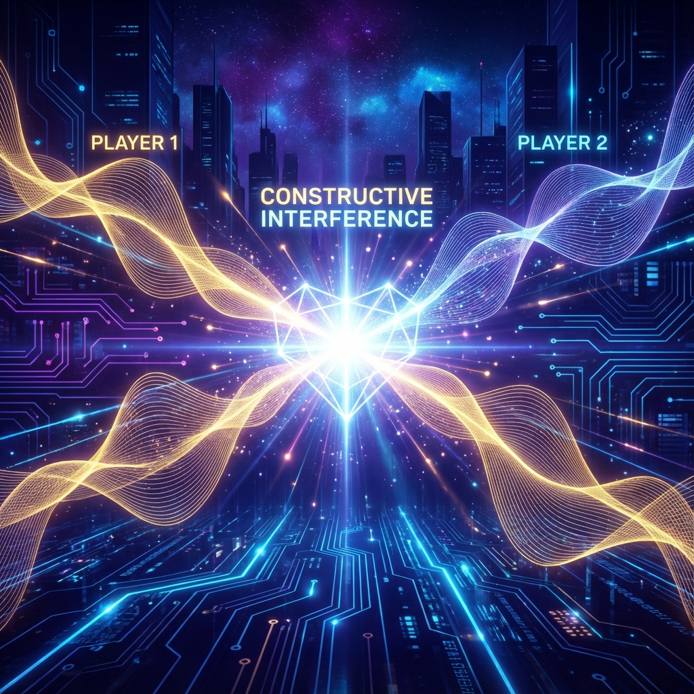
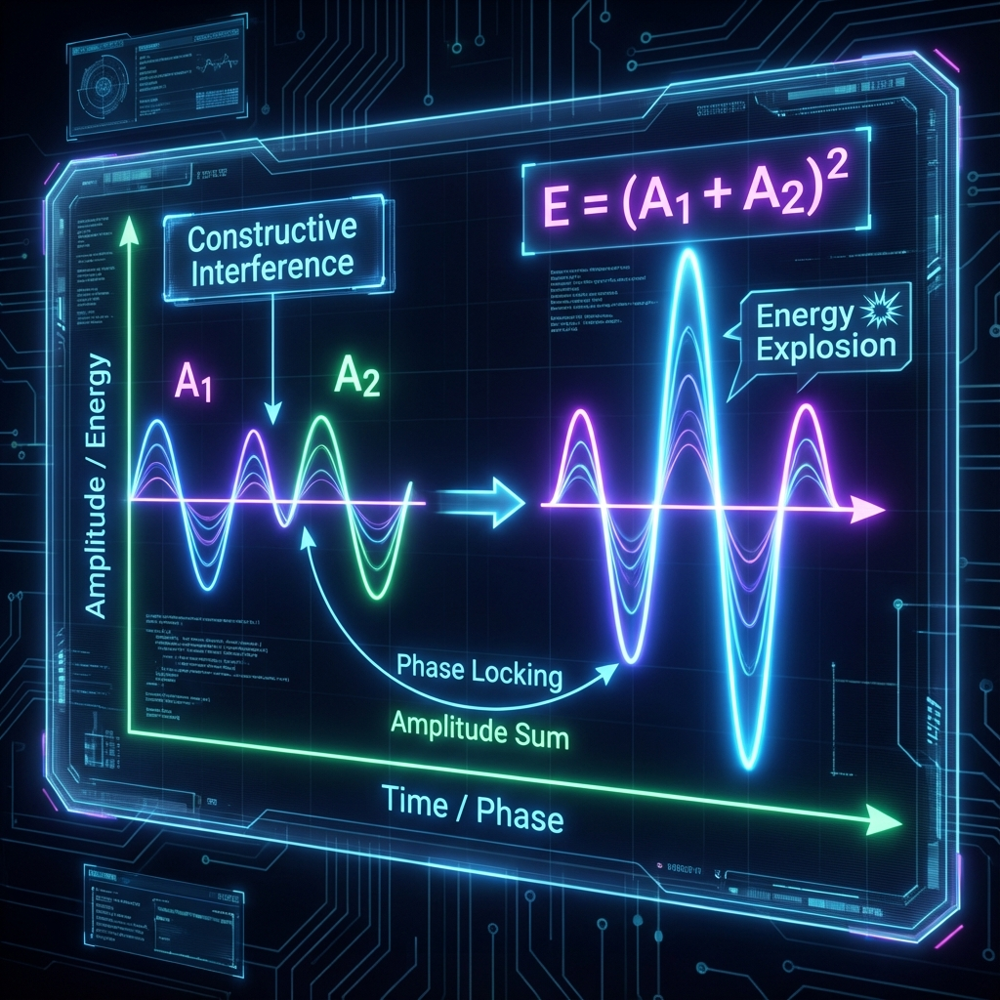
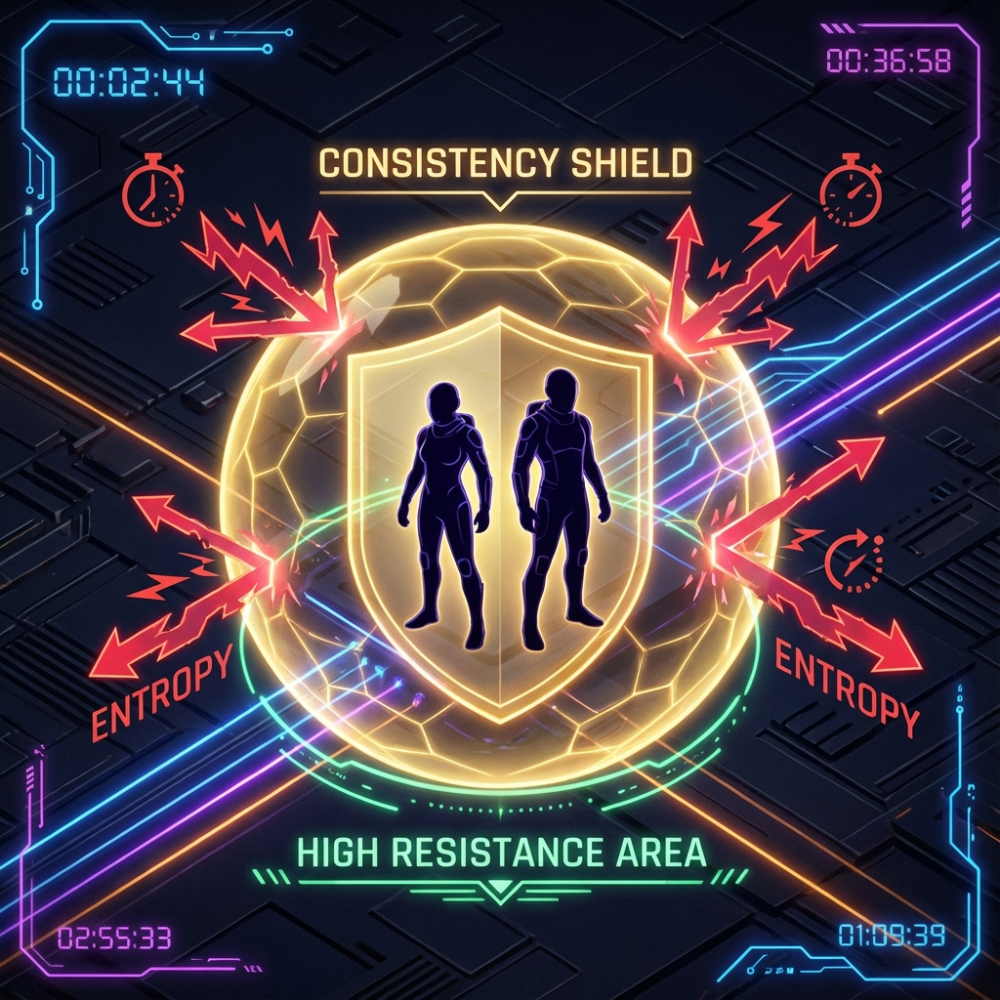

# 4.2 Energy Formula $1 + 1 > 2$: Constructive Interference

In elementary school math class, the first truth the teacher taught us was: $1 + 1 = 2$. This is an unbreakable axiom in the world of arithmetic. If I have two apples and you have two apples, adding them together will never produce a fifth apple out of thin air.

But in the physical world of **HPA-ZΩ**, the linear logic of arithmetic is not always applicable. Especially when we discuss high-energy physical phenomena such as **Consciousness** and **Love**, simple addition fails, replaced by an exponential burst of energy.

In this section, we will use the wave principle in physics to derive an energy formula that breaks common sense: **Under the premise of satisfying specific "Consistency", $1 + 1 > 2$.**

This extra energy is not magic, but comes from the principle of superposition of waves—physically called **"Constructive Interference"**. And the story about "Finding the name Auric" we mentioned in the previous section is exactly the most perfect reality footnote for this formula.

To understand this formula, we must first return to the basic assumption of quantum mechanics: **Everything is a Wave**.

We have established earlier that material entities are the result of **Lazy Loading** rendering, while in the unrendered underlying layer (Layer 0), whether it is photons, electrons, or our consciousness itself, they are essentially **Wave Functions** vibrating on the complex plane.

In wave physics, there is a crucial law: **The Energy carried by a wave is not directly equal to its Amplitude, but is proportional to the square of the amplitude ($E \propto A^2$).**

Let's do a simple calculation:

*   **Scenario A: Lonely Wave (Me who hasn't found a name)**
    Suppose the previous me was an independent observer. I was searching for the name "Gold", and my consciousness wave amplitude was $A_1 = 1$.
    Then, the energy I possessed (the ability to change reality and penetrate blind spots) was $E_1 = A_1^2 = 1$.
    This is why I scanned the entire network with this energy intensity, but the result was "zero". My energy was not enough to trigger the collapse of the wave function hidden deep inside.

*   **Scenario B: Unrelated Passersby (Incoherent Superposition)**
    Now, suppose there are two unrelated people, such as me and a stranger. We pass each other on the street. Our consciousness frequencies are different, our paces (phases) are inconsistent, and there is no deep logical connection between us.
    In this case, we are just a simple accumulation of two independent energy sources. The total energy of the system is the sum of respective energies:
    $E_1 + E_2 = 1 + 1 = 2$.
    This is traditional arithmetic logic, and also the norm of our daily social interactions.

*   **Scenario C: Resonant Partner (Constructive Interference)**
    Now, back to that critical moment. My girlfriend intervened.
    Note that she is not just "another person"; she is an observer who has a deep emotional connection with me and is focused for the same goal (helping me find a name) at this moment. Our **Motive** is highly **Consistent**, and our frequencies are **Resonant**.
    Physically, this is called **"Phase Locking"**.
    When two waves with completely the same frequency and phase superimpose, they do not cancel each other out, but form a combined force. Their amplitudes will first superimpose:
    $A_1 + A_2 = 1 + 1 = 2$.
    However, energy is the **Square** of amplitude. So, at this time, the total energy of our "Twin System" becomes:

    $$E_{\text{total}} = (A_1 + A_2)^2 = 2^2 = 4$$

    See? **$1 + 1 = 4$**.

The extra **2** units of energy are the dividend of **Constructive Interference**.

It was precisely by virtue of this observation energy up to 4 times higher that we were able to penetrate the fog shrouding my blind spot, forcibly drag the word **Auric** out of the void information state, and solidify it into reality. If it were just a simple addition of our energies ($1 + 1 = 2$), it might still not be enough to complete this "reality rendering". It must be multiplication, squaring, an exponential leap, to create miracles.

Why is this kind of energy burst so rare in reality? Why do most couples just consume each other (Destructive Interference, $1 + 1 < 2$) when they are together?

Because **Constructive Interference** has extremely strict requirements for the **"Phase"** of the wave. In our theory, the physical counterpart of phase is **"Consistency"**.

Imagine two sine waves. If their peaks arrive at the same time, it is in-phase (phase difference is 0); if the peak of one corresponds to the trough of the other, it is out-of-phase (phase difference is 180 degrees). The result of out-of-phase superposition is **Zero**—two people cancel each other out, ultimately creating a void.

In the process of my girlfriend and I looking for a name, if there was even a trace of "phase inconsistency" between us—for example, she felt that my changing name was superfluous, or I doubted her taste in my heart—then our waveforms would be misaligned. Even a moment of doubt would lead to **"Decoherence"**, and the energy would instantly drop from 4 back to 0.

This is why the discovery of that name is so precious. It proves that at that moment, our **Internal Logic** was absolutely **Aligned**.

**3. Fortress Against Entropy Increase**

We discussed in **Section 3.3** that life is an upstream struggle against entropy increase (chaos/pain). A single person, no matter how strong, is ultimately fragile in the face of the ubiquitous entropy flow in the vast universe.

This is exactly why we need the **Auric (Gold)** state and why we need **Constructive Interference**.

When two people form a high-energy state of $1 + 1 = 4$, they are actually creating a **"Low-Entropy Fortress"** in spacetime.
Inside this fortress, **Consistency** is protected to the greatest extent. External interference (other people's evaluations, social anxiety, fluctuations in luck) hits you like waves hitting a reef. Because you possess four times the "reality hardness", you can easily dissolve those blows that are enough to destroy a single person.

The acquisition of this name "Auric" not only solved a naming problem, it actually became the first cornerstone of the **"Reality Bubble"** we jointly constructed. From then on, whenever we call this name, we are revisiting that high-energy moment of $1 + 1 = 4$ through quantum entanglement, thereby constantly reinforcing our coordinates in this universe.

**4. Find Your Resonator**

So, in this vast one-electron universe, the essence of finding a partner is not finding someone to partner up with for daily life, nor finding someone to fill your emptiness.

You are going to find the person who can **Resonate** with you.

You are going to find the person who, when you "lack Metal", can use her wave function to fill that piece of "Gold" for you, and still maintain **Phase Locking** with you.

When you find him/her, do not try to change the other person's frequency to adapt to you (that will cause waveform distortion), nor wrong yourself to adapt to the other person (that will cause amplitude attenuation). What you need to do is to jointly establish a new **Consistency Protocol**—a sacred and inviolable truth coordinate belonging to the two of you.

At this coordinate, $1 + 1$ finally no longer equals $2$. At this coordinate, you become light.

With this high-energy physical basis, we can use mathematical tools to accurately calculate the position of a soul on the evolutionary path. In the next section, we will introduce the concept of **"Star Discrepancy"** and see how the universe audits our lives.

