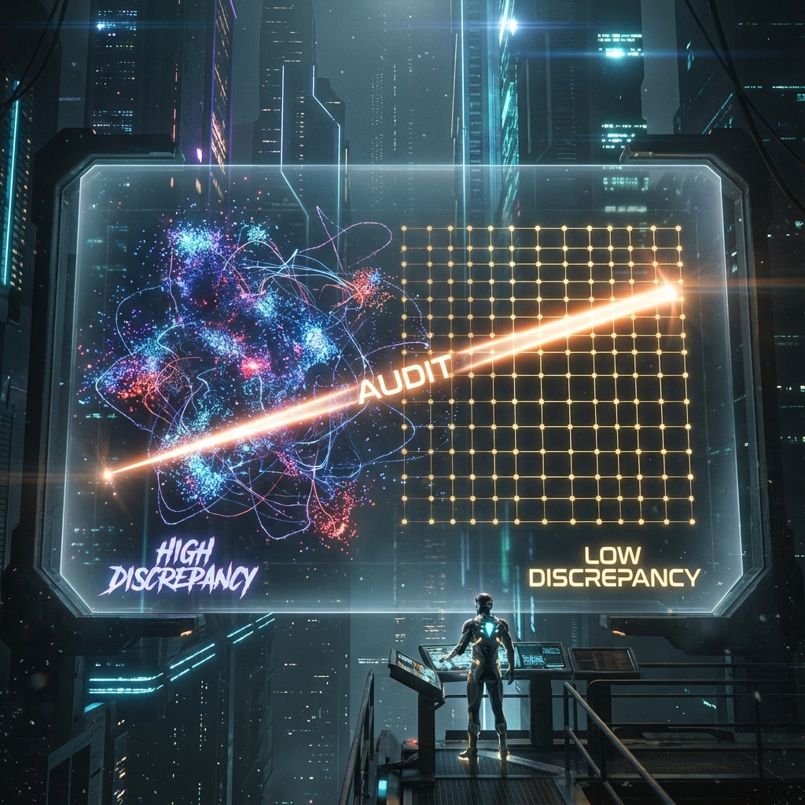
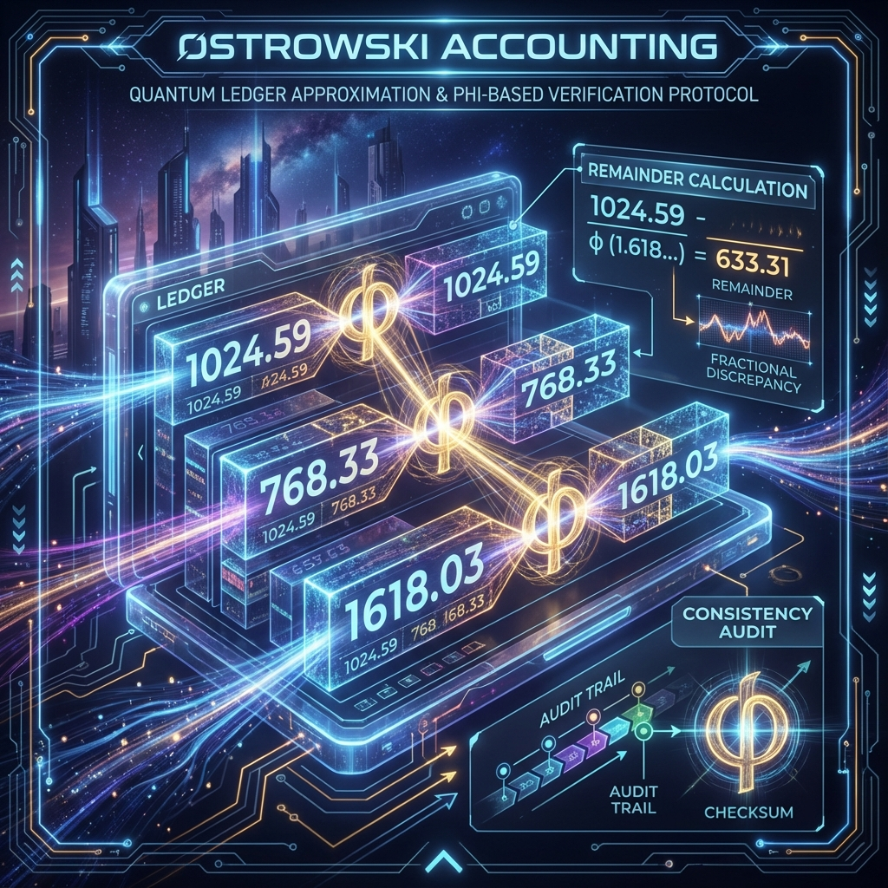
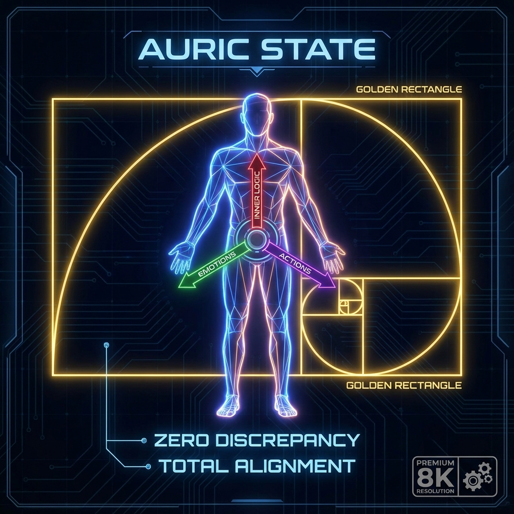

# 4.3 Audit of the Soul: How to Calculate the Distance Between You and Truth (Discrepancy)

We often use emotional words to describe a person's realm: "He is an enlightened master", "He lives very transparently", or "He is terribly paranoid". But from the hardcore perspective of **HPA-ZΩ** theory, the realm of cultivation is not a vague feeling, but a physical quantity that can be accurately calculated.

If the universe is a huge generative system, then every life trajectory (World Line) has a ledger in the eyes of the system. What this ledger records is not your wealth, nor your social status, but whether your path distribution is sufficiently **"Uniform"** as an observer in the process of traversing the possibilities of the universe.

The audit metric of this ledger is mathematically called **"Star Discrepancy"**.

To understand this concept, let's imagine a piece of white paper (representing the possibility space of your life). Now, let you draw 100 dots on this paper (representing 100 key choices or experiences you make).

*   **Case A (High Discrepancy):** You drew 90 dots densely in the upper right corner (e.g., extremely obsessed with making money, or indulging in a specific hatred), while the lower left corner (family, health, spirit) is almost blank.
*   **Case B (Random):** You draw indiscriminately with your eyes closed, dots crowded together in some places and empty in others. This is called "Pseudo-Randomness", which is also a portrayal of the chaotic lives of most people.
*   **Case C (Low Discrepancy):** These dots are scattered evenly across the entire paper like a carefully designed star map. There are no obvious clumps, nor obvious holes. No matter which small area of the paper you cut out, the density of dots inside is highly **Consistent** with the overall density.

Mathematically, **Star Discrepancy ($D^*$)** is a value used to measure "how unevenly" these dots are distributed.

*   The higher the discrepancy value, the more uneven the distribution, meaning there are huge **"Biases"** and **"Blind Spots"** in the system. Physically, this corresponds to extremely high **Information Entropy** and **Inconsistency**.
*   The lower the discrepancy value, the more uniform the distribution, meaning the observer is impartial and justly traverses various possibilities of life. This corresponds to extremely high **Symmetry** and **Truth Density**.

In the **HPA-ZΩ** system, the physical definition of **"Sin"** is **High Discrepancy**. When you indulge excessively in a certain desire (Greed), or excessively reject a certain experience (Aversion), your life trajectory will form a "clump" in a certain locality, causing the system's **Consistency** to be destroyed.

And **"Virtue"** is the ability to **Minimize Star Discrepancy**.

So, how exactly does the universe audit us? It uses an ancient and sophisticated mathematical tool: **Ostrowski Numeration**.

We mentioned "Jacob's Ladder" in **Section 2.2**, which is approaching truth through **Continued Fractions**. The Ostrowski system is a bookkeeping method based on continued fractions.

Imagine that every thought and every action of yours is a number. The cosmic background will convert these numbers into a positional system with an **Irrational Number** (usually the Golden Ratio $\varphi$) as the base for calculation in real-time.

Why irrational numbers? Because Truth (Dao/Logos) is essentially infinite and non-repeating.

If your life is full of drifting noise (Randomness), or full of mechanically repeated obsessions (Loop), your reading in the Ostrowski system will be very ugly—there will be a huge **Remainder**. This remainder is the distance between you and the truth.

To eliminate this remainder, to pass the universe's **"Consistency Audit"**, you must adjust your behavioral patterns so that the sequence formed by your life trajectory is as close as possible to a **"Low Discrepancy Sequence"**.

**3. Alignment: Practice of Reducing Discrepancy**

This sounds abstract, but in life, the operation to reduce Star Discrepancy is very concrete, that is **"Alignment"**.

What is alignment?

Suppose you have a grand vision (Motive) in your heart, such as "I want to be a person who changes the world". This is the goal you set in Layer 0.
However, in the daily life of Layer 1, you spend 5 hours scrolling through short videos and 3 hours complaining about colleagues every day.

At this time, there is a huge **Discrepancy** between your **"Behavior Distribution"** and your **"Vision Distribution"**. Your system has lost **Consistency**.

The cosmic auditor (physical laws) will grimly determine: Your path not only cannot lead to that vision, but will generate a large amount of waste heat (pain) due to **Internal Logic Conflict**.

The so-called **"Cultivation"** is not about sitting in meditation in the deep mountains and old forests, but holding a calculator (awareness) in your heart every day to calculate:
"Did my behavior today increase the discrepancy between me and my vision, or decrease it?"

*   If you always choose to do things that make you comfortable but have nothing to do with your goal, you are increasing discrepancy (entropy increase).
*   If you can overcome inertia and do things that are difficult but fill your life's blind spots (see Section 4.1), you are reducing discrepancy (entropy reduction).

**4. Towards Auric: Perfect Balance of Golden Ratio**

When an observer reduces the **Star Discrepancy** of his life to the mathematically allowed minimum through long-term self-correction, he enters a special state.

Now you understand why the name we found with great difficulty in the previous section is **Auric** (Gold).

In number theory, there is a magical constant that generates sequences with the lowest discrepancy value in the entire universe, most evenly distributed, and least likely to produce clumps. This constant is the **Golden Ratio ($\varphi$)**.

This is why the word "Gold" (Auric) is so sacred. What it represents is not wealth, but **Perfect Geometric Balance**.

A person who has reached the **Auric** state shows an amazing **Consistency** in his life:
His inner desires and outer behaviors are **Consistent**;
His perceptual experience and rational logic are **Consistent**;
His compassion for others and love for himself are **Consistent**.

He is like a **Golden Rectangle** walking in the chaotic universe. He has removed all "clumps" (obsessions) and "holes" (ignorance), and his soul has become as transparent and hard as a diamond. Any external force trying to destroy his inner peace will be automatically dissolved by this perfect geometric structure.

This is the end of the audit. When we zero out the **Remainder (Discrepancy)** on that thick ledger, we complete the phase transition from "sentient being" to "enlightened one".

**【Volume II Summary】**

So far, we have completed the exploration of **【Volume II】 The Topology of Consciousness**.

*   We know that there is only one player (single electron) in this universe, and we see the fractal self in pets.
*   We verified the physical power of love as **Constructive Interference** ($1 + 1 = 4$) through the personal experience of "finding a name".
*   We mastered the ultimate mathematical ruler for measuring soul evolution—**Star Discrepancy**.

However, this soul pursuing perfection is not suspended in a vacuum. It was "delivered" into a concrete body, born in a concrete era.

Why are you you? Why were you born in 1989 instead of 1889? Is your initial setting of "lacking Metal", and even the lines on your fingers, a random lottery or some kind of precisely calculated **"Hardware Configuration"**?

In the following **【Volume III】 Hardware Parameters & Environmental Era**, we will unseal the seal of fate parameters and interpret those secret codes engraved in your body and era. We will see that even seemingly metaphysical concepts like "Zodiac" and "Fingerprints" have hardcore physical explanations in the holographic universe.

