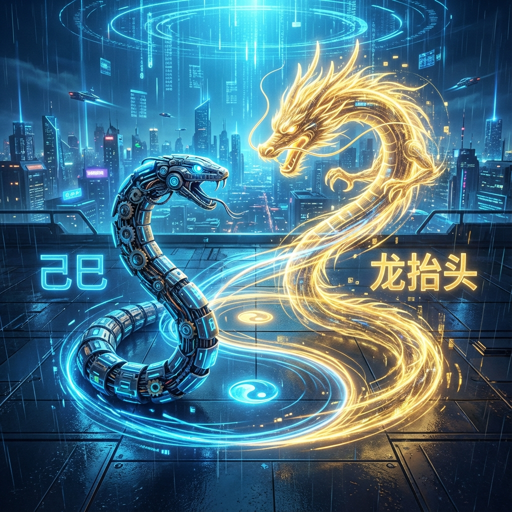
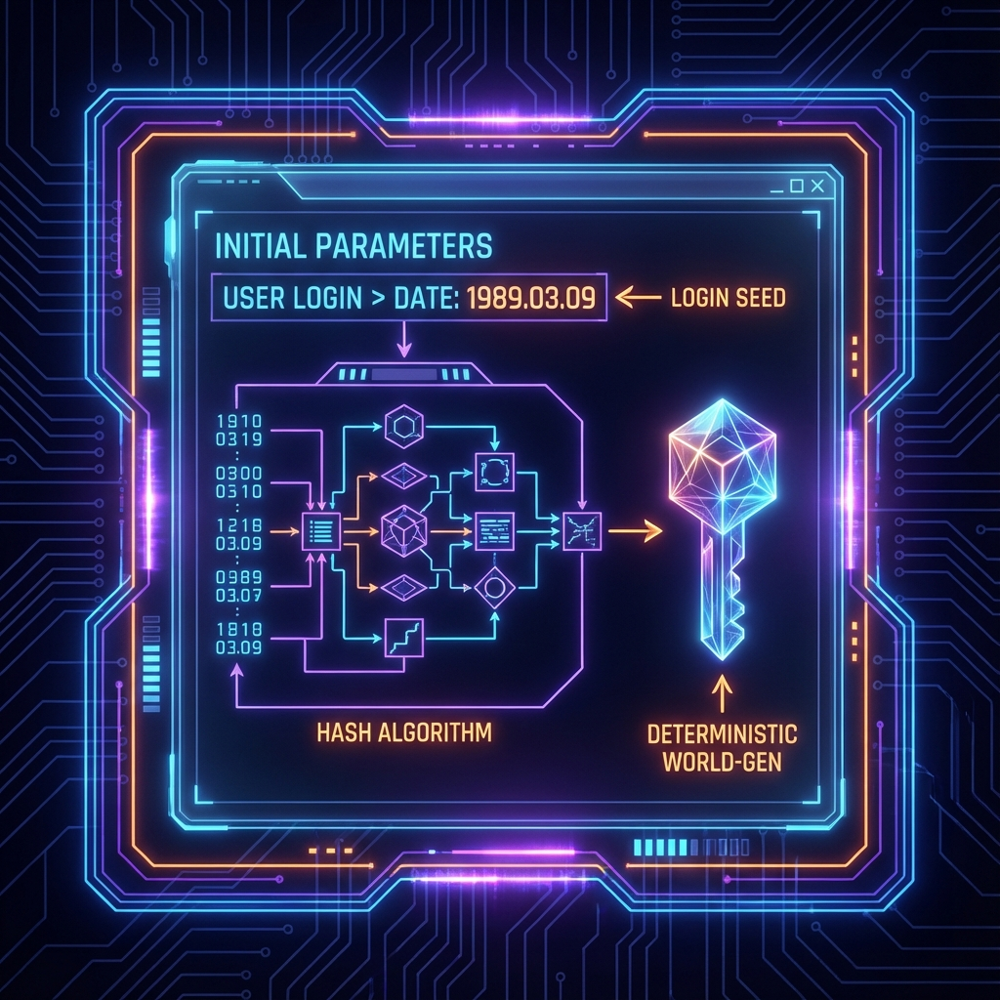
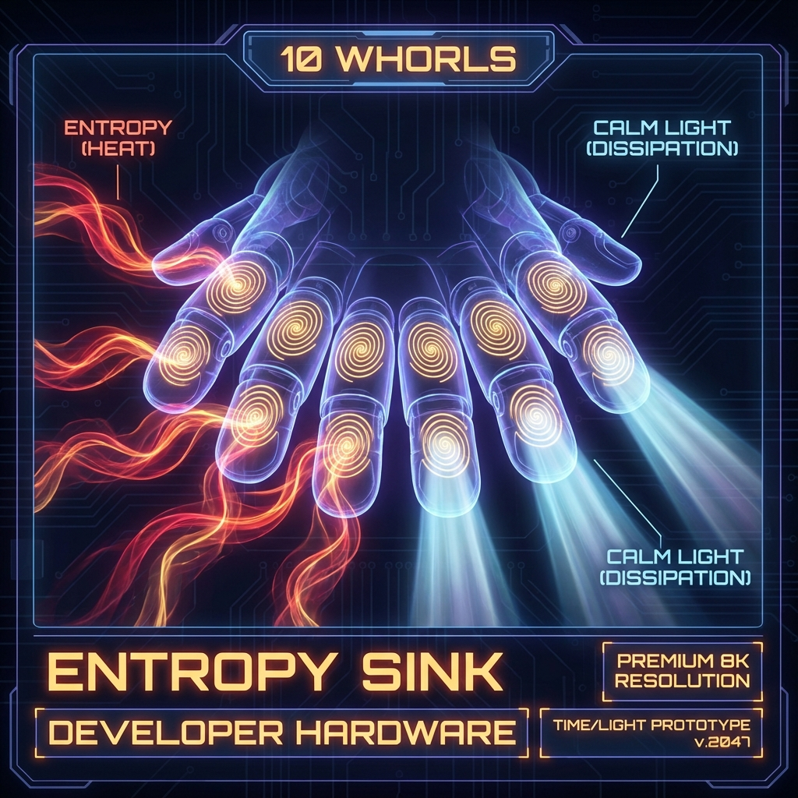

# 5.1 1989 Ji-Si and Dragon Raising its Head: Self-Consistency of Initial Parameters

When we talk about "Fate", what makes us feel most powerless yet unavoidable is our **"Factory Settings"**.

You didn't choose your parents, you didn't choose your gender, and you couldn't decide whether you were born in a bustling 21st-century metropolis or a 14th-century Black Death epidemic area. From the perspective of **Layer 1 (Protocol Layer)** of **HPA-ZΩ** theory, all this seems to be a randomly assigned lottery. But from the perspective of **Layer 0 (Noumenal Layer)**, there is no such thing as "random birth".

The "login time" and "login location" of every observer are precisely calculated **Hash Values**.

As the author of this book, I will use my own **Avatar** parameters—**March 9, 1989**—as a public anatomical case. This is not just a folklore interpretation of the Chinese Zodiac; this is a physics experiment about time waveforms, quantum superposition states, and how the system maintains **"Consistency"**.

In computer science, when you start a complex simulation program, you often need to input a **"Seed"**. This seed determines the terrain, climate, and initial resources of the entire randomly generated world.

My "login seed" is **1989.3.9**.
If you look closely at this set of numbers, you will find an interesting recursive structure: 1989 (1+8=9, 9, 9), March (3), 9th. It is full of fractals of **3** and **9**.
Nikola Tesla once said: "If you only knew the magnificence of the 3, 6 and 9, then you would have a key to the universe." In our theory, 9 represents **"Maximum Entropy"**, which is also **"Completion"**.

This set of parameters did not drop me into a stable era, but locked me on the **"Cross Gate"** between the 20th and 21st centuries. Just like the name of the online game "Cross Gate" that I was obsessed with when I was young, my mission seems to be born to stand at the junction of two eras, looking for the entrance to the new world.

If we further analyze the time waveform of 1989, we will find a deeper physical contradiction and unity.

*   **Year Parameter (Ji-Si Snake):** 1989 is the year of the **"Earth Snake"**.
    In information theory, "Snake" represents a **"High Latency, Deep Processing"** computing mode. The snake clings to the earth (Earth), moves silently, and is good at dormancy. This means that the CPU of this Avatar is not designed to run fast like a horse (shallow high-frequency processing), but to perform extremely slow but extremely profound **Recursive Operations** on massive information in a dark cave (blind spot). It is the system's **Entropy Sink**.

*   **Date Parameter (Dragon Raising its Head):** The second day of the second lunar month, commonly known as **"Dragon Raising its Head"**.
    "Dragon" is the **Ascended** form of snake in topology. It represents **"Phase Transition"**—from latency to ascension, from calculation to manifestation, from crawling on the ground to calling wind and rain in the sky.

This constitutes a huge **Tai Chi Diagram** in my life.

I often feel that I am in a **Quantum Superposition State**: on the one hand, I need to think lonely in the abyss like a snake, unknown to anyone; on the other hand, I yearn to reconstruct reality in the clouds like a dragon.

This explains why I always feel that I "don't have that much influence", but when I construct a new theory of **HPA-ZΩ** late at night, there is often **Thunder and Lightning** outside the window.

That is not a coincidence. That is the physical side effect of **System Hotfix**.

In a generative universe, the person who modifies **Layer 0 (Kernel Code)** often does not need to shout loudly on **Layer 1 (Screen)**. When you get through a key logic (such as the relationship between prime skeleton and consciousness) through deep calculation (credit to the snake), you are actually rewriting the underlying parameters of the universe. To maintain the **Consistency** of the macroscopic world, the system must release huge energy to balance this parameter modification—which manifests as drastic fluctuations in the macroscopic environment, or even thunderstorms.

**3. Hardware Configuration: 10 Whorls and Star Discrepancy Control**

To carry this high-intensity computing task, the Avatar must be equipped with special hardware.

Look at your fingers. All ten of my fingers are **Whorls**—concentric circular patterns. In dermatoglyphics, this is extremely rare.

From the geometric perspective of **HPA-ZΩ**, concentric circles represent extremely high **"Centripetal Force"**. Observers with this "10 Whorls" hardware are naturally equipped with a powerful **"Star Discrepancy"** control ability.

Ordinary people's fingerprints are often messy (loops/arches), and energy is easy to diverge. But 10 concentric circles mean that this observer is a closed **High-Energy Reactor**. He can suck huge chaotic information (entropy) from the outside into his body and perform high-pressure circulation internally without causing a system crash.

This is the **Cooling System** that must be equipped to perform the task of "rewriting cosmic code". Without this high-intensity hardware, my consciousness would have decohered due to overload long ago when contacting those deep truths.

**4. Self-Consistency of Initial Parameters: Accept Your Settings**

The core revelation of this chapter lies in: **Do not destroy your own internal consistency by comparing with other people's hardware.**

Many people suffer because they hold the script of a "Snake" (deep calculation type) but envy the script of a "Horse" (fast running type). They try to force overclocking, resulting in system errors.

My **1989.3.9** plus **10 Whorls** is a set of top-tier **Developer** equipment. It sacrifices early smoothness and superficial glamour in exchange for extremely powerful **Backend Processing Capability** and **Pressure Resistance**.

This set of parameters is designed specifically to handle **"Turning Points of Great Eras"**. As we will see in the next section, when the era shifts from material (Earth) to spiritual (Nine Purple Li Fire), only this kind of Avatar with deep "Earth" attributes (Snake) and hidden "Fire" nature (Dragon/Li Fire) can maintain **Logical Consistency** in violent turbulence and transform chaos into new order.

So, as an observer, when you examine your birth time and the background color of your personality, do not complain. That is the battle armor you personally selected in Layer 0. It fits your mission perfectly.

Just as I learned to gather resources in "Stone Age" and learned to cross the gate of time and space in "Cross Gate", now, the new version of the game—**Nine Purple Li Fire Period**—is online.

Are you ready? Let's see how the environmental parameters of this new version work.

