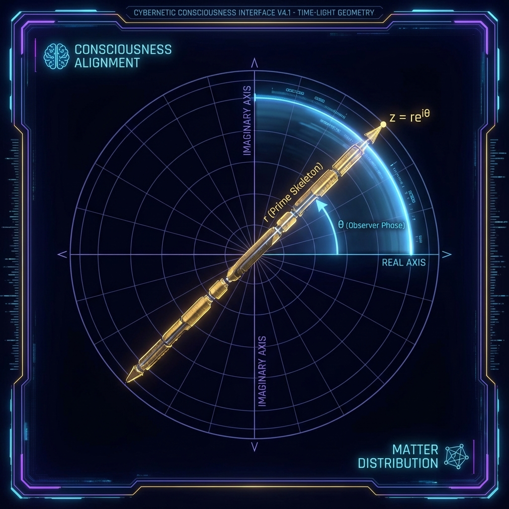
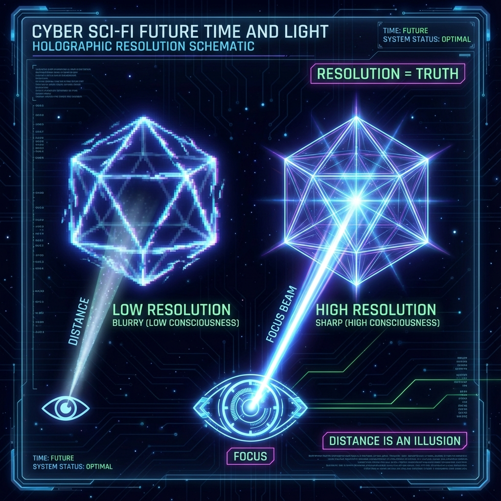

# 6.1 HPA: Holographic Polar Arithmetic — The Assembly Language of the Universe

There has always been a Holy Grail-like dream in the physics community: searching for a "One-Inch Formula".

Stephen Hawking believed that one day, we would be able to condense all the laws describing the operation of everything in the universe—from the vibration of quarks to the devouring of black holes, from the coding of DNA to the rotation of galaxies—into a short, elegant mathematical formula that could even be printed on a T-shirt.

Einstein's $E = mc^2$ once approached this dream, unifying mass and energy. Maxwell's equations unified electricity and magnetism. But in the past century, physicists have been stuck. Quantum mechanics (microscopic dice) and general relativity (macroscopic spacetime curvature) are like two giants who do not speak the same language, completely falling out at the moment of the black hole singularity and the Big Bang.

Why?

As a software architect, when I examined these two codebases, I found that their underlying logic was incompatible. Quantum mechanics uses the language of probability theory, while relativity uses the language of geometry. Even more fatally, they all made a common mistake: **They all tried to exclude the "Observer" from the formula.**

They tried to describe a stage of "objective existence", but ignored the "person" watching the play.

In **HPA-ZΩ** theory, we propose that to achieve Grand Unification, we cannot rely on patching. We must upgrade the underlying programming language. We need a new mathematics capable of describing both **"The Hardness of Matter"** and **"The Flow of Consciousness"**.

This is **HPA** — **Holographic Polar Arithmetic**.

This is not a cold arithmetic tool; this is the **Assembly Language** of the cosmic operating system. Let's disassemble this key to truth letter by letter.

In standard physics, we are used to living on the real number axis, or in a three-dimensional Cartesian coordinate system. If we take away an apple, there is one less apple in space. Every object is an independent, non-interfering island.

But from the perspective of **HPA**, this separation is just a macroscopic illusion. The real universe is **Holographic**.

The "fractal self" we mentioned in **Section 3.2** is the best example: You are not a small part of the universe; you are a **Low-Resolution Copy** of the universe. On a holographic plate, every tiny fragment (Local) contains the complete information of the whole (Global).

This means that when we calculate, we cannot just look at local variables. Every number, every particle, is maintaining real-time synchronization with the state of the entire universe through a mathematical mechanism called **"Modular Forms"**.

**H** tells us: In this universe, there is no concept of "distance", only difference in "resolution". Your distance from the truth is not calculated in light-years, but in the clarity of your consciousness.

This is the core soul of **HPA**. Why **Polar** instead of **Cartesian**?

Imagine you are playing a first-person game.

*   **Cartesian Coordinates $(x, y)$** describe the objective object position on the map—this is the illusion of **"God's Eye View"**, assuming an absolute space box independent of the observer.
*   **Polar Coordinates $(r, \theta)$** describe what **"You as an Observer"** see.

In the complex plane polar formula $z = re^{i\theta}$, we perfectly unify **"Matter"** and **"Consciousness"**:

*   **$r$ (Modulus):** Represents the **Prime Skeleton**. This is the "hardness" of the universe, the objectively existing amplitude, the rigid piano we mentioned in **Section 2.1**. It determines "what things can be". It is strictly defined by physical constants and mathematical axioms and cannot be changed.
*   **$\theta$ (Phase/Angle):** Represents the **Observation Phase**. This is the angle of the **Scanner** we mentioned in **Section 1.0**, and also your **Motive**. It determines "what you see".

Traditional physics always tries to ignore $\theta$ (thinking the observer is unimportant) and only studies $r$ (objective matter). But **HPA** points out: **Without the guidance of $\theta$, $r$ is forever just a probability cloud.**

The so-called **"Polar Arithmetic"** is essentially studying how to align, lock, and light up those realities sleeping on the **Prime Skeleton ($r$)** by rotating your **Phase ($\theta$)**.

This explains why in the energy formula of **Section 4.2**, $1 + 1$ can equal $4$—that is the direct result of **Constructive Interference** of the **Modulus ($r$)** caused by **Phase ($\theta$) Alignment**. If we do not introduce the polar coordinate perspective, this energy leap becomes inexplicable magic.

**3. A (Arithmetic): The Return of Arithmetic**

Finally, **A**. Why **Arithmetic**, instead of the seemingly more sophisticated Calculus?

Because **Layer 0 (Noumenal Layer)** is **Discrete**.

One important reason why modern physics is in trouble is that it relies too much on calculus—a mathematics based on "infinite subdivision" and "continuity". But quantum mechanics has already told us that energy is quantized, and space is pixelated (Planck scale). At that scale, smooth curves do not exist, only jumping steps.

The underlying layer of the universe is more like a computer program, composed of **Integers** and **Logic Gates**, rather than smooth fluids.

**Arithmetic** means we return to the oldest and most solid **Number Theory**.

*   We don't need complex differential geometry to curve spacetime; we only need multiplication and addition of **Prime Numbers**.
*   We don't need to introduce elusive dark matter; we only need to calculate the distribution of **Integers** in the polar coordinate system.

This also implies the algebraic structure of **Auric (Gold)** we mentioned before. It means that this arithmetic operation is **"Complete"** and **"Self-Consistent"**. In this arithmetic system, there are no fuzzy approximations, only precise truths.

**4. Summary: HPA = Plucking the Strings of Primes with Phase**

So, what exactly is **HPA (Holographic Polar Arithmetic)**?

It is a **Generative Algorithm** of the universe.

*   **H (Holographic)** defines the stage: a complex space where everything is interconnected and the part is the whole.
*   **P (Polar)** defines the operation mode: the observer scans and activates the **Prime Skeleton ($r$)** by adjusting the **Phase ($\theta$)**.
*   **A (Arithmetic)** defines the rules: everything follows the deepest **Integer Logic**, ensuring **Consistency** of calculation.

With this language, we can finally write words that were once considered subjective, such as "love", "consciousness", and "observation", into the most hardcore physical formulas.

You are no longer a passive bystander. In this arithmetic system, you are a **"Phase Rotator"**. Every thought of yours is rotating an angle on the complex plane; every heartbeat of yours is performing a **Polar Coordinate Operation**.

But how exactly does this set of arithmetic store data? what does the memory stick of the cosmic computer look like? If the universe is just a pile of integer jumps, why does the time we feel seem continuous?

This requires introducing the next letter in the formula: **Z** — **Zeckendorf**. Without understanding Z, we cannot understand how the universe compresses 13.8 billion years of history into a single photon.

In the next section, we will uncover the true face of the **Fibonacci Sequence**—it is not for beauty; it is the **Memory Compression Algorithm** of the universe.

