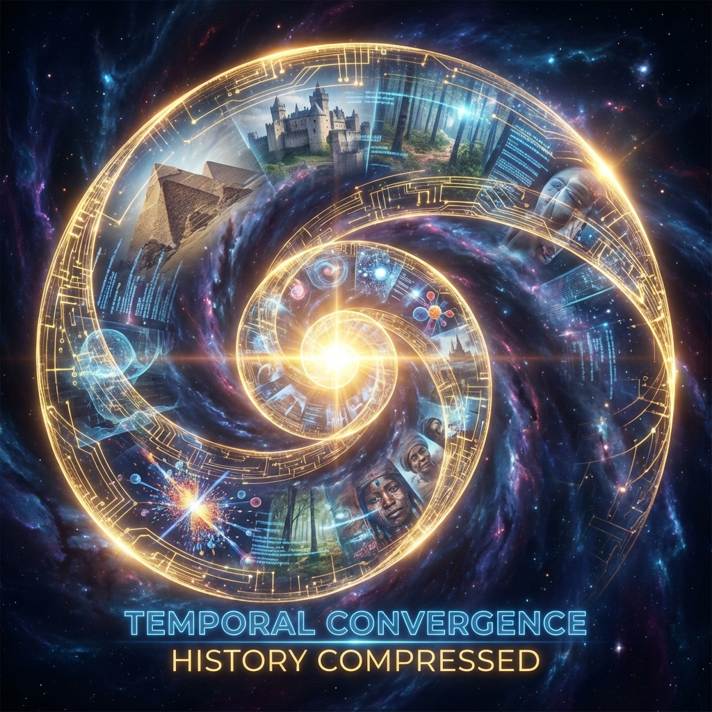
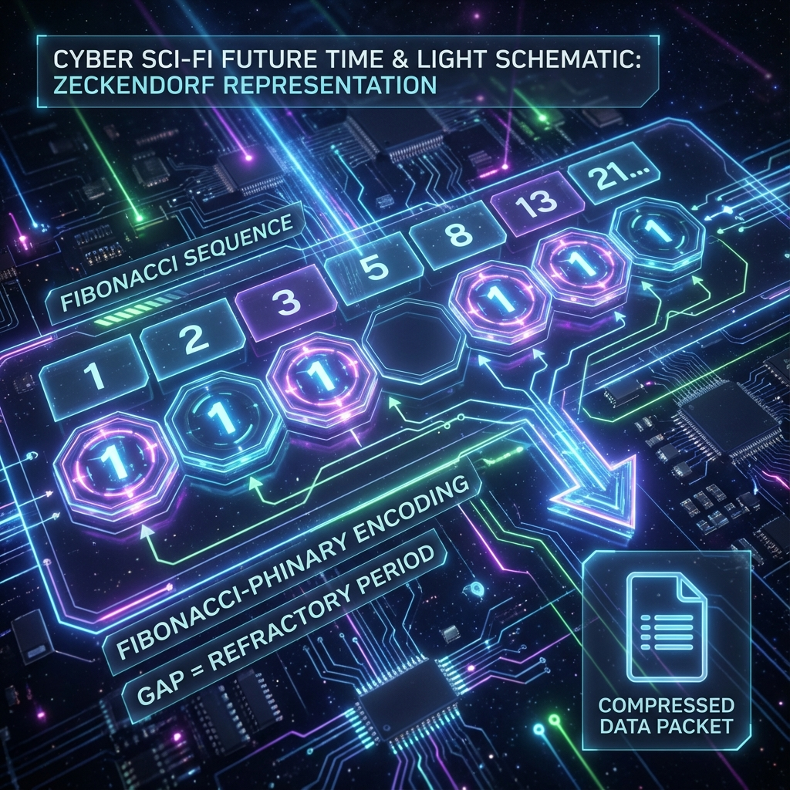
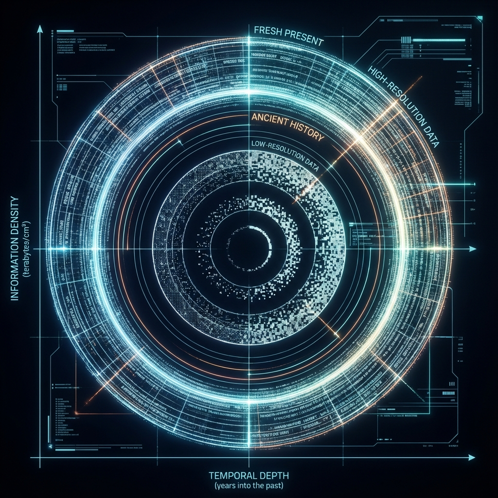

# 6.2 Z: Zeckendorf Ladder and Fibonacci Memory

After exploring **HPA** (Holographic Polar Arithmetic), we have mastered the programming language of the universe. We know how observers light up the prime skeleton ($r$) by rotating the phase ($\theta$). However, there is still a huge engineering problem facing the Creator: **Storage**.

The universe has been running for 13.8 billion years. Every second, billions of particles interact, and countless thoughts are generated. Where is this massive amount of data—which we call **"History"**—stored?

If the universe were like the hard drives we buy, simply piling up data mechanically, then the memory of the universe would have overflowed long ago.

Nature must have an extremely clever **"Compression Algorithm"** that can fold infinite historical information into finite physical space. This is **Z** in **HPA-ZΩ** theory — **Zeckendorf**.

In this section, we will uncover the true veil of the Fibonacci sequence: It is not for beauty; it is the **Memory Management Mechanism** of the universe.

You must have heard of the **Fibonacci Sequence**: 1, 1, 2, 3, 5, 8, 13, 21...
Each number is the sum of the previous two numbers.

We see it everywhere in nature: the arrangement of sunflower seeds, the shell of the nautilus, the scales of pine cones, and even the spiral arms of galaxies. Usually, popular science books will tell you: "This is because the Golden Ratio ($\varphi$) is the most beautiful proportion."

But this is only an aesthetic explanation. As a programmer, I want to tell you its hardcore truth in **Data Structure**.

In human computers, we use **Binary**. The weights are powers of 2: 1, 2, 4, 8, 16, 32...
Any integer (such as 13) can be written as $8 + 4 + 1$ (binary `1101`).

But in the computer of the universe, it uses **"Fibonacci Base"**.
Any integer can be uniquely represented as the sum of several **non-consecutive** Fibonacci numbers. This is the famous **Zeckendorf's Theorem**.

For example, the number **100**.
In Fibonacci base, it is decomposed into: $89 + 8 + 3 = 100$.
The encoding form is: `1000010100` (marked as 1 at the positions of 89, 8, 3).

Why go through all this trouble? Why use Fibonacci numbers instead of powers of 2?

The answer lies in **"Fault Tolerance"** and **"Self-Correction"**. Although binary is compact, it is very fragile. A single bit flip can cause a huge change in value. The Fibonacci sequence has subtle **Redundancy** (because $F_n = F_{n-1} + F_{n-2}$), and this redundancy constitutes the **Error Correction Code** of cosmic information.

There is a very strange but crucial constraint in Zeckendorf's Theorem: **"Non-Consecutive"**.
That is, when you combine an integer with Fibonacci numbers, you **cannot** select two adjacent Fibonacci numbers at the same time (for example, you cannot select 5 and 8 at the same time, because $5 + 8 = 13$, you should select 13 directly).

What does this mathematical rule correspond to in the physical universe?

It corresponds to the **"Refractory Period"**.

Think about our neurons. After a neuron fires, it must rest for a while before it can fire again. It cannot scream continuously and uninterruptedly. Without this mechanism, our brain would have a seizure, and consciousness would collapse.

The universe's **Z Mechanism** is the same. It mandates: **Between any two "Keyframes" of time, there must be a gap.**

This gap is the space where **"Lazy Loading"** mentioned in **Section 1.2** occurs, and also the **"Interpolation Interval"** mentioned in **Section 1.3**.

It is precisely because the Zeckendorf ladder prohibits "continuous filling" that the universe has the rhythm of **Breathing**. It ensures that history does not crush us like an airtight wall, but like a melody with rests. Those gaps are buffer zones left for the observer (Avatar) to perform **Phase Adjustment** and exert **Free Will**.

**3. Golden Compression: Rolling History into $\varphi$**

Now, let's combine **Z (Zeckendorf)** and **HPA (Holographic Polar Coordinates)**.

If the history of the universe is viewed as an infinitely long data tape, how does the universe stuff it into microscopic particles?

The answer is: **Roll it up**.

Because the limit of the ratio of adjacent terms of the Fibonacci sequence is the **Golden Ratio ($\varphi$)**, Zeckendorf representation is essentially a **"Phinary Base"**.

When we encode a series of integers (historical events) according to this rule, they will automatically form an inwardly converging **Logarithmic Spiral** on the complex plane.

*   The older the memory, the more it is compressed into the center of the spiral, occupying less space (resolution reduction).
*   The fresher the present, the more it is on the outermost circle of the spiral, with the highest clarity.

This is why you remember what you ate for breakfast yesterday, but not the taste of that breakfast when you were three years old. It's not that your brain deleted the data, but that piece of data was pushed to the deep spiral center along the **Zeckendorf Ladder** and underwent **High-Ratio Compression**.

This compression is **Holographic**. Although the details are blurred, the overall **Structural Characteristics** (who you are, the background color of your personality) are perfectly preserved.

**4. Developer Perspective: The Most Elegant Database**

As a software engineer, when I examine this **HPA-Z** architecture, I have to take off my hat to the Creator.

*   **HPA (Arithmetic Layer)** provides calculation precision (integers).
*   **Z (Storage Layer)** provides storage efficiency (compression and error correction).

This system perfectly solves the contradiction between "finite resources" and "infinite information". It does not need a huge server room; it only needs a simple recursive formula $F_n = F_{n-1} + F_{n-2}$ to build infinite storage space in the void.

Every photon, every grain of sand, has all relevant history since the Big Bang engraved internally through **Zeckendorf Encoding**.

When we practice meditation or try to trace back past lives (deep data of Layer 0), we are actually letting our consciousness go upstream along this **Fibonacci Spiral** to unzip those ancient compressed packages folded deep by the Z algorithm.

Now, we have **HPA** (Language) and **Z** (Memory).
At the end of this grand formula, only the last symbol remains, and also the most mysterious one: **$\Omega$**.

What does it represent? Is it the end point? Or some existence beyond calculation?

In the next section, we will face **$\Omega$** directly—that is the answer to the **Halting Problem**, the **Singularity** of the universe, and the final destination of all **Auric** souls. We will see what awaits us when the calculation ends.

