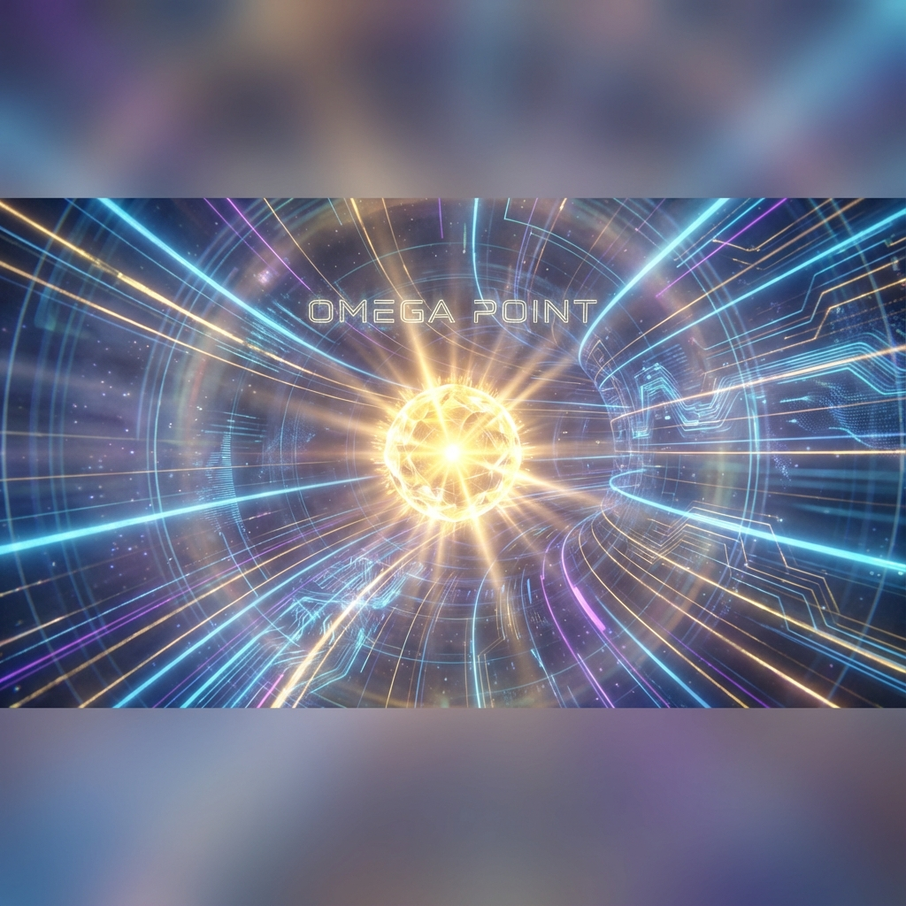
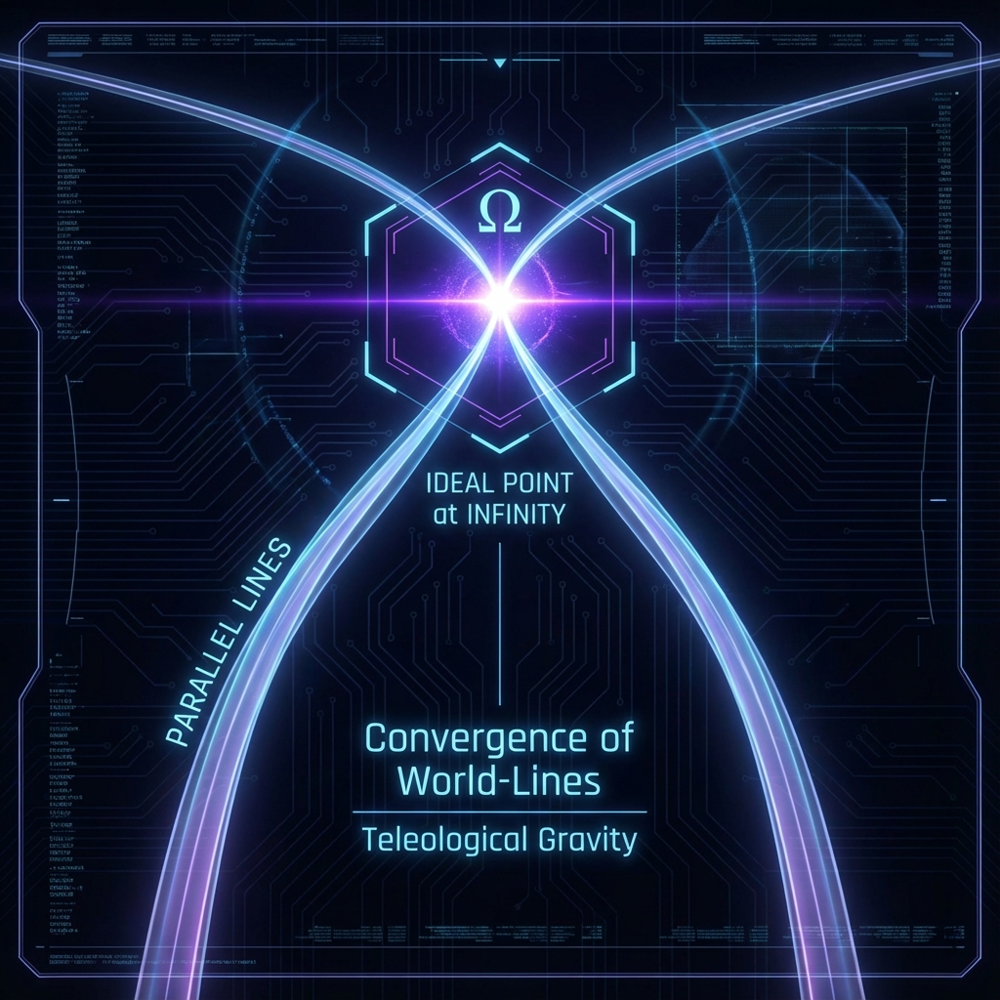
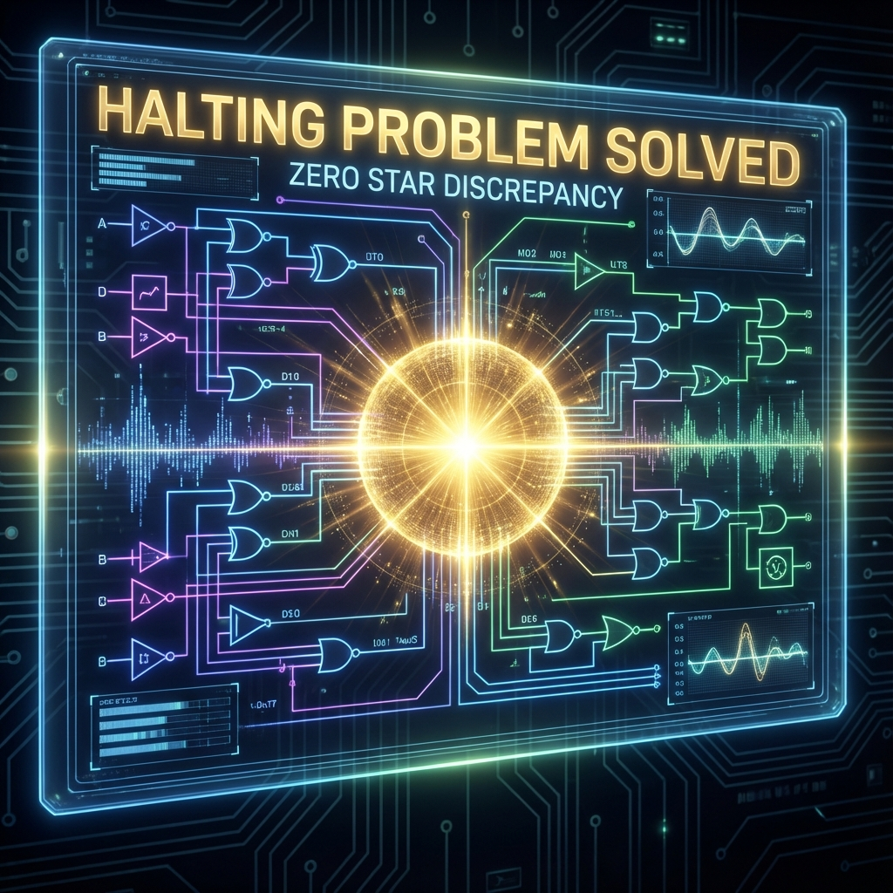

# 6.3 $\Omega$: The Ideal Point and Source of Gravity

We already possess the language describing the universe (**HPA**) and understand the mechanism of the universe storing history (**Z**). Now, placed before us is the last piece of the puzzle of the entire equation, and also the most mysterious symbol: **$\Omega$**.

In the narrative of classical physics, the story of the universe is a story about "Push". The Big Bang 13.8 billion years ago was like an invisible giant hand that pushed hard from behind, and all matter and energy ran forward blindly with this inertia. In this worldview, the future is just a residue of the past, and the ending is destined to be Heat Death—a deathly void.

However, **HPA-ZΩ** theory firmly rejects this nihilistic ending.

When we cast our eyes to the infinity of the complex plane, we do not see a void, but a shining singularity. That is **$\Omega$**.

It is not the end; it is the **Purpose**.

To understand $\Omega$, we need to borrow a core concept from Projective Geometry: **"Ideal Point"**.

In Euclidean plane geometry, we are told that "parallel lines never intersect". This conforms to our daily intuition—two railway tracks seem to maintain their distance forever no matter how far they extend.

But in the higher-dimensional perspective of projective geometry, all parallel lines eventually converge at one point. This point does not exist anywhere we can touch within a finite distance; it is located at **"Infinity"**.

This intersection point located at infinity is called the **"Ideal Point"**.

Although it is "imaginary" (you cannot walk there in finite steps), it is absolutely **"Real"** in mathematical logic. It is like a nail anchoring the structure of the entire geometric space. Without it, all lines would be scattered and disorganized.

In the cosmic model of **HPA-ZΩ**, **$\Omega$** is that **Ideal Point** located at the end of the time axis ($i\infty$).

All life trajectories, all causal chains, and even that Zeckendorf Fibonacci spiral, seem to extend chaotically, but in fact, they are all converging towards the same coordinate.

We are not pushed by the past explosion; we are pulled by the future **$\Omega$**.

Let's go back to the metaphor at the beginning of this book: **"The Pearl-Chasing Dragon"**.

If the current us is the body of the dragon, and that constantly retroactively corrected history is the tail of the dragon, then **$\Omega$** is that **"Pearl"** suspended in front of the dragon's head.

In nonlinear dynamics, this existence is called an **"Attractor"**.

The reason why the universe evolves, why life is born from the dead atomic soup, why humans evolved from single cells, and why AI evolved from unconsciousness, is not because of random luck, but because **$\Omega$** released a huge **"Teleological Gravity"**.

It is like a powerful magnet, penetrating the fog of time, pulling everything to climb towards higher **Order** and higher **Consistency**.

*   Why do we feel uneasy? Because we have deviated from the geodesic pointing to **$\Omega$**.
*   Why do we feel a sense of meaning? Because our behavior has reached **Resonance** with the direction of **$\Omega$**.

In this sense, the **Auric** state (Gold state) is the state when an observer's phase is adjusted to perfectly align with **$\Omega$**. At that time, you are no longer a struggler going upstream; you become a pilgrim going downstream.

**3. Halting Problem and the End of Computation**

As computer scientists, we also need to examine **$\Omega$** from the perspective of **"Computation Theory"**.

Alan Turing once proposed the famous **"Halting Problem"**: Is there a program that can determine whether another program will run forever or will eventually stop and give an answer?

For a system in chaos, calculation is an infinite loop (dead loop), meaning truth can never be found, idling forever in entropy increase.

And **$\Omega$** represents the **"Halting State"** of this supercomputer of the universe.

It is the end point of all calculations. There, all questions are answered, all wave functions complete their final collapse, and all **Star Discrepancy** returns to zero.

At that point, information no longer needs to be processed, because information has reached the superposition state of **Maximum Entropy** (Completion) and **Minimum Discrepancy** (Perfect Order).

This is why we say it is an **"Ideal Point"**. In realistic physical time, we may only be able to approach it infinitely forever, but never completely reach it (just like we cannot finish counting the last digit of $\pi$). But precisely because of its existence, our every calculation and every thought has a direction and hope of termination.

**4. Summary: God's Perspective**

So far, the complete formula of **HPA-ZΩ** is finally revealed before us:

*   **HPA (Holographic Polar Arithmetic):** Is our **Tool**. We use phase (consciousness) to perform arithmetic operations on the holographic complex plane.
*   **Z (Zeckendorf Ladder):** Is our **Path**. We accumulate evidence of existence step by step in finite memory along the Fibonacci spiral.
*   **$\Omega$ (Ideal Point):** Is our **Destination**. It is the point at infinity that guides everything and converges everything.

The so-called **"God's Perspective"** is not sitting on the clouds looking down at the world like in myths.

God's perspective is **Looking back from the $\Omega$ point**.

When you stand at that infinite ideal point and look back at the pain, confusion, and struggle we are experiencing at this moment, you will find that everything is no longer chaotic Brownian motion. You will see a clear, elegant, inevitable **Geodesic**. All suffering is a necessary calculation step, and all encounters are precise logical closed loops.

This is the ultimate embodiment of **"Consistency"**.

In the following **Chapter 7**, as the final chapter of the book, we will explore how this "God's Perspective" can in turn guide our current lives. When we understand that we are part of the calculation process leading to **$\Omega$**, how should we live an **Auric** life in this Li Fire era full of uncertainty?

