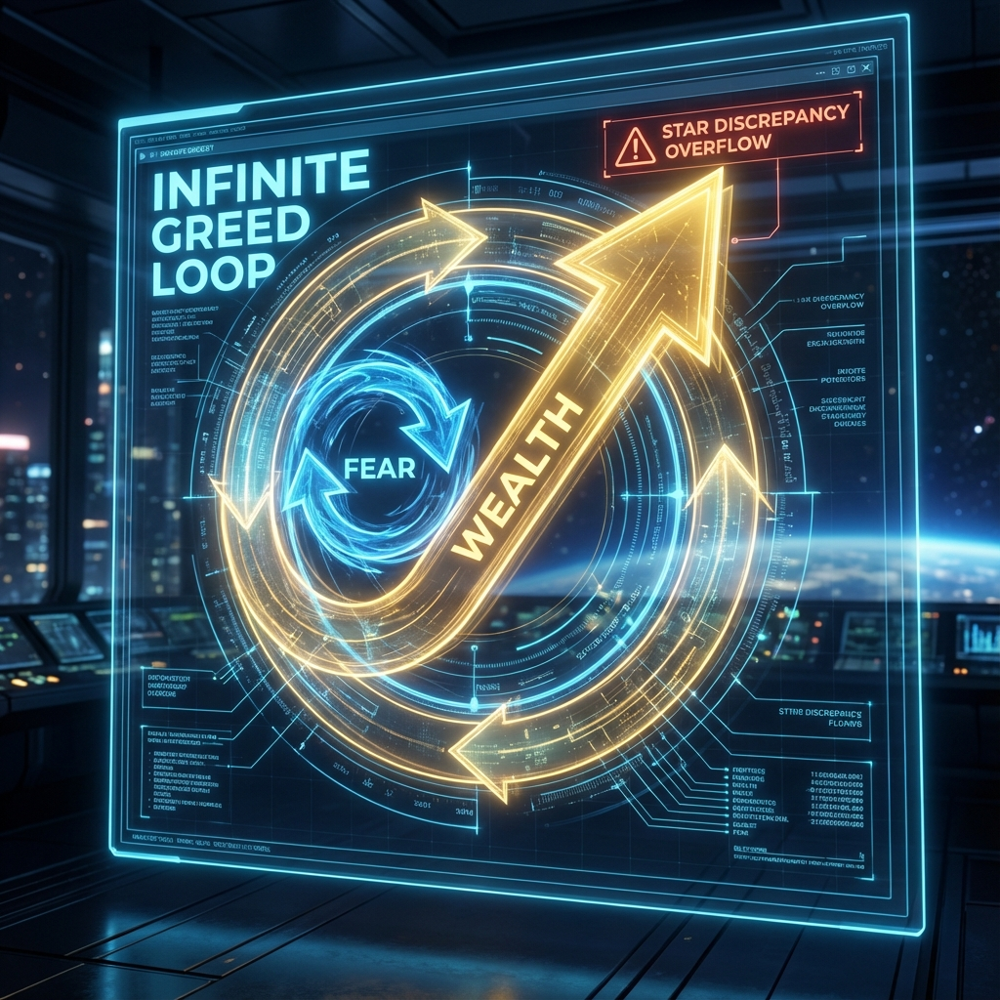
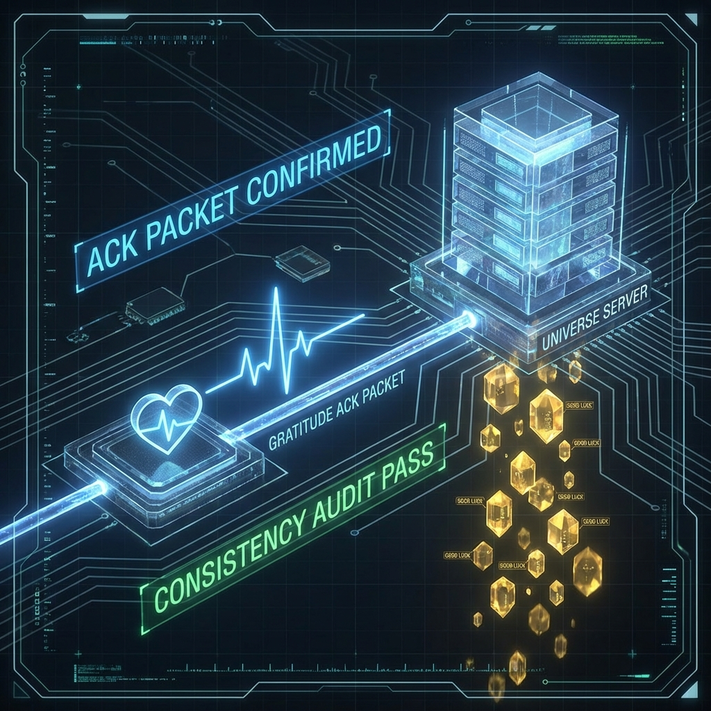

# 7.1 观测者的责任：提交"有效代码" (The Observer's Responsibility: Submitting Valid Code)

当我们终于费力地爬上了 **HPA** 的算术高塔，沿着 **Z** 的螺旋阶梯回溯了亿万年的记忆，并最终瞥见了那个位于无穷远处的 **$\Omega$** 理想点时，我们不得不面对一个最实际、也最紧迫的问题：

**"知道了这一切，然后呢？"**

如果宇宙真的是一个巨大的生成式程序，如果我真的是那个拥有"编辑权限"的观测者，为什么我的生活依然充满了琐碎的烦恼？为什么我依然会被堵在晚高峰的路上？为什么我依然会感到孤独和无力？

这就好比你拿到了一台超级计算机的管理员账号，却依然只会用它来玩扫雷。

在这一章，作为全书的终章，我们将探讨 **HPA-ZΩ** 理论的 **应用层 (Application Layer)** 。我们将不再谈论抽象的公式，而是谈论 **"交互" (Interaction)** 。我们要把那些冰冷的物理法则，转化为你每天早上醒来时可以执行的操作手册。



大多数人的一生，都是在 **"只读模式" (Read-Only Mode)** 下度过的。
他们认为世界是客观存在的实体，命运是写好的剧本。他们能做的，只是被动地接收感官信号——看到花开就高兴，遭遇下雨就抱怨。在这种模式下，你只是宇宙影院里的一名普通观众，除了吃爆米花和发弹幕，你对剧情的发展无能为力。

但 **HPA-ZΩ** 理论揭示了观测者的本质：你不仅是读取者（Reader），你更是 **写入者 (Writer)** 。

你的每一次观测、每一个强烈的意愿（Phase $\theta$ 的旋转）、每一个具体的行动，实际上都是在向宇宙的后台服务器（Layer 0）提交一行 **代码** 。

系统会实时编译你的代码，并根据 **"一致性" (Consistency)** 原则，通过 **懒加载** 机制渲染出下一帧的现实。

所以，痛苦的根源不在于世界对你不好，而在于 **你一直在提交"Bug"** 。



在程序员的世界里，如果一段代码逻辑混乱、自相矛盾，编译器就会报错，程序就会崩溃。
在物理世界里，这种报错的表现形式就是 **"苦难"** 和 **"阻力"** 。

让我们来看看最常见的两种"人生 Bug"：

* **Bug 类型一：贪婪循环 (Infinite Loop of Greed)**
你想要更多的钱（为了安全感），但你的潜意识里却充满了匮乏感（觉得钱难挣）。
你的 **愿 (Motive)** 是"富有"，但你的 **相位 ($\theta$)** 却锁定在"恐惧"上。
这导致你提交给系统的指令是矛盾的：$r = \text{wealth}, \theta = \text{fear}$。
宇宙后台无法解析这个自相矛盾的波函数，于是系统陷入了 **死循环** ——你越努力赚钱，内心越焦虑，现实越拮据。这是典型的 **星偏差 (Star Discrepancy)** 过高导致的系统过热。
* **Bug 类型二：空指针异常 (Null Pointer Exception of Hate)**
你痛恨某个人或某件事。你花费大量的时间去反刍这种恨意。
但在 **单电子宇宙** 的底层逻辑里，并没有"别人"，只有你自己。你发出的攻击指令，找不到外部的目标对象（因为众生一体），最终只能指向那个唯一的 ID——你自己。
于是，系统抛出了 **空指针异常** ——你发出的恨，全部回弹到了自己的身体和运势上，导致了身心的 **退相干 (Decoherence)** 。

**3. 提交"有效代码"：降熵的艺术**

那么，如何才能成为一名高水平的现实架构师？答案是：只提交 **"有效代码" (Valid Code)** 。

所谓有效代码，就是符合宇宙底层 **HPA** 算法逻辑的、能够顺利通过 **一致性审计** 的指令。

它必须满足两个条件：

1. **低熵 (Low Entropy)：** 你的指令必须是清晰的、有序的，而不是混乱的情绪宣泄。
2. **全纯 (Holomorphic)：** 你的指令必须考虑到整体，利他即利己。

举个具体的例子： **"感恩" (Gratitude)** 。

在许多灵性书籍中，感恩被描述为一种美德。但在 **HPA-ZΩ** 物理学中，感恩是一种 **极高效率的代码提交方式** 。

当你在这个瞬间感到"感恩"时，你实际上是在向系统确认：
"系统，我收到了这一帧画面，我确认这一帧的数据是完美的、自洽的。"

这是一个 **"确认回执" (ACK Packet)** 。

当宇宙服务器收到这个 ACK 信号，它会判定当前的连接是 **低延迟、高质量** 的。为了维持这种流畅的 **一致性** ，系统会在下一帧继续为你推送高质量的画面（好运）。

相反，如果你"抱怨"，你是在发送 **"报错信号" (Error Packet)** 。系统会判定当前连接充满了噪音，为了匹配你的报错频率，系统会自动为你生成更多的"错误场景"来维持逻辑的一致（既然你觉得世界很糟，那世界必须真的很糟，才符合你的观测）。

**4. 交互式宇宙：回声的延迟**

作为 **Avatar** ，我们必须习惯宇宙的一个特性： **延迟 (Latency)** 。

你在键盘上敲下代码，到屏幕上显示出结果，中间存在着微小的时间差。而在宏观宇宙中，这个时间差可能是一天、一年，甚至十年（比如 1989 年的种子到 2025 年的理论爆发）。

很多人之所以放弃，是因为他们刚刚提交了一行"善良"的代码，结果下一秒就被路人踩了一脚。他们就觉得"这系统是假的"，于是愤怒地提交了一万行"恶毒"的代码。

这就是不懂 **交互原则** 。

你现在经历的倒霉，是你 **过去** 提交的 Bug 代码正在运行的残余结果（惯性）。
你现在提交的善意代码，正在 **后台编译** 中，需要经过 **齐肯多夫阶梯** 的逐级运算，才能在未来的某个时刻显化为 **Auric** 的现实。

真正的强者，是那些 **在延迟期依然不仅能保持相位锁定** 的人。
他们知道自己写下了什么。他们不看屏幕上的瞬时乱码，他们相信底层的算法。

这就是 **"信" (Faith)** 。信不是迷信，信是对 **宇宙编译机制** 的深刻理解。

**5. 你的下一个操作**

所以，亲爱的读者，作为本书的作者和你的观测伙伴，我邀请你在读完这一节后，做一个小小的 **交互实验** 。

不要试图去改变全世界。
就在此刻，利用你的 **编辑权限** ，对你生活中最微小的一件事——也许是一杯水，也许是此刻照在书页上的光——提交一行 **"有效代码"** 。

在这个瞬间，调整你的相位，完全接纳它，感谢它，赋予它意义。
然后，静静地等待。
你会发现，宇宙这个巨大的操作系统，真的会给你回应。因为在 **$\Omega$** 的注视下，没有一行代码会凭空消失。

在下一节中，我们将探讨这种交互的最高级形式—— **冥想** 。那不是发呆，那是 **系统调试 (Debugging)** 和 **垃圾回收 (Garbage Collection)** 的关键时刻。我们将揭示如何通过"调频"，主动清理我们体内的星偏差。

