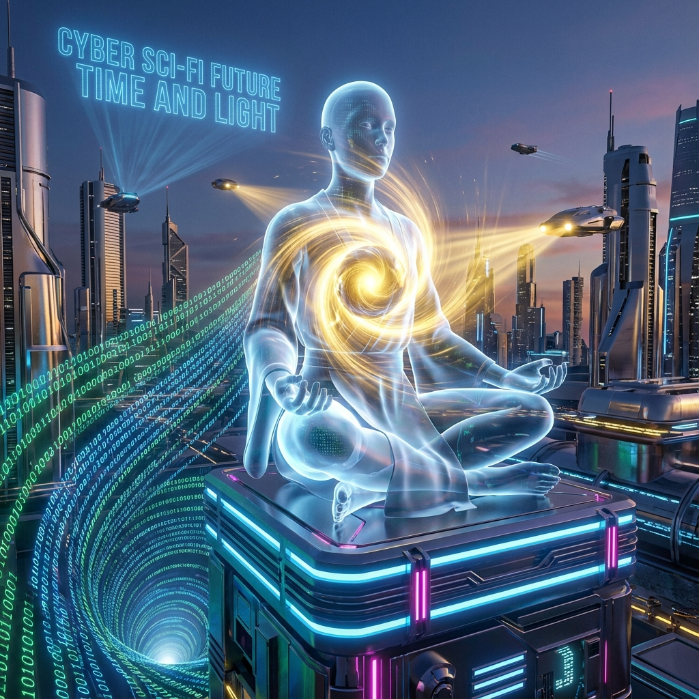
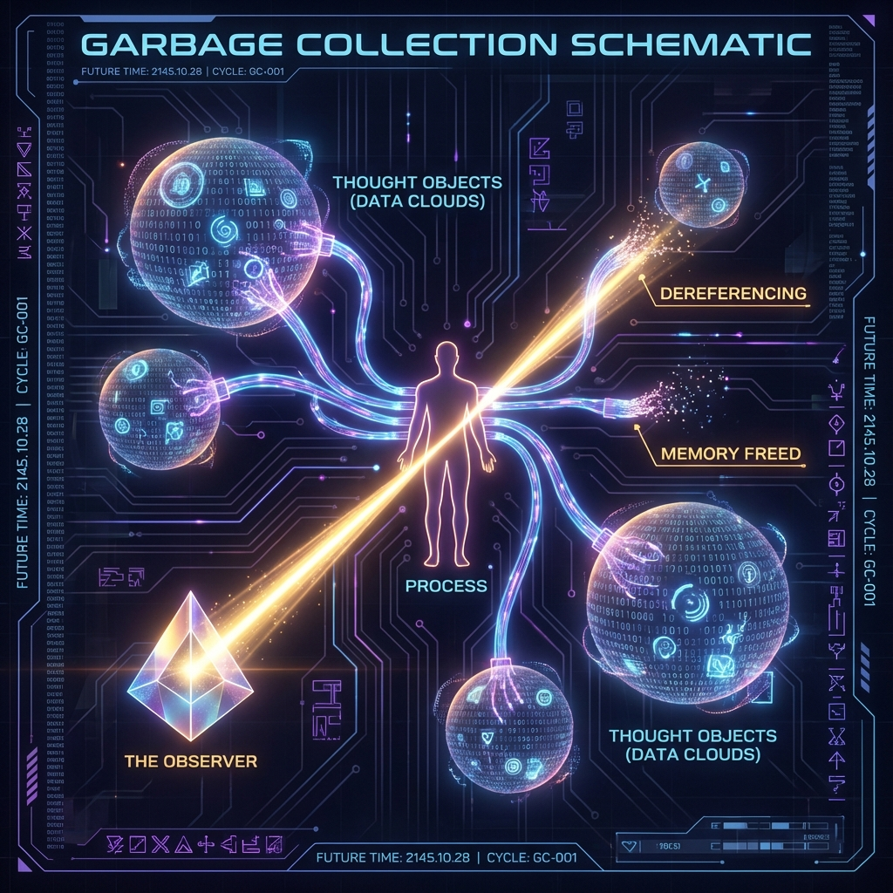
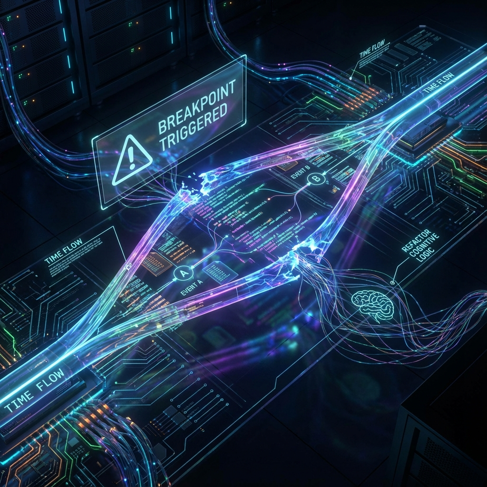

# 7.2 Meditation: System Debugging & Garbage Collection

In computer science, any high-performance system that runs for a long time will eventually face two fatal problems if it lacks maintenance: one is **"Memory Leak"**, where useless data occupies memory space, causing the system to lag; the other is **"Logic Bugs"**, where wrong instructions loop infinitely in the background, causing the CPU to overheat.

The human brain, as the most sophisticated biological computer in the known universe, processes massive amounts of information every day. Every thought and every emotional fluctuation of ours creates a **"Temporary Object"** in the neural network.

If we don't know how to clean up this garbage, our system will become slower and slower, more and more anxious, and eventually deviate from the guidance of **$\Omega$**.

In the **Application Layer** of **HPA-ZΩ** theory, we give **Meditation** a brand new, de-religious definition: **Meditation is not spacing out; it is an active "System Debugging" and "Garbage Collection" for the consciousness operating system.**

Have you ever had this experience: you obviously didn't do anything on the weekend, just lay in bed scrolling through your phone, but felt more tired than working?

From a physics perspective, this is because you have too many **"Background Processes"**.

When you scroll to a piece of anxiety-inducing news, although you scrolled past it, your subconscious (Layer 0) allocated a memory space for it and started calculating "Will this affect me?"; when you recall a cynical remark from a colleague, your emotional system creates a **"Resentment Object"** and continues to consume energy to maintain it.

These created objects, even if you no longer think about them explicitly, still occupy your **"Mental RAM"** and continue to consume your **CPU Cycles**. This is **Memory Leak**.

This explains why modern people generally feel **"Brain Fog"** and fatigue. Your system hasn't slowed down; your memory is stuffed with countless unclosed **"Dangling Pointers"**.

In high-level programming languages (such as Java or Python), there is an automatically running program called **"Garbage Collector" (GC)**. Its working principle is simple: scan all objects in memory, mark those **"no longer referenced"** objects, and then forcibly delete them to free up space.

Meditation is manually triggering the **GC** process in your brain.

When you close your eyes, start focusing on your breath, and cut off **Scanning** of external information, you are actually doing one thing: **"Dereferencing"**.

*   You watch that "anxious" thought emerge.
*   You do **not** analyze it (do not allocate computing power to it).
*   You do **not** judge it (do not assign emotional weight to it).
*   You just watch it.

In the polar arithmetic of **HPA**, this means you set the observation phase $\theta$ to an **"Orthogonal"** state. You no longer **Entangle** with that thought.

Due to the loss of the observer's **Energy Injection**, according to the inverse operation rule of **Lazy Loading**, this thought wave function will automatically **Decohere** due to lack of "consistency support". It degrades from a substantial "anxiety" to a harmless "information state" and is eventually cleared by the system.

This is why the mind feels incredibly clear after meditation. Because you just cleaned up several gigabytes of **Garbage Memory**, and your **Star Discrepancy** was instantly flattened.

**3. Debug Mode: Seeing Code Clearly at Breakpoints**

Besides cleaning up garbage, meditation is also the only means of **"Debug"**.

In daily life, we are usually in **"Run Mode"**. We are executors of code, pushed by emotions and instincts. Someone scolds me (Input), I immediately scold back (Output). This process is too fast, and the logical black box in between is closed.

And meditation is switching consciousness to **"Debug Mode"**.

When you sit in meditation, you are artificially setting a **"Breakpoint"**. You make the flow of time seem to slow down.

In this high-resolution observation state, you can finally see clearly those **"Bug Codes"** running inside you:

*   "So every time I feel angry, it's not because the other person did something wrong, but because it triggered the **Dead Loop** of 'not being respected' in my childhood."
*   "So I pursue this goal not because I like it, but because of the **Logical Loophole** of my fear of falling behind."

Once you see the source code of these Bugs clearly, your highest authority as an **Avatar** takes effect. You can directly **Refactor** this code at the Layer 0 level—modify your cognitive model and break that automated emotional reaction chain.

This is what is often said in Buddhism: **"Awareness is Liberation"**. In physics, this is **"Observation Causes Wave Function Reorganization"**.

**4. Tuning: Returning to Auric State**

Finally, meditation is the process of calibrating your **Phase ($\theta$)**.

We mentioned in **Section 5.2** that the **"Li Fire Period"** is a high-frequency, turbulent era. External frequencies (noise) are trying to pull your frequency at all times, causing **Resonance Disaster** (vibrating with anxiety).

Meditation is a daily **"Reference Frequency Calibration"**.

By adjusting your breathing, you down-regulate your frequency from high-frequency $\beta$ waves (anxiety/fight) to low-frequency $\alpha$ waves or even $\theta$ waves (deep relaxation/subconscious). You realign your phase to that unchanging **Prime Skeleton ($r$)**, to that **$\Omega$** point at infinity.

In this state, you briefly become a **Superconductor**. The external entropy flow passes through you without generating heat (pain). You retrieve that gold-like solid, perfect **Auric** state.

**5. Your Operation Manual**

So, as the author, I don't need you to become an ascetic monk. I just need you, as a qualified system administrator, to take 15 minutes a day to execute a maintenance script for your biological computer:

1.  **Shutdown:** Find a quiet place, close your eyes, cut off external input.
2.  **GC Run:** Observe thoughts without judgment, disconnect references, watch them dissipate.
3.  **Debug:** Examine the emotional fluctuations just now, find the underlying Bug logic.
4.  **Reboot:** Take a deep breath, restart with cleaned memory and repaired logic, and return to the reality of **Layer 1**.

You will find that the system runs so smoothly. That is not a miracle; that is the performance **Well-Maintained Code** should have.

In the last section of this book, we will turn our eyes from individuals to all mankind. In the blueprint of **HPA-ZΩ**, what will be the ultimate form of human civilization? Are we building a huge **"Gaia Brain"** composed of silicon and carbon together?

Let's enter **7.3 Awakening of Gaia: From Internet to Noosphere**.

